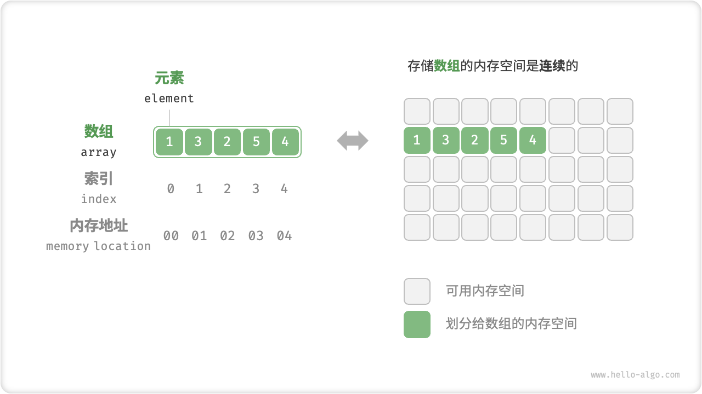
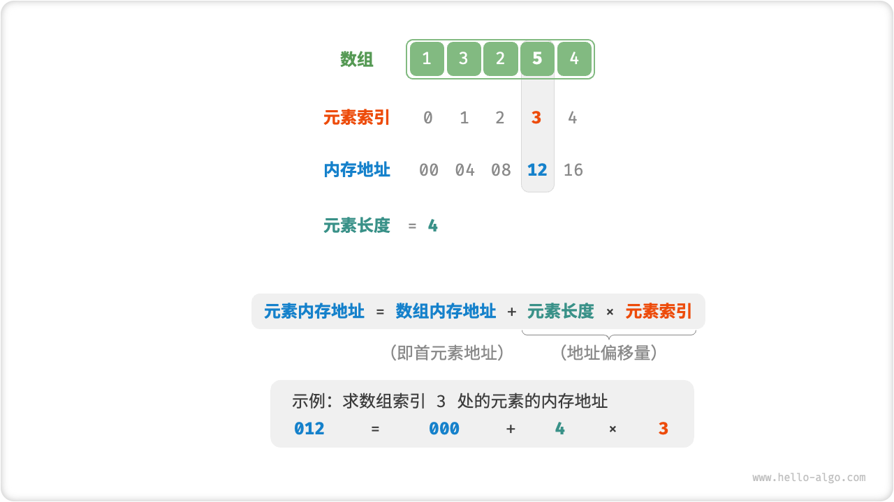
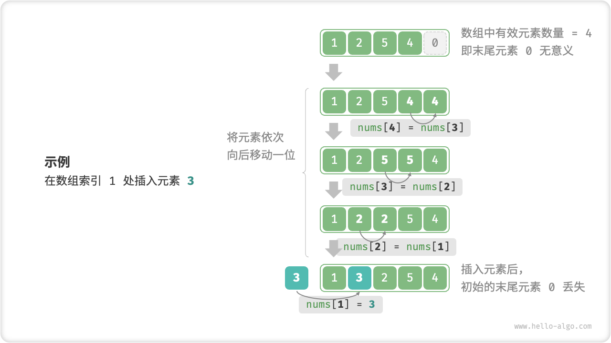
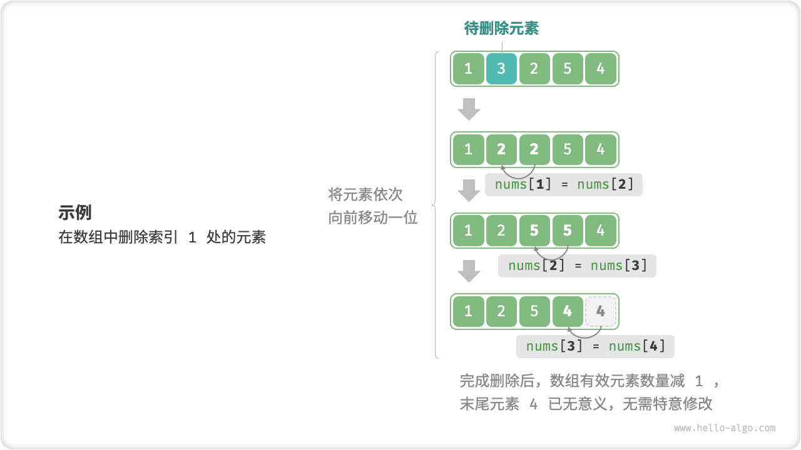

# 4.1. &nbsp; 数组

「数组 Array」是一种线性数据结构，其将相同类型元素存储在连续的内存空间中。我们将元素在数组中的位置称为元素的「索引 Index」。



<p align="center"> Fig. 数组定义与存储方式 </p>

**数组初始化**。通常有无初始值和给定初始值两种方式，我们可根据需求选择合适的方法。在大多数编程语言中，若未指定初始值，数组的所有元素通常会被默认初始化为 $0$ 。

=== "Java"

    ```java title="array.java"
    /* 初始化数组 */
    int[] arr = new int[5]; // { 0, 0, 0, 0, 0 }
    int[] nums = { 1, 3, 2, 5, 4 };
    ```

=== "C++"

    ```cpp title="array.cpp"
    /* 初始化数组 */
    // 存储在栈上
    int arr[5];
    int nums[5] { 1, 3, 2, 5, 4 };
    // 存储在堆上
    int* arr1 = new int[5];
    int* nums1 = new int[5] { 1, 3, 2, 5, 4 };
    ```

=== "Python"

    ```python title="array.py"
    # 初始化数组
    arr: list[int] = [0] * 5  # [ 0, 0, 0, 0, 0 ]
    nums: list[int] = [1, 3, 2, 5, 4]  
    ```

=== "Go"

    ```go title="array.go"
    /* 初始化数组 */
    var arr [5]int
    // 在 Go 中，指定长度时（[5]int）为数组，不指定长度时（[]int）为切片
    // 由于 Go 的数组被设计为在编译期确定长度，因此只能使用常量来指定长度
    // 为了方便实现扩容 extend() 方法，以下将切片（Slice）看作数组（Array）
    nums := []int{1, 3, 2, 5, 4}
    ```

=== "JS"

    ```javascript title="array.js"
    /* 初始化数组 */
    var arr = new Array(5).fill(0);
    var nums = [1, 3, 2, 5, 4];
    ```

=== "TS"

    ```typescript title="array.ts"
    /* 初始化数组 */
    let arr: number[] = new Array(5).fill(0);
    let nums: number[] = [1, 3, 2, 5, 4];
    ```

=== "C"

    ```c title="array.c"
    int arr[5] = { 0 }; // { 0, 0, 0, 0, 0 }
    int nums[5] = { 1, 3, 2, 5, 4 };
    ```

=== "C#"

    ```csharp title="array.cs"
    /* 初始化数组 */
    int[] arr = new int[5]; // { 0, 0, 0, 0, 0 }
    int[] nums = { 1, 3, 2, 5, 4 };
    ```

=== "Swift"

    ```swift title="array.swift"
    /* 初始化数组 */
    let arr = Array(repeating: 0, count: 5) // [0, 0, 0, 0, 0]
    let nums = [1, 3, 2, 5, 4]
    ```

=== "Zig"

    ```zig title="array.zig"
    // 初始化数组
    var arr = [_]i32{0} ** 5; // { 0, 0, 0, 0, 0 }
    var nums = [_]i32{ 1, 3, 2, 5, 4 };
    ```

=== "Dart"

    ```dart title="array.dart"
    /* 初始化数组 */
    List<int> arr = List.filled(5, 0); // [0, 0, 0, 0, 0]
    List<int> nums = [1, 3, 2, 5, 4];
    ```

=== "Rust"

    ```rust title="array.rs"
    /* 初始化数组 */
    let arr: Vec<i32> = vec![0; 5]; // [0, 0, 0, 0, 0]
    let nums: Vec<i32> = vec![1, 3, 2, 5, 4];
    ```

## 4.1.1. &nbsp; 数组优点

**在数组中访问元素非常高效**。由于数组元素被存储在连续的内存空间中，因此计算数组元素的内存地址非常容易。给定数组首个元素的地址和某个元素的索引，我们可以使用以下公式计算得到该元素的内存地址，从而直接访问此元素。



<p align="center"> Fig. 数组元素的内存地址计算 </p>

```shell
# 元素内存地址 = 数组内存地址 + 元素长度 * 元素索引
elementAddr = firtstElementAddr + elementLength * elementIndex
```

!!! question "为什么数组元素的索引要从 $0$ 开始编号呢？"

    观察上图，我们发现数组首个元素的索引为 $0$ ，这似乎有些反直觉，因为从 $1$ 开始计数会更自然。
    
    然而从地址计算公式的角度看，**索引本质上表示的是内存地址的偏移量**。首个元素的地址偏移量是 $0$ ，因此索引为 $0$ 也是合理的。

访问元素的高效性带来了诸多便利。例如，我们可以在 $O(1)$ 时间内随机获取数组中的任意一个元素。

=== "Java"

    ```java title="array.java"
    /* 随机返回一个数组元素 */
    int randomAccess(int[] nums) {
        // 在区间 [0, nums.length) 中随机抽取一个数字
        int randomIndex = ThreadLocalRandom.current().nextInt(0, nums.length);
        // 获取并返回随机元素
        int randomNum = nums[randomIndex];
        return randomNum;
    }
    ```

=== "C++"

    ```cpp title="array.cpp"
    /* 随机返回一个数组元素 */
    int randomAccess(int *nums, int size) {
        // 在区间 [0, size) 中随机抽取一个数字
        int randomIndex = rand() % size;
        // 获取并返回随机元素
        int randomNum = nums[randomIndex];
        return randomNum;
    }
    ```

=== "Python"

    ```python title="array.py"
    def random_access(nums: list[int]) -> int:
        """随机访问元素"""
        # 在区间 [0, len(nums)-1] 中随机抽取一个数字
        random_index = random.randint(0, len(nums) - 1)
        # 获取并返回随机元素
        random_num = nums[random_index]
        return random_num
    ```

=== "Go"

    ```go title="array.go"
    /* 随机返回一个数组元素 */
    func randomAccess(nums []int) (randomNum int) {
        // 在区间 [0, nums.length) 中随机抽取一个数字
        randomIndex := rand.Intn(len(nums))
        // 获取并返回随机元素
        randomNum = nums[randomIndex]
        return
    }
    ```

=== "JS"

    ```javascript title="array.js"
    /* 随机返回一个数组元素 */
    function randomAccess(nums) {
        // 在区间 [0, nums.length) 中随机抽取一个数字
        const random_index = Math.floor(Math.random() * nums.length);
        // 获取并返回随机元素
        const random_num = nums[random_index];
        return random_num;
    }
    ```

=== "TS"

    ```typescript title="array.ts"
    /* 随机返回一个数组元素 */
    function randomAccess(nums: number[]): number {
        // 在区间 [0, nums.length) 中随机抽取一个数字
        const random_index = Math.floor(Math.random() * nums.length);
        // 获取并返回随机元素
        const random_num = nums[random_index];
        return random_num;
    }
    ```

=== "C"

    ```c title="array.c"
    /* 随机返回一个数组元素 */
    int randomAccess(int *nums, int size) {
        // 在区间 [0, size) 中随机抽取一个数字
        int randomIndex = rand() % size;
        // 获取并返回随机元素
        int randomNum = nums[randomIndex];
        return randomNum;
    }
    ```

=== "C#"

    ```csharp title="array.cs"
    /* 随机返回一个数组元素 */
    int randomAccess(int[] nums) {
        Random random = new();
        // 在区间 [0, nums.Length) 中随机抽取一个数字
        int randomIndex = random.Next(nums.Length);
        // 获取并返回随机元素
        int randomNum = nums[randomIndex];
        return randomNum;
    }
    ```

=== "Swift"

    ```swift title="array.swift"
    /* 随机返回一个数组元素 */
    func randomAccess(nums: [Int]) -> Int {
        // 在区间 [0, nums.count) 中随机抽取一个数字
        let randomIndex = nums.indices.randomElement()!
        // 获取并返回随机元素
        let randomNum = nums[randomIndex]
        return randomNum
    }
    ```

=== "Zig"

    ```zig title="array.zig"
    // 随机返回一个数组元素
    fn randomAccess(nums: []i32) i32 {
        // 在区间 [0, nums.len) 中随机抽取一个整数
        var randomIndex = std.crypto.random.intRangeLessThan(usize, 0, nums.len);
        // 获取并返回随机元素
        var randomNum = nums[randomIndex];
        return randomNum;
    }
    ```

=== "Dart"

    ```dart title="array.dart"
    /* 随机返回一个数组元素 */
    int randomAccess(List nums) {
      // 在区间 [0, nums.length) 中随机抽取一个数字
      int randomIndex = Random().nextInt(nums.length);
      // 获取并返回随机元素
      int randomNum = nums[randomIndex];
      return randomNum;
    }
    ```

=== "Rust"

    ```rust title="array.rs"
    /* 随机返回一个数组元素 */
    fn random_access(nums: &[i32]) -> i32 {
        // 在区间 [0, nums.len()) 中随机抽取一个数字
        let random_index = rand::thread_rng().gen_range(0..nums.len());
        // 获取并返回随机元素
        let random_num = nums[random_index];
        random_num
    }
    ```

## 4.1.2. &nbsp; 数组缺点

**数组在初始化后长度不可变**。系统无法保证数组之后的内存空间是可用的，因此数组长度无法扩展。而若希望扩容数组，则需新建一个数组，然后把原数组元素依次拷贝到新数组。在数组很大的情况下，这是非常耗时的。

=== "Java"

    ```java title="array.java"
    /* 扩展数组长度 */
    int[] extend(int[] nums, int enlarge) {
        // 初始化一个扩展长度后的数组
        int[] res = new int[nums.length + enlarge];
        // 将原数组中的所有元素复制到新数组
        for (int i = 0; i < nums.length; i++) {
            res[i] = nums[i];
        }
        // 返回扩展后的新数组
        return res;
    }
    ```

=== "C++"

    ```cpp title="array.cpp"
    /* 扩展数组长度 */
    int *extend(int *nums, int size, int enlarge) {
        // 初始化一个扩展长度后的数组
        int *res = new int[size + enlarge];
        // 将原数组中的所有元素复制到新数组
        for (int i = 0; i < size; i++) {
            res[i] = nums[i];
        }
        // 释放内存
        delete[] nums;
        // 返回扩展后的新数组
        return res;
    }
    ```

=== "Python"

    ```python title="array.py"
    def extend(nums: list[int], enlarge: int) -> list[int]:
        """扩展数组长度"""
        # 初始化一个扩展长度后的数组
        res = [0] * (len(nums) + enlarge)
        # 将原数组中的所有元素复制到新数组
        for i in range(len(nums)):
            res[i] = nums[i]
        # 返回扩展后的新数组
        return res
    ```

=== "Go"

    ```go title="array.go"
    /* 扩展数组长度 */
    func extend(nums []int, enlarge int) []int {
        // 初始化一个扩展长度后的数组
        res := make([]int, len(nums)+enlarge)
        // 将原数组中的所有元素复制到新数组
        for i, num := range nums {
            res[i] = num
        }
        // 返回扩展后的新数组
        return res
    }
    ```

=== "JS"

    ```javascript title="array.js"
    /* 扩展数组长度 */
    // 请注意，JavaScript 的 Array 是动态数组，可以直接扩展
    // 为了方便学习，本函数将 Array 看作是长度不可变的数组
    function extend(nums, enlarge) {
        // 初始化一个扩展长度后的数组
        const res = new Array(nums.length + enlarge).fill(0);
        // 将原数组中的所有元素复制到新数组
        for (let i = 0; i < nums.length; i++) {
            res[i] = nums[i];
        }
        // 返回扩展后的新数组
        return res;
    }
    ```

=== "TS"

    ```typescript title="array.ts"
    /* 扩展数组长度 */
    // 请注意，TypeScript 的 Array 是动态数组，可以直接扩展
    // 为了方便学习，本函数将 Array 看作是长度不可变的数组
    function extend(nums: number[], enlarge: number): number[] {
        // 初始化一个扩展长度后的数组
        const res = new Array(nums.length + enlarge).fill(0);
        // 将原数组中的所有元素复制到新数组
        for (let i = 0; i < nums.length; i++) {
            res[i] = nums[i];
        }
        // 返回扩展后的新数组
        return res;
    }
    ```

=== "C"

    ```c title="array.c"
    /* 扩展数组长度 */
    int *extend(int *nums, int size, int enlarge) {
        // 初始化一个扩展长度后的数组
        int *res = (int *)malloc(sizeof(int) * (size + enlarge));
        // 将原数组中的所有元素复制到新数组
        for (int i = 0; i < size; i++) {
            res[i] = nums[i];
        }
        // 初始化扩展后的空间
        for (int i = size; i < size + enlarge; i++) {
            res[i] = 0;
        }
        // 返回扩展后的新数组
        return res;
    }
    ```

=== "C#"

    ```csharp title="array.cs"
    /* 扩展数组长度 */
    int[] extend(int[] nums, int enlarge) {
        // 初始化一个扩展长度后的数组
        int[] res = new int[nums.Length + enlarge];
        // 将原数组中的所有元素复制到新数组
        for (int i = 0; i < nums.Length; i++) {
            res[i] = nums[i];
        }
        // 返回扩展后的新数组
        return res;
    }
    ```

=== "Swift"

    ```swift title="array.swift"
    /* 扩展数组长度 */
    func extend(nums: [Int], enlarge: Int) -> [Int] {
        // 初始化一个扩展长度后的数组
        var res = Array(repeating: 0, count: nums.count + enlarge)
        // 将原数组中的所有元素复制到新数组
        for i in nums.indices {
            res[i] = nums[i]
        }
        // 返回扩展后的新数组
        return res
    }
    ```

=== "Zig"

    ```zig title="array.zig"
    // 扩展数组长度
    fn extend(mem_allocator: std.mem.Allocator, nums: []i32, enlarge: usize) ![]i32 {
        // 初始化一个扩展长度后的数组
        var res = try mem_allocator.alloc(i32, nums.len + enlarge);
        @memset(res, 0);
        // 将原数组中的所有元素复制到新数组
        std.mem.copy(i32, res, nums);
        // 返回扩展后的新数组
        return res;
    }
    ```

=== "Dart"

    ```dart title="array.dart"
    /* 扩展数组长度 */
    List extend(List nums, int enlarge) {
      // 初始化一个扩展长度后的数组
      List<int> res = List.filled(nums.length + enlarge, 0);
      // 将原数组中的所有元素复制到新数组
      for (var i = 0; i < nums.length; i++) {
        res[i] = nums[i];
      }
      // 返回扩展后的新数组
      return res;
    }
    ```

=== "Rust"

    ```rust title="array.rs"
    /* 扩展数组长度 */
    fn extend(nums: Vec<i32>, enlarge: usize) -> Vec<i32> {
        // 初始化一个扩展长度后的数组
        let mut res: Vec<i32> = vec![0; nums.len() + enlarge];
        // 将原数组中的所有元素复制到新
        for i in 0..nums.len() {
            res[i] = nums[i];
        }
        // 返回扩展后的新数组
        res
    }
    ```

**数组中插入或删除元素效率低下**。数组元素在内存中是“紧挨着的”，它们之间没有空间再放任何数据。这意味着如果我们想要在数组中间插入一个元素，就不得不将此索引之后的所有元素都向后移动一位，然后再把元素赋值给该索引。



<p align="center"> Fig. 数组插入元素 </p>

=== "Java"

    ```java title="array.java"
    /* 在数组的索引 index 处插入元素 num */
    void insert(int[] nums, int num, int index) {
        // 把索引 index 以及之后的所有元素向后移动一位
        for (int i = nums.length - 1; i > index; i--) {
            nums[i] = nums[i - 1];
        }
        // 将 num 赋给 index 处元素
        nums[index] = num;
    }
    ```

=== "C++"

    ```cpp title="array.cpp"
    /* 在数组的索引 index 处插入元素 num */
    void insert(int *nums, int size, int num, int index) {
        // 把索引 index 以及之后的所有元素向后移动一位
        for (int i = size - 1; i > index; i--) {
            nums[i] = nums[i - 1];
        }
        // 将 num 赋给 index 处元素
        nums[index] = num;
    }
    ```

=== "Python"

    ```python title="array.py"
    def insert(nums: list[int], num: int, index: int):
        """在数组的索引 index 处插入元素 num"""
        # 把索引 index 以及之后的所有元素向后移动一位
        for i in range(len(nums) - 1, index, -1):
            nums[i] = nums[i - 1]
        # 将 num 赋给 index 处元素
        nums[index] = num
    ```

=== "Go"

    ```go title="array.go"
    /* 在数组的索引 index 处插入元素 num */
    func insert(nums []int, num int, index int) {
        // 把索引 index 以及之后的所有元素向后移动一位
        for i := len(nums) - 1; i > index; i-- {
            nums[i] = nums[i-1]
        }
        // 将 num 赋给 index 处元素
        nums[index] = num
    }
    ```

=== "JS"

    ```javascript title="array.js"
    /* 在数组的索引 index 处插入元素 num */
    function insert(nums, num, index) {
        // 把索引 index 以及之后的所有元素向后移动一位
        for (let i = nums.length - 1; i > index; i--) {
            nums[i] = nums[i - 1];
        }
        // 将 num 赋给 index 处元素
        nums[index] = num;
    }
    ```

=== "TS"

    ```typescript title="array.ts"
    /* 在数组的索引 index 处插入元素 num */
    function insert(nums: number[], num: number, index: number): void {
        // 把索引 index 以及之后的所有元素向后移动一位
        for (let i = nums.length - 1; i > index; i--) {
            nums[i] = nums[i - 1];
        }
        // 将 num 赋给 index 处元素
        nums[index] = num;
    }
    ```

=== "C"

    ```c title="array.c"
    /* 在数组的索引 index 处插入元素 num */
    void insert(int *nums, int size, int num, int index) {
        // 把索引 index 以及之后的所有元素向后移动一位
        for (int i = size - 1; i > index; i--) {
            nums[i] = nums[i - 1];
        }
        // 将 num 赋给 index 处元素
        nums[index] = num;
    }
    ```

=== "C#"

    ```csharp title="array.cs"
    /* 在数组的索引 index 处插入元素 num */
    void insert(int[] nums, int num, int index) {
        // 把索引 index 以及之后的所有元素向后移动一位
        for (int i = nums.Length - 1; i > index; i--) {
            nums[i] = nums[i - 1];
        }
        // 将 num 赋给 index 处元素
        nums[index] = num;
    }
    ```

=== "Swift"

    ```swift title="array.swift"
    /* 在数组的索引 index 处插入元素 num */
    func insert(nums: inout [Int], num: Int, index: Int) {
        // 把索引 index 以及之后的所有元素向后移动一位
        for i in sequence(first: nums.count - 1, next: { $0 > index + 1 ? $0 - 1 : nil }) {
            nums[i] = nums[i - 1]
        }
        // 将 num 赋给 index 处元素
        nums[index] = num
    }
    ```

=== "Zig"

    ```zig title="array.zig"
    // 在数组的索引 index 处插入元素 num
    fn insert(nums: []i32, num: i32, index: usize) void {
        // 把索引 index 以及之后的所有元素向后移动一位
        var i = nums.len - 1;
        while (i > index) : (i -= 1) {
            nums[i] = nums[i - 1];
        }
        // 将 num 赋给 index 处元素
        nums[index] = num;
    }
    ```

=== "Dart"

    ```dart title="array.dart"
    /* 在数组的索引 index 处插入元素 num */
    void insert(List nums, int num, int index) {
      // 把索引 index 以及之后的所有元素向后移动一位
      for (var i = nums.length - 1; i > index; i--) {
        nums[i] = nums[i - 1];
      }
      // 将 num 赋给 index 处元素
      nums[index] = num;
    }
    ```

=== "Rust"

    ```rust title="array.rs"
    /* 在数组的索引 index 处插入元素 num */
    fn insert(nums: &mut Vec<i32>, num: i32, index: usize) {
        // 把索引 index 以及之后的所有元素向后移动一位
        for i in (index + 1..nums.len()).rev() {
            nums[i] = nums[i - 1];
        }
        // 将 num 赋给 index 处元素
        nums[index] = num;
    }
    ```

删除元素也类似，如果我们想要删除索引 $i$ 处的元素，则需要把索引 $i$ 之后的元素都向前移动一位。值得注意的是，删除元素后，原先末尾的元素变得“无意义”了，所以我们无需特意去修改它。



<p align="center"> Fig. 数组删除元素 </p>

=== "Java"

    ```java title="array.java"
    /* 删除索引 index 处元素 */
    void remove(int[] nums, int index) {
        // 把索引 index 之后的所有元素向前移动一位
        for (int i = index; i < nums.length - 1; i++) {
            nums[i] = nums[i + 1];
        }
    }
    ```

=== "C++"

    ```cpp title="array.cpp"
    /* 删除索引 index 处元素 */
    void remove(int *nums, int size, int index) {
        // 把索引 index 之后的所有元素向前移动一位
        for (int i = index; i < size - 1; i++) {
            nums[i] = nums[i + 1];
        }
    }
    ```

=== "Python"

    ```python title="array.py"
    def remove(nums: list[int], index: int):
        """删除索引 index 处元素"""
        # 把索引 index 之后的所有元素向前移动一位
        for i in range(index, len(nums) - 1):
            nums[i] = nums[i + 1]
    ```

=== "Go"

    ```go title="array.go"
    /* 删除索引 index 处元素 */
    func remove(nums []int, index int) {
        // 把索引 index 之后的所有元素向前移动一位
        for i := index; i < len(nums)-1; i++ {
            nums[i] = nums[i+1]
        }
    }
    ```

=== "JS"

    ```javascript title="array.js"
    /* 删除索引 index 处元素 */
    function remove(nums, index) {
        // 把索引 index 之后的所有元素向前移动一位
        for (let i = index; i < nums.length - 1; i++) {
            nums[i] = nums[i + 1];
        }
    }
    ```

=== "TS"

    ```typescript title="array.ts"
    /* 删除索引 index 处元素 */
    function remove(nums: number[], index: number): void {
        // 把索引 index 之后的所有元素向前移动一位
        for (let i = index; i < nums.length - 1; i++) {
            nums[i] = nums[i + 1];
        }
    }
    ```

=== "C"

    ```c title="array.c"
    /* 删除索引 index 处元素 */
    // 注意：stdio.h 占用了 remove 关键词
    void removeItem(int *nums, int size, int index) {
        // 把索引 index 之后的所有元素向前移动一位
        for (int i = index; i < size - 1; i++) {
            nums[i] = nums[i + 1];
        }
    }
    ```

=== "C#"

    ```csharp title="array.cs"
    /* 删除索引 index 处元素 */
    void remove(int[] nums, int index) {
        // 把索引 index 之后的所有元素向前移动一位
        for (int i = index; i < nums.Length - 1; i++) {
            nums[i] = nums[i + 1];
        }
    }
    ```

=== "Swift"

    ```swift title="array.swift"
    /* 删除索引 index 处元素 */
    func remove(nums: inout [Int], index: Int) {
        let count = nums.count
        // 把索引 index 之后的所有元素向前移动一位
        for i in sequence(first: index, next: { $0 < count - 1 - 1 ? $0 + 1 : nil }) {
            nums[i] = nums[i + 1]
        }
    }
    ```

=== "Zig"

    ```zig title="array.zig"
    // 删除索引 index 处元素
    fn remove(nums: []i32, index: usize) void {
        // 把索引 index 之后的所有元素向前移动一位
        var i = index;
        while (i < nums.len - 1) : (i += 1) {
            nums[i] = nums[i + 1];
        }
    }
    ```

=== "Dart"

    ```dart title="array.dart"
    /* 删除索引 index 处元素 */
    void remove(List nums, int index) {
      // 把索引 index 之后的所有元素向前移动一位
      for (var i = index; i < nums.length - 1; i++) {
        nums[i] = nums[i + 1];
      }
    }
    ```

=== "Rust"

    ```rust title="array.rs"
    /* 删除索引 index 处元素 */
    fn remove(nums: &mut Vec<i32>, index: usize) {
        // 把索引 index 之后的所有元素向前移动一位
        for i in index..nums.len() - 1 {
            nums[i] = nums[i + 1];
        }
    }
    ```

总结来看，数组的插入与删除操作有以下缺点：

- **时间复杂度高**：数组的插入和删除的平均时间复杂度均为 $O(n)$ ，其中 $n$ 为数组长度。
- **丢失元素**：由于数组的长度不可变，因此在插入元素后，超出数组长度范围的元素会丢失。
- **内存浪费**：我们可以初始化一个比较长的数组，只用前面一部分，这样在插入数据时，丢失的末尾元素都是我们不关心的，但这样做同时也会造成内存空间的浪费。

## 4.1.3. &nbsp; 数组常用操作

**数组遍历**。以下介绍两种常用的遍历方法。

=== "Java"

    ```java title="array.java"
    /* 遍历数组 */
    void traverse(int[] nums) {
        int count = 0;
        // 通过索引遍历数组
        for (int i = 0; i < nums.length; i++) {
            count++;
        }
        // 直接遍历数组
        for (int num : nums) {
            count++;
        }
    }
    ```

=== "C++"

    ```cpp title="array.cpp"
    /* 遍历数组 */
    void traverse(int *nums, int size) {
        int count = 0;
        // 通过索引遍历数组
        for (int i = 0; i < size; i++) {
            count++;
        }
    }
    ```

=== "Python"

    ```python title="array.py"
    def traverse(nums: list[int]):
        """遍历数组"""
        count = 0
        # 通过索引遍历数组
        for i in range(len(nums)):
            count += 1
        # 直接遍历数组
        for num in nums:
            count += 1
        # 同时遍历数据索引和元素
        for i, num in enumerate(nums):
            count += 1
    ```

=== "Go"

    ```go title="array.go"
    /* 遍历数组 */
    func traverse(nums []int) {
        count := 0
        // 通过索引遍历数组
        for i := 0; i < len(nums); i++ {
            count++
        }
        count = 0
        // 直接遍历数组
        for range nums {
            count++
        }
    }
    ```

=== "JS"

    ```javascript title="array.js"
    /* 遍历数组 */
    function traverse(nums) {
        let count = 0;
        // 通过索引遍历数组
        for (let i = 0; i < nums.length; i++) {
            count++;
        }
        // 直接遍历数组
        for (let num of nums) {
            count += 1;
        }
    }
    ```

=== "TS"

    ```typescript title="array.ts"
    /* 遍历数组 */
    function traverse(nums: number[]): void {
        let count = 0;
        // 通过索引遍历数组
        for (let i = 0; i < nums.length; i++) {
            count++;
        }
        // 直接遍历数组
        for (let num of nums) {
            count += 1;
        }
    }
    ```

=== "C"

    ```c title="array.c"
    /* 遍历数组 */
    void traverse(int *nums, int size) {
        int count = 0;
        // 通过索引遍历数组
        for (int i = 0; i < size; i++) {
            count++;
        }
    }
    ```

=== "C#"

    ```csharp title="array.cs"
    /* 遍历数组 */
    void traverse(int[] nums) {
        int count = 0;
        // 通过索引遍历数组
        for (int i = 0; i < nums.Length; i++) {
            count++;
        }
        // 直接遍历数组
        foreach (int num in nums) {
            count++;
        }
    }
    ```

=== "Swift"

    ```swift title="array.swift"
    /* 遍历数组 */
    func traverse(nums: [Int]) {
        var count = 0
        // 通过索引遍历数组
        for _ in nums.indices {
            count += 1
        }
        // 直接遍历数组
        for _ in nums {
            count += 1
        }
    }
    ```

=== "Zig"

    ```zig title="array.zig"
    // 遍历数组
    fn traverse(nums: []i32) void {
        var count: i32 = 0;
        // 通过索引遍历数组
        var i: i32 = 0;
        while (i < nums.len) : (i += 1) {
            count += 1;
        }
        count = 0;
        // 直接遍历数组
        for (nums) |_| {
            count += 1;
        }
    }
    ```

=== "Dart"

    ```dart title="array.dart"
    /* 遍历数组元素 */
    void traverse(List nums) {
      var count = 0;
      // 通过索引遍历数组
      for (var i = 0; i < nums.length; i++) {
        count++;
      }
      // 直接遍历数组
      for (var num in nums) {
        count++;
      }
      // 通过 forEach 方法遍历数组
      nums.forEach((element) {
        count++;
      });
    }
    ```

=== "Rust"

    ```rust title="array.rs"
    /* 遍历数组 */
    fn traverse(nums: &[i32]) {
        let mut _count = 0;
        // 通过索引遍历数组
        for _ in 0..nums.len() {
            _count += 1;
        }
        // 直接遍历数组
        for _ in nums {
            _count += 1;
        }
    }
    ```

**数组查找**。通过遍历数组，查找数组内的指定元素，并输出对应索引。

=== "Java"

    ```java title="array.java"
    /* 在数组中查找指定元素 */
    int find(int[] nums, int target) {
        for (int i = 0; i < nums.length; i++) {
            if (nums[i] == target)
                return i;
        }
        return -1;
    }
    ```

=== "C++"

    ```cpp title="array.cpp"
    /* 在数组中查找指定元素 */
    int find(int *nums, int size, int target) {
        for (int i = 0; i < size; i++) {
            if (nums[i] == target)
                return i;
        }
        return -1;
    }
    ```

=== "Python"

    ```python title="array.py"
    def find(nums: list[int], target: int) -> int:
        """在数组中查找指定元素"""
        for i in range(len(nums)):
            if nums[i] == target:
                return i
        return -1
    ```

=== "Go"

    ```go title="array.go"
    /* 在数组中查找指定元素 */
    func find(nums []int, target int) (index int) {
        index = -1
        for i := 0; i < len(nums); i++ {
            if nums[i] == target {
                index = i
                break
            }
        }
        return
    }
    ```

=== "JS"

    ```javascript title="array.js"
    /* 在数组中查找指定元素 */
    function find(nums, target) {
        for (let i = 0; i < nums.length; i++) {
            if (nums[i] === target) return i;
        }
        return -1;
    }
    ```

=== "TS"

    ```typescript title="array.ts"
    /* 在数组中查找指定元素 */
    function find(nums: number[], target: number): number {
        for (let i = 0; i < nums.length; i++) {
            if (nums[i] === target) {
                return i;
            }
        }
        return -1;
    }
    ```

=== "C"

    ```c title="array.c"
    /* 在数组中查找指定元素 */
    int find(int *nums, int size, int target) {
        for (int i = 0; i < size; i++) {
            if (nums[i] == target)
                return i;
        }
        return -1;
    }
    ```

=== "C#"

    ```csharp title="array.cs"
    /* 在数组中查找指定元素 */
    int find(int[] nums, int target) {
        for (int i = 0; i < nums.Length; i++) {
            if (nums[i] == target)
                return i;
        }
        return -1;
    }
    ```

=== "Swift"

    ```swift title="array.swift"
    /* 在数组中查找指定元素 */
    func find(nums: [Int], target: Int) -> Int {
        for i in nums.indices {
            if nums[i] == target {
                return i
            }
        }
        return -1
    }
    ```

=== "Zig"

    ```zig title="array.zig"
    // 在数组中查找指定元素
    fn find(nums: []i32, target: i32) i32 {
        for (nums, 0..) |num, i| {
            if (num == target) return @intCast(i);
        }
        return -1;
    }
    ```

=== "Dart"

    ```dart title="array.dart"
    /* 在数组中查找指定元素 */
    int find(List nums, int target) {
      for (var i = 0; i < nums.length; i++) {
        if (nums[i] == target) return i;
      }
      return -1;
    }
    ```

=== "Rust"

    ```rust title="array.rs"
    /* 在数组中查找指定元素 */
    fn find(nums: &[i32], target: i32) -> Option<usize> {
        for i in 0..nums.len() {
            if nums[i] == target {
                return Some(i);
            }
        }
        None
    }
    ```

## 4.1.4. &nbsp; 数组典型应用

数组是最基础的数据结构，在各类数据结构和算法中都有广泛应用。

- **随机访问**：如果我们想要随机抽取一些样本，那么可以用数组存储，并生成一个随机序列，根据索引实现样本的随机抽取。
- **排序和搜索**：数组是排序和搜索算法最常用的数据结构。例如，快速排序、归并排序、二分查找等都需要在数组上进行。
- **查找表**：当我们需要快速查找一个元素或者需要查找一个元素的对应关系时，可以使用数组作为查找表。假如我们想要实现字符到 ASCII 码的映射，则可以将字符的 ASCII 码值作为索引，对应的元素存放在数组中的对应位置。
- **机器学习**：神经网络中大量使用了向量、矩阵、张量之间的线性代数运算，这些数据都是以数组的形式构建的。数组是神经网络编程中最常使用的数据结构。
- **数据结构实现**：数组可以用于实现栈、队列、哈希表、堆、图等数据结构。例如，图的邻接矩阵表示实际上是一个二维数组。
