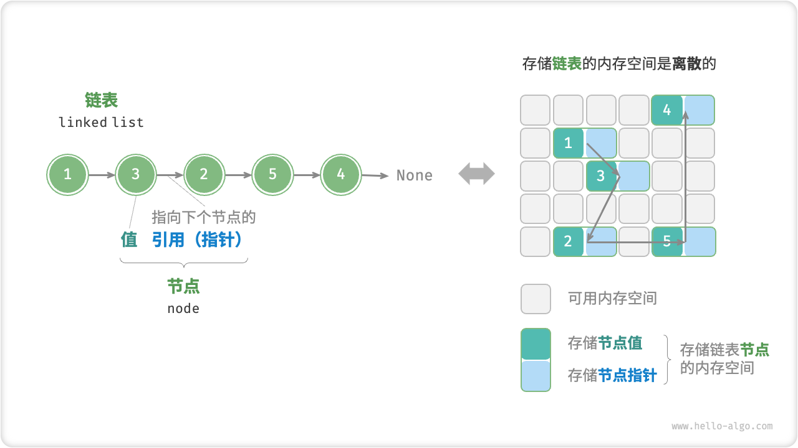
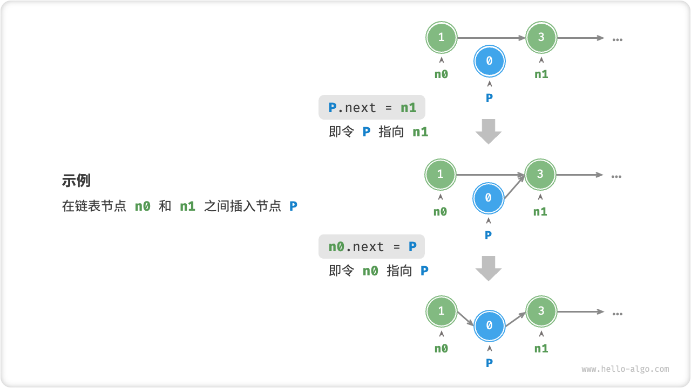
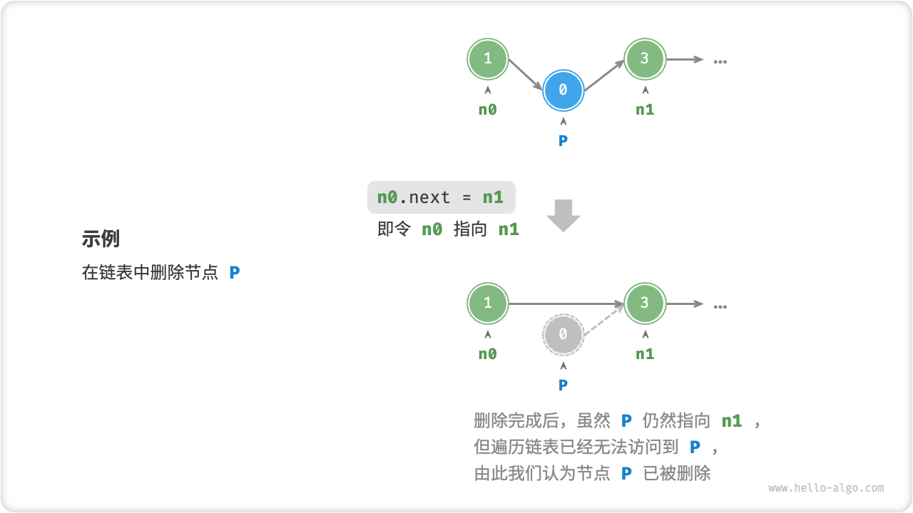

# 4.2. &nbsp; 链表

!!! note "引言"

    内存空间是所有程序的公共资源，排除已占用的内存，空闲内存往往是散落在内存各处的。我们知道，存储数组需要内存空间连续，当我们需要申请一个很大的数组时，系统不一定存在这么大的连续内存空间。而链表则更加灵活，不需要内存是连续的，只要剩余内存空间大小够用即可。

「链表 Linked List」是一种线性数据结构，其中每个元素都是单独的对象，各个元素（一般称为结点）之间通过指针连接。由于结点中记录了连接关系，因此链表的存储方式相比于数组更加灵活，系统不必保证内存地址的连续性。

链表的「结点 Node」包含两项数据，一是结点「值 Value」，二是指向下一结点的「指针 Pointer」（或称「引用 Reference」）。



<p align="center"> Fig. 链表定义与存储方式 </p>

=== "Java"

    ```java title=""
    /* 链表结点类 */
    class ListNode {
        int val;        // 结点值
        ListNode next;  // 指向下一结点的指针（引用）
        ListNode(int x) { val = x; }  // 构造函数
    }
    ```

=== "C++"

    ```cpp title=""
    /* 链表结点结构体 */
    struct ListNode {
        int val;         // 结点值
        ListNode *next;  // 指向下一结点的指针（引用）
        ListNode(int x) : val(x), next(nullptr) {}  // 构造函数
    };
    ```

=== "Python"

    ```python title=""
    """ 链表结点类 """ 
    class ListNode:
        def __init__(self, val: int):
            self.val: int = val                  # 结点值
            self.next: Optional[ListNode] = None # 指向下一结点的指针（引用）
    ```

=== "Go"

    ```go title=""
    /* 链表结点结构体 */
    type ListNode struct {
        Val  int       // 结点值
        Next *ListNode // 指向下一结点的指针（引用）
    }
    
    // NewListNode 构造函数，创建一个新的链表
    func NewListNode(val int) *ListNode {
        return &ListNode{
            Val:  val,
            Next: nil,
        }
    }
    ```

=== "JavaScript"

    ```javascript title=""
    /* 链表结点类 */
    class ListNode {
        val;
        next;
        constructor(val, next) {
            this.val = (val === undefined ? 0 : val);       // 结点值
            this.next = (next === undefined ? null : next); // 指向下一结点的引用
        }
    }
    ```

=== "TypeScript"

    ```typescript title=""
    /* 链表结点类 */
    class ListNode {
        val: number;
        next: ListNode | null;
        constructor(val?: number, next?: ListNode | null) {
            this.val = val === undefined ? 0 : val;        // 结点值
            this.next = next === undefined ? null : next;  // 指向下一结点的引用
        }
    }
    ```

=== "C"

    ```c title=""
    /* 链表结点结构体 */
    struct ListNode {
        int val;               // 结点值
        struct ListNode *next; // 指向下一结点的指针（引用）
    };

    // typedef 作用是为一种数据类型定义一个新名字
    typedef struct ListNode ListNode;

    /* 构造函数，初始化一个新结点 */
    ListNode *newListNode(int val) {
        ListNode *node, *next;
        node = (ListNode *) malloc(sizeof(ListNode));
        node->val = val;
        node->next = NULL;
        return node;
    }
    ```

=== "C#"

    ```csharp title=""
    /* 链表结点类 */
    class ListNode
    {
        int val;         // 结点值
        ListNode next;   // 指向下一结点的引用
        ListNode(int x) => val = x;  //构造函数
    }
    ```

=== "Swift"

    ```swift title=""
    /* 链表结点类 */
    class ListNode {
        var val: Int // 结点值
        var next: ListNode? // 指向下一结点的指针（引用）

        init(x: Int) { // 构造函数
            val = x
        }
    }
    ```

=== "Zig"

    ```zig title=""
    // 链表结点类
    pub fn ListNode(comptime T: type) type {
        return struct {
            const Self = @This();
            
            val: T = 0, // 结点值
            next: ?*Self = null, // 指向下一结点的指针（引用）

            // 构造函数
            pub fn init(self: *Self, x: i32) void {
                self.val = x;
                self.next = null;
            }
        };
    }
    ```

**尾结点指向什么？** 我们一般将链表的最后一个结点称为「尾结点」，其指向的是「空」，在 Java / C++ / Python 中分别记为 `null` / `nullptr` / `None` 。在不引起歧义下，本书都使用 `null` 来表示空。

**链表初始化方法**。建立链表分为两步，第一步是初始化各个结点对象，第二步是构建引用指向关系。完成后，即可以从链表的首个结点（即头结点）出发，访问其余所有的结点。

!!! tip

    我们通常将头结点当作链表的代称，例如头结点 `head` 和链表 `head` 实际上是同义的。

=== "Java"

    ```java title="linked_list.java"
    /* 初始化链表 1 -> 3 -> 2 -> 5 -> 4 */
    // 初始化各个结点 
    ListNode n0 = new ListNode(1);
    ListNode n1 = new ListNode(3);
    ListNode n2 = new ListNode(2);
    ListNode n3 = new ListNode(5);
    ListNode n4 = new ListNode(4);
    // 构建引用指向
    n0.next = n1;
    n1.next = n2;
    n2.next = n3;
    n3.next = n4;
    ```

=== "C++"

    ```cpp title="linked_list.cpp"
    /* 初始化链表 1 -> 3 -> 2 -> 5 -> 4 */
    // 初始化各个结点 
    ListNode* n0 = new ListNode(1);
    ListNode* n1 = new ListNode(3);
    ListNode* n2 = new ListNode(2);
    ListNode* n3 = new ListNode(5);
    ListNode* n4 = new ListNode(4);
    // 构建引用指向
    n0->next = n1;
    n1->next = n2;
    n2->next = n3;
    n3->next = n4;
    ```

=== "Python"

    ```python title="linked_list.py"
    """ 初始化链表 1 -> 3 -> 2 -> 5 -> 4 """
    # 初始化各个结点 
    n0 = ListNode(1)
    n1 = ListNode(3)
    n2 = ListNode(2)
    n3 = ListNode(5)
    n4 = ListNode(4)
    # 构建引用指向
    n0.next = n1
    n1.next = n2
    n2.next = n3
    n3.next = n4
    ```

=== "Go"

    ```go title="linked_list.go"
    /* 初始化链表 1 -> 3 -> 2 -> 5 -> 4 */
    // 初始化各个结点
    n0 := NewListNode(1)
    n1 := NewListNode(3)
    n2 := NewListNode(2)
    n3 := NewListNode(5)
    n4 := NewListNode(4)
    
    // 构建引用指向
    n0.Next = n1
    n1.Next = n2
    n2.Next = n3
    n3.Next = n4
    ```

=== "JavaScript"

    ```javascript title="linked_list.js"
    /* 初始化链表 1 -> 3 -> 2 -> 5 -> 4 */
    // 初始化各个结点
    const n0 = new ListNode(1);
    const n1 = new ListNode(3);
    const n2 = new ListNode(2);
    const n3 = new ListNode(5);
    const n4 = new ListNode(4);
    // 构建引用指向
    n0.next = n1;
    n1.next = n2;
    n2.next = n3;
    n3.next = n4;
    ```

=== "TypeScript"

    ```typescript title="linked_list.ts"
    /* 初始化链表 1 -> 3 -> 2 -> 5 -> 4 */
    // 初始化各个结点
    const n0 = new ListNode(1);
    const n1 = new ListNode(3);
    const n2 = new ListNode(2);
    const n3 = new ListNode(5);
    const n4 = new ListNode(4);
    // 构建引用指向
    n0.next = n1;
    n1.next = n2;
    n2.next = n3;
    n3.next = n4;
    ```

=== "C"

    ```c title="linked_list.c"
    /* 初始化链表 1 -> 3 -> 2 -> 5 -> 4 */
    // 初始化各个结点 
    ListNode* n0 = newListNode(1);
    ListNode* n1 = newListNode(3);
    ListNode* n2 = newListNode(2);
    ListNode* n3 = newListNode(5);
    ListNode* n4 = newListNode(4);
    // 构建引用指向
    n0->next = n1;
    n1->next = n2;
    n2->next = n3;
    n3->next = n4;
    ```

=== "C#"

    ```csharp title="linked_list.cs"
    /* 初始化链表 1 -> 3 -> 2 -> 5 -> 4 */
    // 初始化各个结点 
    ListNode n0 = new ListNode(1);
    ListNode n1 = new ListNode(3);
    ListNode n2 = new ListNode(2);
    ListNode n3 = new ListNode(5);
    ListNode n4 = new ListNode(4);
    // 构建引用指向
    n0.next = n1;
    n1.next = n2;
    n2.next = n3;
    n3.next = n4;
    ```

=== "Swift"

    ```swift title="linked_list.swift"
    /* 初始化链表 1 -> 3 -> 2 -> 5 -> 4 */
    // 初始化各个结点
    let n0 = ListNode(x: 1)
    let n1 = ListNode(x: 3)
    let n2 = ListNode(x: 2)
    let n3 = ListNode(x: 5)
    let n4 = ListNode(x: 4)
    // 构建引用指向
    n0.next = n1
    n1.next = n2
    n2.next = n3
    n3.next = n4
    ```

=== "Zig"

    ```zig title="linked_list.zig"
    // 初始化链表
    // 初始化各个结点 
    var n0 = inc.ListNode(i32){.val = 1};
    var n1 = inc.ListNode(i32){.val = 3};
    var n2 = inc.ListNode(i32){.val = 2};
    var n3 = inc.ListNode(i32){.val = 5};
    var n4 = inc.ListNode(i32){.val = 4};
    // 构建引用指向
    n0.next = &n1;
    n1.next = &n2;
    n2.next = &n3;
    n3.next = &n4;
    ```

## 4.2.1. &nbsp; 链表优点

**在链表中，插入与删除结点的操作效率高**。比如，如果我们想在链表中间的两个结点 `A` , `B` 之间插入一个新结点 `P` ，我们只需要改变两个结点指针即可，时间复杂度为 $O(1)$ ，相比数组的插入操作高效很多。



<p align="center"> Fig. 链表插入结点 </p>

=== "Java"

    ```java title="linked_list.java"
    /* 在链表的结点 n0 之后插入结点 P */
    void insert(ListNode n0, ListNode P) {
        ListNode n1 = n0.next;
        P.next = n1;
        n0.next = P;
    }
    ```

=== "C++"

    ```cpp title="linked_list.cpp"
    /* 在链表的结点 n0 之后插入结点 P */
    void insert(ListNode* n0, ListNode* P) {
        ListNode* n1 = n0->next;
        P->next = n1;
        n0->next = P;
    }
    ```

=== "Python"

    ```python title="linked_list.py"
    def insert(n0: ListNode, P: ListNode) -> None:
        """ 在链表的结点 n0 之后插入结点 P """
        n1 = n0.next
        P.next = n1
        n0.next = P
    ```

=== "Go"

    ```go title="linked_list.go"
    /* 在链表的结点 n0 之后插入结点 P */
    func insertNode(n0 *ListNode, P *ListNode) {
        n1 := n0.Next
        P.Next = n1
        n0.Next = P
    }
    ```

=== "JavaScript"

    ```javascript title="linked_list.js"
    /* 在链表的结点 n0 之后插入结点 P */
    function insert(n0, P) {
        const n1 = n0.next;
        P.next = n1;
        n0.next = P;
    }
    ```

=== "TypeScript"

    ```typescript title="linked_list.ts"
    /* 在链表的结点 n0 之后插入结点 P */
    function insert(n0: ListNode, P: ListNode): void {
        const n1 = n0.next;
        P.next = n1;
        n0.next = P;
    }
    ```

=== "C"

    ```c title="linked_list.c"
    [class]{}-[func]{insertNode}
    ```

=== "C#"

    ```csharp title="linked_list.cs"
    /* 在链表的结点 n0 之后插入结点 P */
    void insert(ListNode n0, ListNode P)
    {
        ListNode? n1 = n0.next;
        P.next = n1;
        n0.next = P;
    }
    ```

=== "Swift"

    ```swift title="linked_list.swift"
    /* 在链表的结点 n0 之后插入结点 P */
    func insert(n0: ListNode, P: ListNode) {
        let n1 = n0.next
        P.next = n1
        n0.next = P
    }
    ```

=== "Zig"

    ```zig title="linked_list.zig"
    // 在链表的结点 n0 之后插入结点 P
    fn insert(n0: ?*inc.ListNode(i32), P: ?*inc.ListNode(i32)) void {
        var n1 = n0.?.next;
        P.?.next = n1;
        n0.?.next = P;
    }
    ```

在链表中删除结点也很方便，只需要改变一个结点指针即可。如下图所示，虽然在完成删除后结点 `P` 仍然指向 `n1` ，但实际上 `P` 已经不属于此链表了，因为遍历此链表是无法访问到 `P` 的。



<p align="center"> Fig. 链表删除结点 </p>

=== "Java"

    ```java title="linked_list.java"
    /* 删除链表的结点 n0 之后的首个结点 */
    void remove(ListNode n0) {
        if (n0.next == null)
            return;
        // n0 -> P -> n1
        ListNode P = n0.next;
        ListNode n1 = P.next;
        n0.next = n1;
    }
    ```

=== "C++"

    ```cpp title="linked_list.cpp"
    /* 删除链表的结点 n0 之后的首个结点 */
    void remove(ListNode* n0) {
        if (n0->next == nullptr)
            return;
        // n0 -> P -> n1
        ListNode* P = n0->next;
        ListNode* n1 = P->next;
        n0->next = n1;
        // 释放内存
        delete P;
    }
    ```

=== "Python"

    ```python title="linked_list.py"
    def remove(n0: ListNode) -> None:
        """ 删除链表的结点 n0 之后的首个结点 """
        if not n0.next:
            return
        # n0 -> P -> n1
        P = n0.next
        n1 = P.next
        n0.next = n1
    ```

=== "Go"

    ```go title="linked_list.go"
    /* 删除链表的结点 n0 之后的首个结点 */
    func removeNode(n0 *ListNode) {
        if n0.Next == nil {
            return
        }
        // n0 -> P -> n1
        P := n0.Next
        n1 := P.Next
        n0.Next = n1
    }
    ```

=== "JavaScript"

    ```javascript title="linked_list.js"
    /* 删除链表的结点 n0 之后的首个结点 */
    function remove(n0) {
        if (!n0.next)
            return;
        // n0 -> P -> n1
        const P = n0.next;
        const n1 = P.next;
        n0.next = n1;
    }
    ```

=== "TypeScript"

    ```typescript title="linked_list.ts"
    /* 删除链表的结点 n0 之后的首个结点 */
    function remove(n0: ListNode): void {
        if (!n0.next) {
            return;
        }
        // n0 -> P -> n1
        const P = n0.next;
        const n1 = P.next;
        n0.next = n1;
    }
    ```

=== "C"

    ```c title="linked_list.c"
    [class]{}-[func]{removeNode}
    ```

=== "C#"

    ```csharp title="linked_list.cs"
    /* 删除链表的结点 n0 之后的首个结点 */
    void remove(ListNode n0)
    {
        if (n0.next == null)
            return;
        // n0 -> P -> n1
        ListNode P = n0.next;
        ListNode? n1 = P.next;
        n0.next = n1;
    }
    ```

=== "Swift"

    ```swift title="linked_list.swift"
    /* 删除链表的结点 n0 之后的首个结点 */
    func remove(n0: ListNode) {
        if n0.next == nil {
            return
        }
        // n0 -> P -> n1
        let P = n0.next
        let n1 = P?.next
        n0.next = n1
        P?.next = nil
    }
    ```

=== "Zig"

    ```zig title="linked_list.zig"
    // 删除链表的结点 n0 之后的首个结点
    fn remove(n0: ?*inc.ListNode(i32)) void {
        if (n0.?.next == null) return;
        // n0 -> P -> n1
        var P = n0.?.next;
        var n1 = P.?.next;
        n0.?.next = n1;
    }
    ```

## 4.2.2. &nbsp; 链表缺点

**链表访问结点效率低**。上节提到，数组可以在 $O(1)$ 时间下访问任意元素，但链表无法直接访问任意结点。这是因为计算机需要从头结点出发，一个一个地向后遍历到目标结点。例如，倘若想要访问链表索引为 `index` （即第 `index + 1` 个）的结点，那么需要 `index` 次访问操作。

=== "Java"

    ```java title="linked_list.java"
    /* 访问链表中索引为 index 的结点 */
    ListNode access(ListNode head, int index) {
        for (int i = 0; i < index; i++) {
            if (head == null)
                return null;
            head = head.next;
        }
        return head;
    }
    ```

=== "C++"

    ```cpp title="linked_list.cpp"
    /* 访问链表中索引为 index 的结点 */
    ListNode* access(ListNode* head, int index) {
        for (int i = 0; i < index; i++) {
            if (head == nullptr)
                return nullptr;
            head = head->next;
        }
        return head;
    }
    ```

=== "Python"

    ```python title="linked_list.py"
    def access(head: ListNode, index: int) -> Optional[ListNode]:
        """ 访问链表中索引为 index 的结点 """
        for _ in range(index):
            if not head:
                return None
            head = head.next
        return head
    ```

=== "Go"

    ```go title="linked_list.go"
    /* 访问链表中索引为 index 的结点 */
    func access(head *ListNode, index int) *ListNode {
        for i := 0; i < index; i++ {
            if head == nil {
                return nil
            }
            head = head.Next
        }
        return head
    }
    ```

=== "JavaScript"

    ```javascript title="linked_list.js"
    /* 访问链表中索引为 index 的结点 */
    function access(head, index) {
        for (let i = 0; i < index; i++) {
            if (!head) {
                return null;
            }
            head = head.next;
        }
        return head;
    }
    ```

=== "TypeScript"

    ```typescript title="linked_list.ts"
    /* 访问链表中索引为 index 的结点 */
    function access(head: ListNode | null, index: number): ListNode | null {
        for (let i = 0; i < index; i++) {
            if (!head) {
                return null;
            }
            head = head.next;
        }
        return head;
    }
    ```

=== "C"

    ```c title="linked_list.c"
    [class]{}-[func]{access}
    ```

=== "C#"

    ```csharp title="linked_list.cs"
    /* 访问链表中索引为 index 的结点 */
    ListNode? access(ListNode head, int index)
    {
        for (int i = 0; i < index; i++)
        {
            if (head == null)
                return null;
            head = head.next;
        }
        return head;
    }
    ```

=== "Swift"

    ```swift title="linked_list.swift"
    /* 访问链表中索引为 index 的结点 */
    func access(head: ListNode, index: Int) -> ListNode? {
        var head: ListNode? = head
        for _ in 0 ..< index {
            if head == nil {
                return nil
            }
            head = head?.next
        }
        return head
    }
    ```

=== "Zig"

    ```zig title="linked_list.zig"
    // 访问链表中索引为 index 的结点
    fn access(node: ?*inc.ListNode(i32), index: i32) ?*inc.ListNode(i32) {
        var head = node;
        var i: i32 = 0;
        while (i < index) : (i += 1) {
            head = head.?.next;
            if (head == null) return null;
        }
        return head;
    }
    ```

**链表的内存占用多**。链表以结点为单位，每个结点除了保存值外，还需额外保存指针（引用）。这意味着同样数据量下，链表比数组需要占用更多内存空间。

## 4.2.3. &nbsp; 链表常用操作

**遍历链表查找**。遍历链表，查找链表内值为 `target` 的结点，输出结点在链表中的索引。

=== "Java"

    ```java title="linked_list.java"
    /* 在链表中查找值为 target 的首个结点 */
    int find(ListNode head, int target) {
        int index = 0;
        while (head != null) {
            if (head.val == target)
                return index;
            head = head.next;
            index++;
        }
        return -1;
    }
    ```

=== "C++"

    ```cpp title="linked_list.cpp"
    /* 在链表中查找值为 target 的首个结点 */
    int find(ListNode* head, int target) {
        int index = 0;
        while (head != nullptr) {
            if (head->val == target)
                return index;
            head = head->next;
            index++;
        }
        return -1;
    }
    ```

=== "Python"

    ```python title="linked_list.py"
    def find(head: ListNode, target: int) -> int:
        """ 在链表中查找值为 target 的首个结点 """
        index = 0
        while head:
            if head.val == target:
                return index
            head = head.next
            index += 1
        return -1
    ```

=== "Go"

    ```go title="linked_list.go"
    /* 在链表中查找值为 target 的首个结点 */
    func findNode(head *ListNode, target int) int {
        index := 0
        for head != nil {
            if head.Val == target {
                return index
            }
            head = head.Next
            index++
        }
        return -1
    }
    ```

=== "JavaScript"

    ```javascript title="linked_list.js"
    /* 在链表中查找值为 target 的首个结点 */
    function find(head, target) {
        let index = 0;
        while (head !== null) {
            if (head.val === target) {
                return index;
            }
            head = head.next;
            index += 1;
        }
        return -1;
    }
    ```

=== "TypeScript"

    ```typescript title="linked_list.ts"
    /* 在链表中查找值为 target 的首个结点 */
    function find(head: ListNode | null, target: number): number {
        let index = 0;
        while (head !== null) {
            if (head.val === target) {
                return index;
            }
            head = head.next;
            index += 1;
        }
        return -1;
    }
    ```

=== "C"

    ```c title="linked_list.c"
    [class]{}-[func]{findNode}
    ```

=== "C#"

    ```csharp title="linked_list.cs"
    /* 在链表中查找值为 target 的首个结点 */
    int find(ListNode head, int target)
    {
        int index = 0;
        while (head != null)
        {
            if (head.val == target)
                return index;
            head = head.next;
            index++;
        }
        return -1;
    }
    ```

=== "Swift"

    ```swift title="linked_list.swift"
    /* 在链表中查找值为 target 的首个结点 */
    func find(head: ListNode, target: Int) -> Int {
        var head: ListNode? = head
        var index = 0
        while head != nil {
            if head?.val == target {
                return index
            }
            head = head?.next
            index += 1
        }
        return -1
    }
    ```

=== "Zig"

    ```zig title="linked_list.zig"
    // 在链表中查找值为 target 的首个结点
    fn find(node: ?*inc.ListNode(i32), target: i32) i32 {
        var head = node;
        var index: i32 = 0;
        while (head != null) {
            if (head.?.val == target) return index;
            head = head.?.next;
            index += 1;
        }
        return -1;
    }
    ```

## 4.2.4. &nbsp; 常见链表类型

**单向链表**。即上述介绍的普通链表。单向链表的结点有「值」和指向下一结点的「指针（引用）」两项数据。我们将首个结点称为头结点，尾结点指向 `null` 。

**环形链表**。如果我们令单向链表的尾结点指向头结点（即首尾相接），则得到一个环形链表。在环形链表中，我们可以将任意结点看作是头结点。

**双向链表**。单向链表仅记录了一个方向的指针（引用），在双向链表的结点定义中，同时有指向下一结点（后继结点）和上一结点（前驱结点）的「指针（引用）」。双向链表相对于单向链表更加灵活，即可以朝两个方向遍历链表，但也需要占用更多的内存空间。

=== "Java"

    ```java title=""
    /* 双向链表结点类 */
    class ListNode {
        int val;        // 结点值
        ListNode next;  // 指向后继结点的指针（引用）
        ListNode prev;  // 指向前驱结点的指针（引用）
        ListNode(int x) { val = x; }  // 构造函数
    }
    ```

=== "C++"

    ```cpp title=""
    /* 双向链表结点结构体 */
    struct ListNode {
        int val;         // 结点值
        ListNode *next;  // 指向后继结点的指针（引用）
        ListNode *prev;  // 指向前驱结点的指针（引用）
        ListNode(int x) : val(x), next(nullptr), prev(nullptr) {}  // 构造函数
    };
    ```

=== "Python"

    ```python title=""
    """ 双向链表结点类 """ 
    class ListNode:
        def __init__(self, val: int):
            self.val: int = val                   # 结点值
            self.next: Optional[ListNode] = None  # 指向后继结点的指针（引用）
            self.prev: Optional[ListNode] = None  # 指向前驱结点的指针（引用）
    ```

=== "Go"

    ```go title=""
    /* 双向链表结点结构体 */
    type DoublyListNode struct {
        Val  int             // 结点值
        Next *DoublyListNode // 指向后继结点的指针（引用）
        Prev *DoublyListNode // 指向前驱结点的指针（引用）
    }
    
    // NewDoublyListNode 初始化
    func NewDoublyListNode(val int) *DoublyListNode {
        return &DoublyListNode{
            Val:  val,
            Next: nil,
            Prev: nil,
        }
    }
    ```

=== "JavaScript"

    ```javascript title=""
    /* 双向链表结点类 */
    class ListNode {
        val;
        next;
        prev;
        constructor(val, next) {
            this.val = val  ===  undefined ? 0 : val;        // 结点值
            this.next = next  ===  undefined ? null : next;  // 指向后继结点的指针（引用）
            this.prev = prev  ===  undefined ? null : prev;  // 指向前驱结点的指针（引用）
        }
    }
    ```

=== "TypeScript"

    ```typescript title=""
    /* 双向链表结点类 */
    class ListNode {
        val: number;
        next: ListNode | null;
        prev: ListNode | null;
        constructor(val?: number, next?: ListNode | null, prev?: ListNode | null) {
            this.val = val  ===  undefined ? 0 : val;        // 结点值
            this.next = next  ===  undefined ? null : next;  // 指向后继结点的指针（引用）
            this.prev = prev  ===  undefined ? null : prev;  // 指向前驱结点的指针（引用）
        }
    }
    ```

=== "C"

    ```c title=""

    ```

=== "C#"

    ```csharp title=""
    /* 双向链表结点类 */
    class ListNode {
        int val;        // 结点值
        ListNode next;  // 指向后继结点的指针（引用）
        ListNode prev;  // 指向前驱结点的指针（引用）
        ListNode(int x) => val = x;  // 构造函数
    }
    ```

=== "Swift"

    ```swift title=""
    /* 双向链表结点类 */
    class ListNode {
        var val: Int // 结点值
        var next: ListNode? // 指向后继结点的指针（引用）
        var prev: ListNode? // 指向前驱结点的指针（引用）

        init(x: Int) { // 构造函数
            val = x
        }
    }
    ```

=== "Zig"

    ```zig title=""
    // 双向链表结点类
    pub fn ListNode(comptime T: type) type {
        return struct {
            const Self = @This();
            
            val: T = 0, // 结点值
            next: ?*Self = null, // 指向后继结点的指针（引用）
            prev: ?*Self = null, // 指向前驱结点的指针（引用）

            // 构造函数
            pub fn init(self: *Self, x: i32) void {
                self.val = x;
                self.next = null;
                self.prev = null;
            }
        };
    }
    ```


<p align="center"> Fig. 常见链表种类 </p>
