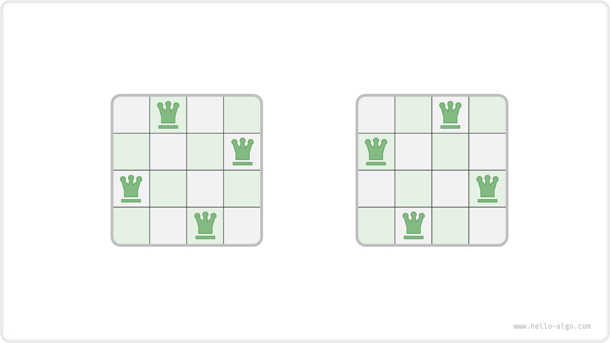
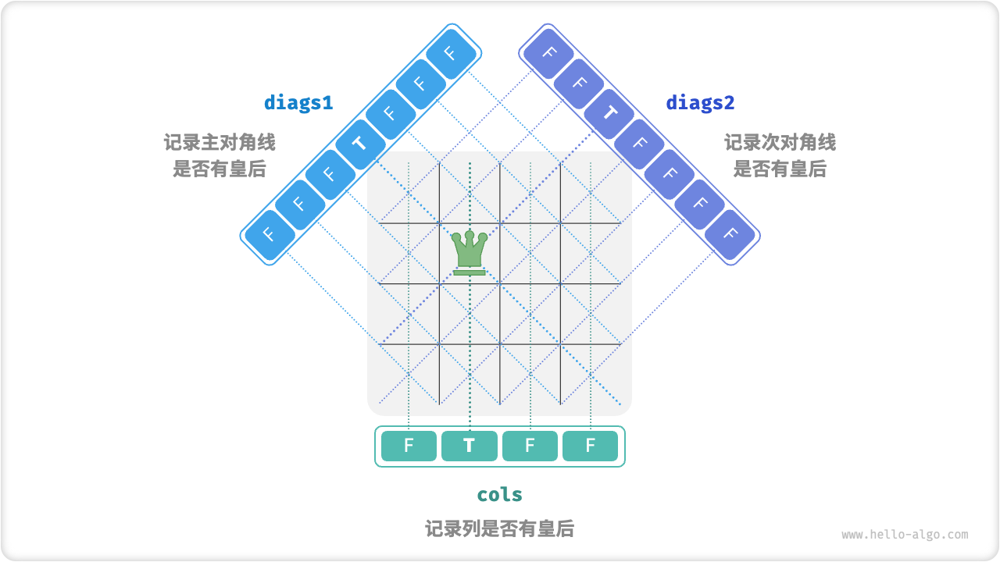

# 13.3. &nbsp; N 皇后问题

!!! question "根据国际象棋的规则，皇后可以攻击与之处在同一行或同一列或同一斜线上的棋子。给定 $n$ 个皇后和一个 $n \times n$ 大小的棋盘，寻找使得所有皇后之间无法相互攻击的摆放方案。"

如下图所示，当 $n = 4$ 时，共可以找到两个解。从回溯算法的角度看，$n \times n$ 大小的棋盘共有 $n^2$ 个格子，给出了所有的选择 `choices` 。在逐个放置皇后的过程中，棋盘状态在不断地变化，每个时刻的棋盘就是状态 `state` 。



<p align="center"> Fig. 4 皇后问题的解 </p>

本题共有三个约束条件：**多个皇后不能在同一行、同一列和同一对角线**。值得注意的是，对角线分为主对角线 `\` 和副对角线 `/` 两种。


<p align="center"> Fig. n 皇后问题的约束条件 </p>

皇后的数量和棋盘的行数都为 $n$ ，因此我们容易得到第一个推论：**棋盘每行都允许且只允许放置一个皇后**。这意味着，我们可以采取逐行放置策略：从第一行开始，在每行放置一个皇后，直至最后一行结束。**此策略起到了剪枝的作用**，它避免了同一行出现多个皇后的所有搜索分支。

下图展示了 $4$ 皇后问题的逐行放置过程。受篇幅限制，下图仅展开了第一行的一个搜索分支。在搜索过程中，我们将不满足列约束和对角线约束的方案都剪枝了。


<p align="center"> Fig. 逐行放置策略 </p>

为了实现根据列约束剪枝，我们可以利用一个长度为 $n$ 的布尔型数组 `cols` 记录每一列是否有皇后。在每次决定放置前，我们通过 `cols` 将已有皇后的列剪枝，并在回溯中动态更新 `cols` 的状态。

那么，如何处理对角线约束呢？设棋盘中某个格子的行列索引为 `(row, col)` ，观察矩阵的某条主对角线，**我们发现该对角线上所有格子的行索引减列索引相等**，即 `row - col` 为恒定值。换句话说，若两个格子满足 `row1 - col1 == row2 - col2` ，则这两个格子一定处在一条主对角线上。

利用该性质，我们可以借助一个数组 `diag1` 来记录每条主对角线上是否有皇后。注意，$n$ 维方阵 `row - col` 的范围是 $[-n + 1, n - 1]$ ，因此共有 $2n - 1$ 条主对角线。



<p align="center"> Fig. 处理列约束和对角线约束 </p>

同理，**次对角线上的所有格子的 `row + col` 是恒定值**。我们可以使用同样的方法，借助数组 `diag2` 来处理次对角线约束。

根据以上分析，我们便可以写出 $n$ 皇后的解题代码。

=== "Java"

    ```java title="n_queens.java"
    /* 回溯算法：N 皇后 */
    void backtrack(int row, int n, List<List<String>> state, List<List<List<String>>> res,
            boolean[] cols, boolean[] diags1, boolean[] diags2) {
        // 当放置完所有行时，记录解
        if (row == n) {
            List<List<String>> copyState = new ArrayList<>();
            for (List<String> sRow : state) {
                copyState.add(new ArrayList<>(sRow));
            }
            res.add(copyState);
            return;
        }
        // 遍历所有列
        for (int col = 0; col < n; col++) {
            // 计算该格子对应的主对角线和副对角线
            int diag1 = row - col + n - 1;
            int diag2 = row + col;
            // 剪枝：不允许该格子所在 (列 或 主对角线 或 副对角线) 包含皇后
            if (!(cols[col] || diags1[diag1] || diags2[diag2])) {
                // 尝试：将皇后放置在该格子
                state.get(row).set(col, "Q");
                cols[col] = diags1[diag1] = diags2[diag2] = true;
                // 放置下一行
                backtrack(row + 1, n, state, res, cols, diags1, diags2);
                // 回退：将该格子恢复为空位
                state.get(row).set(col, "#");
                cols[col] = diags1[diag1] = diags2[diag2] = false;
            }
        }
    }

    /* 求解 N 皇后 */
    List<List<List<String>>> nQueens(int n) {
        // 初始化 n*n 大小的棋盘，其中 'Q' 代表皇后，'#' 代表空位
        List<List<String>> state = new ArrayList<>();
        for (int i = 0; i < n; i++) {
            List<String> row = new ArrayList<>();
            for (int j = 0; j < n; j++) {
                row.add("#");
            }
            state.add(row);
        }
        boolean[] cols = new boolean[n]; // 记录列是否有皇后
        boolean[] diags1 = new boolean[2 * n - 1]; // 记录主对角线是否有皇后
        boolean[] diags2 = new boolean[2 * n - 1]; // 记录副对角线是否有皇后
        List<List<List<String>>> res = new ArrayList<>();

        backtrack(0, n, state, res, cols, diags1, diags2);

        return res;
    }
    ```

=== "C++"

    ```cpp title="n_queens.cpp"
    /* 回溯算法：N 皇后 */
    void backtrack(int row, int n, vector<vector<string>> &state, vector<vector<vector<string>>> &res, vector<bool> &cols,
                   vector<bool> &diags1, vector<bool> &diags2) {
        // 当放置完所有行时，记录解
        if (row == n) {
            res.push_back(state);
            return;
        }
        // 遍历所有列
        for (int col = 0; col < n; col++) {
            // 计算该格子对应的主对角线和副对角线
            int diag1 = row - col + n - 1;
            int diag2 = row + col;
            // 剪枝：不允许该格子所在 (列 或 主对角线 或 副对角线) 包含皇后
            if (!(cols[col] || diags1[diag1] || diags2[diag2])) {
                // 尝试：将皇后放置在该格子
                state[row][col] = "Q";
                cols[col] = diags1[diag1] = diags2[diag2] = true;
                // 放置下一行
                backtrack(row + 1, n, state, res, cols, diags1, diags2);
                // 回退：将该格子恢复为空位
                state[row][col] = "#";
                cols[col] = diags1[diag1] = diags2[diag2] = false;
            }
        }
    }

    /* 求解 N 皇后 */
    vector<vector<vector<string>>> nQueens(int n) {
        // 初始化 n*n 大小的棋盘，其中 'Q' 代表皇后，'#' 代表空位
        vector<vector<string>> state(n, vector<string>(n, "#"));
        vector<bool> cols(n, false);           // 记录列是否有皇后
        vector<bool> diags1(2 * n - 1, false); // 记录主对角线是否有皇后
        vector<bool> diags2(2 * n - 1, false); // 记录副对角线是否有皇后
        vector<vector<vector<string>>> res;

        backtrack(0, n, state, res, cols, diags1, diags2);

        return res;
    }
    ```

=== "Python"

    ```python title="n_queens.py"
    def backtrack(
        row: int,
        n: int,
        state: list[list[str]],
        cols: list[bool],
        diags1: list[bool],
        diags2: list[bool],
        res: list[list[list[str]]],
    ):
        """回溯算法：N 皇后"""
        # 当放置完所有行时，记录解
        if row == n:
            res.append([list(row) for row in state])
            return
        # 遍历所有列
        for col in range(n):
            # 计算该格子对应的主对角线和副对角线
            diag1 = row - col + n - 1
            diag2 = row + col
            # 剪枝：不允许该格子所在 (列 或 主对角线 或 副对角线) 包含皇后
            if not (cols[col] or diags1[diag1] or diags2[diag2]):
                # 尝试：将皇后放置在该格子
                state[row][col] = "Q"
                cols[col] = diags1[diag1] = diags2[diag2] = True
                # 放置下一行
                backtrack(row + 1, n, state, cols, diags1, diags2, res)
                # 回退：将该格子恢复为空位
                state[row][col] = "#"
                cols[col] = diags1[diag1] = diags2[diag2] = False

    def n_queens(n: int) -> list[list[list[str]]]:
        """求解 N 皇后"""
        # 初始化 n*n 大小的棋盘，其中 'Q' 代表皇后，'#' 代表空位
        state = [["#" for _ in range(n)] for _ in range(n)]
        cols = [False] * n  # 记录列是否有皇后
        diags1 = [False] * (2 * n - 1)  # 记录主对角线是否有皇后
        diags2 = [False] * (2 * n - 1)  # 记录副对角线是否有皇后
        res = []
        backtrack(0, n, state, cols, diags1, diags2, res)

        return res
    ```

=== "Go"

    ```go title="n_queens.go"
    [class]{}-[func]{backtrack}

    [class]{}-[func]{nQueens}
    ```

=== "JavaScript"

    ```javascript title="n_queens.js"
    [class]{}-[func]{backtrack}

    [class]{}-[func]{nQueens}
    ```

=== "TypeScript"

    ```typescript title="n_queens.ts"
    [class]{}-[func]{backtrack}

    [class]{}-[func]{nQueens}
    ```

=== "C"

    ```c title="n_queens.c"
    [class]{}-[func]{backtrack}

    [class]{}-[func]{nQueens}
    ```

=== "C#"

    ```csharp title="n_queens.cs"
    [class]{n_queens}-[func]{backtrack}

    [class]{n_queens}-[func]{nQueens}
    ```

=== "Swift"

    ```swift title="n_queens.swift"
    [class]{}-[func]{backtrack}

    [class]{}-[func]{nQueens}
    ```

=== "Zig"

    ```zig title="n_queens.zig"
    [class]{}-[func]{backtrack}

    [class]{}-[func]{nQueens}
    ```

## 13.3.1. &nbsp; 复杂度分析

逐行放置 $n$ 次，考虑列约束，则从第一行到最后一行分别有 $n, n-1, \cdots, 2, 1$ 个选择，**因此时间复杂度为 $O(n!)$** 。实际上，根据对角线约束的剪枝也能够大幅地缩小搜索空间，因而搜索效率往往优于以上时间复杂度。

`state` 使用 $O(n^2)$ 空间，`cols` , `diags1` , `diags2` 皆使用 $O(n)$ 空间。最大递归深度为 $n$ ，使用 $O(n)$ 栈帧空间。因此，**空间复杂度为 $O(n^2)$** 。
