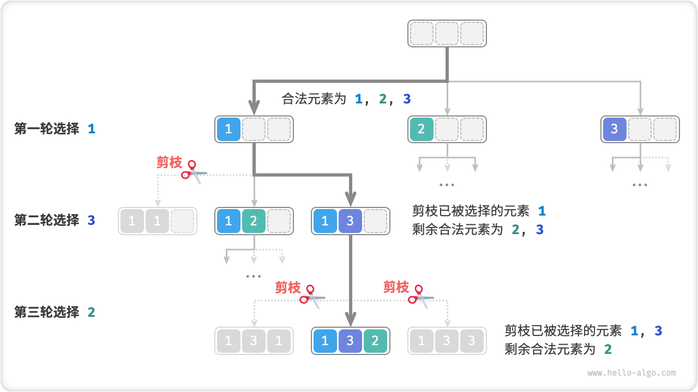
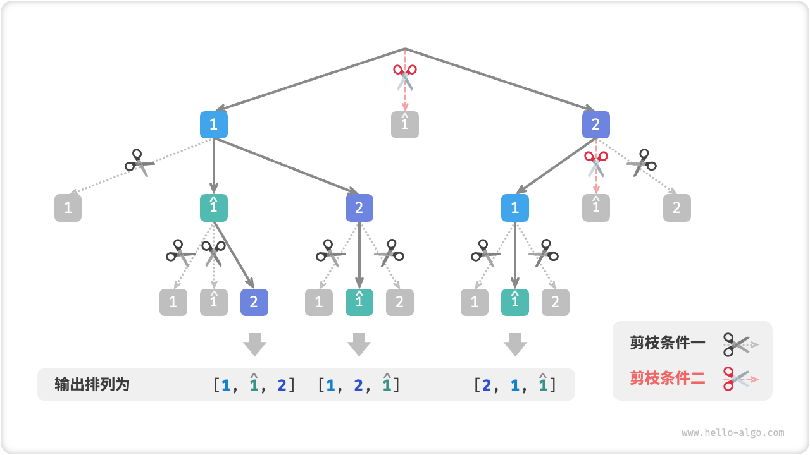

# 13.2. &nbsp; 全排列问题

全排列问题是回溯算法的一个典型应用。它的定义是在给定一个集合（如一个数组或字符串）的情况下，找出这个集合中元素的所有可能的排列。

如下表所示，列举了几个示例数组和其对应的所有排列。

<div class="center-table" markdown>

| 输入数组 | 所有排列                                                          |
| :-------- | :--------------------------------------------------------------- |
| [1]       | [1]                                                              |
| [1, 2]    | [1, 2], [2, 1]                                                   |
| [1, 2, 3] | [1, 2, 3], [1, 3, 2], [2, 1, 3], [2, 3, 1], [3, 1, 2], [3, 2, 1] |

</div>

## 13.2.1. &nbsp; 无重复的情况

!!! question "输入一个整数数组，数组中不包含重复元素，返回所有可能的排列。"

**从回溯算法的角度看，我们可以把生成排列的过程想象成一系列选择的结果**。假设输入数组为 `[1, 2, 3]` ，如果我们先选择 `1` 、再选择 `3` 、最后选择 `2` ，则获得排列 `[1, 3, 2]` 。回退表示撤销一个选择，之后继续尝试其他选择。

从回溯算法代码的角度看，候选集合 `choices` 是输入数组中的所有元素，状态 `state` 是直至目前已被选择的元素。注意，每个元素只允许被选择一次，**因此在遍历选择时，应当排除已经选择过的元素**。

如下图所示，我们可以将搜索过程展开成一个递归树，树中的每个节点代表当前状态 `state` 。从根节点开始，经过三轮选择后到达叶节点，每个叶节点都对应一个排列。


<p align="center"> Fig. 全排列的递归树 </p>

想清楚以上信息之后，我们就可以在框架代码中做“完形填空”了。为了缩短代码行数，我们不单独实现框架代码中的各个函数，而是将他们展开在 `backtrack()` 函数中。

=== "Java"

    ```java title="permutations_i.java"
    /* 回溯算法：全排列 I */
    void backtrack(List<Integer> state, int[] choices, boolean[] selected, List<List<Integer>> res) {
        // 当状态长度等于元素数量时，记录解
        if (state.size() == choices.length) {
            res.add(new ArrayList<Integer>(state));
            return;
        }
        // 遍历所有选择
        for (int i = 0; i < choices.length; i++) {
            int choice = choices[i];
            // 剪枝：不允许重复选择元素 且 不允许重复选择相等元素
            if (!selected[i]) {
                // 尝试：做出选择，更新状态
                selected[i] = true;
                state.add(choice);
                // 进行下一轮选择
                backtrack(state, choices, selected, res);
                // 回退：撤销选择，恢复到之前的状态
                selected[i] = false;
                state.remove(state.size() - 1);
            }
        }
    }

    /* 全排列 I */
    List<List<Integer>> permutationsI(int[] nums) {
        List<List<Integer>> res = new ArrayList<List<Integer>>();
        backtrack(new ArrayList<Integer>(), nums, new boolean[nums.length], res);
        return res;
    }
    ```

=== "C++"

    ```cpp title="permutations_i.cpp"
    /* 回溯算法：全排列 I */
    void backtrack(vector<int> &state, const vector<int> &choices, vector<bool> &selected, vector<vector<int>> &res) {
        // 当状态长度等于元素数量时，记录解
        if (state.size() == choices.size()) {
            res.push_back(state);
            return;
        }
        // 遍历所有选择
        for (int i = 0; i < choices.size(); i++) {
            int choice = choices[i];
            // 剪枝：不允许重复选择元素 且 不允许重复选择相等元素
            if (!selected[i]) {
                // 尝试：做出选择，更新状态
                selected[i] = true;
                state.push_back(choice);
                // 进行下一轮选择
                backtrack(state, choices, selected, res);
                // 回退：撤销选择，恢复到之前的状态
                selected[i] = false;
                state.pop_back();
            }
        }
    }

    /* 全排列 I */
    vector<vector<int>> permutationsI(vector<int> nums) {
        vector<int> state;
        vector<bool> selected(nums.size(), false);
        vector<vector<int>> res;
        backtrack(state, nums, selected, res);
        return res;
    }
    ```

=== "Python"

    ```python title="permutations_i.py"
    def backtrack(
        state: list[int], choices: list[int], selected: list[bool], res: list[list[int]]
    ):
        """回溯算法：全排列 I"""
        # 当状态长度等于元素数量时，记录解
        if len(state) == len(choices):
            res.append(list(state))
            return
        # 遍历所有选择
        for i, choice in enumerate(choices):
            # 剪枝：不允许重复选择元素
            if not selected[i]:
                # 尝试：做出选择，更新状态
                selected[i] = True
                state.append(choice)
                # 进行下一轮选择
                backtrack(state, choices, selected, res)
                # 回退：撤销选择，恢复到之前的状态
                selected[i] = False
                state.pop()

    def permutations_i(nums: list[int]) -> list[list[int]]:
        """全排列 I"""
        res = []
        backtrack(state=[], choices=nums, selected=[False] * len(nums), res=res)
        return res
    ```

=== "Go"

    ```go title="permutations_i.go"
    [class]{}-[func]{backtrack}

    [class]{}-[func]{permutationsI}
    ```

=== "JavaScript"

    ```javascript title="permutations_i.js"
    [class]{}-[func]{backtrack}

    [class]{}-[func]{permutationsI}
    ```

=== "TypeScript"

    ```typescript title="permutations_i.ts"
    [class]{}-[func]{backtrack}

    [class]{}-[func]{permutationsI}
    ```

=== "C"

    ```c title="permutations_i.c"
    [class]{}-[func]{backtrack}

    [class]{}-[func]{permutationsI}
    ```

=== "C#"

    ```csharp title="permutations_i.cs"
    /* 回溯算法：全排列 I */
    void backtrack(List<int> state, int[] choices, bool[] selected, List<List<int>> res) {
        // 当状态长度等于元素数量时，记录解
        if (state.Count == choices.Length) {
            res.Add(new List<int>(state));
            return;
        }
        // 遍历所有选择
        for (int i = 0; i < choices.Length; i++) {
            int choice = choices[i];
            // 剪枝：不允许重复选择元素 且 不允许重复选择相等元素
            if (!selected[i]) {
                // 尝试：做出选择，更新状态
                selected[i] = true;
                state.Add(choice);
                // 进行下一轮选择
                backtrack(state, choices, selected, res);
                // 回退：撤销选择，恢复到之前的状态
                selected[i] = false;
                state.RemoveAt(state.Count - 1);
            }
        }
    }

    /* 全排列 I */
    List<List<int>> permutationsI(int[] nums) {
        List<List<int>> res = new List<List<int>>();
        backtrack(new List<int>(), nums, new bool[nums.Length], res);
        return res;
    }
    ```

=== "Swift"

    ```swift title="permutations_i.swift"
    [class]{}-[func]{backtrack}

    [class]{}-[func]{permutationsI}
    ```

=== "Zig"

    ```zig title="permutations_i.zig"
    [class]{}-[func]{backtrack}

    [class]{}-[func]{permutationsI}
    ```

需要重点关注的是，我们引入了一个布尔型数组 `selected` ，它的长度与输入数组长度相等，其中 `selected[i]` 表示 `choices[i]` 是否已被选择。我们利用 `selected` 避免某个元素被重复选择，从而实现剪枝。

如下图所示，假设我们第一轮选择 1 ，第二轮选择 3 ，第三轮选择 2 ，则需要在第二轮剪掉元素 1 的分支，在第三轮剪掉元素 1, 3 的分支。**从本质上理解，此剪枝操作可将搜索空间大小从 $O(n^n)$ 降低至 $O(n!)$** 。



<p align="center"> Fig. 全排列剪枝示例 </p>

## 13.2.2. &nbsp; 考虑重复的情况

!!! question "输入一个整数数组，**数组中可能包含重复元素**，返回所有不重复的排列。"

假设输入数组为 `[1, 1, 2]` 。为了方便区分两个重复的元素 `1` ，接下来我们将第二个元素记为 `1'` 。如下图所示，上述方法生成的排列有一半都是重复的。


<p align="center"> Fig. 重复排列 </p>

那么，如何去除重复的排列呢？最直接地，我们可以借助一个哈希表，直接对排列结果进行去重。然而，这样做不够优雅，因为生成重复排列的搜索分支是没有必要的，应当被提前识别并剪枝，这样可以提升算法效率。

观察发现，在第一轮中，选择 `1` 或选择 `1'` 是等价的，因为在这两个选择之下生成的所有排列都是重复的。因此，我们应该把 `1'` 剪枝掉。同理，在第一轮选择 `2` 后，第二轮选择中的 `1` 和 `1'` 也会产生重复分支，因此也需要将第二轮的 `1'` 剪枝。


<p align="center"> Fig. 重复排列剪枝 </p>

本质上看，**我们的目标是实现在某一轮选择中，多个相等的元素仅被选择一次**。因此，在上一题的代码的基础上，我们考虑在每一轮选择中开启一个哈希表 `duplicated` ，用于记录该轮中已经尝试过的元素，并将重复元素剪枝。

=== "Java"

    ```java title="permutations_ii.java"
    /* 回溯算法：全排列 II */
    void backtrack(List<Integer> state, int[] choices, boolean[] selected, List<List<Integer>> res) {
        // 当状态长度等于元素数量时，记录解
        if (state.size() == choices.length) {
            res.add(new ArrayList<Integer>(state));
            return;
        }
        // 遍历所有选择
        Set<Integer> duplicated = new HashSet<Integer>();
        for (int i = 0; i < choices.length; i++) {
            int choice = choices[i];
            // 剪枝：不允许重复选择元素 且 不允许重复选择相等元素
            if (!selected[i] && !duplicated.contains(choice)) {
                // 尝试：做出选择，更新状态
                duplicated.add(choice); // 记录选择过的元素值
                selected[i] = true;
                state.add(choice);
                // 进行下一轮选择
                backtrack(state, choices, selected, res);
                // 回退：撤销选择，恢复到之前的状态
                selected[i] = false;
                state.remove(state.size() - 1);
            }
        }
    }

    /* 全排列 II */
    List<List<Integer>> permutationsII(int[] nums) {
        List<List<Integer>> res = new ArrayList<List<Integer>>();
        backtrack(new ArrayList<Integer>(), nums, new boolean[nums.length], res);
        return res;
    }
    ```

=== "C++"

    ```cpp title="permutations_ii.cpp"
    /* 回溯算法：全排列 II */
    void backtrack(vector<int> &state, const vector<int> &choices, vector<bool> &selected, vector<vector<int>> &res) {
        // 当状态长度等于元素数量时，记录解
        if (state.size() == choices.size()) {
            res.push_back(state);
            return;
        }
        // 遍历所有选择
        unordered_set<int> duplicated;
        for (int i = 0; i < choices.size(); i++) {
            int choice = choices[i];
            // 剪枝：不允许重复选择元素 且 不允许重复选择相等元素
            if (!selected[i] && duplicated.find(choice) == duplicated.end()) {
                // 尝试：做出选择，更新状态
                duplicated.emplace(choice); // 记录选择过的元素值
                selected[i] = true;
                state.push_back(choice);
                // 进行下一轮选择
                backtrack(state, choices, selected, res);
                // 回退：撤销选择，恢复到之前的状态
                selected[i] = false;
                state.pop_back();
            }
        }
    }

    /* 全排列 II */
    vector<vector<int>> permutationsII(vector<int> nums) {
        vector<int> state;
        vector<bool> selected(nums.size(), false);
        vector<vector<int>> res;
        backtrack(state, nums, selected, res);
        return res;
    }
    ```

=== "Python"

    ```python title="permutations_ii.py"
    def backtrack(
        state: list[int], choices: list[int], selected: list[bool], res: list[list[int]]
    ):
        """回溯算法：全排列 II"""
        # 当状态长度等于元素数量时，记录解
        if len(state) == len(choices):
            res.append(list(state))
            return
        # 遍历所有选择
        duplicated = set[int]()
        for i, choice in enumerate(choices):
            # 剪枝：不允许重复选择元素 且 不允许重复选择相等元素
            if not selected[i] and choice not in duplicated:
                # 尝试：做出选择，更新状态
                duplicated.add(choice)  # 记录选择过的元素值
                selected[i] = True
                state.append(choice)
                # 进行下一轮选择
                backtrack(state, choices, selected, res)
                # 回退：撤销选择，恢复到之前的状态
                selected[i] = False
                state.pop()

    def permutations_ii(nums: list[int]) -> list[list[int]]:
        """全排列 II"""
        res = []
        backtrack(state=[], choices=nums, selected=[False] * len(nums), res=res)
        return res
    ```

=== "Go"

    ```go title="permutations_ii.go"
    [class]{}-[func]{backtrack}

    [class]{}-[func]{permutationsII}
    ```

=== "JavaScript"

    ```javascript title="permutations_ii.js"
    [class]{}-[func]{backtrack}

    [class]{}-[func]{permutationsII}
    ```

=== "TypeScript"

    ```typescript title="permutations_ii.ts"
    [class]{}-[func]{backtrack}

    [class]{}-[func]{permutationsII}
    ```

=== "C"

    ```c title="permutations_ii.c"
    [class]{}-[func]{backtrack}

    [class]{}-[func]{permutationsII}
    ```

=== "C#"

    ```csharp title="permutations_ii.cs"
    /* 回溯算法：全排列 II */
    void backtrack(List<int> state, int[] choices, bool[] selected, List<List<int>> res) {
        // 当状态长度等于元素数量时，记录解
        if (state.Count == choices.Length) {
            res.Add(new List<int>(state));
            return;
        }
        // 遍历所有选择
        ISet<int> duplicated = new HashSet<int>();
        for (int i = 0; i < choices.Length; i++) {
            int choice = choices[i];
            // 剪枝：不允许重复选择元素 且 不允许重复选择相等元素
            if (!selected[i] && !duplicated.Contains(choice)) {
                // 尝试：做出选择，更新状态
                duplicated.Add(choice); // 记录选择过的元素值
                selected[i] = true;
                state.Add(choice);
                // 进行下一轮选择
                backtrack(state, choices, selected, res);
                // 回退：撤销选择，恢复到之前的状态
                selected[i] = false;
                state.RemoveAt(state.Count - 1);
            }
        }
    }

    /* 全排列 II */
    List<List<int>> permutationsII(int[] nums) {
        List<List<int>> res = new List<List<int>>();
        backtrack(new List<int>(), nums, new bool[nums.Length], res);
        return res;
    }
    ```

=== "Swift"

    ```swift title="permutations_ii.swift"
    [class]{}-[func]{backtrack}

    [class]{}-[func]{permutationsII}
    ```

=== "Zig"

    ```zig title="permutations_ii.zig"
    [class]{}-[func]{backtrack}

    [class]{}-[func]{permutationsII}
    ```

注意，虽然 `selected` 和 `duplicated` 都起到剪枝的作用，但他们剪掉的是不同的分支：

- **剪枝条件一**：整个搜索过程中只有一个 `selected` 。它记录的是当前状态中包含哪些元素，作用是避免某个元素在 `state` 中重复出现。
- **剪枝条件二**：每轮选择（即每个开启的 `backtrack` 函数）都包含一个 `duplicated` 。它记录的是在遍历中哪些元素已被选择过，作用是保证相等元素只被选择一次，以避免产生重复的搜索分支。

下图展示了两个剪枝条件的生效范围。注意，树中的每个节点代表一个选择，从根节点到叶节点的路径上的各个节点构成一个排列。



<p align="center"> Fig. 两种剪枝条件的作用范围 </p>

## 13.2.3. &nbsp; 复杂度分析

假设元素两两之间互不相同，则 $n$ 个元素共有 $n!$  种排列（阶乘）；在记录结果时，需要复制长度为 $n$ 的列表，使用 $O(n)$ 时间。因此，**时间复杂度为 $O(n!n)$** 。

最大递归深度为 $n$ ，使用 $O(n)$ 栈帧空间。`selected` 使用 $O(n)$ 空间。同一时刻最多共有 $n$ 个 `duplicated` ，使用 $O(n^2)$ 空间。因此，**全排列 I 的空间复杂度为 $O(n)$ ，全排列 II 的空间复杂度为 $O(n^2)$** 。
