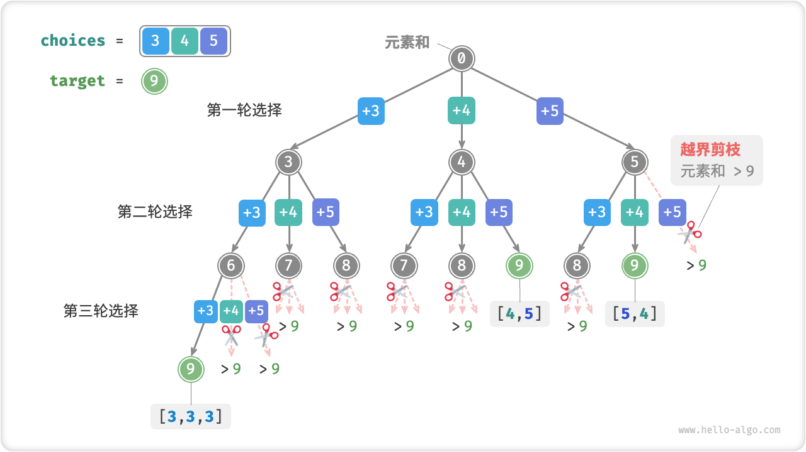
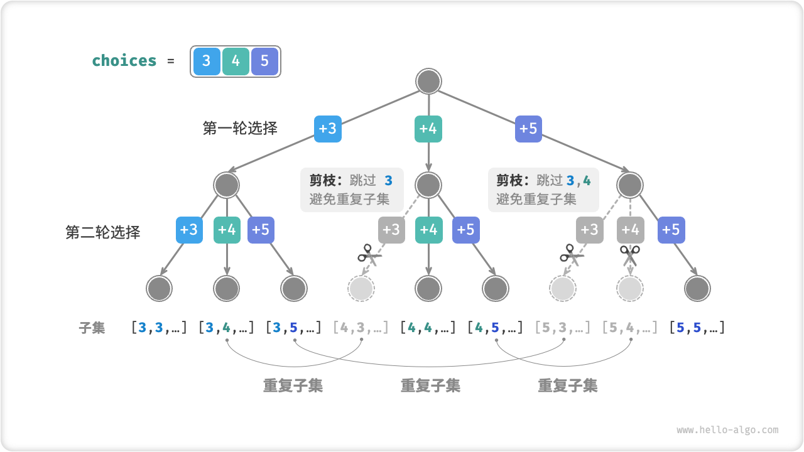
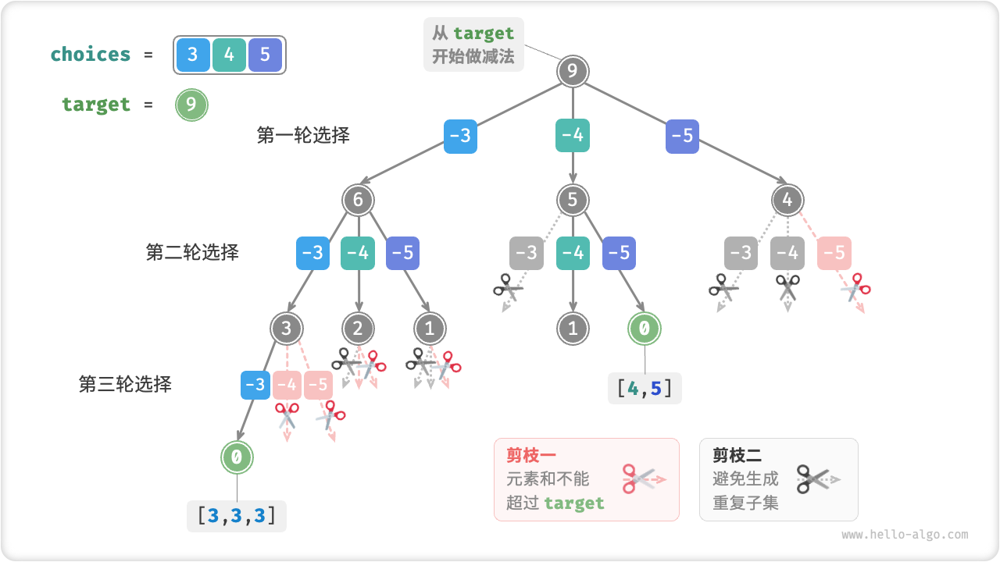
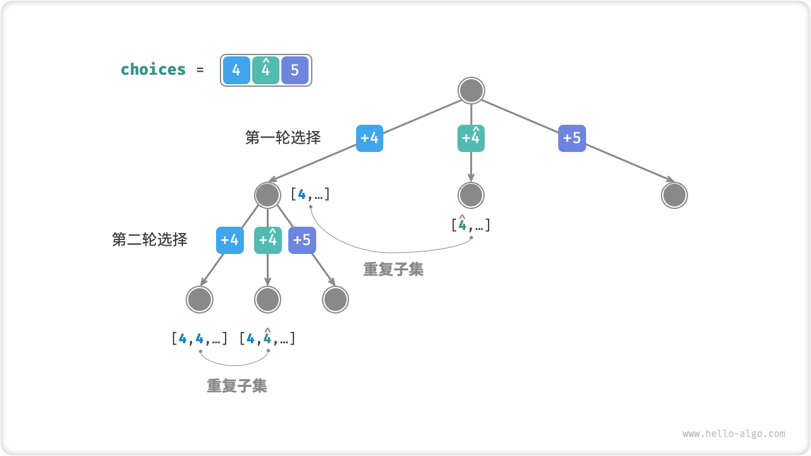
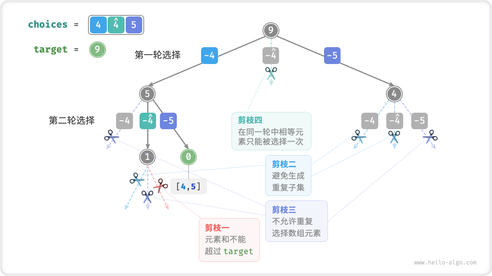

# 13.3. &nbsp; 子集和问题

!!! question

    给定一个正整数数组 `nums` 和一个目标正整数 `target` ，请找出所有可能的组合，使得组合中的元素和等于 `target` 。给定数组无重复元素，每个元素可以被选取多次。请以列表形式返回这些组合，列表中不应包含重复组合。

例如，输入集合 $\{3, 4, 5\}$ 和目标整数 $9$ ，由于集合中的数字可以被重复选取，因此解为 $\{3, 3, 3\}, \{4, 5\}$ 。请注意，子集是不区分元素顺序的，例如 $\{4, 5\}$ 和 $\{5, 4\}$ 是同一个子集。

## 13.3.1. &nbsp; 从全排列引出解法

类似于上节全排列问题的解法，我们可以把子集的生成过程想象成一系列选择的结果，并在选择过程中实时更新“元素和”，当元素和等于 `target` 时，就将子集记录至结果列表。

而与全排列问题不同的是，本题允许重复选取同一元素，因此无需借助 `selected` 布尔列表来记录元素是否已被选择。我们可以对全排列代码进行小幅修改，初步得到解题代码。

=== "Java"

    ```java title="subset_sum_i_naive.java"
    /* 回溯算法：子集和 I */
    void backtrack(List<Integer> state, int target, int total, int[] choices, List<List<Integer>> res) {
        // 子集和等于 target 时，记录解
        if (total == target) {
            res.add(new ArrayList<>(state));
            return;
        }
        // 遍历所有选择
        for (int i = 0; i < choices.length; i++) {
            // 剪枝：若子集和超过 target ，则跳过该选择
            if (total + choices[i] > target) {
                continue;
            }
            // 尝试：做出选择，更新元素和 total
            state.add(choices[i]);
            // 进行下一轮选择
            backtrack(state, target, total + choices[i], choices, res);
            // 回退：撤销选择，恢复到之前的状态
            state.remove(state.size() - 1);
        }
    }

    /* 求解子集和 I（包含重复子集） */
    List<List<Integer>> subsetSumINaive(int[] nums, int target) {
        List<Integer> state = new ArrayList<>(); // 状态（子集）
        int total = 0; // 子集和
        List<List<Integer>> res = new ArrayList<>(); // 结果列表（子集列表）
        backtrack(state, target, total, nums, res);
        return res;
    }
    ```

=== "C++"

    ```cpp title="subset_sum_i_naive.cpp"
    /* 回溯算法：子集和 I */
    void backtrack(vector<int> &state, int target, int total, vector<int> &choices, vector<vector<int>> &res) {
        // 子集和等于 target 时，记录解
        if (total == target) {
            res.push_back(state);
            return;
        }
        // 遍历所有选择
        for (size_t i = 0; i < choices.size(); i++) {
            // 剪枝：若子集和超过 target ，则跳过该选择
            if (total + choices[i] > target) {
                continue;
            }
            // 尝试：做出选择，更新元素和 total
            state.push_back(choices[i]);
            // 进行下一轮选择
            backtrack(state, target, total + choices[i], choices, res);
            // 回退：撤销选择，恢复到之前的状态
            state.pop_back();
        }
    }

    /* 求解子集和 I（包含重复子集） */
    vector<vector<int>> subsetSumINaive(vector<int> &nums, int target) {
        vector<int> state;       // 状态（子集）
        int total = 0;           // 子集和
        vector<vector<int>> res; // 结果列表（子集列表）
        backtrack(state, target, total, nums, res);
        return res;
    }
    ```

=== "Python"

    ```python title="subset_sum_i_naive.py"
    def backtrack(
        state: list[int],
        target: int,
        total: int,
        choices: list[int],
        res: list[list[int]],
    ):
        """回溯算法：子集和 I"""
        # 子集和等于 target 时，记录解
        if total == target:
            res.append(list(state))
            return
        # 遍历所有选择
        for i in range(len(choices)):
            # 剪枝：若子集和超过 target ，则跳过该选择
            if total + choices[i] > target:
                continue
            # 尝试：做出选择，更新元素和 total
            state.append(choices[i])
            # 进行下一轮选择
            backtrack(state, target, total + choices[i], choices, res)
            # 回退：撤销选择，恢复到之前的状态
            state.pop()

    def subset_sum_i_naive(nums: list[int], target: int) -> list[list[int]]:
        """求解子集和 I（包含重复子集）"""
        state = []  # 状态（子集）
        total = 0  # 子集和
        res = []  # 结果列表（子集列表）
        backtrack(state, target, total, nums, res)
        return res
    ```

=== "Go"

    ```go title="subset_sum_i_naive.go"
    /* 回溯算法：子集和 I */
    func backtrackSubsetSumINaive(total, target int, state, choices *[]int, res *[][]int) {
        // 子集和等于 target 时，记录解
        if target == total {
            newState := append([]int{}, *state...)
            *res = append(*res, newState)
            return
        }
        // 遍历所有选择
        for i := 0; i < len(*choices); i++ {
            // 剪枝：若子集和超过 target ，则跳过该选择
            if total+(*choices)[i] > target {
                continue
            }
            // 尝试：做出选择，更新元素和 total
            *state = append(*state, (*choices)[i])
            // 进行下一轮选择
            backtrackSubsetSumINaive(total+(*choices)[i], target, state, choices, res)
            // 回退：撤销选择，恢复到之前的状态
            *state = (*state)[:len(*state)-1]
        }
    }

    /* 求解子集和 I（包含重复子集） */
    func subsetSumINaive(nums []int, target int) [][]int {
        state := make([]int, 0) // 状态（子集）
        total := 0              // 子集和
        res := make([][]int, 0) // 结果列表（子集列表）
        backtrackSubsetSumINaive(total, target, &state, &nums, &res)
        return res
    }
    ```

=== "JavaScript"

    ```javascript title="subset_sum_i_naive.js"
    [class]{}-[func]{backtrack}

    [class]{}-[func]{subsetSumINaive}
    ```

=== "TypeScript"

    ```typescript title="subset_sum_i_naive.ts"
    [class]{}-[func]{backtrack}

    [class]{}-[func]{subsetSumINaive}
    ```

=== "C"

    ```c title="subset_sum_i_naive.c"
    [class]{}-[func]{backtrack}

    [class]{}-[func]{subsetSumINaive}
    ```

=== "C#"

    ```csharp title="subset_sum_i_naive.cs"
    /* 回溯算法：子集和 I */
    void backtrack(List<int> state, int target, int total, int[] choices, List<List<int>> res) {
        // 子集和等于 target 时，记录解
        if (total == target) {
            res.Add(new List<int>(state));
            return;
        }
        // 遍历所有选择
        for (int i = 0; i < choices.Length; i++) {
            // 剪枝：若子集和超过 target ，则跳过该选择
            if (total + choices[i] > target) {
                continue;
            }
            // 尝试：做出选择，更新元素和 total
            state.Add(choices[i]);
            // 进行下一轮选择
            backtrack(state, target, total + choices[i], choices, res);
            // 回退：撤销选择，恢复到之前的状态
            state.RemoveAt(state.Count - 1);
        }
    }

    /* 求解子集和 I（包含重复子集） */
    List<List<int>> subsetSumINaive(int[] nums, int target) {
        List<int> state = new List<int>(); // 状态（子集）
        int total = 0; // 子集和
        List<List<int>> res = new List<List<int>>(); // 结果列表（子集列表）
        backtrack(state, target, total, nums, res);
        return res;
    }
    ```

=== "Swift"

    ```swift title="subset_sum_i_naive.swift"
    /* 回溯算法：子集和 I */
    func backtrack(state: inout [Int], target: Int, total: Int, choices: [Int], res: inout [[Int]]) {
        // 子集和等于 target 时，记录解
        if total == target {
            res.append(state)
            return
        }
        // 遍历所有选择
        for i in stride(from: 0, to: choices.count, by: 1) {
            // 剪枝：若子集和超过 target ，则跳过该选择
            if total + choices[i] > target {
                continue
            }
            // 尝试：做出选择，更新元素和 total
            state.append(choices[i])
            // 进行下一轮选择
            backtrack(state: &state, target: target, total: total + choices[i], choices: choices, res: &res)
            // 回退：撤销选择，恢复到之前的状态
            state.removeLast()
        }
    }

    /* 求解子集和 I（包含重复子集） */
    func subsetSumINaive(nums: [Int], target: Int) -> [[Int]] {
        var state: [Int] = [] // 状态（子集）
        let total = 0 // 子集和
        var res: [[Int]] = [] // 结果列表（子集列表）
        backtrack(state: &state, target: target, total: total, choices: nums, res: &res)
        return res
    }
    ```

=== "Zig"

    ```zig title="subset_sum_i_naive.zig"
    [class]{}-[func]{backtrack}

    [class]{}-[func]{subsetSumINaive}
    ```

=== "Dart"

    ```dart title="subset_sum_i_naive.dart"
    [class]{}-[func]{backtrack}

    [class]{}-[func]{subsetSumINaive}
    ```

向以上代码输入数组 $[3, 4, 5]$ 和目标元素 $9$ ，输出结果为 $[3, 3, 3], [4, 5], [5, 4]$ 。**虽然成功找出了所有和为 $9$ 的子集，但其中存在重复的子集 $[4, 5]$ 和 $[5, 4]$** 。这是因为搜索过程是区分选择顺序的，如下图所示，先选 $4$ 后选 $5$ 与先选 $5$ 后选 $4$ 是两种不同的情况。



<p align="center"> Fig. 子集搜索与越界剪枝 </p>

## 13.3.2. &nbsp; 重复子集剪枝

为了去除重复子集，**一种直接的思路是对结果列表进行去重**。但这个方法效率很低，因为：

- 当数组元素较多，尤其是当 `target` 较大时，搜索过程会产生大量的重复子集。
- 比较子集（数组）的异同是很耗时的，需要先排序数组，再比较数组中每个元素的异同。

为了达到最佳效率，**我们希望在搜索过程中通过剪枝进行去重**。观察下图，重复子集是在以不同顺序选择数组元素时产生的，具体来看：

1. 第一轮和第二轮分别选择 $3$ , $4$ ，会生成包含这两个元素的所有子集，记为 $[3, 4, \cdots]$ 。
2. 若第一轮选择 $4$ ，**则第二轮应该跳过 $3$** ，因为该选择产生的子集 $[4, 3, \cdots]$ 和 `1.` 中提到的子集完全重复。
3. 同理，若第一轮选择 $5$ ，**则第二轮应该跳过 $3$ 和 $4$** ，因为子集 $[5, 3, \cdots]$ 和子集 $[5, 4, \cdots]$ 和之前的子集重复。



<p align="center"> Fig. 不同选择顺序导致的重复子集 </p>

总结来看，给定输入数组 $[x_1, x_2, \cdots, x_n]$ ，设搜索过程中的选择序列为 $[x_{i_1}, x_{i_2}, \cdots , x_{i_m}]$ ，则该选择序列需要满足 $i_1 \leq i_2 \leq \cdots \leq i_m$ 。**不满足该条件的选择序列都是重复子集**。

为实现该剪枝，我们初始化变量 `start` ，用于指示遍历起点。**当做出选择 $x_{i}$ 后，设定下一轮从索引 $i$ 开始遍历**，从而完成子集去重。

除此之外，我们还对代码进行了两项优化。首先，我们在开启搜索前将数组 `nums` 排序，在搜索过程中，**当子集和超过 `target` 时直接结束循环**，因为后边的元素更大，其子集和都一定会超过 `target` 。其次，**我们通过在 `target` 上执行减法来统计元素和**，当 `target` 等于 $0$ 时记录解，省去了元素和变量 `total` 。

=== "Java"

    ```java title="subset_sum_i.java"
    /* 回溯算法：子集和 I */
    void backtrack(List<Integer> state, int target, int[] choices, int start, List<List<Integer>> res) {
        // 子集和等于 target 时，记录解
        if (target == 0) {
            res.add(new ArrayList<>(state));
            return;
        }
        // 遍历所有选择
        // 剪枝二：从 start 开始遍历，避免生成重复子集
        for (int i = start; i < choices.length; i++) {
            // 剪枝一：若子集和超过 target ，则直接结束循环
            // 这是因为数组已排序，后边元素更大，子集和一定超过 target
            if (target - choices[i] < 0) {
                break;
            }
            // 尝试：做出选择，更新 target, start
            state.add(choices[i]);
            // 进行下一轮选择
            backtrack(state, target - choices[i], choices, i, res);
            // 回退：撤销选择，恢复到之前的状态
            state.remove(state.size() - 1);
        }
    }

    /* 求解子集和 I */
    List<List<Integer>> subsetSumI(int[] nums, int target) {
        List<Integer> state = new ArrayList<>(); // 状态（子集）
        Arrays.sort(nums); // 对 nums 进行排序
        int start = 0; // 遍历起始点
        List<List<Integer>> res = new ArrayList<>(); // 结果列表（子集列表）
        backtrack(state, target, nums, start, res);
        return res;
    }
    ```

=== "C++"

    ```cpp title="subset_sum_i.cpp"
    /* 回溯算法：子集和 I */
    void backtrack(vector<int> &state, int target, vector<int> &choices, int start, vector<vector<int>> &res) {
        // 子集和等于 target 时，记录解
        if (target == 0) {
            res.push_back(state);
            return;
        }
        // 遍历所有选择
        // 剪枝二：从 start 开始遍历，避免生成重复子集
        for (int i = start; i < choices.size(); i++) {
            // 剪枝一：若子集和超过 target ，则直接结束循环
            // 这是因为数组已排序，后边元素更大，子集和一定超过 target
            if (target - choices[i] < 0) {
                break;
            }
            // 尝试：做出选择，更新 target, start
            state.push_back(choices[i]);
            // 进行下一轮选择
            backtrack(state, target - choices[i], choices, i, res);
            // 回退：撤销选择，恢复到之前的状态
            state.pop_back();
        }
    }

    /* 求解子集和 I */
    vector<vector<int>> subsetSumI(vector<int> &nums, int target) {
        vector<int> state;              // 状态（子集）
        sort(nums.begin(), nums.end()); // 对 nums 进行排序
        int start = 0;                  // 遍历起始点
        vector<vector<int>> res;        // 结果列表（子集列表）
        backtrack(state, target, nums, start, res);
        return res;
    }
    ```

=== "Python"

    ```python title="subset_sum_i.py"
    def backtrack(
        state: list[int], target: int, choices: list[int], start: int, res: list[list[int]]
    ):
        """回溯算法：子集和 I"""
        # 子集和等于 target 时，记录解
        if target == 0:
            res.append(list(state))
            return
        # 遍历所有选择
        # 剪枝二：从 start 开始遍历，避免生成重复子集
        for i in range(start, len(choices)):
            # 剪枝一：若子集和超过 target ，则直接结束循环
            # 这是因为数组已排序，后边元素更大，子集和一定超过 target
            if target - choices[i] < 0:
                break
            # 尝试：做出选择，更新 target, start
            state.append(choices[i])
            # 进行下一轮选择
            backtrack(state, target - choices[i], choices, i, res)
            # 回退：撤销选择，恢复到之前的状态
            state.pop()

    def subset_sum_i(nums: list[int], target: int) -> list[list[int]]:
        """求解子集和 I"""
        state = []  # 状态（子集）
        nums.sort()  # 对 nums 进行排序
        start = 0  # 遍历起始点
        res = []  # 结果列表（子集列表）
        backtrack(state, target, nums, start, res)
        return res
    ```

=== "Go"

    ```go title="subset_sum_i.go"
    /* 回溯算法：子集和 I */
    func backtrackSubsetSumI(start, target int, state, choices *[]int, res *[][]int) {
        // 子集和等于 target 时，记录解
        if target == 0 {
            newState := append([]int{}, *state...)
            *res = append(*res, newState)
            return
        }
        // 遍历所有选择
        // 剪枝二：从 start 开始遍历，避免生成重复子集
        for i := start; i < len(*choices); i++ {
            // 剪枝一：若子集和超过 target ，则直接结束循环
            // 这是因为数组已排序，后边元素更大，子集和一定超过 target
            if target-(*choices)[i] < 0 {
                break
            }
            // 尝试：做出选择，更新 target, start
            *state = append(*state, (*choices)[i])
            // 进行下一轮选择
            backtrackSubsetSumI(i, target-(*choices)[i], state, choices, res)
            // 回退：撤销选择，恢复到之前的状态
            *state = (*state)[:len(*state)-1]
        }
    }

    /* 求解子集和 I */
    func subsetSumI(nums []int, target int) [][]int {
        state := make([]int, 0) // 状态（子集）
        sort.Ints(nums)         // 对 nums 进行排序
        start := 0              // 遍历起始点
        res := make([][]int, 0) // 结果列表（子集列表）
        backtrackSubsetSumI(start, target, &state, &nums, &res)
        return res
    }
    ```

=== "JavaScript"

    ```javascript title="subset_sum_i.js"
    [class]{}-[func]{backtrack}

    [class]{}-[func]{subsetSumI}
    ```

=== "TypeScript"

    ```typescript title="subset_sum_i.ts"
    [class]{}-[func]{backtrack}

    [class]{}-[func]{subsetSumI}
    ```

=== "C"

    ```c title="subset_sum_i.c"
    [class]{}-[func]{backtrack}

    [class]{}-[func]{subsetSumI}
    ```

=== "C#"

    ```csharp title="subset_sum_i.cs"
    /* 回溯算法：子集和 I */
    void backtrack(List<int> state, int target, int[] choices, int start, List<List<int>> res) {
        // 子集和等于 target 时，记录解
        if (target == 0) {
            res.Add(new List<int>(state));
            return;
        }
        // 遍历所有选择
        // 剪枝二：从 start 开始遍历，避免生成重复子集
        for (int i = start; i < choices.Length; i++) {
            // 剪枝一：若子集和超过 target ，则直接结束循环
            // 这是因为数组已排序，后边元素更大，子集和一定超过 target
            if (target - choices[i] < 0) {
                break;
            }
            // 尝试：做出选择，更新 target, start
            state.Add(choices[i]);
            // 进行下一轮选择
            backtrack(state, target - choices[i], choices, i, res);
            // 回退：撤销选择，恢复到之前的状态
            state.RemoveAt(state.Count - 1);
        }
    }

    /* 求解子集和 I */
    List<List<int>> subsetSumI(int[] nums, int target) {
        List<int> state = new List<int>(); // 状态（子集）
        Array.Sort(nums); // 对 nums 进行排序
        int start = 0; // 遍历起始点
        List<List<int>> res = new List<List<int>>(); // 结果列表（子集列表）
        backtrack(state, target, nums, start, res);
        return res;
    }
    ```

=== "Swift"

    ```swift title="subset_sum_i.swift"
    /* 回溯算法：子集和 I */
    func backtrack(state: inout [Int], target: Int, choices: [Int], start: Int, res: inout [[Int]]) {
        // 子集和等于 target 时，记录解
        if target == 0 {
            res.append(state)
            return
        }
        // 遍历所有选择
        // 剪枝二：从 start 开始遍历，避免生成重复子集
        for i in stride(from: start, to: choices.count, by: 1) {
            // 剪枝一：若子集和超过 target ，则直接结束循环
            // 这是因为数组已排序，后边元素更大，子集和一定超过 target
            if target - choices[i] < 0 {
                break
            }
            // 尝试：做出选择，更新 target, start
            state.append(choices[i])
            // 进行下一轮选择
            backtrack(state: &state, target: target - choices[i], choices: choices, start: i, res: &res)
            // 回退：撤销选择，恢复到之前的状态
            state.removeLast()
        }
    }

    /* 求解子集和 I */
    func subsetSumI(nums: [Int], target: Int) -> [[Int]] {
        var state: [Int] = [] // 状态（子集）
        let nums = nums.sorted() // 对 nums 进行排序
        let start = 0 // 遍历起始点
        var res: [[Int]] = [] // 结果列表（子集列表）
        backtrack(state: &state, target: target, choices: nums, start: start, res: &res)
        return res
    }
    ```

=== "Zig"

    ```zig title="subset_sum_i.zig"
    [class]{}-[func]{backtrack}

    [class]{}-[func]{subsetSumI}
    ```

=== "Dart"

    ```dart title="subset_sum_i.dart"
    [class]{}-[func]{backtrack}

    [class]{}-[func]{subsetSumI}
    ```

如下图所示，为将数组 $[3, 4, 5]$ 和目标元素 $9$ 输入到以上代码后的整体回溯过程。



<p align="center"> Fig. 子集和 I 回溯过程 </p>

## 13.3.3. &nbsp; 相等元素剪枝

!!! question

    给定一个正整数数组 `nums` 和一个目标正整数 `target` ，请找出所有可能的组合，使得组合中的元素和等于 `target` 。**给定数组可能包含重复元素，每个元素只可被选择一次**。请以列表形式返回这些组合，列表中不应包含重复组合。

相比于上题，**本题的输入数组可能包含重复元素**，这引入了新的问题。例如，给定数组 $[4, \hat{4}, 5]$ 和目标元素 $9$ ，则现有代码的输出结果为 $[4, 5], [\hat{4}, 5]$ ，也出现了重复子集。**造成这种重复的原因是相等元素在某轮中被多次选择**。如下图所示，第一轮共有三个选择，其中两个都为 $4$ ，会产生两个重复的搜索分支，从而输出重复子集；同理，第二轮的两个 $4$ 也会产生重复子集。



<p align="center"> Fig. 相等元素导致的重复子集 </p>

为解决此问题，**我们需要限制相等元素在每一轮中只被选择一次**。实现方式比较巧妙：由于数组是已排序的，因此相等元素都是相邻的。利用该特性，在某轮选择中，若当前元素与其左边元素相等，则说明它已经被选择过，因此直接跳过当前元素。

与此同时，**本题规定数组元素只能被选择一次**。幸运的是，我们也可以利用变量 `start` 来满足该约束：当做出选择 $x_{i}$ 后，设定下一轮从索引 $i + 1$ 开始向后遍历。这样即能去除重复子集，也能避免重复选择相等元素。

=== "Java"

    ```java title="subset_sum_ii.java"
    /* 回溯算法：子集和 II */
    void backtrack(List<Integer> state, int target, int[] choices, int start, List<List<Integer>> res) {
        // 子集和等于 target 时，记录解
        if (target == 0) {
            res.add(new ArrayList<>(state));
            return;
        }
        // 遍历所有选择
        // 剪枝二：从 start 开始遍历，避免生成重复子集
        // 剪枝三：从 start 开始遍历，避免重复选择同一元素
        for (int i = start; i < choices.length; i++) {
            // 剪枝一：若子集和超过 target ，则直接结束循环
            // 这是因为数组已排序，后边元素更大，子集和一定超过 target
            if (target - choices[i] < 0) {
                break;
            }
            // 剪枝四：如果该元素与左边元素相等，说明该搜索分支重复，直接跳过
            if (i > start && choices[i] == choices[i - 1]) {
                continue;
            }
            // 尝试：做出选择，更新 target, start
            state.add(choices[i]);
            // 进行下一轮选择
            backtrack(state, target - choices[i], choices, i + 1, res);
            // 回退：撤销选择，恢复到之前的状态
            state.remove(state.size() - 1);
        }
    }

    /* 求解子集和 II */
    List<List<Integer>> subsetSumII(int[] nums, int target) {
        List<Integer> state = new ArrayList<>(); // 状态（子集）
        Arrays.sort(nums); // 对 nums 进行排序
        int start = 0; // 遍历起始点
        List<List<Integer>> res = new ArrayList<>(); // 结果列表（子集列表）
        backtrack(state, target, nums, start, res);
        return res;
    }
    ```

=== "C++"

    ```cpp title="subset_sum_ii.cpp"
    /* 回溯算法：子集和 II */
    void backtrack(vector<int> &state, int target, vector<int> &choices, int start, vector<vector<int>> &res) {
        // 子集和等于 target 时，记录解
        if (target == 0) {
            res.push_back(state);
            return;
        }
        // 遍历所有选择
        // 剪枝二：从 start 开始遍历，避免生成重复子集
        // 剪枝三：从 start 开始遍历，避免重复选择同一元素
        for (int i = start; i < choices.size(); i++) {
            // 剪枝一：若子集和超过 target ，则直接结束循环
            // 这是因为数组已排序，后边元素更大，子集和一定超过 target
            if (target - choices[i] < 0) {
                break;
            }
            // 剪枝四：如果该元素与左边元素相等，说明该搜索分支重复，直接跳过
            if (i > start && choices[i] == choices[i - 1]) {
                continue;
            }
            // 尝试：做出选择，更新 target, start
            state.push_back(choices[i]);
            // 进行下一轮选择
            backtrack(state, target - choices[i], choices, i + 1, res);
            // 回退：撤销选择，恢复到之前的状态
            state.pop_back();
        }
    }

    /* 求解子集和 II */
    vector<vector<int>> subsetSumII(vector<int> &nums, int target) {
        vector<int> state;              // 状态（子集）
        sort(nums.begin(), nums.end()); // 对 nums 进行排序
        int start = 0;                  // 遍历起始点
        vector<vector<int>> res;        // 结果列表（子集列表）
        backtrack(state, target, nums, start, res);
        return res;
    }
    ```

=== "Python"

    ```python title="subset_sum_ii.py"
    def backtrack(
        state: list[int], target: int, choices: list[int], start: int, res: list[list[int]]
    ):
        """回溯算法：子集和 II"""
        # 子集和等于 target 时，记录解
        if target == 0:
            res.append(list(state))
            return
        # 遍历所有选择
        # 剪枝二：从 start 开始遍历，避免生成重复子集
        # 剪枝三：从 start 开始遍历，避免重复选择同一元素
        for i in range(start, len(choices)):
            # 剪枝一：若子集和超过 target ，则直接结束循环
            # 这是因为数组已排序，后边元素更大，子集和一定超过 target
            if target - choices[i] < 0:
                break
            # 剪枝四：如果该元素与左边元素相等，说明该搜索分支重复，直接跳过
            if i > start and choices[i] == choices[i - 1]:
                continue
            # 尝试：做出选择，更新 target, start
            state.append(choices[i])
            # 进行下一轮选择
            backtrack(state, target - choices[i], choices, i + 1, res)
            # 回退：撤销选择，恢复到之前的状态
            state.pop()

    def subset_sum_ii(nums: list[int], target: int) -> list[list[int]]:
        """求解子集和 II"""
        state = []  # 状态（子集）
        nums.sort()  # 对 nums 进行排序
        start = 0  # 遍历起始点
        res = []  # 结果列表（子集列表）
        backtrack(state, target, nums, start, res)
        return res
    ```

=== "Go"

    ```go title="subset_sum_ii.go"
    /* 回溯算法：子集和 II */
    func backtrackSubsetSumII(start, target int, state, choices *[]int, res *[][]int) {
        // 子集和等于 target 时，记录解
        if target == 0 {
            newState := append([]int{}, *state...)
            *res = append(*res, newState)
            return
        }
        // 遍历所有选择
        // 剪枝二：从 start 开始遍历，避免生成重复子集
        // 剪枝三：从 start 开始遍历，避免重复选择同一元素
        for i := start; i < len(*choices); i++ {
            // 剪枝一：若子集和超过 target ，则直接结束循环
            // 这是因为数组已排序，后边元素更大，子集和一定超过 target
            if target-(*choices)[i] < 0 {
                break
            }
            // 剪枝四：如果该元素与左边元素相等，说明该搜索分支重复，直接跳过
            if i > start && (*choices)[i] == (*choices)[i-1] {
                continue
            }
            // 尝试：做出选择，更新 target, start
            *state = append(*state, (*choices)[i])
            // 进行下一轮选择
            backtrackSubsetSumII(i+1, target-(*choices)[i], state, choices, res)
            // 回退：撤销选择，恢复到之前的状态
            *state = (*state)[:len(*state)-1]
        }
    }

    /* 求解子集和 II */
    func subsetSumII(nums []int, target int) [][]int {
        state := make([]int, 0) // 状态（子集）
        sort.Ints(nums)         // 对 nums 进行排序
        start := 0              // 遍历起始点
        res := make([][]int, 0) // 结果列表（子集列表）
        backtrackSubsetSumII(start, target, &state, &nums, &res)
        return res
    }
    ```

=== "JavaScript"

    ```javascript title="subset_sum_ii.js"
    [class]{}-[func]{backtrack}

    [class]{}-[func]{subsetSumII}
    ```

=== "TypeScript"

    ```typescript title="subset_sum_ii.ts"
    [class]{}-[func]{backtrack}

    [class]{}-[func]{subsetSumII}
    ```

=== "C"

    ```c title="subset_sum_ii.c"
    [class]{}-[func]{backtrack}

    [class]{}-[func]{subsetSumII}
    ```

=== "C#"

    ```csharp title="subset_sum_ii.cs"
    /* 回溯算法：子集和 II */
    void backtrack(List<int> state, int target, int[] choices, int start, List<List<int>> res) {
        // 子集和等于 target 时，记录解
        if (target == 0) {
            res.Add(new List<int>(state));
            return;
        }
        // 遍历所有选择
        // 剪枝二：从 start 开始遍历，避免生成重复子集
        // 剪枝三：从 start 开始遍历，避免重复选择同一元素
        for (int i = start; i < choices.Length; i++) {
            // 剪枝一：若子集和超过 target ，则直接结束循环
            // 这是因为数组已排序，后边元素更大，子集和一定超过 target
            if (target - choices[i] < 0) {
                break;
            }
            // 剪枝四：如果该元素与左边元素相等，说明该搜索分支重复，直接跳过
            if (i > start && choices[i] == choices[i - 1]) {
                continue;
            }
            // 尝试：做出选择，更新 target, start
            state.Add(choices[i]);
            // 进行下一轮选择
            backtrack(state, target - choices[i], choices, i + 1, res);
            // 回退：撤销选择，恢复到之前的状态
            state.RemoveAt(state.Count - 1);
        }
    }

    /* 求解子集和 II */
    List<List<int>> subsetSumII(int[] nums, int target) {
        List<int> state = new List<int>(); // 状态（子集）
        Array.Sort(nums); // 对 nums 进行排序
        int start = 0; // 遍历起始点
        List<List<int>> res = new List<List<int>>(); // 结果列表（子集列表）
        backtrack(state, target, nums, start, res);
        return res;
    }
    ```

=== "Swift"

    ```swift title="subset_sum_ii.swift"
    /* 回溯算法：子集和 II */
    func backtrack(state: inout [Int], target: Int, choices: [Int], start: Int, res: inout [[Int]]) {
        // 子集和等于 target 时，记录解
        if target == 0 {
            res.append(state)
            return
        }
        // 遍历所有选择
        // 剪枝二：从 start 开始遍历，避免生成重复子集
        // 剪枝三：从 start 开始遍历，避免重复选择同一元素
        for i in stride(from: start, to: choices.count, by: 1) {
            // 剪枝一：若子集和超过 target ，则直接结束循环
            // 这是因为数组已排序，后边元素更大，子集和一定超过 target
            if target - choices[i] < 0 {
                break
            }
            // 剪枝四：如果该元素与左边元素相等，说明该搜索分支重复，直接跳过
            if i > start, choices[i] == choices[i - 1] {
                continue
            }
            // 尝试：做出选择，更新 target, start
            state.append(choices[i])
            // 进行下一轮选择
            backtrack(state: &state, target: target - choices[i], choices: choices, start: i + 1, res: &res)
            // 回退：撤销选择，恢复到之前的状态
            state.removeLast()
        }
    }

    /* 求解子集和 II */
    func subsetSumII(nums: [Int], target: Int) -> [[Int]] {
        var state: [Int] = [] // 状态（子集）
        let nums = nums.sorted() // 对 nums 进行排序
        let start = 0 // 遍历起始点
        var res: [[Int]] = [] // 结果列表（子集列表）
        backtrack(state: &state, target: target, choices: nums, start: start, res: &res)
        return res
    }
    ```

=== "Zig"

    ```zig title="subset_sum_ii.zig"
    [class]{}-[func]{backtrack}

    [class]{}-[func]{subsetSumII}
    ```

=== "Dart"

    ```dart title="subset_sum_ii.dart"
    [class]{}-[func]{backtrack}

    [class]{}-[func]{subsetSumII}
    ```

下图展示了数组 $[4, 4, 5]$ 和目标元素 $9$ 的回溯过程，共包含四种剪枝操作。建议你将图示与代码注释相结合，理解整个搜索过程，以及每种剪枝操作是如何工作的。



<p align="center"> Fig. 子集和 II 回溯过程 </p>
