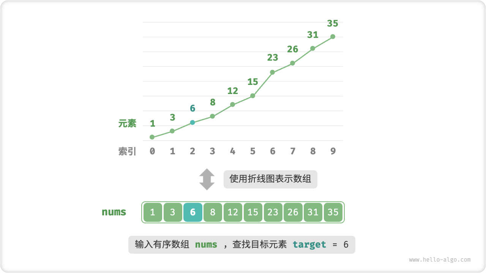
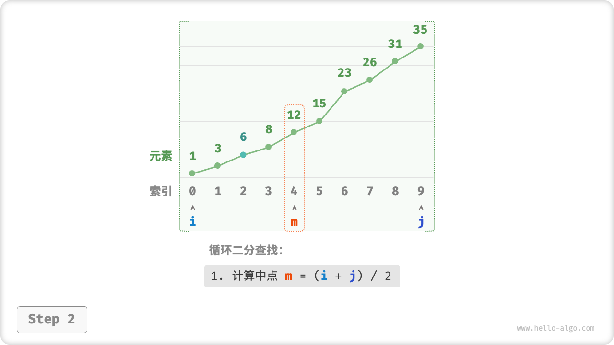
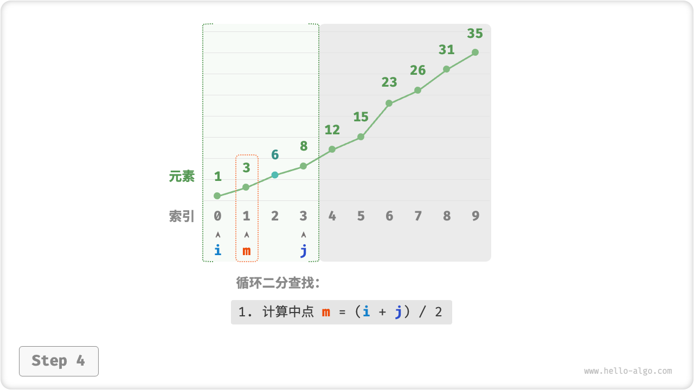
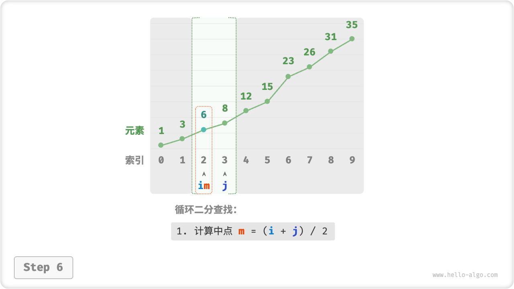
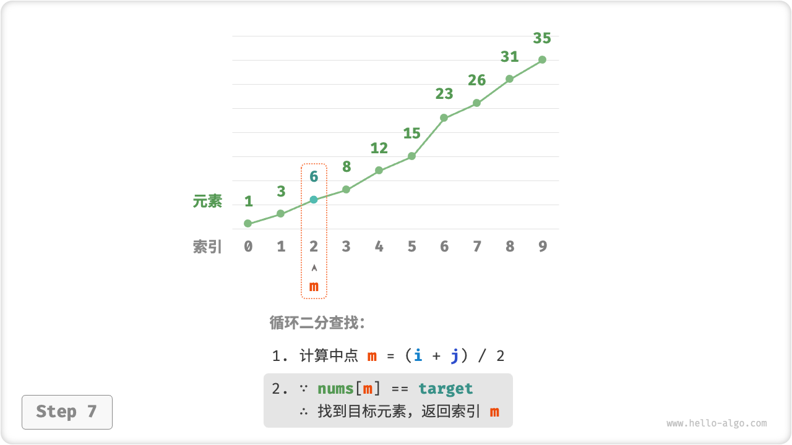
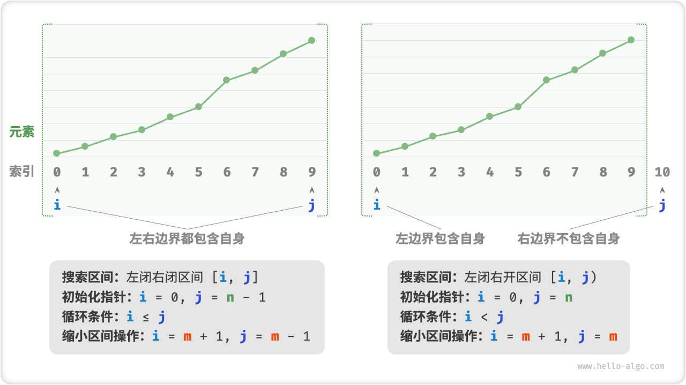

# 6.1. &nbsp; 二分查找

「二分查找 Binary Search」是一种基于分治思想的高效搜索算法。它利用数据的有序性，每轮减少一半搜索范围，实现定位目标元素。

我们先来求解一个简单的二分查找问题。

!!! question "给定一个长度为 $n$ 的有序数组 `nums` ，元素按从小到大的顺序排列。查找并返回元素 `target` 在该数组中的索引。若数组中不包含该元素，则返回 $-1$ 。数组中不包含重复元素。"

该数组的索引范围可以使用区间 $[0, n - 1]$ 来表示。其中，**中括号表示“闭区间”，即包含边界值本身**。在该表示下，区间 $[i, j]$ 在 $i = j$ 时仍包含一个元素，在 $i > j$ 时为空区间。

接下来，我们基于上述区间定义实现二分查找。先初始化指针 $i = 0$ 和 $j = n - 1$ ，分别指向数组首元素和尾元素。之后循环执行以下两个步骤:

1. 计算中点索引 $m = \lfloor {(i + j) / 2} \rfloor$ ，其中 $\lfloor \space \rfloor$ 表示向下取整操作。
2. 根据 `nums[m]` 和 `target` 缩小搜索区间，分为三种情况：
    1. 当 `nums[m] < target` 时，说明 `target` 在区间 $[m + 1, j]$ 中，因此执行 $i = m + 1$ ；
    2. 当 `nums[m] > target` 时，说明 `target` 在区间 $[i, m - 1]$ 中，因此执行 $j = m - 1$ ；
    3. 当 `nums[m] = target` 时，说明找到目标元素，直接返回索引 $m$ 即可；

**若数组不包含目标元素，搜索区间最终会缩小为空**，即达到 $i > j$ 。此时，终止循环并返回 $-1$ 即可。

为了更清晰地表示区间，我们在下图中以折线图的形式表示数组。

=== "<0>"
    

=== "<1>"
    

=== "<2>"
    

=== "<3>"
    

=== "<4>"
    

=== "<5>"
    

=== "<6>"
    

=== "<7>"
    

值得注意的是，**当数组长度 $n$ 很大时，加法 $i + j$ 的结果可能会超出 `int` 类型的取值范围**。为了避免大数越界，我们通常采用公式 $m = \lfloor {i + (j - i) / 2} \rfloor$ 来计算中点。

有趣的是，理论上 Python 的数字可以无限大（取决于内存大小），因此无需考虑大数越界问题。

=== "Java"

    ```java title="binary_search.java"
    /* 二分查找（双闭区间） */
    int binarySearch(int[] nums, int target) {
        // 初始化双闭区间 [0, n-1] ，即 i, j 分别指向数组首元素、尾元素
        int i = 0, j = nums.length - 1;
        // 循环，当搜索区间为空时跳出（当 i > j 时为空）
        while (i <= j) {
            int m = i + (j - i) / 2; // 计算中点索引 m
            if (nums[m] < target) // 此情况说明 target 在区间 [m+1, j] 中
                i = m + 1;
            else if (nums[m] > target) // 此情况说明 target 在区间 [i, m-1] 中
                j = m - 1;
            else // 找到目标元素，返回其索引
                return m;
        }
        // 未找到目标元素，返回 -1
        return -1;
    }
    ```

=== "C++"

    ```cpp title="binary_search.cpp"
    /* 二分查找（双闭区间） */
    int binarySearch(vector<int> &nums, int target) {
        // 初始化双闭区间 [0, n-1] ，即 i, j 分别指向数组首元素、尾元素
        int i = 0, j = nums.size() - 1;
        // 循环，当搜索区间为空时跳出（当 i > j 时为空）
        while (i <= j) {
            int m = i + (j - i) / 2; // 计算中点索引 m
            if (nums[m] < target)    // 此情况说明 target 在区间 [m+1, j] 中
                i = m + 1;
            else if (nums[m] > target) // 此情况说明 target 在区间 [i, m-1] 中
                j = m - 1;
            else // 找到目标元素，返回其索引
                return m;
        }
        // 未找到目标元素，返回 -1
        return -1;
    }
    ```

=== "Python"

    ```python title="binary_search.py"
    def binary_search(nums: list[int], target: int) -> int:
        """二分查找（双闭区间）"""
        # 初始化双闭区间 [0, n-1] ，即 i, j 分别指向数组首元素、尾元素
        i, j = 0, len(nums) - 1
        # 循环，当搜索区间为空时跳出（当 i > j 时为空）
        while i <= j:
            m = (i + j) // 2  # 计算中点索引 m
            if nums[m] < target:
                i = m + 1  # 此情况说明 target 在区间 [m+1, j] 中
            elif nums[m] > target:
                j = m - 1  # 此情况说明 target 在区间 [i, m-1] 中
            else:
                return m  # 找到目标元素，返回其索引
        return -1  # 未找到目标元素，返回 -1
    ```

=== "Go"

    ```go title="binary_search.go"
    /* 二分查找（双闭区间） */
    func binarySearch(nums []int, target int) int {
        // 初始化双闭区间 [0, n-1] ，即 i, j 分别指向数组首元素、尾元素
        i, j := 0, len(nums)-1
        // 循环，当搜索区间为空时跳出（当 i > j 时为空）
        for i <= j {
            m := i + (j-i)/2      // 计算中点索引 m
            if nums[m] < target { // 此情况说明 target 在区间 [m+1, j] 中
                i = m + 1
            } else if nums[m] > target { // 此情况说明 target 在区间 [i, m-1] 中
                j = m - 1
            } else { // 找到目标元素，返回其索引
                return m
            }
        }
        // 未找到目标元素，返回 -1
        return -1
    }
    ```

=== "JavaScript"

    ```javascript title="binary_search.js"
    /* 二分查找（双闭区间） */
    function binarySearch(nums, target) {
        // 初始化双闭区间 [0, n-1] ，即 i, j 分别指向数组首元素、尾元素
        let i = 0,
            j = nums.length - 1;
        // 循环，当搜索区间为空时跳出（当 i > j 时为空）
        while (i <= j) {
            // 计算中点索引 m ，使用 parseInt() 向下取整
            const m = parseInt(i + (j - i) / 2);
            if (nums[m] < target)
                // 此情况说明 target 在区间 [m+1, j] 中
                i = m + 1;
            else if (nums[m] > target)
                // 此情况说明 target 在区间 [i, m-1] 中
                j = m - 1;
            else return m; // 找到目标元素，返回其索引
        }
        // 未找到目标元素，返回 -1
        return -1;
    }
    ```

=== "TypeScript"

    ```typescript title="binary_search.ts"
    /* 二分查找（双闭区间） */
    function binarySearch(nums: number[], target: number): number {
        // 初始化双闭区间 [0, n-1] ，即 i, j 分别指向数组首元素、尾元素
        let i = 0,
            j = nums.length - 1;
        // 循环，当搜索区间为空时跳出（当 i > j 时为空）
        while (i <= j) {
            // 计算中点索引 m
            const m = Math.floor(i + (j - i) / 2);
            if (nums[m] < target) {
                // 此情况说明 target 在区间 [m+1, j] 中
                i = m + 1;
            } else if (nums[m] > target) {
                // 此情况说明 target 在区间 [i, m-1] 中
                j = m - 1;
            } else {
                // 找到目标元素，返回其索引
                return m;
            }
        }
        return -1; // 未找到目标元素，返回 -1
    }
    ```

=== "C"

    ```c title="binary_search.c"
    /* 二分查找（双闭区间） */
    int binarySearch(int *nums, int len, int target) {
        // 初始化双闭区间 [0, n-1] ，即 i, j 分别指向数组首元素、尾元素
        int i = 0, j = len - 1;
        // 循环，当搜索区间为空时跳出（当 i > j 时为空）
        while (i <= j) {
            int m = i + (j - i) / 2; // 计算中点索引 m
            if (nums[m] < target)    // 此情况说明 target 在区间 [m+1, j] 中
                i = m + 1;
            else if (nums[m] > target) // 此情况说明 target 在区间 [i, m-1] 中
                j = m - 1;
            else // 找到目标元素，返回其索引
                return m;
        }
        // 未找到目标元素，返回 -1
        return -1;
    }
    ```

=== "C#"

    ```csharp title="binary_search.cs"
    /* 二分查找（双闭区间） */
    int binarySearch(int[] nums, int target) {
        // 初始化双闭区间 [0, n-1] ，即 i, j 分别指向数组首元素、尾元素
        int i = 0, j = nums.Length - 1;
        // 循环，当搜索区间为空时跳出（当 i > j 时为空）
        while (i <= j) {
            int m = i + (j - i) / 2;   // 计算中点索引 m
            if (nums[m] < target)      // 此情况说明 target 在区间 [m+1, j] 中
                i = m + 1;
            else if (nums[m] > target) // 此情况说明 target 在区间 [i, m-1] 中
                j = m - 1;
            else                       // 找到目标元素，返回其索引
                return m;
        }
        // 未找到目标元素，返回 -1
        return -1;
    }
    ```

=== "Swift"

    ```swift title="binary_search.swift"
    /* 二分查找（双闭区间） */
    func binarySearch(nums: [Int], target: Int) -> Int {
        // 初始化双闭区间 [0, n-1] ，即 i, j 分别指向数组首元素、尾元素
        var i = 0
        var j = nums.count - 1
        // 循环，当搜索区间为空时跳出（当 i > j 时为空）
        while i <= j {
            let m = i + (j - i) / 2 // 计算中点索引 m
            if nums[m] < target { // 此情况说明 target 在区间 [m+1, j] 中
                i = m + 1
            } else if nums[m] > target { // 此情况说明 target 在区间 [i, m-1] 中
                j = m - 1
            } else { // 找到目标元素，返回其索引
                return m
            }
        }
        // 未找到目标元素，返回 -1
        return -1
    }
    ```

=== "Zig"

    ```zig title="binary_search.zig"
    // 二分查找（双闭区间）
    fn binarySearch(comptime T: type, nums: std.ArrayList(T), target: T) T {
        // 初始化双闭区间 [0, n-1] ，即 i, j 分别指向数组首元素、尾元素
        var i: usize = 0;
        var j: usize = nums.items.len - 1;
        // 循环，当搜索区间为空时跳出（当 i > j 时为空）
        while (i <= j) {
            var m = i + (j - i) / 2;                // 计算中点索引 m
            if (nums.items[m] < target) {           // 此情况说明 target 在区间 [m+1, j] 中
                i = m + 1;
            } else if (nums.items[m] > target) {    // 此情况说明 target 在区间 [i, m-1] 中
                j = m - 1;
            } else {                                // 找到目标元素，返回其索引
                return @intCast(T, m);
            }
        }
        // 未找到目标元素，返回 -1
        return -1;
    }
    ```

时间复杂度为 $O(\log n)$ 。每轮缩小一半区间，因此二分循环次数为 $\log_2 n$ 。

空间复杂度为 $O(1)$  。指针 `i` , `j` 使用常数大小空间。

## 6.1.1. &nbsp; 区间表示方法

除了上述的双闭区间外，常见的区间表示还有“左闭右开”区间，定义为 $[0, n)$ ，即左边界包含自身，右边界不包含自身。在该表示下，区间 $[i, j]$ 在 $i = j$ 时为空。

我们可以基于该表示实现具有相同功能的二分查找算法。

=== "Java"

    ```java title="binary_search.java"
    /* 二分查找（左闭右开） */
    int binarySearchLCRO(int[] nums, int target) {
        // 初始化左闭右开 [0, n) ，即 i, j 分别指向数组首元素、尾元素+1
        int i = 0, j = nums.length;
        // 循环，当搜索区间为空时跳出（当 i = j 时为空）
        while (i < j) {
            int m = i + (j - i) / 2; // 计算中点索引 m
            if (nums[m] < target) // 此情况说明 target 在区间 [m+1, j) 中
                i = m + 1;
            else if (nums[m] > target) // 此情况说明 target 在区间 [i, m) 中
                j = m;
            else // 找到目标元素，返回其索引
                return m;
        }
        // 未找到目标元素，返回 -1
        return -1;
    }
    ```

=== "C++"

    ```cpp title="binary_search.cpp"
    /* 二分查找（左闭右开） */
    int binarySearchLCRO(vector<int> &nums, int target) {
        // 初始化左闭右开 [0, n) ，即 i, j 分别指向数组首元素、尾元素+1
        int i = 0, j = nums.size();
        // 循环，当搜索区间为空时跳出（当 i = j 时为空）
        while (i < j) {
            int m = i + (j - i) / 2; // 计算中点索引 m
            if (nums[m] < target)    // 此情况说明 target 在区间 [m+1, j) 中
                i = m + 1;
            else if (nums[m] > target) // 此情况说明 target 在区间 [i, m) 中
                j = m;
            else // 找到目标元素，返回其索引
                return m;
        }
        // 未找到目标元素，返回 -1
        return -1;
    }
    ```

=== "Python"

    ```python title="binary_search.py"
    def binary_search_lcro(nums: list[int], target: int) -> int:
        """二分查找（左闭右开）"""
        # 初始化左闭右开 [0, n) ，即 i, j 分别指向数组首元素、尾元素+1
        i, j = 0, len(nums)
        # 循环，当搜索区间为空时跳出（当 i = j 时为空）
        while i < j:
            m = (i + j) // 2  # 计算中点索引 m
            if nums[m] < target:
                i = m + 1  # 此情况说明 target 在区间 [m+1, j) 中
            elif nums[m] > target:
                j = m  # 此情况说明 target 在区间 [i, m) 中
            else:
                return m  # 找到目标元素，返回其索引
        return -1  # 未找到目标元素，返回 -1
    ```

=== "Go"

    ```go title="binary_search.go"
    /* 二分查找（左闭右开） */
    func binarySearchLCRO(nums []int, target int) int {
        // 初始化左闭右开 [0, n) ，即 i, j 分别指向数组首元素、尾元素+1
        i, j := 0, len(nums)
        // 循环，当搜索区间为空时跳出（当 i = j 时为空）
        for i < j {
            m := i + (j-i)/2      // 计算中点索引 m
            if nums[m] < target { // 此情况说明 target 在区间 [m+1, j) 中
                i = m + 1
            } else if nums[m] > target { // 此情况说明 target 在区间 [i, m) 中
                j = m
            } else { // 找到目标元素，返回其索引
                return m
            }
        }
        // 未找到目标元素，返回 -1
        return -1
    }
    ```

=== "JavaScript"

    ```javascript title="binary_search.js"
    /* 二分查找（左闭右开） */
    function binarySearchLCRO(nums, target) {
        // 初始化左闭右开 [0, n) ，即 i, j 分别指向数组首元素、尾元素+1
        let i = 0,
            j = nums.length;
        // 循环，当搜索区间为空时跳出（当 i = j 时为空）
        while (i < j) {
            // 计算中点索引 m ，使用 parseInt() 向下取整
            const m = parseInt(i + (j - i) / 2);
            if (nums[m] < target)
                // 此情况说明 target 在区间 [m+1, j) 中
                i = m + 1;
            else if (nums[m] > target)
                // 此情况说明 target 在区间 [i, m) 中
                j = m;
            // 找到目标元素，返回其索引
            else return m;
        }
        // 未找到目标元素，返回 -1
        return -1;
    }
    ```

=== "TypeScript"

    ```typescript title="binary_search.ts"
    /* 二分查找（左闭右开） */
    function binarySearchLCRO(nums: number[], target: number): number {
        // 初始化左闭右开 [0, n) ，即 i, j 分别指向数组首元素、尾元素+1
        let i = 0,
            j = nums.length;
        // 循环，当搜索区间为空时跳出（当 i = j 时为空）
        while (i < j) {
            // 计算中点索引 m
            const m = Math.floor(i + (j - i) / 2);
            if (nums[m] < target) {
                // 此情况说明 target 在区间 [m+1, j) 中
                i = m + 1;
            } else if (nums[m] > target) {
                // 此情况说明 target 在区间 [i, m) 中
                j = m;
            } else {
                // 找到目标元素，返回其索引
                return m;
            }
        }
        return -1; // 未找到目标元素，返回 -1
    }
    ```

=== "C"

    ```c title="binary_search.c"
    /* 二分查找（左闭右开） */
    int binarySearchLCRO(int *nums, int len, int target) {
        // 初始化左闭右开 [0, n) ，即 i, j 分别指向数组首元素、尾元素+1
        int i = 0, j = len;
        // 循环，当搜索区间为空时跳出（当 i = j 时为空）
        while (i < j) {
            int m = i + (j - i) / 2; // 计算中点索引 m
            if (nums[m] < target)    // 此情况说明 target 在区间 [m+1, j) 中
                i = m + 1;
            else if (nums[m] > target) // 此情况说明 target 在区间 [i, m) 中
                j = m;
            else // 找到目标元素，返回其索引
                return m;
        }
        // 未找到目标元素，返回 -1
        return -1;
    }
    ```

=== "C#"

    ```csharp title="binary_search.cs"
    /* 二分查找（左闭右开） */
    int binarySearchLCRO(int[] nums, int target) {
        // 初始化左闭右开 [0, n) ，即 i, j 分别指向数组首元素、尾元素+1
        int i = 0, j = nums.Length;
        // 循环，当搜索区间为空时跳出（当 i = j 时为空）
        while (i < j) {
            int m = i + (j - i) / 2;   // 计算中点索引 m
            if (nums[m] < target)      // 此情况说明 target 在区间 [m+1, j) 中
                i = m + 1;
            else if (nums[m] > target) // 此情况说明 target 在区间 [i, m) 中
                j = m;
            else                       // 找到目标元素，返回其索引
                return m;
        }
        // 未找到目标元素，返回 -1
        return -1;
    }
    ```

=== "Swift"

    ```swift title="binary_search.swift"
    /* 二分查找（左闭右开） */
    func binarySearchLCRO(nums: [Int], target: Int) -> Int {
        // 初始化左闭右开 [0, n) ，即 i, j 分别指向数组首元素、尾元素+1
        var i = 0
        var j = nums.count
        // 循环，当搜索区间为空时跳出（当 i = j 时为空）
        while i < j {
            let m = i + (j - i) / 2 // 计算中点索引 m
            if nums[m] < target { // 此情况说明 target 在区间 [m+1, j) 中
                i = m + 1
            } else if nums[m] > target { // 此情况说明 target 在区间 [i, m) 中
                j = m
            } else { // 找到目标元素，返回其索引
                return m
            }
        }
        // 未找到目标元素，返回 -1
        return -1
    }
    ```

=== "Zig"

    ```zig title="binary_search.zig"
    // 二分查找（左闭右开）
    fn binarySearchLCRO(comptime T: type, nums: std.ArrayList(T), target: T) T {
        // 初始化左闭右开 [0, n) ，即 i, j 分别指向数组首元素、尾元素+1
        var i: usize = 0;
        var j: usize = nums.items.len;
        // 循环，当搜索区间为空时跳出（当 i = j 时为空）
        while (i <= j) {
            var m = i + (j - i) / 2;                // 计算中点索引 m
            if (nums.items[m] < target) {           // 此情况说明 target 在区间 [m+1, j) 中
                i = m + 1;
            } else if (nums.items[m] > target) {    // 此情况说明 target 在区间 [i, m) 中
                j = m;
            } else {                                // 找到目标元素，返回其索引
                return @intCast(T, m);
            }
        }
        // 未找到目标元素，返回 -1
        return -1;
    }
    ```

如下图所示，在两种区间表示下，二分查找算法的初始化、循环条件和缩小区间操作皆有所不同。

在“双闭区间”表示法中，由于左右边界都被定义为闭区间，因此指针 $i$ 和 $j$ 缩小区间操作也是对称的。这样更不容易出错。因此，**我们通常采用“双闭区间”的写法**。



<p align="center"> Fig. 两种区间定义 </p>

## 6.1.2. &nbsp; 优点与局限性

二分查找效率很高，主要体现在：

- **二分查找的时间复杂度较低**。对数阶在大数据量情况下具有显著优势。例如，当数据大小 $n = 2^{20}$ 时，线性查找需要 $2^{20} = 1048576$ 轮循环，而二分查找仅需 $\log_2 2^{20} = 20$ 轮循环。
- **二分查找无需额外空间**。与哈希查找相比，二分查找更加节省空间。

然而，并非所有情况下都可使用二分查找，原因如下：

- **二分查找仅适用于有序数据**。若输入数据无序，为了使用二分查找而专门进行排序，得不偿失。因为排序算法的时间复杂度通常为 $O(n \log n)$ ，比线性查找和二分查找都更高。对于频繁插入元素的场景，为保持数组有序性，需要将元素插入到特定位置，时间复杂度为 $O(n)$ ，也是非常昂贵的。
- **二分查找仅适用于数组**。二分查找需要跳跃式（非连续地）访问元素，而在链表中执行跳跃式访问的效率较低，因此不适合应用在链表或基于链表实现的数据结构。
- **小数据量下，线性查找性能更佳**。在线性查找中，每轮只需要 1 次判断操作；而在二分查找中，需要 1 次加法、1 次除法、1 ~ 3 次判断操作、1 次加法（减法），共 4 ~ 6 个单元操作；因此，当数据量 $n$ 较小时，线性查找反而比二分查找更快。
