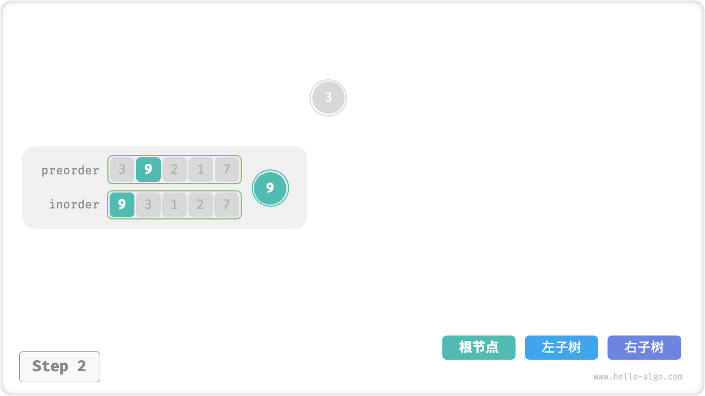
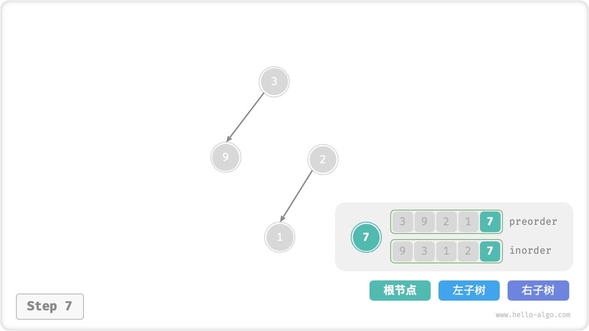
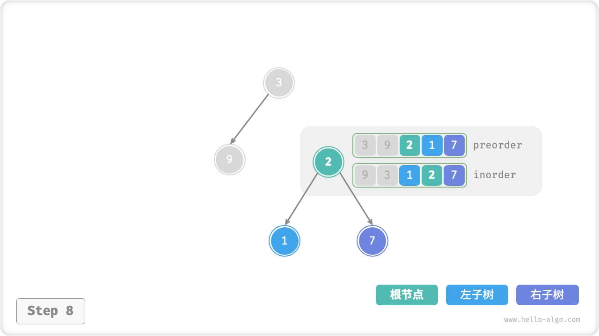
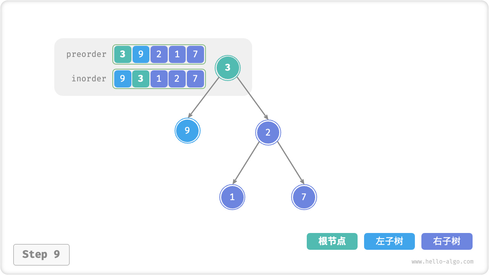
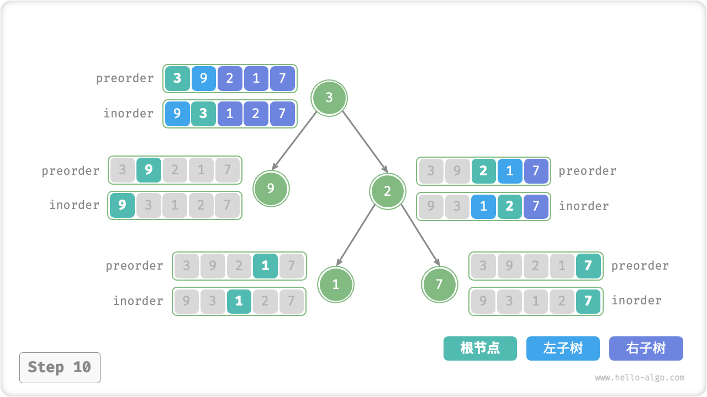

# 12.3. &nbsp; 构建二叉树问题

!!! question

    给定一个二叉树的前序遍历 `preorder` 和中序遍历 `inorder` ，请从中构建二叉树，返回二叉树的根节点。


<p align="center"> Fig. 构建二叉树的示例数据 </p>

原问题定义为从 `preorder` 和 `inorder` 构建二叉树。我们首先从分治的角度分析这道题：

- **问题可以被分解**：从分治的角度切入，我们可以将原问题划分为两个子问题：构建左子树、构建右子树，加上一步操作：初始化根节点。而对于每个子树（子问题），我们仍然可以复用以上划分方法，将其划分为更小的子树（子问题），直至达到最小子问题（空子树）时终止。
- **子问题是独立的**：左子树和右子树是相互独立的，它们之间没有交集。在构建左子树时，我们只需要关注中序遍历和前序遍历或后序遍历中与左子树对应的部分。右子树同理。
- **子问题的解可以合并**：一旦我们得到了左子树和右子树，我们可以将它们链接到根节点上，从而得到原问题的解。

根据以上分析，这道题是可以使用分治来求解的，但问题是：**如何通过前序遍历 `preorder` 和中序遍历 `inorder` 来划分左子树和右子树呢**？

根据定义，`preorder` 和 `inorder` 都可以被划分为三个部分：

- 前序遍历：`[ 根节点 | 左子树 | 右子树 ]` ，例如上图 `[ 3 | 9 | 2 1 7 ]` ；
- 中序遍历：`[ 左子树 | 根节点 ｜ 右子树 ]` ，例如上图 `[ 9 | 3 | 1 2 7 ]` ；

以上图数据为例，我们可以通过以下三步得到上述的划分结果：

1. 前序遍历的首元素 3 为根节点的值；
2. 查找根节点在 `inorder` 中的索引，基于该索引可将 `inorder` 划分为 `[ 9 | 3 ｜ 1 2 7 ]` ；
3. 根据 `inorder` 划分结果，可得左子树和右子树分别有 1 个和 3 个节点，从而可将 `preorder` 划分为 `[ 3 | 9 | 2 1 7 ]` ；


<p align="center"> Fig. 在前序和中序遍历中划分子树 </p>

至此，**我们已经推导出根节点、左子树、右子树在 `preorder` 和 `inorder` 中的索引区间**。而为了描述这些索引区间，我们需要借助几个指针变量：

- 将当前树的根节点在 `preorder` 中的索引记为 $i$ ；
- 将当前树的根节点在 `inorder` 中的索引记为 $m$ ；
- 将当前树在 `inorder` 中的索引区间记为 $[l, r]$ ；

下表整理了根节点、左子树和右子树的索引区间在这些变量下的具体表示。

<div class="center-table" markdown>

|        | 子树根节点在 `preorder` 中的索引 | 子树在 `inorder` 中的索引区间 |
| ------ | -------------------------------- | ----------------------------- |
| 当前树 | $i$                              | $[l, r]$                      |
| 左子树 | $i + 1$                          | $[l, m-1]$                    |
| 右子树 | $i + 1 + (m - l)$                | $[m+1, r]$                    |

</div>

请注意，右子树根节点索引中的 $(m-l)$ 的含义是“左子树的节点数量”，建议配合下图理解。


<p align="center"> Fig. 根节点和左右子树的索引区间表示 </p>

接下来就可以实现代码了。为了提升查询 $m$ 的效率，我们借助一个哈希表 `hmap` 来存储 `inorder` 列表元素到索引的映射。

=== "Java"

    ```java title="build_tree.java"
    /* 构建二叉树：分治 */
    TreeNode dfs(int[] preorder, int[] inorder, Map<Integer, Integer> hmap, int i, int l, int r) {
        // 子树区间为空时终止
        if (r - l < 0)
            return null;
        // 初始化根节点
        TreeNode root = new TreeNode(preorder[i]);
        // 查询 m ，从而划分左右子树
        int m = hmap.get(preorder[i]);
        // 子问题：构建左子树
        root.left = dfs(preorder, inorder, hmap, i + 1, l, m - 1);
        // 子问题：构建右子树
        root.right = dfs(preorder, inorder, hmap, i + 1 + m - l, m + 1, r);
        // 返回根节点
        return root;
    }

    /* 构建二叉树 */
    TreeNode buildTree(int[] preorder, int[] inorder) {
        // 初始化哈希表，存储 inorder 元素到索引的映射
        Map<Integer, Integer> hmap = new HashMap<>();
        for (int i = 0; i < inorder.length; i++) {
            hmap.put(inorder[i], i);
        }
        TreeNode root = dfs(preorder, inorder, hmap, 0, 0, inorder.length - 1);
        return root;
    }
    ```

=== "C++"

    ```cpp title="build_tree.cpp"
    /* 构建二叉树：分治 */
    TreeNode *dfs(vector<int> &preorder, vector<int> &inorder, unordered_map<int, int> &hmap, int i, int l, int r) {
        // 子树区间为空时终止
        if (r - l < 0)
            return NULL;
        // 初始化根节点
        TreeNode *root = new TreeNode(preorder[i]);
        // 查询 m ，从而划分左右子树
        int m = hmap[preorder[i]];
        // 子问题：构建左子树
        root->left = dfs(preorder, inorder, hmap, i + 1, l, m - 1);
        // 子问题：构建右子树
        root->right = dfs(preorder, inorder, hmap, i + 1 + m - l, m + 1, r);
        // 返回根节点
        return root;
    }

    /* 构建二叉树 */
    TreeNode *buildTree(vector<int> &preorder, vector<int> &inorder) {
        // 初始化哈希表，存储 inorder 元素到索引的映射
        unordered_map<int, int> hmap;
        for (int i = 0; i < inorder.size(); i++) {
            hmap[inorder[i]] = i;
        }
        TreeNode *root = dfs(preorder, inorder, hmap, 0, 0, inorder.size() - 1);
        return root;
    }
    ```

=== "Python"

    ```python title="build_tree.py"
    def dfs(
        preorder: list[int],
        inorder: list[int],
        hmap: dict[int, int],
        i: int,
        l: int,
        r: int,
    ) -> TreeNode | None:
        """构建二叉树：分治"""
        # 子树区间为空时终止
        if r - l < 0:
            return None
        # 初始化根节点
        root = TreeNode(preorder[i])
        # 查询 m ，从而划分左右子树
        m = hmap[preorder[i]]
        # 子问题：构建左子树
        root.left = dfs(preorder, inorder, hmap, i + 1, l, m - 1)
        # 子问题：构建右子树
        root.right = dfs(preorder, inorder, hmap, i + 1 + m - l, m + 1, r)
        # 返回根节点
        return root

    def build_tree(preorder: list[int], inorder: list[int]) -> TreeNode | None:
        """构建二叉树"""
        # 初始化哈希表，存储 inorder 元素到索引的映射
        hmap = {val: i for i, val in enumerate(inorder)}
        root = dfs(preorder, inorder, hmap, 0, 0, len(inorder) - 1)
        return root
    ```

=== "Go"

    ```go title="build_tree.go"
    [class]{}-[func]{dfs}

    [class]{}-[func]{buildTree}
    ```

=== "JavaScript"

    ```javascript title="build_tree.js"
    [class]{}-[func]{dfs}

    [class]{}-[func]{buildTree}
    ```

=== "TypeScript"

    ```typescript title="build_tree.ts"
    [class]{}-[func]{dfs}

    [class]{}-[func]{buildTree}
    ```

=== "C"

    ```c title="build_tree.c"
    [class]{}-[func]{dfs}

    [class]{}-[func]{buildTree}
    ```

=== "C#"

    ```csharp title="build_tree.cs"
    /* 构建二叉树：分治 */
    TreeNode dfs(int[] preorder, int[] inorder, Dictionary<int, int> hmap, int i, int l, int r) {
        // 子树区间为空时终止
        if (r - l < 0)
            return null;
        // 初始化根节点
        TreeNode root = new TreeNode(preorder[i]);
        // 查询 m ，从而划分左右子树
        int m = hmap[preorder[i]];
        // 子问题：构建左子树
        root.left = dfs(preorder, inorder, hmap, i + 1, l, m - 1);
        // 子问题：构建右子树
        root.right = dfs(preorder, inorder, hmap, i + 1 + m - l, m + 1, r);
        // 返回根节点
        return root;
    }

    /* 构建二叉树 */
    TreeNode buildTree(int[] preorder, int[] inorder) {
        // 初始化哈希表，存储 inorder 元素到索引的映射
        Dictionary<int, int> hmap = new Dictionary<int, int>();
        for (int i = 0; i < inorder.Length; i++) {
            hmap.TryAdd(inorder[i], i);
        }
        TreeNode root = dfs(preorder, inorder, hmap, 0, 0, inorder.Length - 1);
        return root;
    }
    ```

=== "Swift"

    ```swift title="build_tree.swift"
    [class]{}-[func]{dfs}

    [class]{}-[func]{buildTree}
    ```

=== "Zig"

    ```zig title="build_tree.zig"
    [class]{}-[func]{dfs}

    [class]{}-[func]{buildTree}
    ```

=== "Dart"

    ```dart title="build_tree.dart"
    [class]{}-[func]{dfs}

    [class]{}-[func]{buildTree}
    ```

下图展示了构建二叉树的递归过程，各个节点是在向下“递”的过程中建立的，而各条边是在向上“归”的过程中建立的。

=== "<1>"
    

=== "<2>"
    

=== "<3>"
    

=== "<4>"
    

=== "<5>"
    

=== "<6>"
    

=== "<7>"
    

=== "<8>"
    

=== "<9>"
    

=== "<10>"
    

设树的节点数量为 $n$ ，初始化每一个节点（执行一个递归函数 `dfs()` ）使用 $O(1)$ 时间。**因此总体时间复杂度为 $O(n)$** 。

哈希表存储 `inorder` 元素到索引的映射，空间复杂度为 $O(n)$ 。最差情况下，即二叉树退化为链表时，递归深度达到 $n$ ，使用 $O(n)$ 的栈帧空间。**因此总体空间复杂度为 $O(n)$** 。
