# 12.4 &nbsp; 汉诺塔问题

在归并排序和构建二叉树中，我们都是将原问题分解为两个规模为原问题一半的子问题。然而对于汉诺塔问题，我们采用不同的分解策略。

!!! question

    给定三根柱子，记为 `A`、`B` 和 `C` 。起始状态下，柱子 `A` 上套着 $n$ 个圆盘，它们从上到下按照从小到大的顺序排列。我们的任务是要把这 $n$ 个圆盘移到柱子 `C` 上，并保持它们的原有顺序不变。在移动圆盘的过程中，需要遵守以下规则。
    
    1. 圆盘只能从一个柱子顶部拿出，从另一个柱子顶部放入。
    2. 每次只能移动一个圆盘。
    3. 小圆盘必须时刻位于大圆盘之上。

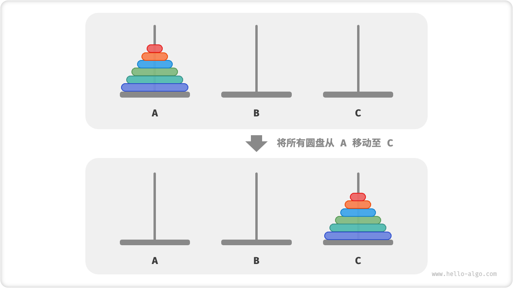

<p align="center"> 图 12-10 &nbsp; 汉诺塔问题示例 </p>

**我们将规模为 $i$ 的汉诺塔问题记做 $f(i)$** 。例如 $f(3)$ 代表将 $3$ 个圆盘从 `A` 移动至 `C` 的汉诺塔问题。

### 1. &nbsp; 考虑基本情况

如图 12-11 所示，对于问题 $f(1)$ ，即当只有一个圆盘时，我们将它直接从 `A` 移动至 `C` 即可。

=== "<1>"
    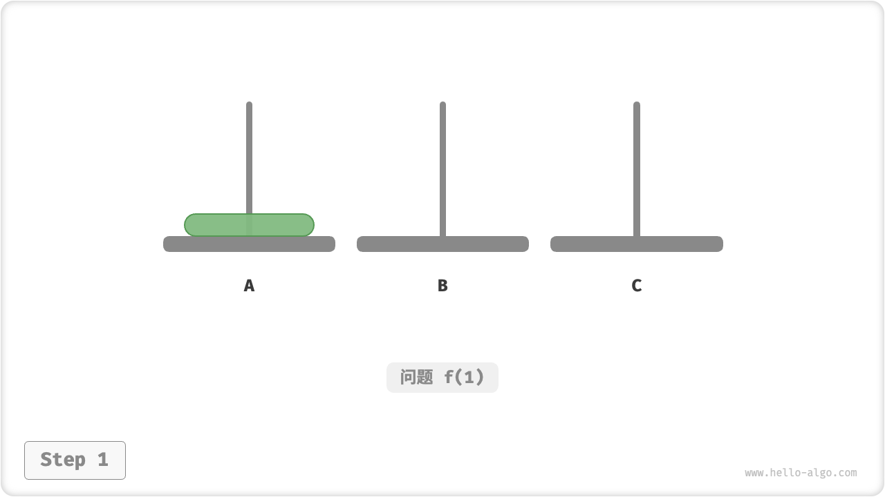

=== "<2>"
    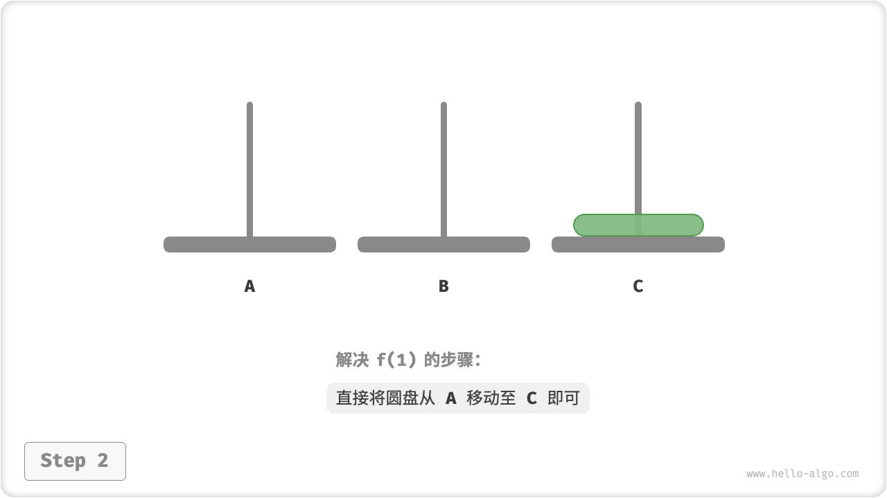

<p align="center"> 图 12-11 &nbsp; 规模为 1 问题的解 </p>

如图 12-12 所示，对于问题 $f(2)$ ，即当有两个圆盘时，**由于要时刻满足小圆盘在大圆盘之上，因此需要借助 `B` 来完成移动**。

1. 先将上面的小圆盘从 `A` 移至 `B` 。
2. 再将大圆盘从 `A` 移至 `C` 。
3. 最后将小圆盘从 `B` 移至 `C` 。

=== "<1>"
    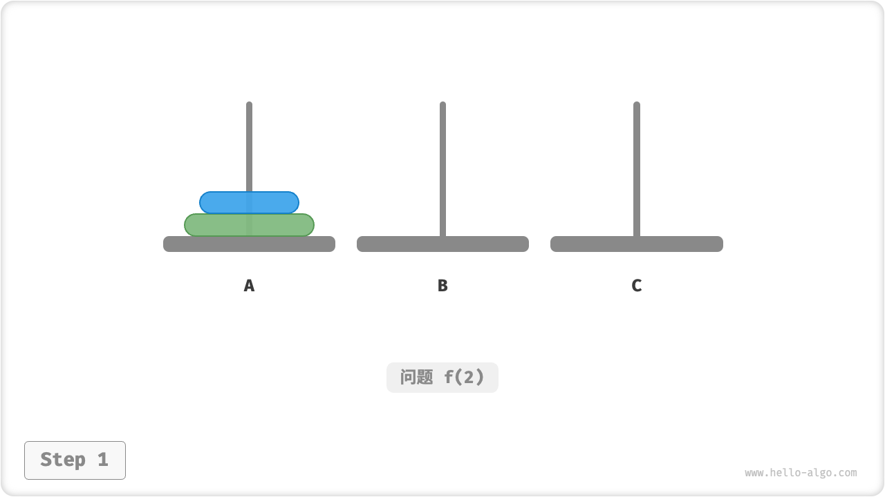

=== "<2>"
    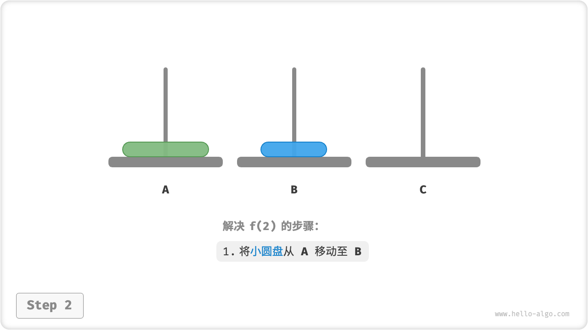

=== "<3>"
    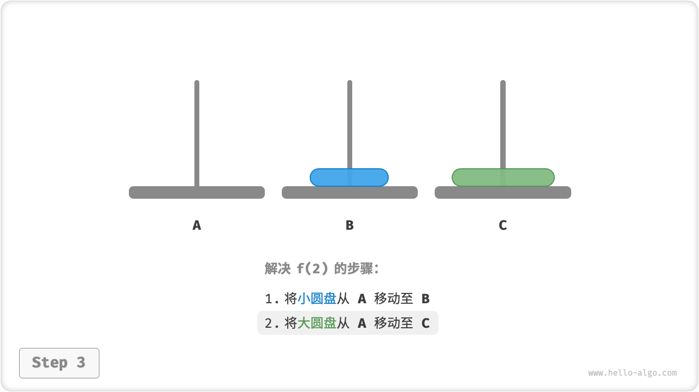

=== "<4>"
    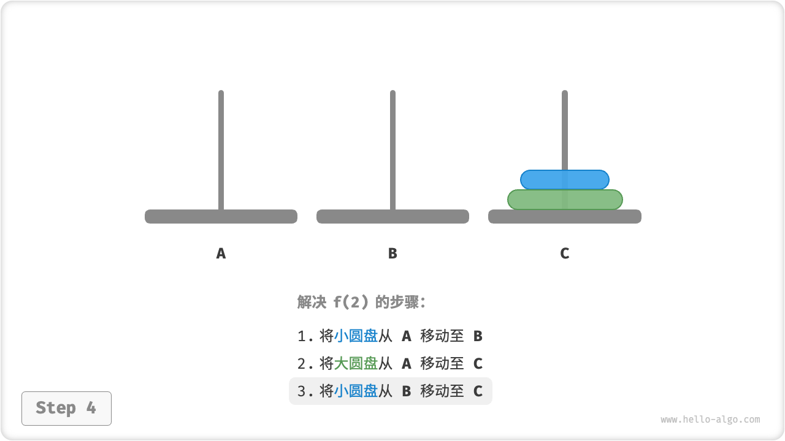

<p align="center"> 图 12-12 &nbsp; 规模为 2 问题的解 </p>

解决问题 $f(2)$ 的过程可总结为：**将两个圆盘借助 `B` 从 `A` 移至 `C`** 。其中，`C` 称为目标柱、`B` 称为缓冲柱。

### 2. &nbsp; 子问题分解

对于问题 $f(3)$ ，即当有三个圆盘时，情况变得稍微复杂了一些。

因为已知 $f(1)$ 和 $f(2)$ 的解，所以我们可从分治角度思考，**将 `A` 顶部的两个圆盘看做一个整体**，执行图 12-13 所示的步骤。这样三个圆盘就被顺利地从 `A` 移动至 `C` 了。

1. 令 `B` 为目标柱、`C` 为缓冲柱，将两个圆盘从 `A` 移动至 `B` 。
2. 将 `A` 中剩余的一个圆盘从 `A` 直接移动至 `C` 。
3. 令 `C` 为目标柱、`A` 为缓冲柱，将两个圆盘从 `B` 移动至 `C` 。

=== "<1>"
    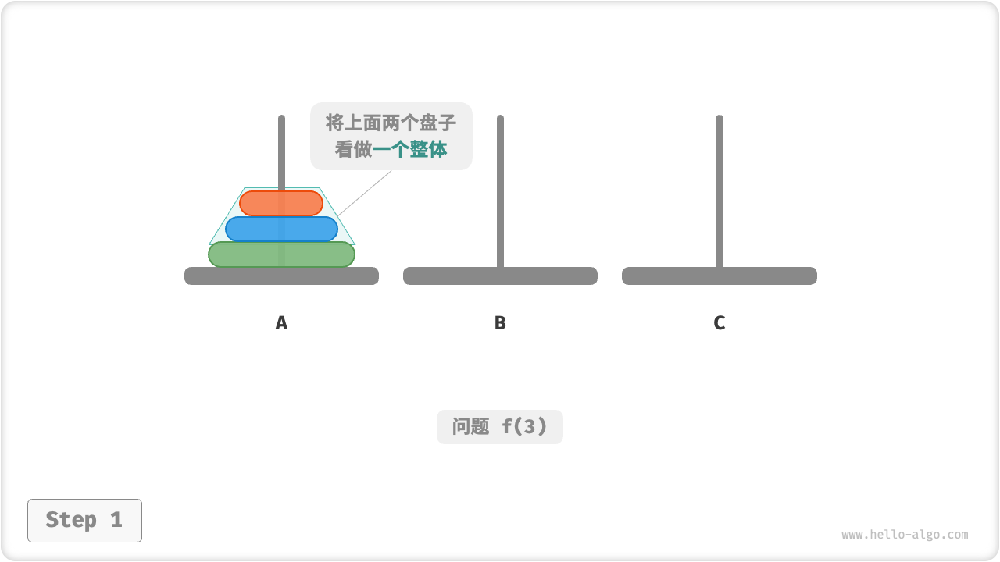

=== "<2>"
    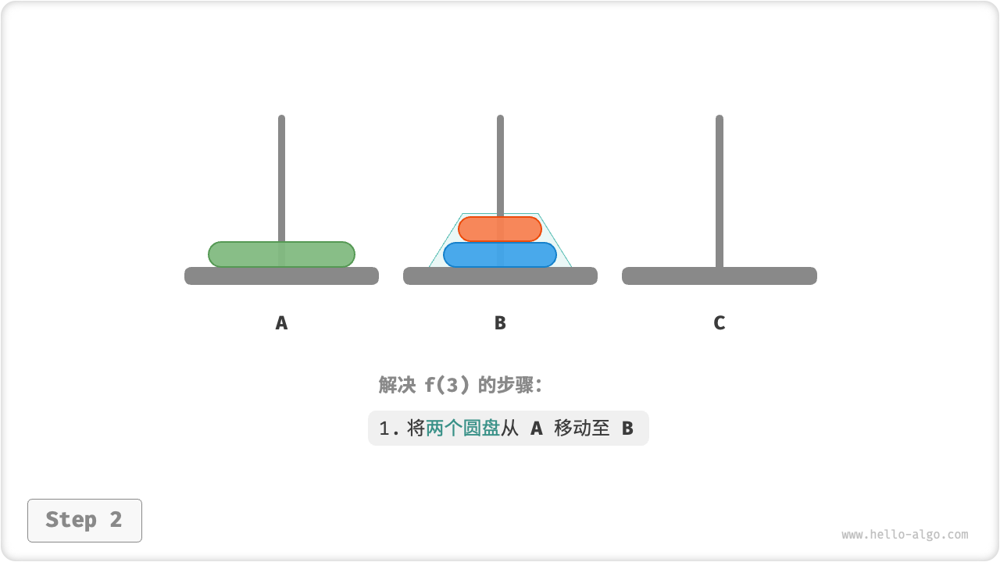

=== "<3>"
    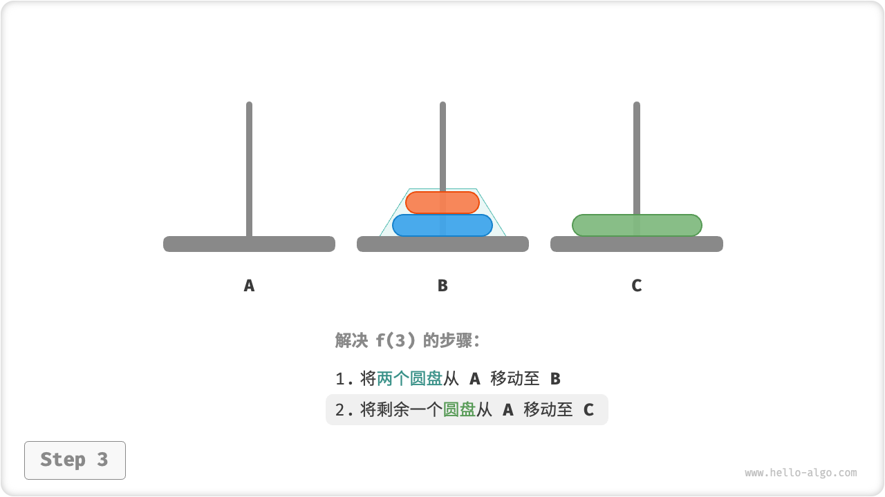

=== "<4>"
    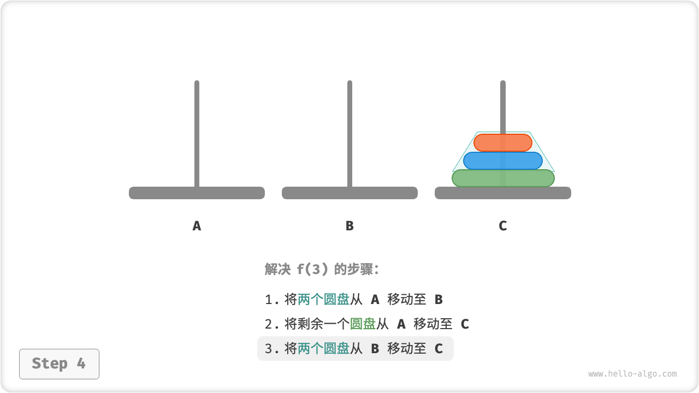

<p align="center"> 图 12-13 &nbsp; 规模为 3 问题的解 </p>

本质上看，**我们将问题 $f(3)$ 划分为两个子问题 $f(2)$ 和子问题 $f(1)$** 。按顺序解决这三个子问题之后，原问题随之得到解决。这说明子问题是独立的，而且解是可以合并的。

至此，我们可总结出图 12-14 所示的汉诺塔问题的分治策略：将原问题 $f(n)$ 划分为两个子问题 $f(n-1)$ 和一个子问题 $f(1)$ ，并按照以下顺序解决这三个子问题。

1. 将 $n-1$ 个圆盘借助 `C` 从 `A` 移至 `B` 。
2. 将剩余 $1$ 个圆盘从 `A` 直接移至 `C` 。
3. 将 $n-1$ 个圆盘借助 `A` 从 `B` 移至 `C` 。

对于这两个子问题 $f(n-1)$ ，**可以通过相同的方式进行递归划分**，直至达到最小子问题 $f(1)$ 。而 $f(1)$ 的解是已知的，只需一次移动操作即可。

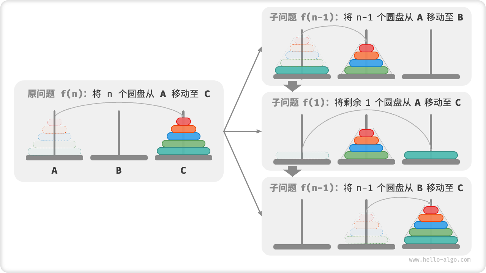

<p align="center"> 图 12-14 &nbsp; 汉诺塔问题的分治策略 </p>

### 3. &nbsp; 代码实现

在代码中，我们声明一个递归函数 `dfs(i, src, buf, tar)` ，它的作用是将柱 `src` 顶部的 $i$ 个圆盘借助缓冲柱 `buf` 移动至目标柱 `tar` 。

=== "Java"

    ```java title="hanota.java"
    /* 移动一个圆盘 */
    void move(List<Integer> src, List<Integer> tar) {
        // 从 src 顶部拿出一个圆盘
        Integer pan = src.remove(src.size() - 1);
        // 将圆盘放入 tar 顶部
        tar.add(pan);
    }

    /* 求解汉诺塔：问题 f(i) */
    void dfs(int i, List<Integer> src, List<Integer> buf, List<Integer> tar) {
        // 若 src 只剩下一个圆盘，则直接将其移到 tar
        if (i == 1) {
            move(src, tar);
            return;
        }
        // 子问题 f(i-1) ：将 src 顶部 i-1 个圆盘借助 tar 移到 buf
        dfs(i - 1, src, tar, buf);
        // 子问题 f(1) ：将 src 剩余一个圆盘移到 tar
        move(src, tar);
        // 子问题 f(i-1) ：将 buf 顶部 i-1 个圆盘借助 src 移到 tar
        dfs(i - 1, buf, src, tar);
    }

    /* 求解汉诺塔 */
    void solveHanota(List<Integer> A, List<Integer> B, List<Integer> C) {
        int n = A.size();
        // 将 A 顶部 n 个圆盘借助 B 移到 C
        dfs(n, A, B, C);
    }
    ```

=== "C++"

    ```cpp title="hanota.cpp"
    /* 移动一个圆盘 */
    void move(vector<int> &src, vector<int> &tar) {
        // 从 src 顶部拿出一个圆盘
        int pan = src.back();
        src.pop_back();
        // 将圆盘放入 tar 顶部
        tar.push_back(pan);
    }

    /* 求解汉诺塔：问题 f(i) */
    void dfs(int i, vector<int> &src, vector<int> &buf, vector<int> &tar) {
        // 若 src 只剩下一个圆盘，则直接将其移到 tar
        if (i == 1) {
            move(src, tar);
            return;
        }
        // 子问题 f(i-1) ：将 src 顶部 i-1 个圆盘借助 tar 移到 buf
        dfs(i - 1, src, tar, buf);
        // 子问题 f(1) ：将 src 剩余一个圆盘移到 tar
        move(src, tar);
        // 子问题 f(i-1) ：将 buf 顶部 i-1 个圆盘借助 src 移到 tar
        dfs(i - 1, buf, src, tar);
    }

    /* 求解汉诺塔 */
    void hanota(vector<int> &A, vector<int> &B, vector<int> &C) {
        int n = A.size();
        // 将 A 顶部 n 个圆盘借助 B 移到 C
        dfs(n, A, B, C);
    }
    ```

=== "Python"

    ```python title="hanota.py"
    def move(src: list[int], tar: list[int]):
        """移动一个圆盘"""
        # 从 src 顶部拿出一个圆盘
        pan = src.pop()
        # 将圆盘放入 tar 顶部
        tar.append(pan)

    def dfs(i: int, src: list[int], buf: list[int], tar: list[int]):
        """求解汉诺塔：问题 f(i)"""
        # 若 src 只剩下一个圆盘，则直接将其移到 tar
        if i == 1:
            move(src, tar)
            return
        # 子问题 f(i-1) ：将 src 顶部 i-1 个圆盘借助 tar 移到 buf
        dfs(i - 1, src, tar, buf)
        # 子问题 f(1) ：将 src 剩余一个圆盘移到 tar
        move(src, tar)
        # 子问题 f(i-1) ：将 buf 顶部 i-1 个圆盘借助 src 移到 tar
        dfs(i - 1, buf, src, tar)

    def hanota(A: list[int], B: list[int], C: list[int]):
        """求解汉诺塔"""
        n = len(A)
        # 将 A 顶部 n 个圆盘借助 B 移到 C
        dfs(n, A, B, C)
    ```

=== "Go"

    ```go title="hanota.go"
    /* 移动一个圆盘 */
    func move(src, tar *list.List) {
        // 从 src 顶部拿出一个圆盘
        pan := src.Back()
        // 将圆盘放入 tar 顶部
        tar.PushBack(pan.Value)
        // 移除 src 顶部圆盘
        src.Remove(pan)
    }

    /* 求解汉诺塔：问题 f(i) */
    func dfsHanota(i int, src, buf, tar *list.List) {
        // 若 src 只剩下一个圆盘，则直接将其移到 tar
        if i == 1 {
            move(src, tar)
            return
        }
        // 子问题 f(i-1) ：将 src 顶部 i-1 个圆盘借助 tar 移到 buf
        dfsHanota(i-1, src, tar, buf)
        // 子问题 f(1) ：将 src 剩余一个圆盘移到 tar
        move(src, tar)
        // 子问题 f(i-1) ：将 buf 顶部 i-1 个圆盘借助 src 移到 tar
        dfsHanota(i-1, buf, src, tar)
    }

    /* 求解汉诺塔 */
    func hanota(A, B, C *list.List) {
        n := A.Len()
        // 将 A 顶部 n 个圆盘借助 B 移到 C
        dfsHanota(n, A, B, C)
    }
    ```

=== "JS"

    ```javascript title="hanota.js"
    /* 移动一个圆盘 */
    function move(src, tar) {
        // 从 src 顶部拿出一个圆盘
        const pan = src.pop();
        // 将圆盘放入 tar 顶部
        tar.push(pan);
    }

    /* 求解汉诺塔：问题 f(i) */
    function dfs(i, src, buf, tar) {
        // 若 src 只剩下一个圆盘，则直接将其移到 tar
        if (i === 1) {
            move(src, tar);
            return;
        }
        // 子问题 f(i-1) ：将 src 顶部 i-1 个圆盘借助 tar 移到 buf
        dfs(i - 1, src, tar, buf);
        // 子问题 f(1) ：将 src 剩余一个圆盘移到 tar
        move(src, tar);
        // 子问题 f(i-1) ：将 buf 顶部 i-1 个圆盘借助 src 移到 tar
        dfs(i - 1, buf, src, tar);
    }

    /* 求解汉诺塔 */
    function hanota(A, B, C) {
        const n = A.length;
        // 将 A 顶部 n 个圆盘借助 B 移到 C
        dfs(n, A, B, C);
    }
    ```

=== "TS"

    ```typescript title="hanota.ts"
    /* 移动一个圆盘 */
    function move(src: number[], tar: number[]): void {
        // 从 src 顶部拿出一个圆盘
        const pan = src.pop();
        // 将圆盘放入 tar 顶部
        tar.push(pan);
    }

    /* 求解汉诺塔：问题 f(i) */
    function dfs(i: number, src: number[], buf: number[], tar: number[]): void {
        // 若 src 只剩下一个圆盘，则直接将其移到 tar
        if (i === 1) {
            move(src, tar);
            return;
        }
        // 子问题 f(i-1) ：将 src 顶部 i-1 个圆盘借助 tar 移到 buf
        dfs(i - 1, src, tar, buf);
        // 子问题 f(1) ：将 src 剩余一个圆盘移到 tar
        move(src, tar);
        // 子问题 f(i-1) ：将 buf 顶部 i-1 个圆盘借助 src 移到 tar
        dfs(i - 1, buf, src, tar);
    }

    /* 求解汉诺塔 */
    function hanota(A: number[], B: number[], C: number[]): void {
        const n = A.length;
        // 将 A 顶部 n 个圆盘借助 B 移到 C
        dfs(n, A, B, C);
    }
    ```

=== "C"

    ```c title="hanota.c"
    [class]{}-[func]{move}

    [class]{}-[func]{dfs}

    [class]{}-[func]{hanota}
    ```

=== "C#"

    ```csharp title="hanota.cs"
    /* 移动一个圆盘 */
    void move(List<int> src, List<int> tar) {
        // 从 src 顶部拿出一个圆盘
        int pan = src[^1];
        src.RemoveAt(src.Count - 1);
        // 将圆盘放入 tar 顶部
        tar.Add(pan);
    }

    /* 求解汉诺塔：问题 f(i) */
    void dfs(int i, List<int> src, List<int> buf, List<int> tar) {
        // 若 src 只剩下一个圆盘，则直接将其移到 tar
        if (i == 1) {
            move(src, tar);
            return;
        }
        // 子问题 f(i-1) ：将 src 顶部 i-1 个圆盘借助 tar 移到 buf
        dfs(i - 1, src, tar, buf);
        // 子问题 f(1) ：将 src 剩余一个圆盘移到 tar
        move(src, tar);
        // 子问题 f(i-1) ：将 buf 顶部 i-1 个圆盘借助 src 移到 tar
        dfs(i - 1, buf, src, tar);
    }

    /* 求解汉诺塔 */
    void solveHanota(List<int> A, List<int> B, List<int> C) {
        int n = A.Count;
        // 将 A 顶部 n 个圆盘借助 B 移到 C
        dfs(n, A, B, C);
    }
    ```

=== "Swift"

    ```swift title="hanota.swift"
    [class]{}-[func]{move}

    [class]{}-[func]{dfs}

    [class]{}-[func]{hanota}
    ```

=== "Zig"

    ```zig title="hanota.zig"
    [class]{}-[func]{move}

    [class]{}-[func]{dfs}

    [class]{}-[func]{hanota}
    ```

=== "Dart"

    ```dart title="hanota.dart"
    /* 移动一个圆盘 */
    void move(List<int> src, List<int> tar) {
      // 从 src 顶部拿出一个圆盘
      int pan = src.removeLast();
      // 将圆盘放入 tar 顶部
      tar.add(pan);
    }

    /* 求解汉诺塔：问题 f(i) */
    void dfs(int i, List<int> src, List<int> buf, List<int> tar) {
      // 若 src 只剩下一个圆盘，则直接将其移到 tar
      if (i == 1) {
        move(src, tar);
        return;
      }
      // 子问题 f(i-1) ：将 src 顶部 i-1 个圆盘借助 tar 移到 buf
      dfs(i - 1, src, tar, buf);
      // 子问题 f(1) ：将 src 剩余一个圆盘移到 tar
      move(src, tar);
      // 子问题 f(i-1) ：将 buf 顶部 i-1 个圆盘借助 src 移到 tar
      dfs(i - 1, buf, src, tar);
    }

    /* 求解汉诺塔 */
    void hanota(List<int> A, List<int> B, List<int> C) {
      int n = A.length;
      // 将 A 顶部 n 个圆盘借助 B 移到 C
      dfs(n, A, B, C);
    }
    ```

=== "Rust"

    ```rust title="hanota.rs"
    /* 移动一个圆盘 */
    fn move_pan(src: &mut Vec<i32>, tar: &mut Vec<i32>) {
        // 从 src 顶部拿出一个圆盘
        let pan = src.remove(src.len() - 1);
        // 将圆盘放入 tar 顶部
        tar.push(pan);
    }

    /* 求解汉诺塔：问题 f(i) */
    fn dfs(i: i32, src: &mut Vec<i32>, buf: &mut Vec<i32>, tar: &mut Vec<i32>) {
        // 若 src 只剩下一个圆盘，则直接将其移到 tar
        if i == 1 {
            move_pan(src, tar);
            return;
        }
        // 子问题 f(i-1) ：将 src 顶部 i-1 个圆盘借助 tar 移到 buf
        dfs(i - 1, src, tar, buf);
        // 子问题 f(1) ：将 src 剩余一个圆盘移到 tar
        move_pan(src, tar);
        // 子问题 f(i-1) ：将 buf 顶部 i-1 个圆盘借助 src 移到 tar
        dfs(i - 1, buf, src, tar);
    }

    /* 求解汉诺塔 */
    fn hanota(A: &mut Vec<i32>, B: &mut Vec<i32>, C: &mut Vec<i32>) {
        let n = A.len() as i32;
        // 将 A 顶部 n 个圆盘借助 B 移到 C
        dfs(n, A, B, C);
    }
    ```

如图 12-15 所示，汉诺塔问题形成一个高度为 $n$ 的递归树，每个节点代表一个子问题、对应一个开启的 `dfs()` 函数，**因此时间复杂度为 $O(2^n)$ ，空间复杂度为 $O(n)$** 。

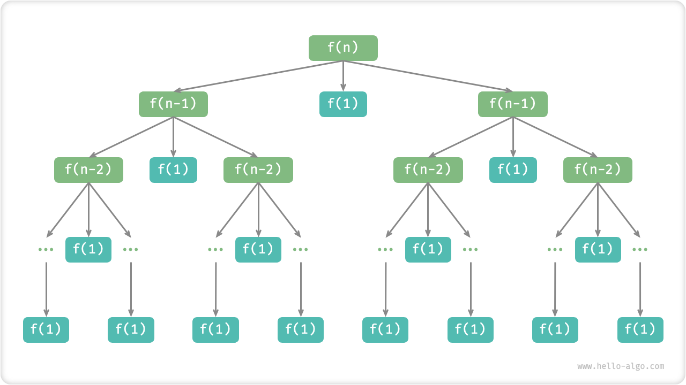

<p align="center"> 图 12-15 &nbsp; 汉诺塔问题的递归树 </p>

!!! quote

    汉诺塔问题源自一种古老的传说故事。在古印度的一个寺庙里，僧侣们有三根高大的钻石柱子，以及 $64$ 个大小不一的金圆盘。僧侣们不断地移动原盘，他们相信在最后一个圆盘被正确放置的那一刻，这个世界就会结束。

    然而，即使僧侣们每秒钟移动一次，总共需要大约 $2^{64} \approx 1.84×10^{19}$ 秒，合约 $5850$ 亿年，远远超过了现在对宇宙年龄的估计。所以，倘若这个传说是真的，我们应该不需要担心世界末日的到来。
