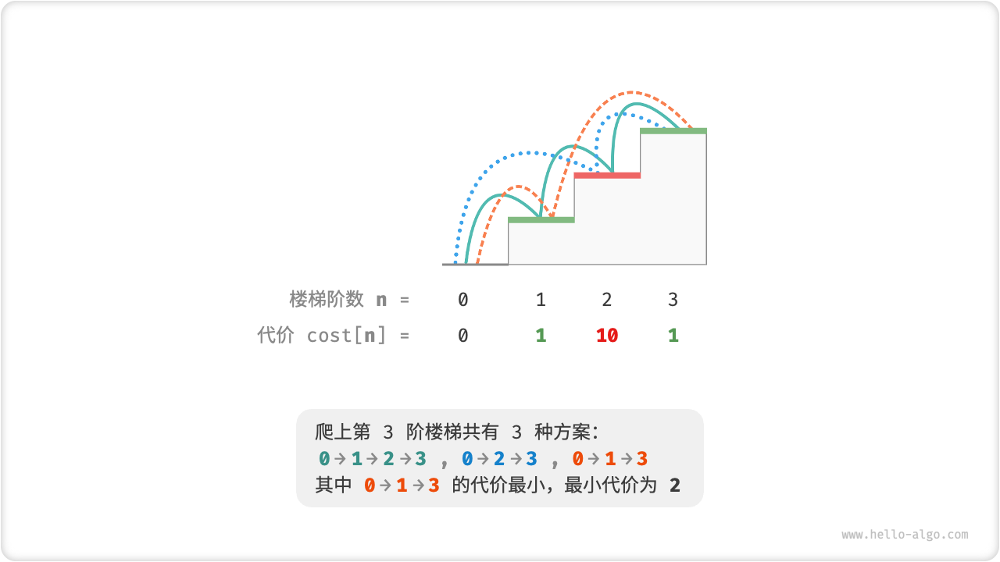
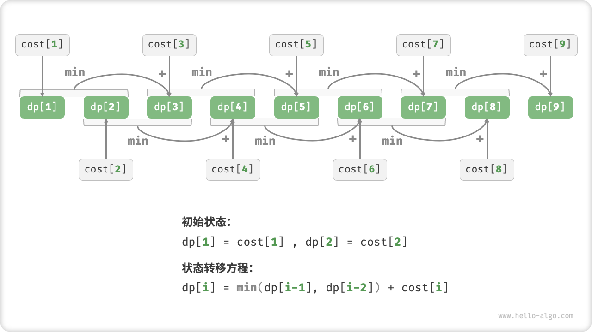
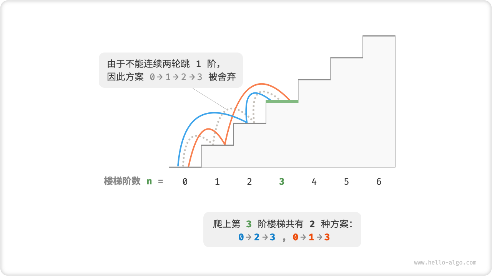
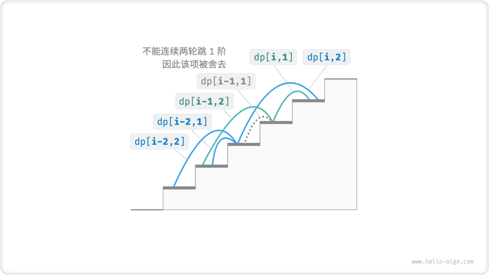

# 13.2. &nbsp; 动态规划问题特性

在上节中，我们学习了动态规划问题的暴力解法，从递归树中观察到海量的重叠子问题，以及了解到动态规划是如何通过记录解来优化时间复杂度的。

实际上，动态规划最常用来求解最优方案问题，例如寻找最短路径、最大利润、最少时间等。**这类问题不仅包含重叠子问题，往往还具有另外两大特性：最优子结构、无后效性**。

在本节中，我们将通过两个例题，一同探究以下几个问题：

1. 动态规划与分治算法的区别是什么。
2. 最优子结构在动态规划问题中的表现形式。
3. 无后效性的含义，其对动态规划的意义是什么。

## 13.2.1. &nbsp; 最优子结构

我们对爬楼梯问题稍作改动，使之更加适合展示最优子结构概念。

!!! question "爬楼梯最小代价"

    给定一个楼梯，你每步可以上 $1$ 阶或者 $2$ 阶，每一阶楼梯上都贴有一个非负整数，表示你在该台阶所需要付出的代价。给定一个非负整数数组 $cost$ ，其中 $cost[i]$ 表示在第 $i$ 个台阶需要付出的代价，$cost[0]$ 为地面起始点。请计算最少需要付出多少代价才能到达顶部？

如下图所示，若第 $1$ , $2$ , $3$ 阶的代价分别为 $1$ , $10$ , $1$ ，则从地面爬到第 $3$ 阶的最小代价为 $2$ 。



<p align="center"> Fig. 爬到第 3 阶的最小代价 </p>

设 $dp[i]$ 为爬到第 $i$ 阶累计付出的代价，由于第 $i$ 阶只可能从 $i - 1$ 阶或 $i - 2$ 阶走来，因此 $dp[i]$ 只可能等于 $dp[i - 1] + cost[i]$ 或 $dp[i - 2] + cost[i]$ 。为了尽可能减少代价，我们应该选择两者中较小的那一个，即：

$$
dp[i] = \min(dp[i-1], dp[i-2]) + cost[i]
$$

这便可以引出「最优子结构」的含义：**原问题的最优解是从子问题的最优解构建得来的**。对于本题，我们从两个子问题最优解 $dp[i-1]$ , $dp[i-2]$ 中挑选出较优的那一个，并用它构建出原问题 $dp[i]$ 的最优解。

相较于分治算法问题，动态规划问题的解也是由其子问题的解构成的。不同的是，**动态规划中子问题的解不仅揭示了问题的局部最优解，而且还通过特定的递推关系链接起来，共同构建出原问题的全局最优解**。

那么，上节的爬楼梯题目有没有最优子结构呢？它要求解的是方案数量，看似是一个计数问题，但如果换一种问法：求解最大方案数量。我们意外地发现，**虽然题目修改前后是等价的，但最优子结构浮现出来了**：第 $n$ 阶最大方案数量等于第 $n-1$ 阶和第 $n-2$ 阶最大方案数量之和。所以说，最优子结构的是一个比较宽泛的概念，在不同问题中会有不同的含义。

根据以上状态转移方程，以及初始状态 $dp[1] = cost[1]$ , $dp[2] = cost[2]$ ，我们可以得出动态规划解题代码。

=== "Java"

    ```java title="min_cost_climbing_stairs_dp.java"
    /* 爬楼梯最小代价：动态规划 */
    int minCostClimbingStairsDP(int[] cost) {
        int n = cost.length - 1;
        if (n == 1 || n == 2)
            return cost[n];
        // 初始化 dp 列表，用于存储子问题的解
        int[] dp = new int[n + 1];
        // 初始状态：预设最小子问题的解
        dp[1] = cost[1];
        dp[2] = cost[2];
        // 状态转移：从较小子问题逐步求解较大子问题
        for (int i = 3; i <= n; i++) {
            dp[i] = Math.min(dp[i - 1], dp[i - 2]) + cost[i];
        }
        return dp[n];
    }
    ```

=== "C++"

    ```cpp title="min_cost_climbing_stairs_dp.cpp"
    /* 爬楼梯最小代价：动态规划 */
    int minCostClimbingStairsDP(vector<int> &cost) {
        int n = cost.size() - 1;
        if (n == 1 || n == 2)
            return cost[n];
        // 初始化 dp 列表，用于存储子问题的解
        vector<int> dp(n + 1);
        // 初始状态：预设最小子问题的解
        dp[1] = cost[1];
        dp[2] = cost[2];
        // 状态转移：从较小子问题逐步求解较大子问题
        for (int i = 3; i <= n; i++) {
            dp[i] = min(dp[i - 1], dp[i - 2]) + cost[i];
        }
        return dp[n];
    }
    ```

=== "Python"

    ```python title="min_cost_climbing_stairs_dp.py"
    def min_cost_climbing_stairs_dp(cost: list[int]) -> int:
        """爬楼梯最小代价：动态规划"""
        n = len(cost) - 1
        if n == 1 or n == 2:
            return cost[n]
        # 初始化 dp 列表，用于存储子问题的解
        dp = [0] * (n + 1)
        # 初始状态：预设最小子问题的解
        dp[1], dp[2] = cost[1], cost[2]
        # 状态转移：从较小子问题逐步求解较大子问题
        for i in range(3, n + 1):
            dp[i] = min(dp[i - 1], dp[i - 2]) + cost[i]
        return dp[n]
    ```

=== "Go"

    ```go title="min_cost_climbing_stairs_dp.go"
    [class]{}-[func]{minCostClimbingStairsDP}
    ```

=== "JavaScript"

    ```javascript title="min_cost_climbing_stairs_dp.js"
    [class]{}-[func]{minCostClimbingStairsDP}
    ```

=== "TypeScript"

    ```typescript title="min_cost_climbing_stairs_dp.ts"
    [class]{}-[func]{minCostClimbingStairsDP}
    ```

=== "C"

    ```c title="min_cost_climbing_stairs_dp.c"
    [class]{}-[func]{minCostClimbingStairsDP}
    ```

=== "C#"

    ```csharp title="min_cost_climbing_stairs_dp.cs"
    [class]{min_cost_climbing_stairs_dp}-[func]{minCostClimbingStairsDP}
    ```

=== "Swift"

    ```swift title="min_cost_climbing_stairs_dp.swift"
    [class]{}-[func]{minCostClimbingStairsDP}
    ```

=== "Zig"

    ```zig title="min_cost_climbing_stairs_dp.zig"
    [class]{}-[func]{minCostClimbingStairsDP}
    ```

=== "Dart"

    ```dart title="min_cost_climbing_stairs_dp.dart"
    [class]{}-[func]{minCostClimbingStairsDP}
    ```



<p align="center"> Fig. 爬楼梯最小代价的动态规划过程 </p>

这道题同样也可以进行状态压缩，将一维压缩至零维，使得空间复杂度从 $O(n)$ 降低至 $O(1)$ 。

=== "Java"

    ```java title="min_cost_climbing_stairs_dp.java"
    /* 爬楼梯最小代价：状态压缩后的动态规划 */
    int minCostClimbingStairsDPComp(int[] cost) {
        int n = cost.length - 1;
        if (n == 1 || n == 2)
            return cost[n];
        int a = cost[1], b = cost[2];
        for (int i = 3; i <= n; i++) {
            int tmp = b;
            b = Math.min(a, tmp) + cost[i];
            a = tmp;
        }
        return b;
    }
    ```

=== "C++"

    ```cpp title="min_cost_climbing_stairs_dp.cpp"
    /* 爬楼梯最小代价：状态压缩后的动态规划 */
    int minCostClimbingStairsDPComp(vector<int> &cost) {
        int n = cost.size() - 1;
        if (n == 1 || n == 2)
            return cost[n];
        int a = cost[1], b = cost[2];
        for (int i = 3; i <= n; i++) {
            int tmp = b;
            b = min(a, tmp) + cost[i];
            a = tmp;
        }
        return b;
    }
    ```

=== "Python"

    ```python title="min_cost_climbing_stairs_dp.py"
    def min_cost_climbing_stairs_dp_comp(cost: list[int]) -> int:
        """爬楼梯最小代价：状态压缩后的动态规划"""
        n = len(cost) - 1
        if n == 1 or n == 2:
            return cost[n]
        a, b = cost[1], cost[2]
        for i in range(3, n + 1):
            a, b = b, min(a, b) + cost[i]
        return b
    ```

=== "Go"

    ```go title="min_cost_climbing_stairs_dp.go"
    [class]{}-[func]{minCostClimbingStairsDPComp}
    ```

=== "JavaScript"

    ```javascript title="min_cost_climbing_stairs_dp.js"
    [class]{}-[func]{minCostClimbingStairsDPComp}
    ```

=== "TypeScript"

    ```typescript title="min_cost_climbing_stairs_dp.ts"
    [class]{}-[func]{minCostClimbingStairsDPComp}
    ```

=== "C"

    ```c title="min_cost_climbing_stairs_dp.c"
    [class]{}-[func]{minCostClimbingStairsDPComp}
    ```

=== "C#"

    ```csharp title="min_cost_climbing_stairs_dp.cs"
    [class]{min_cost_climbing_stairs_dp}-[func]{minCostClimbingStairsDPComp}
    ```

=== "Swift"

    ```swift title="min_cost_climbing_stairs_dp.swift"
    [class]{}-[func]{minCostClimbingStairsDPComp}
    ```

=== "Zig"

    ```zig title="min_cost_climbing_stairs_dp.zig"
    [class]{}-[func]{minCostClimbingStairsDPComp}
    ```

=== "Dart"

    ```dart title="min_cost_climbing_stairs_dp.dart"
    [class]{}-[func]{minCostClimbingStairsDPComp}
    ```

## 13.2.2. &nbsp; 无后效性

「无后效性」是动态规划能够有效解决问题的重要特性之一，定义为：**给定一个确定的状态，它的未来发展只与当前状态有关，而与当前状态过去所经历过的所有状态无关**。

以爬楼梯问题为例，给定状态 $i$ ，它会发展出状态 $i+1$ 和状态 $i+2$ ，分别对应跳 $1$ 步和跳 $2$ 步。在做出这两种选择时，我们无需考虑状态 $i$ 之前的状态，即它们对状态 $i$ 的未来没有影响。

然而，如果我们向爬楼梯问题添加一个约束，情况就不一样了。

!!! question "带约束爬楼梯"

    给定一个共有 $n$ 阶的楼梯，你每步可以上 $1$ 阶或者 $2$ 阶，**但不能连续两轮跳 $1$ 阶**，请问有多少种方案可以爬到楼顶。

例如，爬上第 $3$ 阶仅剩 $2$ 种可行方案，其中连续三次跳 $1$ 阶的方案不满足约束条件，因此被舍弃。



<p align="center"> Fig. 带约束爬到第 3 阶的方案数量 </p>

在该问题中，**下一步选择不能由当前状态（当前楼梯阶数）独立决定，还和前一个状态（上轮楼梯阶数）有关**。如果上一轮是跳 $1$ 阶上来的，那么下一轮就必须跳 $2$ 阶。

不难发现，此问题已不满足无后效性，状态转移方程 $dp[i] = dp[i-1] + dp[i-2]$ 也失效了，因为 $dp[i-1]$ 代表本轮跳 $1$ 阶，但其中包含了许多“上一轮跳 $1$ 阶上来的”方案，而为了满足约束，我们不能将 $dp[i-1]$ 直接计入 $dp[i]$ 中。

为了解决该问题，我们需要扩展状态定义：**状态 $[i, j]$ 表示处在第 $i$ 阶、并且上一轮跳了 $j$ 阶**，其中 $j \in \{1, 2\}$ 。此状态定义有效地区分了上一轮跳了 $1$ 阶还是 $2$ 阶，我们可以据此来决定下一步该怎么跳：

- 当 $j$ 等于 $1$ ，即上一轮跳了 $1$ 阶时，这一轮只能选择跳 $2$ 阶；
- 当 $j$ 等于 $2$ ，即上一轮跳了 $2$ 阶时，这一轮可选择跳 $1$ 阶或跳 $2$ 阶；

在该定义下，$dp[i, j]$ 表示状态 $[i, j]$ 对应的方案数。由此，我们便能推导出以下的状态转移方程：

$$
\begin{cases}
dp[i, 1] = dp[i-1, 2] \\
dp[i, 2] = dp[i-2, 1] + dp[i-2, 2]
\end{cases}
$$



<p align="center"> Fig. 考虑约束下的递推关系 </p>

最终，返回 $dp[n, 1] + dp[n, 2]$ 即可，两者之和代表爬到第 $n$ 阶的方案总数。

=== "Java"

    ```java title="climbing_stairs_constraint_dp.java"
    /* 带约束爬楼梯：动态规划 */
    int climbingStairsConstraintDP(int n) {
        if (n == 1 || n == 2) {
            return n;
        }
        // 初始化 dp 列表，用于存储子问题的解
        int[][] dp = new int[n + 1][3];
        // 初始状态：预设最小子问题的解
        dp[1][1] = 1;
        dp[1][2] = 0;
        dp[2][1] = 0;
        dp[2][2] = 1;
        // 状态转移：从较小子问题逐步求解较大子问题
        for (int i = 3; i <= n; i++) {
            dp[i][1] = dp[i - 1][2];
            dp[i][2] = dp[i - 2][1] + dp[i - 2][2];
        }
        return dp[n][1] + dp[n][2];
    }
    ```

=== "C++"

    ```cpp title="climbing_stairs_constraint_dp.cpp"
    /* 带约束爬楼梯：动态规划 */
    int climbingStairsConstraintDP(int n) {
        if (n == 1 || n == 2) {
            return n;
        }
        // 初始化 dp 列表，用于存储子问题的解
        vector<vector<int>> dp(n + 1, vector<int>(3, 0));
        // 初始状态：预设最小子问题的解
        dp[1][1] = 1;
        dp[1][2] = 0;
        dp[2][1] = 0;
        dp[2][2] = 1;
        // 状态转移：从较小子问题逐步求解较大子问题
        for (int i = 3; i <= n; i++) {
            dp[i][1] = dp[i - 1][2];
            dp[i][2] = dp[i - 2][1] + dp[i - 2][2];
        }
        return dp[n][1] + dp[n][2];
    }
    ```

=== "Python"

    ```python title="climbing_stairs_constraint_dp.py"
    def climbing_stairs_constraint_dp(n: int) -> int:
        """带约束爬楼梯：动态规划"""
        if n == 1 or n == 2:
            return n
        # 初始化 dp 列表，用于存储子问题的解
        dp = [[0] * 3 for _ in range(n + 1)]
        # 初始状态：预设最小子问题的解
        dp[1][1], dp[1][2] = 1, 0
        dp[2][1], dp[2][2] = 0, 1
        # 状态转移：从较小子问题逐步求解较大子问题
        for i in range(3, n + 1):
            dp[i][1] = dp[i - 1][2]
            dp[i][2] = dp[i - 2][1] + dp[i - 2][2]
        return dp[n][1] + dp[n][2]
    ```

=== "Go"

    ```go title="climbing_stairs_constraint_dp.go"
    [class]{}-[func]{climbingStairsConstraintDP}
    ```

=== "JavaScript"

    ```javascript title="climbing_stairs_constraint_dp.js"
    [class]{}-[func]{climbingStairsConstraintDP}
    ```

=== "TypeScript"

    ```typescript title="climbing_stairs_constraint_dp.ts"
    [class]{}-[func]{climbingStairsConstraintDP}
    ```

=== "C"

    ```c title="climbing_stairs_constraint_dp.c"
    [class]{}-[func]{climbingStairsConstraintDP}
    ```

=== "C#"

    ```csharp title="climbing_stairs_constraint_dp.cs"
    [class]{climbing_stairs_constraint_dp}-[func]{climbingStairsConstraintDP}
    ```

=== "Swift"

    ```swift title="climbing_stairs_constraint_dp.swift"
    [class]{}-[func]{climbingStairsConstraintDP}
    ```

=== "Zig"

    ```zig title="climbing_stairs_constraint_dp.zig"
    [class]{}-[func]{climbingStairsConstraintDP}
    ```

=== "Dart"

    ```dart title="climbing_stairs_constraint_dp.dart"
    [class]{}-[func]{climbingStairsConstraintDP}
    ```

在上面的案例中，由于仅需多考虑前面一个状态，我们仍然可以通过扩展状态定义，使得问题恢复无后效性。然而，许多问题具有非常严重的“有后效性”，例如：

!!! question "爬楼梯与障碍生成"

    给定一个共有 $n$ 阶的楼梯，你每步可以上 $1$ 阶或者 $2$ 阶。**规定当爬到第 $i$ 阶时，系统自动会给第 $2i$ 阶上放上障碍物，之后所有轮都不允许跳到第 $2i$ 阶上**。例如，前两轮分别跳到了第 $2, 3$ 阶上，则之后就不能跳到第 $4, 6$ 阶上。请问有多少种方案可以爬到楼顶。

在这个问题中，下次跳跃依赖于过去所有的状态，因为每一次跳跃都会在更高的阶梯上设置障碍，并影响未来的跳跃。对于这类问题，动态规划往往难以解决，或是因为计算复杂度过高而难以应用。

实际上，许多组合优化问题（例如著名的旅行商问题）都不满足无后效性。对于这类问题，我们通常会选择使用其他方法，例如启发式搜索、遗传算法、强化学习等，从而降低时间复杂度，在有限时间内得到能够接受的局部最优解。
