# 14.3. &nbsp; 动态规划解题思路

上两节介绍了动态规划问题的主要特征，接下来我们一起探究两个更加实用的问题：

1. 如何判断一个问题是不是动态规划问题？
2. 求解动态规划问题该从何处入手，完整步骤是什么？

## 14.3.1. &nbsp; 问题判断

总的来说，如果一个问题包含重叠子问题、最优子结构，并满足无后效性，那么它通常就适合用动态规划求解，但我们很难从问题描述上直接提取出这些特性。因此我们通常会放宽条件，**先观察问题是否适合使用回溯（穷举）解决**。

**适合用回溯解决的问题通常满足“决策树模型”**，这种问题可以使用树形结构来描述，其中每一个节点代表一个决策，每一条路径代表一个决策序列。

换句话说，如果问题包含明确的决策概念，并且解是通过一系列决策产生的，那么它就满足决策树模型，通常可以使用回溯来解决。

在此基础上，还有一些判断问题是动态规划问题的“加分项”，包括：

- 问题包含最大（小）或最多（少）等最优化描述；
- 问题的状态能够使用一个列表、多维矩阵或树来表示，并且一个状态与其周围的状态存在某种递推关系；

而相应的“减分项”包括：

- 问题的目标是找出所有可能的解决方案，而不是找出最优解。
- 问题描述中有明显的排列组合的特征，需要返回具体的多个方案。

如果一个问题满足决策树模型，并具有较为明显的“加分项“，我们就可以假设它是一个动态规划问题，并尝试求解它。

## 14.3.2. &nbsp; 问题求解步骤

动态规划的解题流程可能会因问题的性质和难度而有所不同，但通常遵循以下步骤：描述决策，定义状态，建立 $dp$ 表，推导状态转移方程，确定边界条件等。

为了更形象地展示解题步骤，我们使用一个经典问题「最小路径和」来举例。

!!! question

    给定一个 $n \times m$ 的二维网格 `grid` ，网格中的每个单元格包含一个非负整数，表示该单元格的代价。机器人以左上角单元格为起始点，每次只能向下或者向右移动一步，直至到达右下角单元格。请返回从左上角到右下角的最小路径和。

例如以下示例数据，给定网格的最小路径和为 $13$ 。

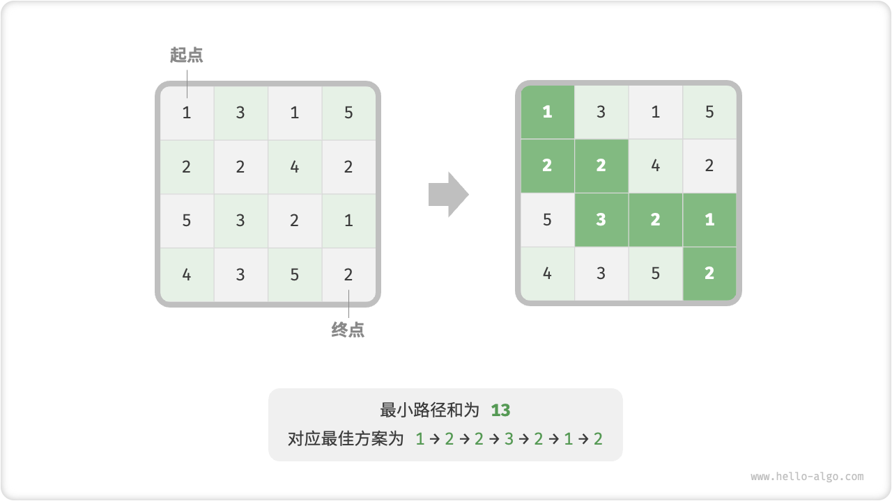

<p align="center"> Fig. 最小路径和示例数据 </p>

**第一步：思考每轮的决策，定义状态，从而得到 $dp$ 表**

本题的每一轮的决策就是从当前格子向下或向右一步。设当前格子的行列索引为 $[i, j]$ ，则向下或向右走一步后，索引变为 $[i+1, j]$ 或 $[i, j+1]$ 。因此，状态应包含行索引和列索引两个变量，记为 $[i, j]$ 。

状态 $[i, j]$ 对应的子问题为：从起始点 $[0, 0]$ 走到 $[i, j]$ 的最小路径和，解记为 $dp[i, j]$ 。

至此，我们就得到了一个二维 $dp$ 矩阵，其尺寸与输入网格 $grid$ 相同。

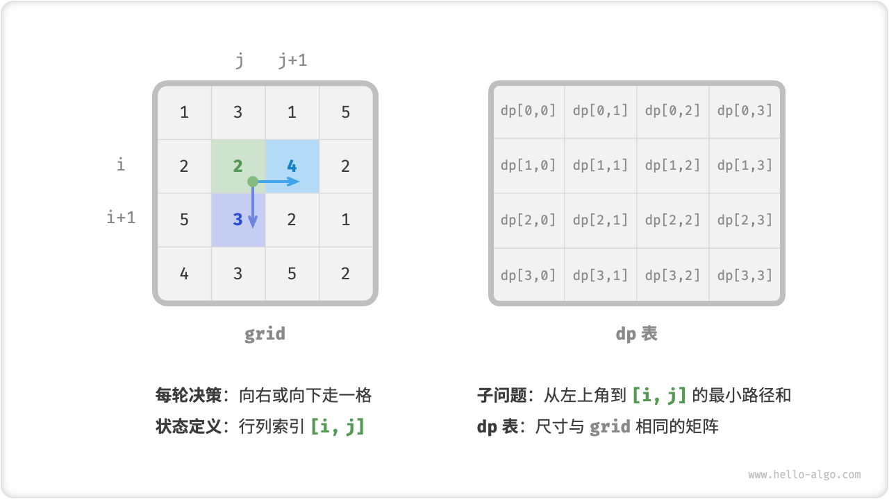

<p align="center"> Fig. 状态定义与 dp 表 </p>

!!! note

    动态规划和回溯通常都会被描述为一个决策序列，而状态通常由所有决策变量构成。它应当包含描述解题进度的所有变量，其包含了足够的信息，能够用来推导出下一个状态。
    
    每个状态都对应一个子问题，我们会定义一个 $dp$ 表来存储所有子问题的解，状态的每个独立变量都是 $dp$ 表的一个维度。本质上看，$dp$ 表是子问题的解和状态之间的映射。

**第二步：找出最优子结构，进而推导出状态转移方程**

对于状态 $[i, j]$ ，它只能从上边格子 $[i-1, j]$ 和左边格子 $[i, j-1]$ 转移而来。因此最优子结构为：到达 $[i, j]$ 的最小路径和由 $[i, j-1]$ 的最小路径和与 $[i-1, j]$ 的最小路径和，这两者较小的那一个决定。

根据以上分析，可推出以下状态转移方程：

$$
dp[i, j] = \min(dp[i-1, j], dp[i, j-1]) + grid[i, j]
$$

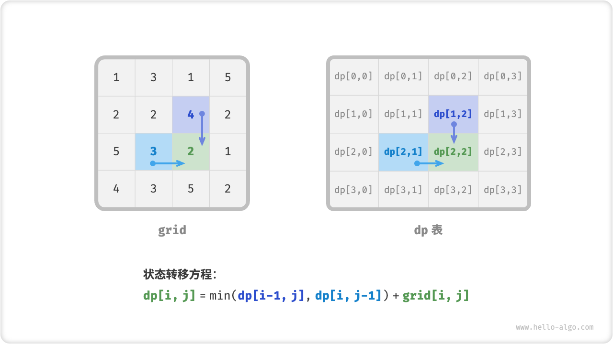

<p align="center"> Fig. 最优子结构与状态转移方程 </p>

!!! note

    基于定义好的 $dp$ 表，我们思考原问题和子问题的关系，找出如何通过子问题的解来构造原问题的解。
    
    最优子结构揭示了原问题和子问题的递推关系，一旦我们找到了最优子结构，就可以使用它来构建出状态转移方程。

**第三步：确定边界条件和状态转移顺序**

在本题中，当 $i=0$ 或 $j=0$ 时只有一种可能的路径，即只能向右移动或只能向下移动，因此首行和首列是边界条件。

每个格子是由其左方格子和上方格子转移而来，因此我们使用两层循环来遍历矩阵即可，即外循环正序遍历各行、内循环正序遍历各列。


<p align="center"> Fig. 边界条件与状态转移顺序 </p>

!!! note

    边界条件即初始状态，在搜索中用于剪枝，在动态规划中用于初始化 $dp$ 表。状态转移顺序的核心是要保证在计算当前问题时，所有它依赖的更小子问题都已经被正确地计算出来。

接下来，我们就可以实现动态规划代码了。然而，由于子问题分解是一种从顶至底的思想，因此按照“暴力搜索 $\rightarrow$ 记忆化搜索 $\rightarrow$ 动态规划”的顺序实现更加符合思维习惯。

### 方法一：暴力搜索

从状态 $[i, j]$ 开始搜索，不断分解为更小的状态 $[i-1, j]$ 和 $[i, j-1]$ ，包括以下递归要素：

- **递归参数**：状态 $[i, j]$ ；**返回值**：从 $[0, 0]$ 到 $[i, j]$ 的最小路径和 $dp[i, j]$ ；
- **终止条件**：当 $i = 0$ 且 $j = 0$ 时，返回代价 $grid[0, 0]$ ；
- **剪枝**：当 $i < 0$ 时或 $j < 0$ 时索引越界，此时返回代价 $+\infty$ ，代表不可行；

=== "Java"

    ```java title="min_path_sum.java"
    /* 最小路径和：暴力搜索 */
    int minPathSumDFS(int[][] grid, int i, int j) {
        // 若为左上角单元格，则终止搜索
        if (i == 0 && j == 0) {
            return grid[0][0];
        }
        // 若行列索引越界，则返回 +∞ 代价
        if (i < 0 || j < 0) {
            return Integer.MAX_VALUE;
        }
        // 计算从左上角到 (i-1, j) 和 (i, j-1) 的最小路径代价
        int left = minPathSumDFS(grid, i - 1, j);
        int up = minPathSumDFS(grid, i, j - 1);
        // 返回从左上角到 (i, j) 的最小路径代价
        return Math.min(left, up) + grid[i][j];
    }
    ```

=== "C++"

    ```cpp title="min_path_sum.cpp"
    /* 最小路径和：暴力搜索 */
    int minPathSumDFS(vector<vector<int>> &grid, int i, int j) {
        // 若为左上角单元格，则终止搜索
        if (i == 0 && j == 0) {
            return grid[0][0];
        }
        // 若行列索引越界，则返回 +∞ 代价
        if (i < 0 || j < 0) {
            return INT_MAX;
        }
        // 计算从左上角到 (i-1, j) 和 (i, j-1) 的最小路径代价
        int left = minPathSumDFS(grid, i - 1, j);
        int up = minPathSumDFS(grid, i, j - 1);
        // 返回从左上角到 (i, j) 的最小路径代价
        return min(left, up) != INT_MAX ? min(left, up) + grid[i][j] : INT_MAX;
    }
    ```

=== "Python"

    ```python title="min_path_sum.py"
    def min_path_sum_dfs(grid: list[list[int]], i: int, j: int) -> int:
        """最小路径和：暴力搜索"""
        # 若为左上角单元格，则终止搜索
        if i == 0 and j == 0:
            return grid[0][0]
        # 若行列索引越界，则返回 +∞ 代价
        if i < 0 or j < 0:
            return inf
        # 计算从左上角到 (i-1, j) 和 (i, j-1) 的最小路径代价
        left = min_path_sum_dfs(grid, i - 1, j)
        up = min_path_sum_dfs(grid, i, j - 1)
        # 返回从左上角到 (i, j) 的最小路径代价
        return min(left, up) + grid[i][j]
    ```

=== "Go"

    ```go title="min_path_sum.go"
    /* 最小路径和：暴力搜索 */
    func minPathSumDFS(grid [][]int, i, j int) int {
        // 若为左上角单元格，则终止搜索
        if i == 0 && j == 0 {
            return grid[0][0]
        }
        // 若行列索引越界，则返回 +∞ 代价
        if i < 0 || j < 0 {
            return math.MaxInt
        }
        // 计算从左上角到 (i-1, j) 和 (i, j-1) 的最小路径代价
        left := minPathSumDFS(grid, i-1, j)
        up := minPathSumDFS(grid, i, j-1)
        // 返回从左上角到 (i, j) 的最小路径代价
        return int(math.Min(float64(left), float64(up))) + grid[i][j]
    }
    ```

=== "JavaScript"

    ```javascript title="min_path_sum.js"
    [class]{}-[func]{minPathSumDFS}
    ```

=== "TypeScript"

    ```typescript title="min_path_sum.ts"
    [class]{}-[func]{minPathSumDFS}
    ```

=== "C"

    ```c title="min_path_sum.c"
    [class]{}-[func]{minPathSumDFS}
    ```

=== "C#"

    ```csharp title="min_path_sum.cs"
    /* 最小路径和：暴力搜索 */
    int minPathSumDFS(int[][] grid, int i, int j) {
        // 若为左上角单元格，则终止搜索
        if (i == 0 && j == 0){
            return grid[0][0];
        }
        // 若行列索引越界，则返回 +∞ 代价
        if (i < 0 || j < 0) {
            return int.MaxValue;
        }
        // 计算从左上角到 (i-1, j) 和 (i, j-1) 的最小路径代价
        int left = minPathSumDFS(grid, i - 1, j);
        int up = minPathSumDFS(grid, i, j - 1);
        // 返回从左上角到 (i, j) 的最小路径代价
        return Math.Min(left, up) + grid[i][j];
    }
    ```

=== "Swift"

    ```swift title="min_path_sum.swift"
    /* 最小路径和：暴力搜索 */
    func minPathSumDFS(grid: [[Int]], i: Int, j: Int) -> Int {
        // 若为左上角单元格，则终止搜索
        if i == 0, j == 0 {
            return grid[0][0]
        }
        // 若行列索引越界，则返回 +∞ 代价
        if i < 0 || j < 0 {
            return .max
        }
        // 计算从左上角到 (i-1, j) 和 (i, j-1) 的最小路径代价
        let left = minPathSumDFS(grid: grid, i: i - 1, j: j)
        let up = minPathSumDFS(grid: grid, i: i, j: j - 1)
        // 返回从左上角到 (i, j) 的最小路径代价
        return min(left, up) + grid[i][j]
    }
    ```

=== "Zig"

    ```zig title="min_path_sum.zig"
    // 最小路径和：暴力搜索
    fn minPathSumDFS(grid: anytype, i: i32, j: i32) i32 {
        // 若为左上角单元格，则终止搜索
        if (i == 0 and j == 0) {
            return grid[0][0];
        }
        // 若行列索引越界，则返回 +∞ 代价
        if (i < 0 or j < 0) {
            return std.math.maxInt(i32);
        }
        // 计算从左上角到 (i-1, j) 和 (i, j-1) 的最小路径代价
        var left = minPathSumDFS(grid, i - 1, j);
        var up = minPathSumDFS(grid, i, j - 1);
        // 返回从左上角到 (i, j) 的最小路径代价
        return @min(left, up) + grid[@as(usize, @intCast(i))][@as(usize, @intCast(j))];
    }
    ```

=== "Dart"

    ```dart title="min_path_sum.dart"
    [class]{}-[func]{minPathSumDFS}
    ```

我们尝试画出以 $dp[2, 1]$ 为根节点的递归树。观察下图，递归树包含一些重叠子问题，其数量会随着网格 `grid` 的尺寸变大而急剧增多。

直观上看，**存在多条路径可以从左上角到达同一单元格**，这便是该问题存在重叠子问题的内在原因。

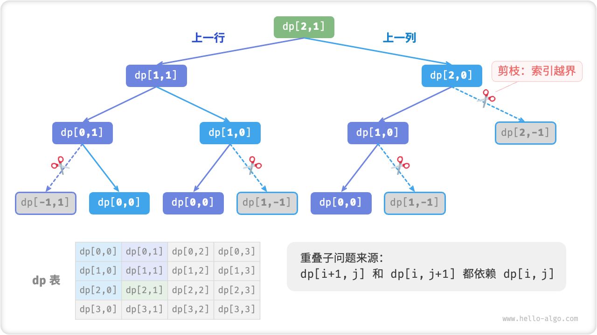

<p align="center"> Fig. 暴力搜索递归树 </p>

每个状态都有向下和向右两种选择，从左上角走到右下角总共需要 $m + n - 2$ 步，所以最差时间复杂度为 $O(2^{m + n})$ 。请注意，这种计算方式未考虑临近网格边界的情况，当到达网络边界时只剩下一种选择。因此实际的路径数量会少一些。

### 方法二：记忆化搜索

为了避免重复计算重叠子问题，我们引入一个和网格 `grid` 相同尺寸的记忆列表 `mem` ，用于记录各个子问题的解，提升搜索效率。

=== "Java"

    ```java title="min_path_sum.java"
    /* 最小路径和：记忆化搜索 */
    int minPathSumDFSMem(int[][] grid, int[][] mem, int i, int j) {
        // 若为左上角单元格，则终止搜索
        if (i == 0 && j == 0) {
            return grid[0][0];
        }
        // 若行列索引越界，则返回 +∞ 代价
        if (i < 0 || j < 0) {
            return Integer.MAX_VALUE;
        }
        // 若已有记录，则直接返回
        if (mem[i][j] != -1) {
            return mem[i][j];
        }
        // 左边和上边单元格的最小路径代价
        int left = minPathSumDFSMem(grid, mem, i - 1, j);
        int up = minPathSumDFSMem(grid, mem, i, j - 1);
        // 记录并返回左上角到 (i, j) 的最小路径代价
        mem[i][j] = Math.min(left, up) + grid[i][j];
        return mem[i][j];
    }
    ```

=== "C++"

    ```cpp title="min_path_sum.cpp"
    /* 最小路径和：记忆化搜索 */
    int minPathSumDFSMem(vector<vector<int>> &grid, vector<vector<int>> &mem, int i, int j) {
        // 若为左上角单元格，则终止搜索
        if (i == 0 && j == 0) {
            return grid[0][0];
        }
        // 若行列索引越界，则返回 +∞ 代价
        if (i < 0 || j < 0) {
            return INT_MAX;
        }
        // 若已有记录，则直接返回
        if (mem[i][j] != -1) {
            return mem[i][j];
        }
        // 左边和上边单元格的最小路径代价
        int left = minPathSumDFSMem(grid, mem, i - 1, j);
        int up = minPathSumDFSMem(grid, mem, i, j - 1);
        // 记录并返回左上角到 (i, j) 的最小路径代价
        mem[i][j] = min(left, up) != INT_MAX ? min(left, up) + grid[i][j] : INT_MAX;
        return mem[i][j];
    }
    ```

=== "Python"

    ```python title="min_path_sum.py"
    def min_path_sum_dfs_mem(
        grid: list[list[int]], mem: list[list[int]], i: int, j: int
    ) -> int:
        """最小路径和：记忆化搜索"""
        # 若为左上角单元格，则终止搜索
        if i == 0 and j == 0:
            return grid[0][0]
        # 若行列索引越界，则返回 +∞ 代价
        if i < 0 or j < 0:
            return inf
        # 若已有记录，则直接返回
        if mem[i][j] != -1:
            return mem[i][j]
        # 左边和上边单元格的最小路径代价
        left = min_path_sum_dfs_mem(grid, mem, i - 1, j)
        up = min_path_sum_dfs_mem(grid, mem, i, j - 1)
        # 记录并返回左上角到 (i, j) 的最小路径代价
        mem[i][j] = min(left, up) + grid[i][j]
        return mem[i][j]
    ```

=== "Go"

    ```go title="min_path_sum.go"
    /* 最小路径和：记忆化搜索 */
    func minPathSumDFSMem(grid, mem [][]int, i, j int) int {
        // 若为左上角单元格，则终止搜索
        if i == 0 && j == 0 {
            return grid[0][0]
        }
        // 若行列索引越界，则返回 +∞ 代价
        if i < 0 || j < 0 {
            return math.MaxInt
        }
        // 若已有记录，则直接返回
        if mem[i][j] != -1 {
            return mem[i][j]
        }
        // 左边和上边单元格的最小路径代价
        left := minPathSumDFSMem(grid, mem, i-1, j)
        up := minPathSumDFSMem(grid, mem, i, j-1)
        // 记录并返回左上角到 (i, j) 的最小路径代价
        mem[i][j] = int(math.Min(float64(left), float64(up))) + grid[i][j]
        return mem[i][j]
    }
    ```

=== "JavaScript"

    ```javascript title="min_path_sum.js"
    [class]{}-[func]{minPathSumDFSMem}
    ```

=== "TypeScript"

    ```typescript title="min_path_sum.ts"
    [class]{}-[func]{minPathSumDFSMem}
    ```

=== "C"

    ```c title="min_path_sum.c"
    [class]{}-[func]{minPathSumDFSMem}
    ```

=== "C#"

    ```csharp title="min_path_sum.cs"
    /* 最小路径和：记忆化搜索 */
    int minPathSumDFSMem(int[][] grid, int[][] mem, int i, int j) {
        // 若为左上角单元格，则终止搜索
        if (i == 0 && j == 0) {
            return grid[0][0];
        }
        // 若行列索引越界，则返回 +∞ 代价
        if (i < 0 || j < 0) {
            return int.MaxValue;
        }
        // 若已有记录，则直接返回
        if (mem[i][j] != -1) {
            return mem[i][j];
        }
        // 左边和上边单元格的最小路径代价
        int left = minPathSumDFSMem(grid, mem, i - 1, j);
        int up = minPathSumDFSMem(grid, mem, i, j - 1);
        // 记录并返回左上角到 (i, j) 的最小路径代价
        mem[i][j] = Math.Min(left, up) + grid[i][j];
        return mem[i][j];
    }
    ```

=== "Swift"

    ```swift title="min_path_sum.swift"
    /* 最小路径和：记忆化搜索 */
    func minPathSumDFSMem(grid: [[Int]], mem: inout [[Int]], i: Int, j: Int) -> Int {
        // 若为左上角单元格，则终止搜索
        if i == 0, j == 0 {
            return grid[0][0]
        }
        // 若行列索引越界，则返回 +∞ 代价
        if i < 0 || j < 0 {
            return .max
        }
        // 若已有记录，则直接返回
        if mem[i][j] != -1 {
            return mem[i][j]
        }
        // 左边和上边单元格的最小路径代价
        let left = minPathSumDFSMem(grid: grid, mem: &mem, i: i - 1, j: j)
        let up = minPathSumDFSMem(grid: grid, mem: &mem, i: i, j: j - 1)
        // 记录并返回左上角到 (i, j) 的最小路径代价
        mem[i][j] = min(left, up) + grid[i][j]
        return mem[i][j]
    }
    ```

=== "Zig"

    ```zig title="min_path_sum.zig"
    // 最小路径和：记忆化搜索
    fn minPathSumDFSMem(grid: anytype, mem: anytype, i: i32, j: i32) i32 {
        // 若为左上角单元格，则终止搜索
        if (i == 0 and j == 0) {
            return grid[0][0];
        }
        // 若行列索引越界，则返回 +∞ 代价
        if (i < 0 or j < 0) {
            return std.math.maxInt(i32);
        }
        // 若已有记录，则直接返回
        if (mem[@as(usize, @intCast(i))][@as(usize, @intCast(j))] != -1) {
            return mem[@as(usize, @intCast(i))][@as(usize, @intCast(j))];
        }
        // 计算从左上角到 (i-1, j) 和 (i, j-1) 的最小路径代价
        var left = minPathSumDFSMem(grid, mem, i - 1, j);
        var up = minPathSumDFSMem(grid, mem, i, j - 1);
        // 返回从左上角到 (i, j) 的最小路径代价
        // 记录并返回左上角到 (i, j) 的最小路径代价
        mem[@as(usize, @intCast(i))][@as(usize, @intCast(j))] = @min(left, up) + grid[@as(usize, @intCast(i))][@as(usize, @intCast(j))];
        return mem[@as(usize, @intCast(i))][@as(usize, @intCast(j))];
    }
    ```

=== "Dart"

    ```dart title="min_path_sum.dart"
    [class]{}-[func]{minPathSumDFSMem}
    ```

如下图所示，引入记忆化可以消除所有重复计算，时间复杂度取决于状态总数，即网格尺寸 $O(nm)$ 。

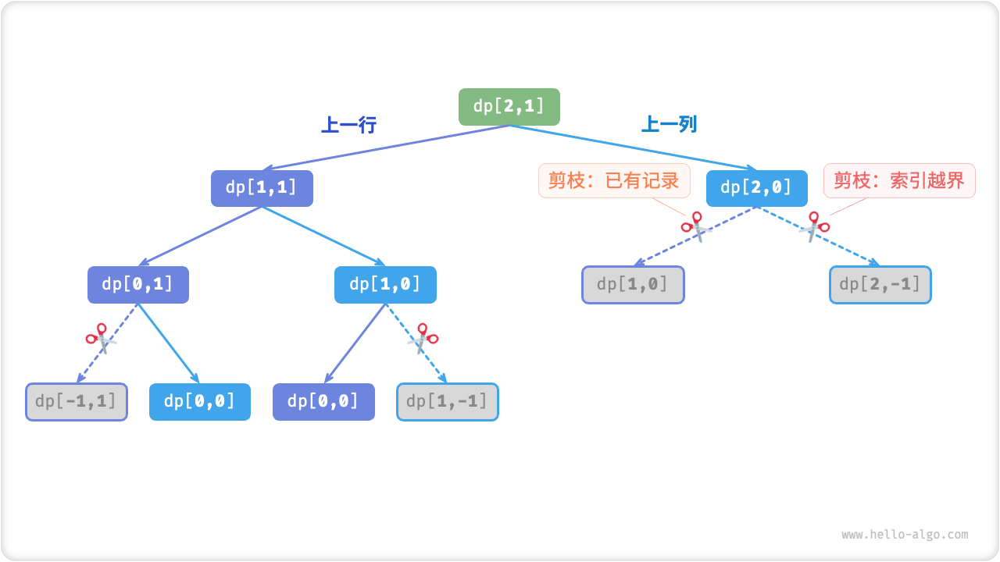

<p align="center"> Fig. 记忆化搜索递归树 </p>

### 方法三：动态规划

动态规划代码是从底至顶的，仅需循环即可实现。

=== "Java"

    ```java title="min_path_sum.java"
    /* 最小路径和：动态规划 */
    int minPathSumDP(int[][] grid) {
        int n = grid.length, m = grid[0].length;
        // 初始化 dp 表
        int[][] dp = new int[n][m];
        dp[0][0] = grid[0][0];
        // 状态转移：首行
        for (int j = 1; j < m; j++) {
            dp[0][j] = dp[0][j - 1] + grid[0][j];
        }
        // 状态转移：首列
        for (int i = 1; i < n; i++) {
            dp[i][0] = dp[i - 1][0] + grid[i][0];
        }
        // 状态转移：其余行列
        for (int i = 1; i < n; i++) {
            for (int j = 1; j < m; j++) {
                dp[i][j] = Math.min(dp[i][j - 1], dp[i - 1][j]) + grid[i][j];
            }
        }
        return dp[n - 1][m - 1];
    }
    ```

=== "C++"

    ```cpp title="min_path_sum.cpp"
    /* 最小路径和：动态规划 */
    int minPathSumDP(vector<vector<int>> &grid) {
        int n = grid.size(), m = grid[0].size();
        // 初始化 dp 表
        vector<vector<int>> dp(n, vector<int>(m));
        dp[0][0] = grid[0][0];
        // 状态转移：首行
        for (int j = 1; j < m; j++) {
            dp[0][j] = dp[0][j - 1] + grid[0][j];
        }
        // 状态转移：首列
        for (int i = 1; i < n; i++) {
            dp[i][0] = dp[i - 1][0] + grid[i][0];
        }
        // 状态转移：其余行列
        for (int i = 1; i < n; i++) {
            for (int j = 1; j < m; j++) {
                dp[i][j] = min(dp[i][j - 1], dp[i - 1][j]) + grid[i][j];
            }
        }
        return dp[n - 1][m - 1];
    }
    ```

=== "Python"

    ```python title="min_path_sum.py"
    def min_path_sum_dp(grid: list[list[int]]) -> int:
        """最小路径和：动态规划"""
        n, m = len(grid), len(grid[0])
        # 初始化 dp 表
        dp = [[0] * m for _ in range(n)]
        dp[0][0] = grid[0][0]
        # 状态转移：首行
        for j in range(1, m):
            dp[0][j] = dp[0][j - 1] + grid[0][j]
        # 状态转移：首列
        for i in range(1, n):
            dp[i][0] = dp[i - 1][0] + grid[i][0]
        # 状态转移：其余行列
        for i in range(1, n):
            for j in range(1, m):
                dp[i][j] = min(dp[i][j - 1], dp[i - 1][j]) + grid[i][j]
        return dp[n - 1][m - 1]
    ```

=== "Go"

    ```go title="min_path_sum.go"
    /* 最小路径和：动态规划 */
    func minPathSumDP(grid [][]int) int {
        n, m := len(grid), len(grid[0])
        // 初始化 dp 表
        dp := make([][]int, n)
        for i := 0; i < n; i++ {
            dp[i] = make([]int, m)
        }
        dp[0][0] = grid[0][0]
        // 状态转移：首行
        for j := 1; j < m; j++ {
            dp[0][j] = dp[0][j-1] + grid[0][j]
        }
        // 状态转移：首列
        for i := 1; i < n; i++ {
            dp[i][0] = dp[i-1][0] + grid[i][0]
        }
        // 状态转移：其余行列
        for i := 1; i < n; i++ {
            for j := 1; j < m; j++ {
                dp[i][j] = int(math.Min(float64(dp[i][j-1]), float64(dp[i-1][j]))) + grid[i][j]
            }
        }
        return dp[n-1][m-1]
    }
    ```

=== "JavaScript"

    ```javascript title="min_path_sum.js"
    [class]{}-[func]{minPathSumDP}
    ```

=== "TypeScript"

    ```typescript title="min_path_sum.ts"
    [class]{}-[func]{minPathSumDP}
    ```

=== "C"

    ```c title="min_path_sum.c"
    [class]{}-[func]{minPathSumDP}
    ```

=== "C#"

    ```csharp title="min_path_sum.cs"
    /* 最小路径和：动态规划 */
    int minPathSumDP(int[][] grid) {
        int n = grid.Length, m = grid[0].Length;
        // 初始化 dp 表
        int[,] dp = new int[n, m];
        dp[0, 0] = grid[0][0];
        // 状态转移：首行
        for (int j = 1; j < m; j++) {
            dp[0, j] = dp[0, j - 1] + grid[0][j];
        }
        // 状态转移：首列
        for (int i = 1; i < n; i++) {
            dp[i, 0] = dp[i - 1, 0] + grid[i][0];
        }
        // 状态转移：其余行列
        for (int i = 1; i < n; i++) {
            for (int j = 1; j < m; j++) {
                dp[i, j] = Math.Min(dp[i, j - 1], dp[i - 1, j]) + grid[i][j];
            }
        }
        return dp[n - 1, m - 1];
    }
    ```

=== "Swift"

    ```swift title="min_path_sum.swift"
    /* 最小路径和：动态规划 */
    func minPathSumDP(grid: [[Int]]) -> Int {
        let n = grid.count
        let m = grid[0].count
        // 初始化 dp 表
        var dp = Array(repeating: Array(repeating: 0, count: m), count: n)
        dp[0][0] = grid[0][0]
        // 状态转移：首行
        for j in stride(from: 1, to: m, by: 1) {
            dp[0][j] = dp[0][j - 1] + grid[0][j]
        }
        // 状态转移：首列
        for i in stride(from: 1, to: n, by: 1) {
            dp[i][0] = dp[i - 1][0] + grid[i][0]
        }
        // 状态转移：其余行列
        for i in stride(from: 1, to: n, by: 1) {
            for j in stride(from: 1, to: m, by: 1) {
                dp[i][j] = min(dp[i][j - 1], dp[i - 1][j]) + grid[i][j]
            }
        }
        return dp[n - 1][m - 1]
    }
    ```

=== "Zig"

    ```zig title="min_path_sum.zig"
    // 最小路径和：动态规划
    fn minPathSumDP(comptime grid: anytype) i32 {
        comptime var n = grid.len;
        comptime var m = grid[0].len;
        // 初始化 dp 表
        var dp = [_][m]i32{[_]i32{0} ** m} ** n;
        dp[0][0] = grid[0][0];
        // 状态转移：首行
        for (1..m) |j| {
            dp[0][j] = dp[0][j - 1] + grid[0][j];
        }
        // 状态转移：首列
        for (1..n) |i| {
            dp[i][0] = dp[i - 1][0] + grid[i][0];
        }
        // 状态转移：其余行列
        for (1..n) |i| {
            for (1..m) |j| {
                dp[i][j] = @min(dp[i][j - 1], dp[i - 1][j]) + grid[i][j];
            }
        }
        return dp[n - 1][m - 1];
    }
    ```

=== "Dart"

    ```dart title="min_path_sum.dart"
    [class]{}-[func]{minPathSumDP}
    ```

下图展示了最小路径和的状态转移过程。该过程遍历了整个网格，因此时间复杂度为 $O(nm)$ ；数组 `dp` 使用 $O(nm)$ 空间。

=== "<1>"
    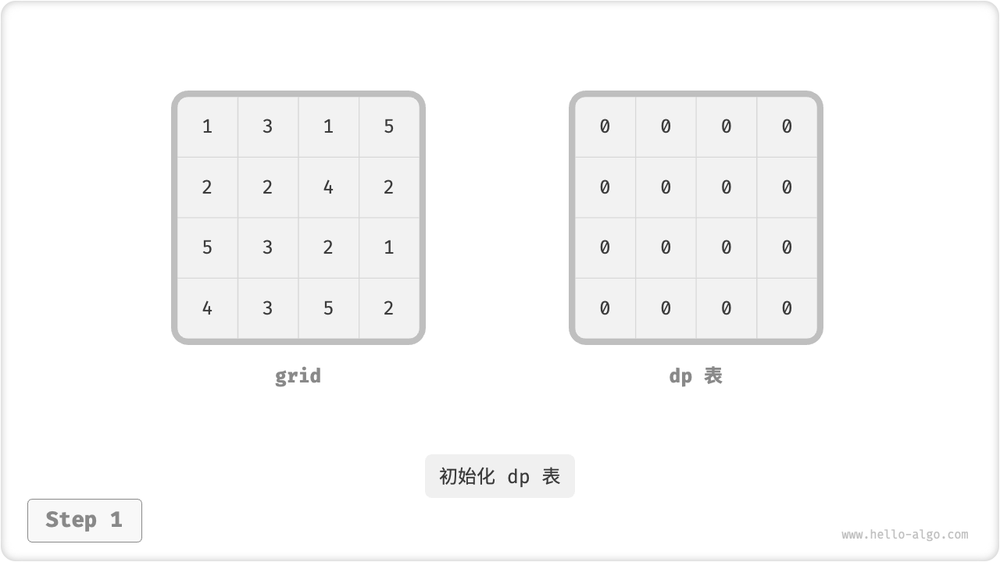

=== "<2>"
    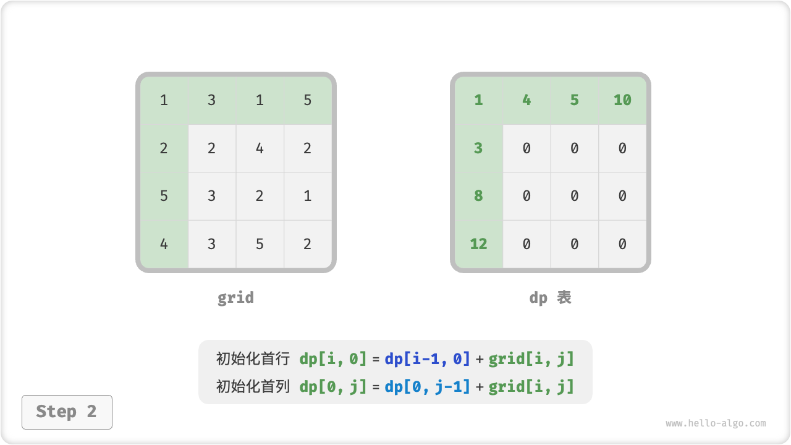

=== "<3>"
    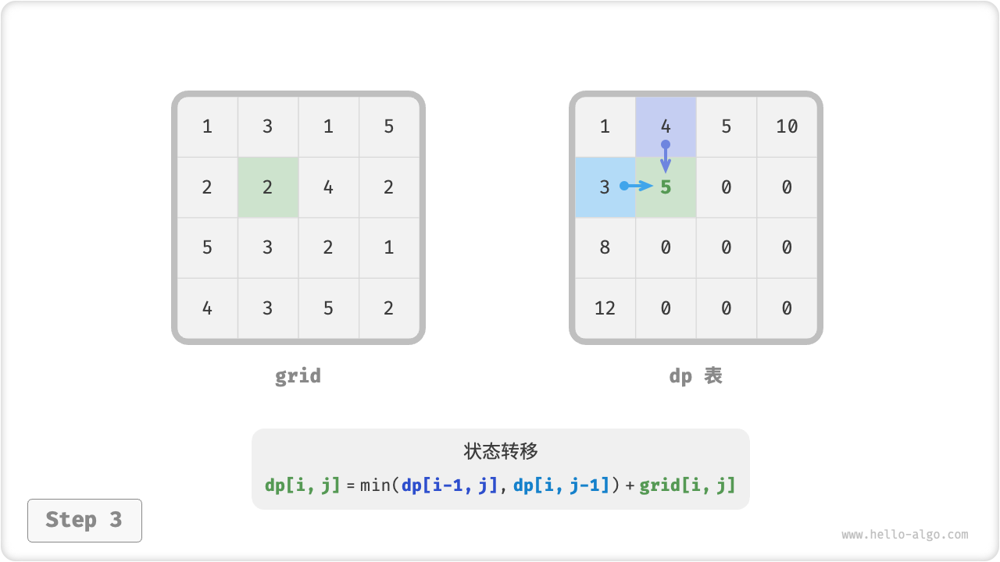

=== "<4>"
    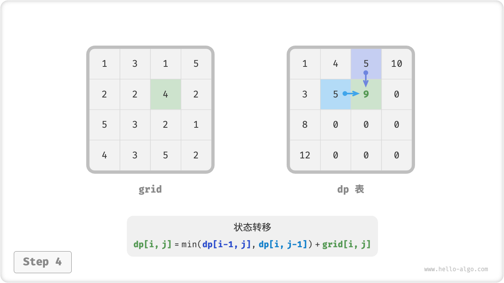

=== "<5>"
    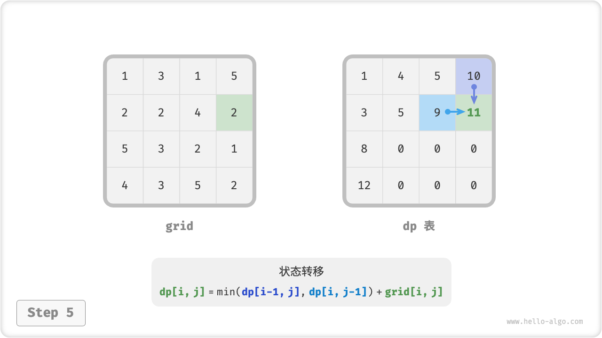

=== "<6>"
    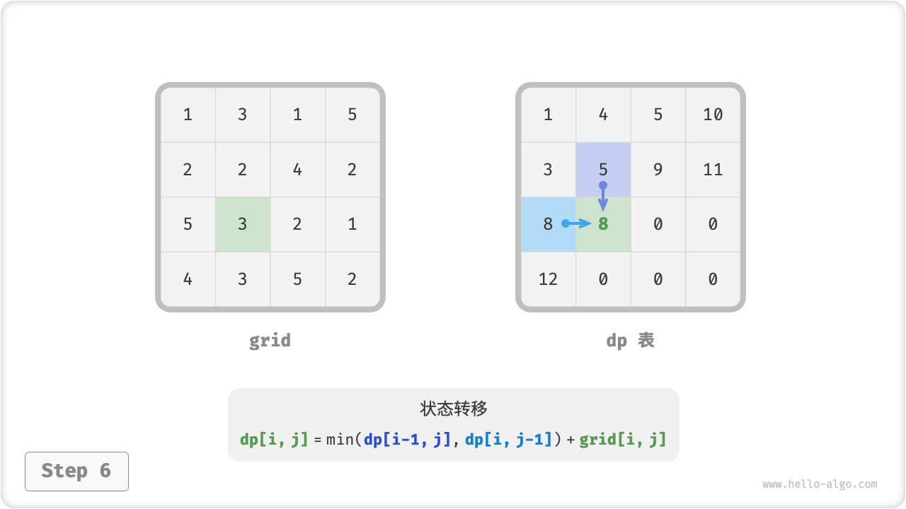

=== "<7>"
    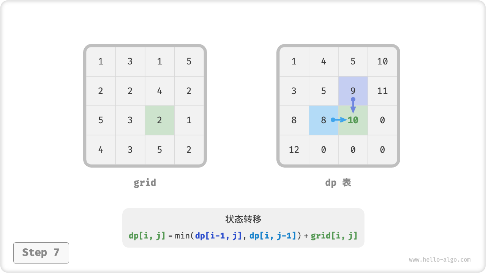

=== "<8>"
    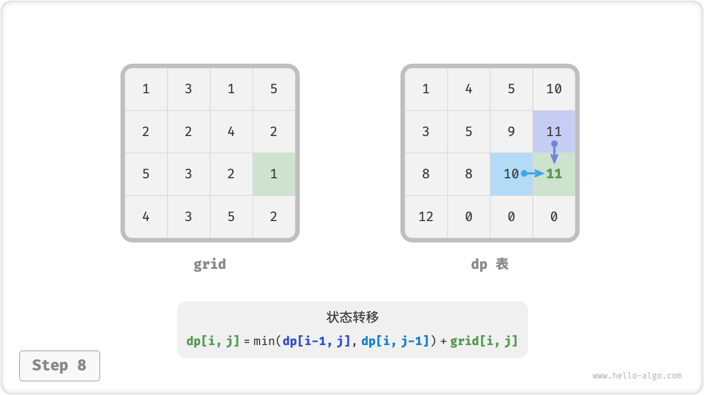

=== "<9>"
    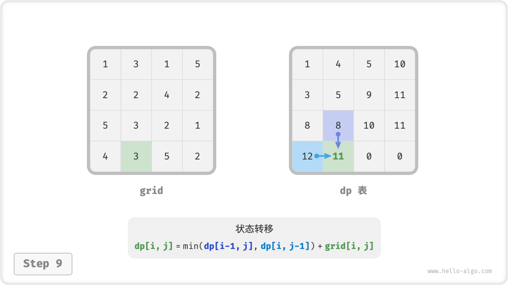

=== "<10>"
    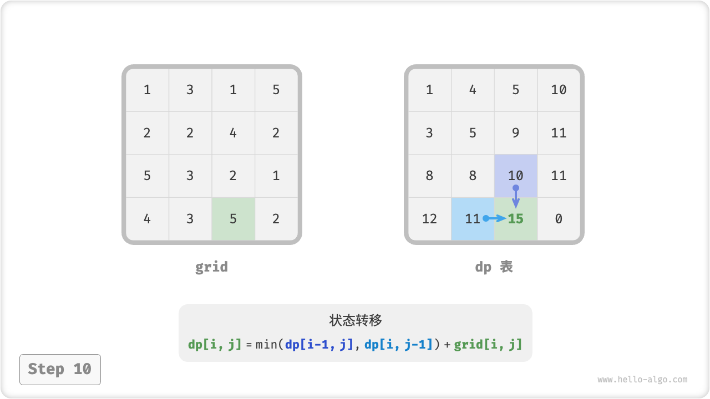

=== "<11>"
    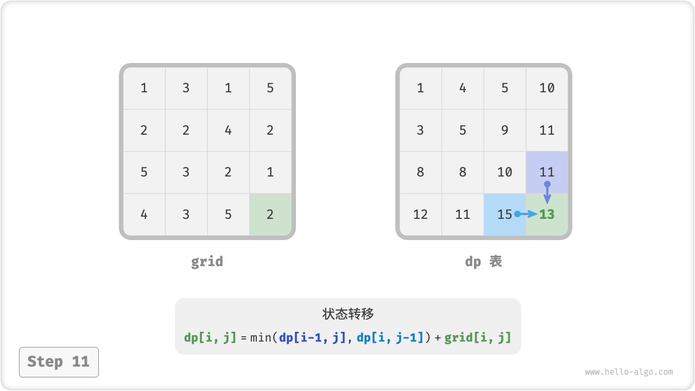

=== "<12>"
    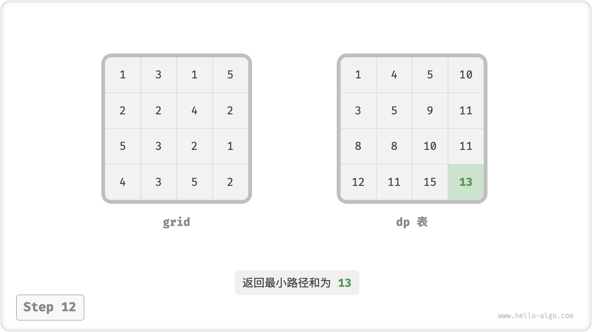

### 状态压缩

如果希望进一步节省空间使用，可以考虑进行状态压缩。每个格子只与左边和上边的格子有关，因此我们可以只用一个单行数组来实现 $dp$ 表。

由于数组 `dp` 只能表示一行的状态，因此我们无法提前初始化首列状态，而是在遍历每行中更新它。

=== "Java"

    ```java title="min_path_sum.java"
    /* 最小路径和：状态压缩后的动态规划 */
    int minPathSumDPComp(int[][] grid) {
        int n = grid.length, m = grid[0].length;
        // 初始化 dp 表
        int[] dp = new int[m];
        // 状态转移：首行
        dp[0] = grid[0][0];
        for (int j = 1; j < m; j++) {
            dp[j] = dp[j - 1] + grid[0][j];
        }
        // 状态转移：其余行
        for (int i = 1; i < n; i++) {
            // 状态转移：首列
            dp[0] = dp[0] + grid[i][0];
            // 状态转移：其余列
            for (int j = 1; j < m; j++) {
                dp[j] = Math.min(dp[j - 1], dp[j]) + grid[i][j];
            }
        }
        return dp[m - 1];
    }
    ```

=== "C++"

    ```cpp title="min_path_sum.cpp"
    /* 最小路径和：状态压缩后的动态规划 */
    int minPathSumDPComp(vector<vector<int>> &grid) {
        int n = grid.size(), m = grid[0].size();
        // 初始化 dp 表
        vector<int> dp(m);
        // 状态转移：首行
        dp[0] = grid[0][0];
        for (int j = 1; j < m; j++) {
            dp[j] = dp[j - 1] + grid[0][j];
        }
        // 状态转移：其余行
        for (int i = 1; i < n; i++) {
            // 状态转移：首列
            dp[0] = dp[0] + grid[i][0];
            // 状态转移：其余列
            for (int j = 1; j < m; j++) {
                dp[j] = min(dp[j - 1], dp[j]) + grid[i][j];
            }
        }
        return dp[m - 1];
    }
    ```

=== "Python"

    ```python title="min_path_sum.py"
    def min_path_sum_dp_comp(grid: list[list[int]]) -> int:
        """最小路径和：状态压缩后的动态规划"""
        n, m = len(grid), len(grid[0])
        # 初始化 dp 表
        dp = [0] * m
        # 状态转移：首行
        dp[0] = grid[0][0]
        for j in range(1, m):
            dp[j] = dp[j - 1] + grid[0][j]
        # 状态转移：其余行
        for i in range(1, n):
            # 状态转移：首列
            dp[0] = dp[0] + grid[i][0]
            # 状态转移：其余列
            for j in range(1, m):
                dp[j] = min(dp[j - 1], dp[j]) + grid[i][j]
        return dp[m - 1]
    ```

=== "Go"

    ```go title="min_path_sum.go"
    /* 最小路径和：状态压缩后的动态规划 */
    func minPathSumDPComp(grid [][]int) int {
        n, m := len(grid), len(grid[0])
        // 初始化 dp 表
        dp := make([]int, m)
        // 状态转移：首行
        dp[0] = grid[0][0]
        for j := 1; j < m; j++ {
            dp[j] = dp[j-1] + grid[0][j]
        }
        // 状态转移：其余行列
        for i := 1; i < n; i++ {
            // 状态转移：首列
            dp[0] = dp[0] + grid[i][0]
            // 状态转移：其余列
            for j := 1; j < m; j++ {
                dp[j] = int(math.Min(float64(dp[j-1]), float64(dp[j]))) + grid[i][j]
            }
        }
        return dp[m-1]
    }
    ```

=== "JavaScript"

    ```javascript title="min_path_sum.js"
    [class]{}-[func]{minPathSumDPComp}
    ```

=== "TypeScript"

    ```typescript title="min_path_sum.ts"
    [class]{}-[func]{minPathSumDPComp}
    ```

=== "C"

    ```c title="min_path_sum.c"
    [class]{}-[func]{minPathSumDPComp}
    ```

=== "C#"

    ```csharp title="min_path_sum.cs"
    /* 最小路径和：状态压缩后的动态规划 */
    int minPathSumDPComp(int[][] grid) {
        int n = grid.Length, m = grid[0].Length;
        // 初始化 dp 表
        int[] dp = new int[m];
        dp[0] = grid[0][0];
        // 状态转移：首行
        for (int j = 1; j < m; j++) {
            dp[j] = dp[j - 1] + grid[0][j];
        }
        // 状态转移：其余行
        for (int i = 1; i < n; i++) {
            // 状态转移：首列
            dp[0] = dp[0] + grid[i][0];
            // 状态转移：其余列
            for (int j = 1; j < m; j++) {
                dp[j] = Math.Min(dp[j - 1], dp[j]) + grid[i][j];
            }
        }
        return dp[m - 1];
    }
    ```

=== "Swift"

    ```swift title="min_path_sum.swift"
    /* 最小路径和：状态压缩后的动态规划 */
    func minPathSumDPComp(grid: [[Int]]) -> Int {
        let n = grid.count
        let m = grid[0].count
        // 初始化 dp 表
        var dp = Array(repeating: 0, count: m)
        // 状态转移：首行
        dp[0] = grid[0][0]
        for j in stride(from: 1, to: m, by: 1) {
            dp[j] = dp[j - 1] + grid[0][j]
        }
        // 状态转移：其余行
        for i in stride(from: 1, to: n, by: 1) {
            // 状态转移：首列
            dp[0] = dp[0] + grid[i][0]
            // 状态转移：其余列
            for j in stride(from: 1, to: m, by: 1) {
                dp[j] = min(dp[j - 1], dp[j]) + grid[i][j]
            }
        }
        return dp[m - 1]
    }
    ```

=== "Zig"

    ```zig title="min_path_sum.zig"
    // 最小路径和：状态压缩后的动态规划
    fn minPathSumDPComp(comptime grid: anytype) i32 {
        comptime var n = grid.len;
        comptime var m = grid[0].len;
        // 初始化 dp 表
        var dp = [_]i32{0} ** m;
        // 状态转移：首行
        dp[0] = grid[0][0];
        for (1..m) |j| {
            dp[j] = dp[j - 1] + grid[0][j];
        }
        // 状态转移：其余行
        for (1..n) |i| {
            // 状态转移：首列
            dp[0] = dp[0] + grid[i][0];
            for (1..m) |j| {
                dp[j] = @min(dp[j - 1], dp[j]) + grid[i][j];
            }
        }
        return dp[m - 1];
    }
    ```

=== "Dart"

    ```dart title="min_path_sum.dart"
    [class]{}-[func]{minPathSumDPComp}
    ```
