# 14.6 &nbsp; 编辑距离问题

编辑距离，也被称为 Levenshtein 距离，指两个字符串之间互相转换的最小修改次数，通常用于在信息检索和自然语言处理中度量两个序列的相似度。

!!! question

    输入两个字符串 $s$ 和 $t$ ，返回将 $s$ 转换为 $t$ 所需的最少编辑步数。
    
    你可以在一个字符串中进行三种编辑操作：插入一个字符、删除一个字符、替换字符为任意一个字符。

如下图所示，将 `kitten` 转换为 `sitting` 需要编辑 3 步，包括 2 次替换操作与 1 次添加操作；将 `hello` 转换为 `algo` 需要 3 步，包括 2 次替换操作和 1 次删除操作。

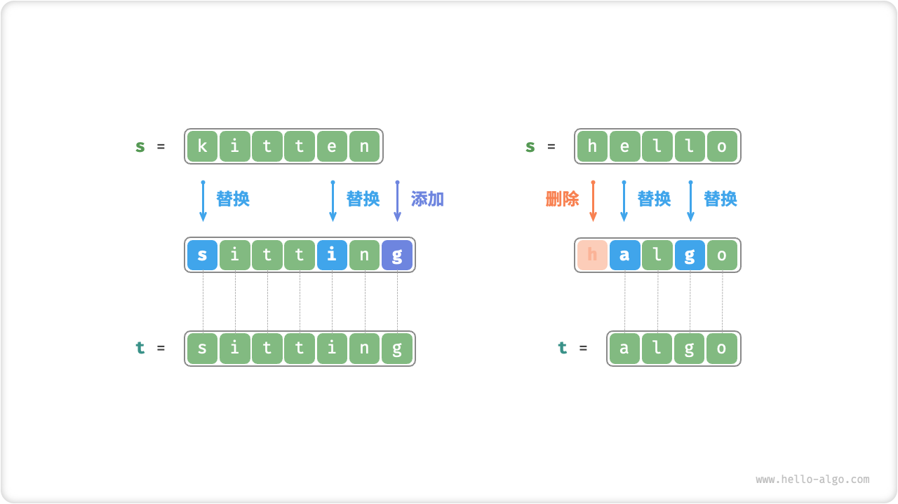

<p align="center"> 图：编辑距离的示例数据 </p>

**编辑距离问题可以很自然地用决策树模型来解释**。字符串对应树节点，一轮决策（一次编辑操作）对应树的一条边。

如下图所示，在不限制操作的情况下，每个节点都可以派生出许多条边，每条边对应一种操作，这意味着从 `hello` 转换到 `algo` 有许多种可能的路径。

从决策树的角度看，本题的目标是求解节点 `hello` 和节点 `algo` 之间的最短路径。

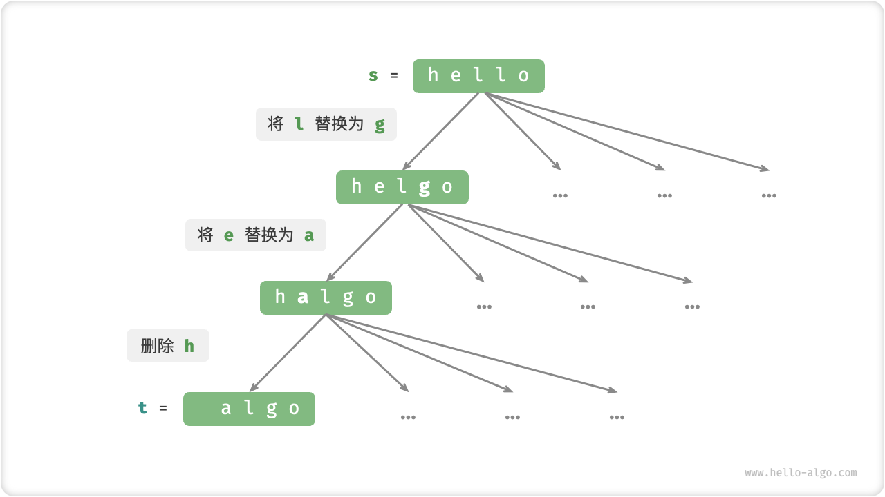

<p align="center"> 图：基于决策树模型表示编辑距离问题 </p>

### 1. &nbsp; 动态规划思路

**第一步：思考每轮的决策，定义状态，从而得到 $dp$ 表**

每一轮的决策是对字符串 $s$ 进行一次编辑操作。

我们希望在编辑操作的过程中，问题的规模逐渐缩小，这样才能构建子问题。设字符串 $s$ 和 $t$ 的长度分别为 $n$ 和 $m$ ，我们先考虑两字符串尾部的字符 $s[n-1]$ 和 $t[m-1]$ ：

- 若 $s[n-1]$ 和 $t[m-1]$ 相同，我们可以跳过它们，直接考虑 $s[n-2]$ 和 $t[m-2]$ 。
- 若 $s[n-1]$ 和 $t[m-1]$ 不同，我们需要对 $s$ 进行一次编辑（插入、删除、替换），使得两字符串尾部的字符相同，从而可以跳过它们，考虑规模更小的问题。

也就是说，我们在字符串 $s$ 中进行的每一轮决策（编辑操作），都会使得 $s$ 和 $t$ 中剩余的待匹配字符发生变化。因此，状态为当前在 $s$ , $t$ 中考虑的第 $i$ , $j$ 个字符，记为 $[i, j]$ 。

状态 $[i, j]$ 对应的子问题：**将 $s$ 的前 $i$ 个字符更改为 $t$ 的前 $j$ 个字符所需的最少编辑步数**。

至此，得到一个尺寸为 $(i+1) \times (j+1)$ 的二维 $dp$ 表。

**第二步：找出最优子结构，进而推导出状态转移方程**

考虑子问题 $dp[i, j]$ ，其对应的两个字符串的尾部字符为 $s[i-1]$ 和 $t[j-1]$ ，可根据不同编辑操作分为下图所示的三种情况：

1. 在 $s[i-1]$ 之后添加 $t[j-1]$ ，则剩余子问题 $dp[i, j-1]$ 。
2. 删除 $s[i-1]$ ，则剩余子问题 $dp[i-1, j]$ 。
3. 将 $s[i-1]$ 替换为 $t[j-1]$ ，则剩余子问题 $dp[i-1, j-1]$ 。

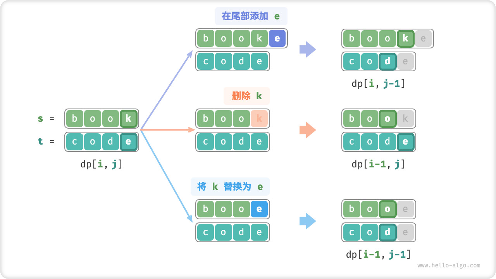

<p align="center"> 图：编辑距离的状态转移 </p>

根据以上分析，可得最优子结构：$dp[i, j]$ 的最少编辑步数等于 $dp[i, j-1]$ , $dp[i-1, j]$ , $dp[i-1, j-1]$ 三者中的最少编辑步数，再加上本次的编辑步数 $1$ 。对应的状态转移方程为：

$$
dp[i, j] = \min(dp[i, j-1], dp[i-1, j], dp[i-1, j-1]) + 1
$$

请注意，**当 $s[i-1]$ 和 $t[j-1]$ 相同时，无须编辑当前字符**，这种情况下的状态转移方程为：

$$
dp[i, j] = dp[i-1, j-1]
$$

**第三步：确定边界条件和状态转移顺序**

当两字符串都为空时，编辑步数为 $0$ ，即 $dp[0, 0] = 0$ 。当 $s$ 为空但 $t$ 不为空时，最少编辑步数等于 $t$ 的长度，即首行 $dp[0, j] = j$ 。当 $s$ 不为空但 $t$ 为空时，等于 $s$ 的长度，即首列 $dp[i, 0] = i$ 。

观察状态转移方程，解 $dp[i, j]$ 依赖左方、上方、左上方的解，因此通过两层循环正序遍历整个 $dp$ 表即可。

### 2. &nbsp; 代码实现

=== "Java"

    ```java title="edit_distance.java"
    /* 编辑距离：动态规划 */
    int editDistanceDP(String s, String t) {
        int n = s.length(), m = t.length();
        int[][] dp = new int[n + 1][m + 1];
        // 状态转移：首行首列
        for (int i = 1; i <= n; i++) {
            dp[i][0] = i;
        }
        for (int j = 1; j <= m; j++) {
            dp[0][j] = j;
        }
        // 状态转移：其余行列
        for (int i = 1; i <= n; i++) {
            for (int j = 1; j <= m; j++) {
                if (s.charAt(i - 1) == t.charAt(j - 1)) {
                    // 若两字符相等，则直接跳过此两字符
                    dp[i][j] = dp[i - 1][j - 1];
                } else {
                    // 最少编辑步数 = 插入、删除、替换这三种操作的最少编辑步数 + 1
                    dp[i][j] = Math.min(Math.min(dp[i][j - 1], dp[i - 1][j]), dp[i - 1][j - 1]) + 1;
                }
            }
        }
        return dp[n][m];
    }
    ```

=== "C++"

    ```cpp title="edit_distance.cpp"
    /* 编辑距离：动态规划 */
    int editDistanceDP(string s, string t) {
        int n = s.length(), m = t.length();
        vector<vector<int>> dp(n + 1, vector<int>(m + 1, 0));
        // 状态转移：首行首列
        for (int i = 1; i <= n; i++) {
            dp[i][0] = i;
        }
        for (int j = 1; j <= m; j++) {
            dp[0][j] = j;
        }
        // 状态转移：其余行列
        for (int i = 1; i <= n; i++) {
            for (int j = 1; j <= m; j++) {
                if (s[i - 1] == t[j - 1]) {
                    // 若两字符相等，则直接跳过此两字符
                    dp[i][j] = dp[i - 1][j - 1];
                } else {
                    // 最少编辑步数 = 插入、删除、替换这三种操作的最少编辑步数 + 1
                    dp[i][j] = min(min(dp[i][j - 1], dp[i - 1][j]), dp[i - 1][j - 1]) + 1;
                }
            }
        }
        return dp[n][m];
    }
    ```

=== "Python"

    ```python title="edit_distance.py"
    def edit_distance_dp(s: str, t: str) -> int:
        """编辑距离：动态规划"""
        n, m = len(s), len(t)
        dp = [[0] * (m + 1) for _ in range(n + 1)]
        # 状态转移：首行首列
        for i in range(1, n + 1):
            dp[i][0] = i
        for j in range(1, m + 1):
            dp[0][j] = j
        # 状态转移：其余行列
        for i in range(1, n + 1):
            for j in range(1, m + 1):
                if s[i - 1] == t[j - 1]:
                    # 若两字符相等，则直接跳过此两字符
                    dp[i][j] = dp[i - 1][j - 1]
                else:
                    # 最少编辑步数 = 插入、删除、替换这三种操作的最少编辑步数 + 1
                    dp[i][j] = min(dp[i][j - 1], dp[i - 1][j], dp[i - 1][j - 1]) + 1
        return dp[n][m]
    ```

=== "Go"

    ```go title="edit_distance.go"
    /* 编辑距离：动态规划 */
    func editDistanceDP(s string, t string) int {
        n := len(s)
        m := len(t)
        dp := make([][]int, n+1)
        for i := 0; i <= n; i++ {
            dp[i] = make([]int, m+1)
        }
        // 状态转移：首行首列
        for i := 1; i <= n; i++ {
            dp[i][0] = i
        }
        for j := 1; j <= m; j++ {
            dp[0][j] = j
        }
        // 状态转移：其余行列
        for i := 1; i <= n; i++ {
            for j := 1; j <= m; j++ {
                if s[i-1] == t[j-1] {
                    // 若两字符相等，则直接跳过此两字符
                    dp[i][j] = dp[i-1][j-1]
                } else {
                    // 最少编辑步数 = 插入、删除、替换这三种操作的最少编辑步数 + 1
                    dp[i][j] = MinInt(MinInt(dp[i][j-1], dp[i-1][j]), dp[i-1][j-1]) + 1
                }
            }
        }
        return dp[n][m]
    }
    ```

=== "JS"

    ```javascript title="edit_distance.js"
    [class]{}-[func]{editDistanceDP}
    ```

=== "TS"

    ```typescript title="edit_distance.ts"
    [class]{}-[func]{editDistanceDP}
    ```

=== "C"

    ```c title="edit_distance.c"
    [class]{}-[func]{editDistanceDP}
    ```

=== "C#"

    ```csharp title="edit_distance.cs"
    /* 编辑距离：动态规划 */
    int editDistanceDP(string s, string t) {
        int n = s.Length, m = t.Length;
        int[,] dp = new int[n + 1, m + 1];
        // 状态转移：首行首列
        for (int i = 1; i <= n; i++) {
            dp[i, 0] = i;
        }
        for (int j = 1; j <= m; j++) {
            dp[0, j] = j;
        }
        // 状态转移：其余行列
        for (int i = 1; i <= n; i++) {
            for (int j = 1; j <= m; j++) {
                if (s[i - 1] == t[j - 1]) {
                    // 若两字符相等，则直接跳过此两字符
                    dp[i, j] = dp[i - 1, j - 1];
                } else {
                    // 最少编辑步数 = 插入、删除、替换这三种操作的最少编辑步数 + 1
                    dp[i, j] = Math.Min(Math.Min(dp[i, j - 1], dp[i - 1, j]), dp[i - 1, j - 1]) + 1;
                }
            }
        }
        return dp[n, m];
    }
    ```

=== "Swift"

    ```swift title="edit_distance.swift"
    /* 编辑距离：动态规划 */
    func editDistanceDP(s: String, t: String) -> Int {
        let n = s.utf8CString.count
        let m = t.utf8CString.count
        var dp = Array(repeating: Array(repeating: 0, count: m + 1), count: n + 1)
        // 状态转移：首行首列
        for i in stride(from: 1, through: n, by: 1) {
            dp[i][0] = i
        }
        for j in stride(from: 1, through: m, by: 1) {
            dp[0][j] = j
        }
        // 状态转移：其余行列
        for i in stride(from: 1, through: n, by: 1) {
            for j in stride(from: 1, through: m, by: 1) {
                if s.utf8CString[i - 1] == t.utf8CString[j - 1] {
                    // 若两字符相等，则直接跳过此两字符
                    dp[i][j] = dp[i - 1][j - 1]
                } else {
                    // 最少编辑步数 = 插入、删除、替换这三种操作的最少编辑步数 + 1
                    dp[i][j] = min(min(dp[i][j - 1], dp[i - 1][j]), dp[i - 1][j - 1]) + 1
                }
            }
        }
        return dp[n][m]
    }
    ```

=== "Zig"

    ```zig title="edit_distance.zig"
    // 编辑距离：动态规划
    fn editDistanceDP(comptime s: []const u8, comptime t: []const u8) i32 {
        comptime var n = s.len;
        comptime var m = t.len;
        var dp = [_][m + 1]i32{[_]i32{0} ** (m + 1)} ** (n + 1);
        // 状态转移：首行首列
        for (1..n + 1) |i| {
            dp[i][0] = @intCast(i);
        }
        for (1..m + 1) |j| {
            dp[0][j] = @intCast(j);
        }
        // 状态转移：其余行列
        for (1..n + 1) |i| {
            for (1..m + 1) |j| {
                if (s[i - 1] == t[j - 1]) {
                    // 若两字符相等，则直接跳过此两字符
                    dp[i][j] = dp[i - 1][j - 1];
                } else {
                    // 最少编辑步数 = 插入、删除、替换这三种操作的最少编辑步数 + 1
                    dp[i][j] = @min(@min(dp[i][j - 1], dp[i - 1][j]), dp[i - 1][j - 1]) + 1;
                }
            }
        }
        return dp[n][m];
    }
    ```

=== "Dart"

    ```dart title="edit_distance.dart"
    /* 编辑距离：动态规划 */
    int editDistanceDP(String s, String t) {
      int n = s.length, m = t.length;
      List<List<int>> dp = List.generate(n + 1, (_) => List.filled(m + 1, 0));
      // 状态转移：首行首列
      for (int i = 1; i <= n; i++) {
        dp[i][0] = i;
      }
      for (int j = 1; j <= m; j++) {
        dp[0][j] = j;
      }
      // 状态转移：其余行列
      for (int i = 1; i <= n; i++) {
        for (int j = 1; j <= m; j++) {
          if (s[i - 1] == t[j - 1]) {
            // 若两字符相等，则直接跳过此两字符
            dp[i][j] = dp[i - 1][j - 1];
          } else {
            // 最少编辑步数 = 插入、删除、替换这三种操作的最少编辑步数 + 1
            dp[i][j] = min(min(dp[i][j - 1], dp[i - 1][j]), dp[i - 1][j - 1]) + 1;
          }
        }
      }
      return dp[n][m];
    }
    ```

=== "Rust"

    ```rust title="edit_distance.rs"
    /* 编辑距离：动态规划 */
    fn edit_distance_dp(s: &str, t: &str) -> i32 {
        let (n, m) = (s.len(), t.len());
        let mut dp = vec![vec![0; m + 1]; n + 1];
        // 状态转移：首行首列
        for i in 1..= n {
            dp[i][0] = i as i32;
        }
        for j in 1..m {
            dp[0][j] = j as i32;
        }
        // 状态转移：其余行列
        for i in 1..=n {
            for j in 1..=m {
                if s.chars().nth(i - 1) == t.chars().nth(j - 1) {
                    // 若两字符相等，则直接跳过此两字符
                    dp[i][j] = dp[i - 1][j - 1];
                } else {
                    // 最少编辑步数 = 插入、删除、替换这三种操作的最少编辑步数 + 1
                    dp[i][j] = std::cmp::min(std::cmp::min(dp[i][j - 1], dp[i - 1][j]), dp[i - 1][j - 1]) + 1;
                }
            }
        }
        dp[n][m]
    }
    ```

如下图所示，编辑距离问题的状态转移过程与背包问题非常类似，都可以看作是填写一个二维网格的过程。

=== "<1>"
    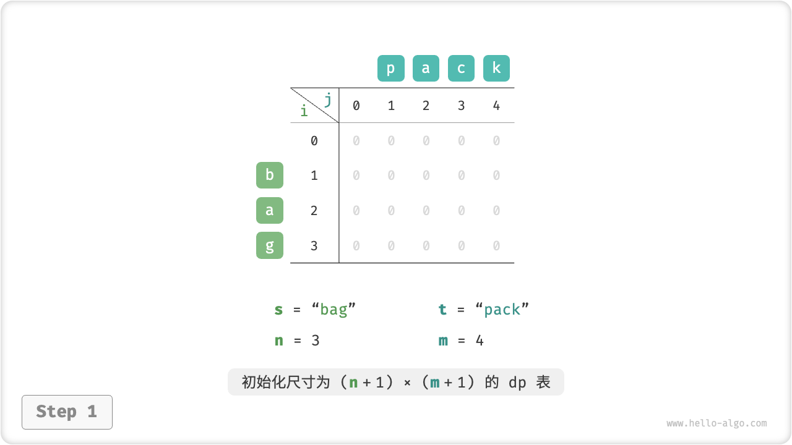

=== "<2>"
    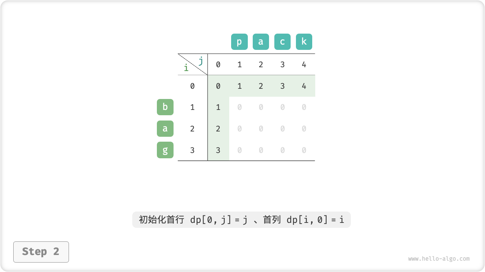

=== "<3>"
    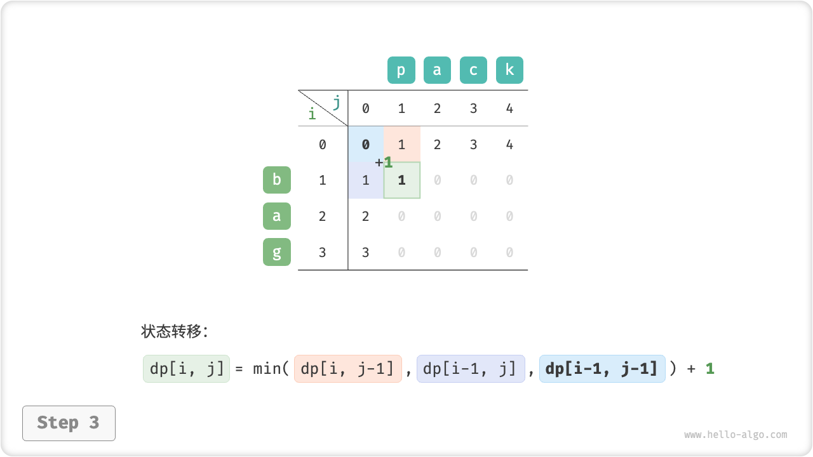

=== "<4>"
    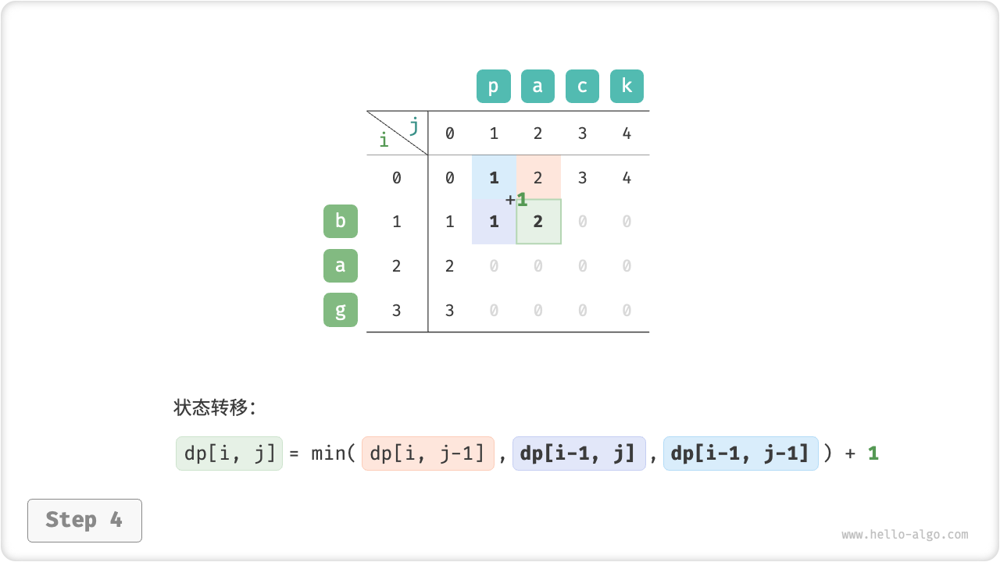

=== "<5>"
    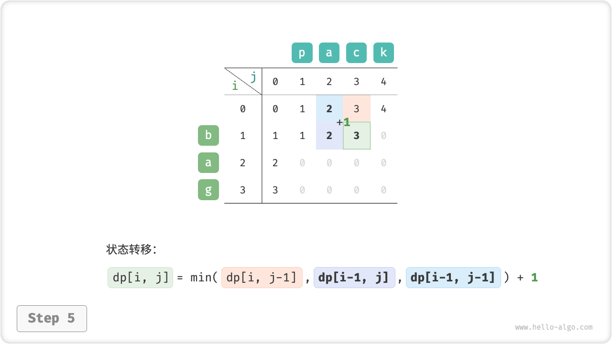

=== "<6>"
    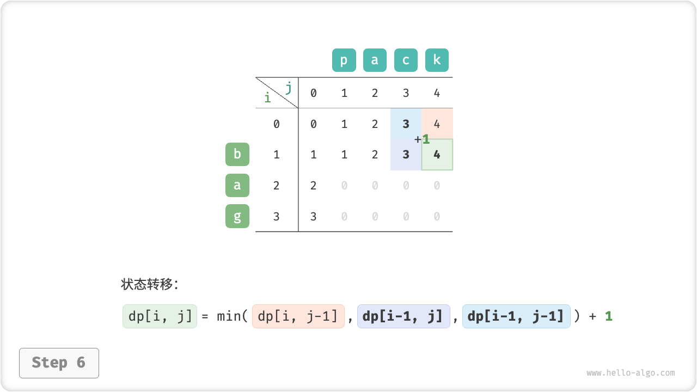

=== "<7>"
    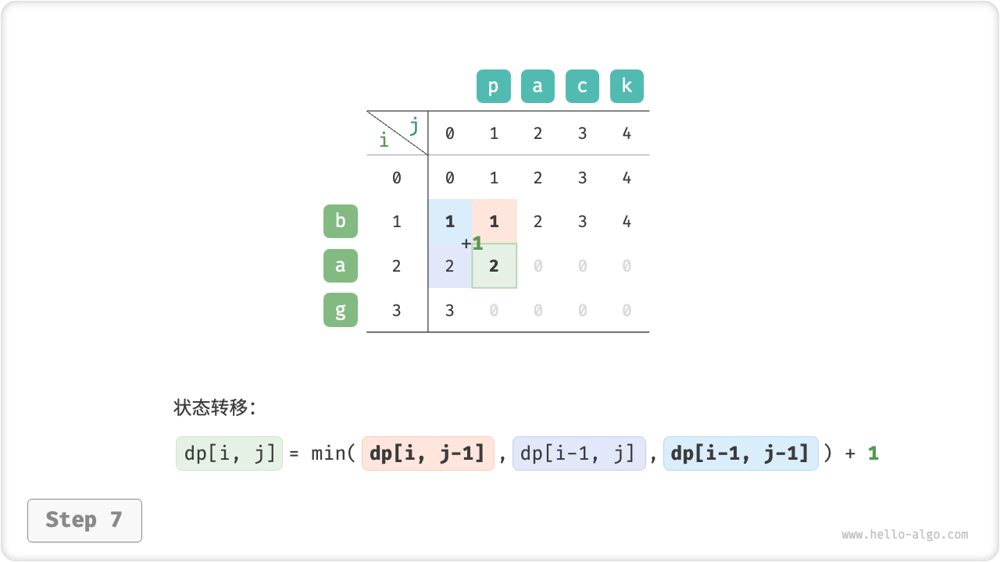

=== "<8>"
    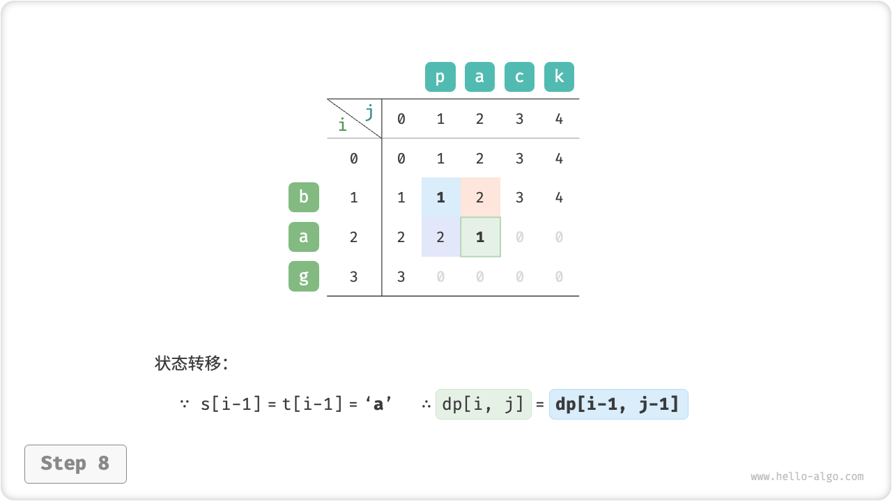

=== "<9>"
    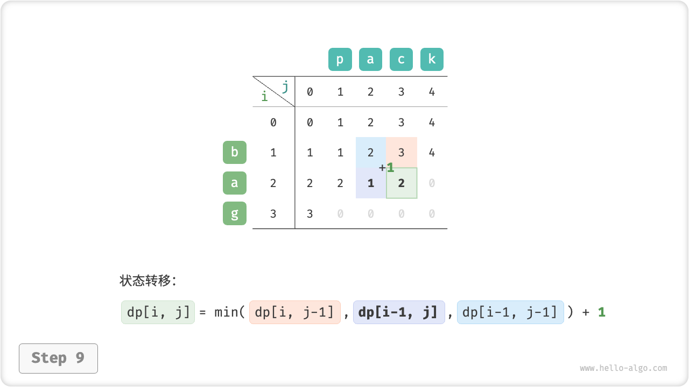

=== "<10>"
    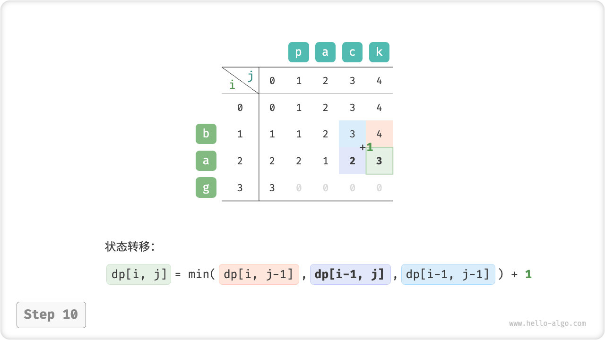

=== "<11>"
    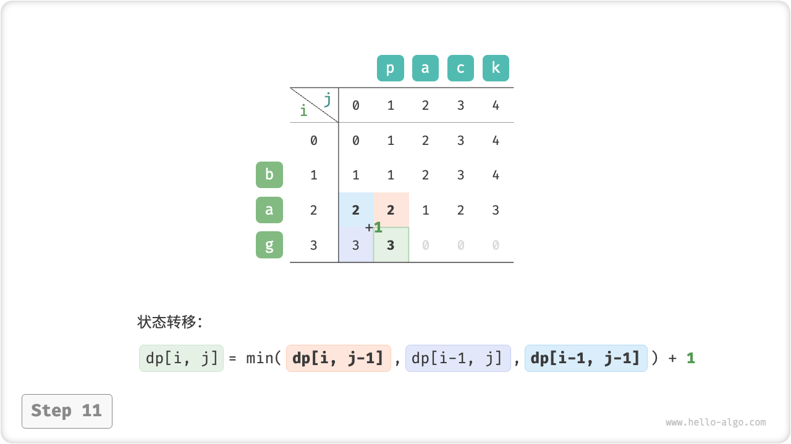

=== "<12>"
    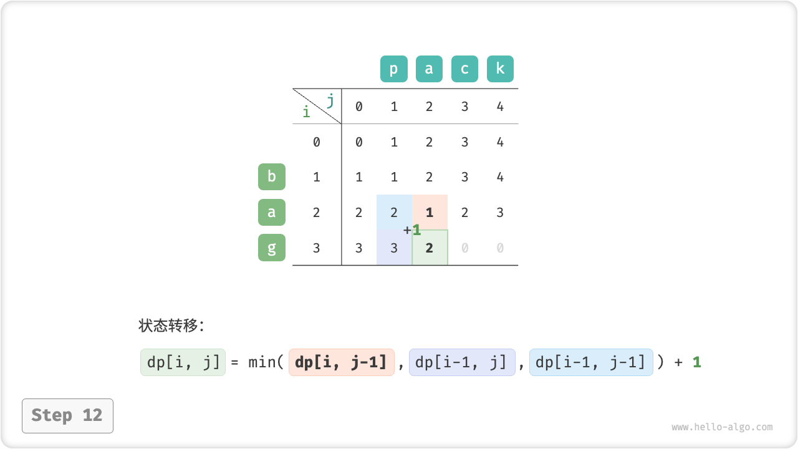

=== "<13>"
    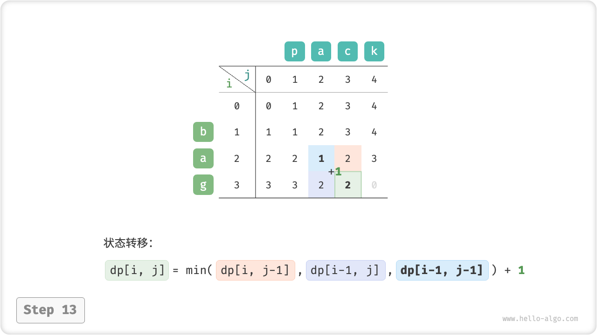

=== "<14>"
    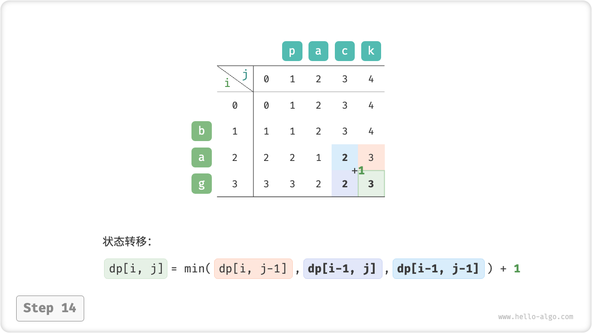

=== "<15>"
    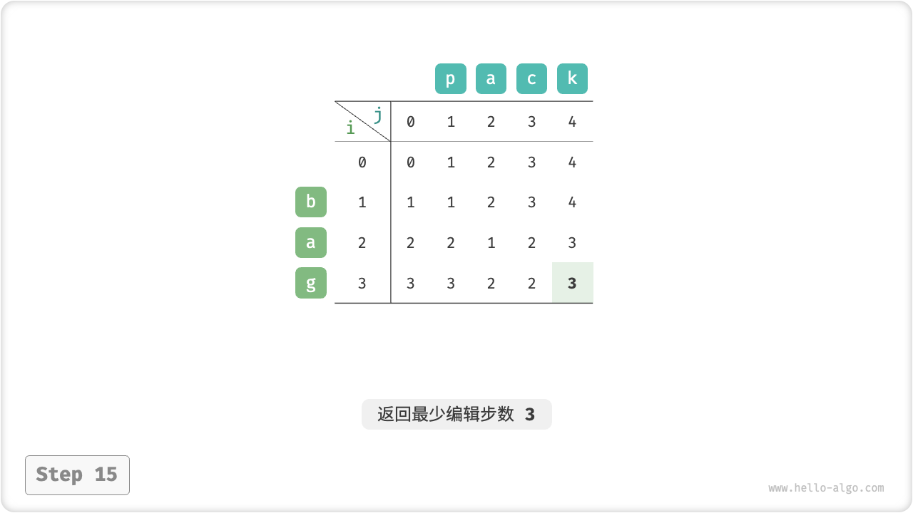

<p align="center"> 图：编辑距离的动态规划过程 </p>

### 3. &nbsp; 状态压缩

由于 $dp[i,j]$ 是由上方 $dp[i-1, j]$ 、左方 $dp[i, j-1]$ 、左上方状态 $dp[i-1, j-1]$ 转移而来，而正序遍历会丢失左上方 $dp[i-1, j-1]$ ，倒序遍历无法提前构建 $dp[i, j-1]$ ，因此两种遍历顺序都不可取。

为此，我们可以使用一个变量 `leftup` 来暂存左上方的解 $dp[i-1, j-1]$ ，从而只需考虑左方和上方的解。此时的情况与完全背包问题相同，可使用正序遍历。

=== "Java"

    ```java title="edit_distance.java"
    /* 编辑距离：状态压缩后的动态规划 */
    int editDistanceDPComp(String s, String t) {
        int n = s.length(), m = t.length();
        int[] dp = new int[m + 1];
        // 状态转移：首行
        for (int j = 1; j <= m; j++) {
            dp[j] = j;
        }
        // 状态转移：其余行
        for (int i = 1; i <= n; i++) {
            // 状态转移：首列
            int leftup = dp[0]; // 暂存 dp[i-1, j-1]
            dp[0] = i;
            // 状态转移：其余列
            for (int j = 1; j <= m; j++) {
                int temp = dp[j];
                if (s.charAt(i - 1) == t.charAt(j - 1)) {
                    // 若两字符相等，则直接跳过此两字符
                    dp[j] = leftup;
                } else {
                    // 最少编辑步数 = 插入、删除、替换这三种操作的最少编辑步数 + 1
                    dp[j] = Math.min(Math.min(dp[j - 1], dp[j]), leftup) + 1;
                }
                leftup = temp; // 更新为下一轮的 dp[i-1, j-1]
            }
        }
        return dp[m];
    }
    ```

=== "C++"

    ```cpp title="edit_distance.cpp"
    /* 编辑距离：状态压缩后的动态规划 */
    int editDistanceDPComp(string s, string t) {
        int n = s.length(), m = t.length();
        vector<int> dp(m + 1, 0);
        // 状态转移：首行
        for (int j = 1; j <= m; j++) {
            dp[j] = j;
        }
        // 状态转移：其余行
        for (int i = 1; i <= n; i++) {
            // 状态转移：首列
            int leftup = dp[0]; // 暂存 dp[i-1, j-1]
            dp[0] = i;
            // 状态转移：其余列
            for (int j = 1; j <= m; j++) {
                int temp = dp[j];
                if (s[i - 1] == t[j - 1]) {
                    // 若两字符相等，则直接跳过此两字符
                    dp[j] = leftup;
                } else {
                    // 最少编辑步数 = 插入、删除、替换这三种操作的最少编辑步数 + 1
                    dp[j] = min(min(dp[j - 1], dp[j]), leftup) + 1;
                }
                leftup = temp; // 更新为下一轮的 dp[i-1, j-1]
            }
        }
        return dp[m];
    }
    ```

=== "Python"

    ```python title="edit_distance.py"
    def edit_distance_dp_comp(s: str, t: str) -> int:
        """编辑距离：状态压缩后的动态规划"""
        n, m = len(s), len(t)
        dp = [0] * (m + 1)
        # 状态转移：首行
        for j in range(1, m + 1):
            dp[j] = j
        # 状态转移：其余行
        for i in range(1, n + 1):
            # 状态转移：首列
            leftup = dp[0]  # 暂存 dp[i-1, j-1]
            dp[0] += 1
            # 状态转移：其余列
            for j in range(1, m + 1):
                temp = dp[j]
                if s[i - 1] == t[j - 1]:
                    # 若两字符相等，则直接跳过此两字符
                    dp[j] = leftup
                else:
                    # 最少编辑步数 = 插入、删除、替换这三种操作的最少编辑步数 + 1
                    dp[j] = min(dp[j - 1], dp[j], leftup) + 1
                leftup = temp  # 更新为下一轮的 dp[i-1, j-1]
        return dp[m]
    ```

=== "Go"

    ```go title="edit_distance.go"
    /* 编辑距离：状态压缩后的动态规划 */
    func editDistanceDPComp(s string, t string) int {
        n := len(s)
        m := len(t)
        dp := make([]int, m+1)
        // 状态转移：首行
        for j := 1; j <= m; j++ {
            dp[j] = j
        }
        // 状态转移：其余行
        for i := 1; i <= n; i++ {
            // 状态转移：首列
            leftUp := dp[0] // 暂存 dp[i-1, j-1]
            dp[0] = i
            // 状态转移：其余列
            for j := 1; j <= m; j++ {
                temp := dp[j]
                if s[i-1] == t[j-1] {
                    // 若两字符相等，则直接跳过此两字符
                    dp[j] = leftUp
                } else {
                    // 最少编辑步数 = 插入、删除、替换这三种操作的最少编辑步数 + 1
                    dp[j] = MinInt(MinInt(dp[j-1], dp[j]), leftUp) + 1
                }
                leftUp = temp // 更新为下一轮的 dp[i-1, j-1]
            }
        }
        return dp[m]
    }
    ```

=== "JS"

    ```javascript title="edit_distance.js"
    [class]{}-[func]{editDistanceDPComp}
    ```

=== "TS"

    ```typescript title="edit_distance.ts"
    [class]{}-[func]{editDistanceDPComp}
    ```

=== "C"

    ```c title="edit_distance.c"
    [class]{}-[func]{editDistanceDPComp}
    ```

=== "C#"

    ```csharp title="edit_distance.cs"
    /* 编辑距离：状态压缩后的动态规划 */
    int editDistanceDPComp(string s, string t) {
        int n = s.Length, m = t.Length;
        int[] dp = new int[m + 1];
        // 状态转移：首行
        for (int j = 1; j <= m; j++) {
            dp[j] = j;
        }
        // 状态转移：其余行
        for (int i = 1; i <= n; i++) {
            // 状态转移：首列
            int leftup = dp[0]; // 暂存 dp[i-1, j-1]
            dp[0] = i;
            // 状态转移：其余列
            for (int j = 1; j <= m; j++) {
                int temp = dp[j];
                if (s[i - 1] == t[j - 1]) {
                    // 若两字符相等，则直接跳过此两字符
                    dp[j] = leftup;
                } else {
                    // 最少编辑步数 = 插入、删除、替换这三种操作的最少编辑步数 + 1
                    dp[j] = Math.Min(Math.Min(dp[j - 1], dp[j]), leftup) + 1;
                }
                leftup = temp; // 更新为下一轮的 dp[i-1, j-1]
            }
        }
        return dp[m];
    }
    ```

=== "Swift"

    ```swift title="edit_distance.swift"
    /* 编辑距离：状态压缩后的动态规划 */
    func editDistanceDPComp(s: String, t: String) -> Int {
        let n = s.utf8CString.count
        let m = t.utf8CString.count
        var dp = Array(repeating: 0, count: m + 1)
        // 状态转移：首行
        for j in stride(from: 1, through: m, by: 1) {
            dp[j] = j
        }
        // 状态转移：其余行
        for i in stride(from: 1, through: n, by: 1) {
            // 状态转移：首列
            var leftup = dp[0] // 暂存 dp[i-1, j-1]
            dp[0] = i
            // 状态转移：其余列
            for j in stride(from: 1, through: m, by: 1) {
                let temp = dp[j]
                if s.utf8CString[i - 1] == t.utf8CString[j - 1] {
                    // 若两字符相等，则直接跳过此两字符
                    dp[j] = leftup
                } else {
                    // 最少编辑步数 = 插入、删除、替换这三种操作的最少编辑步数 + 1
                    dp[j] = min(min(dp[j - 1], dp[j]), leftup) + 1
                }
                leftup = temp // 更新为下一轮的 dp[i-1, j-1]
            }
        }
        return dp[m]
    }
    ```

=== "Zig"

    ```zig title="edit_distance.zig"
    // 编辑距离：状态压缩后的动态规划
    fn editDistanceDPComp(comptime s: []const u8, comptime t: []const u8) i32 {
        comptime var n = s.len;
        comptime var m = t.len;
        var dp = [_]i32{0} ** (m + 1);
        // 状态转移：首行
        for (1..m + 1) |j| {
            dp[j] = @intCast(j);
        }
        // 状态转移：其余行
        for (1..n + 1) |i| {
            // 状态转移：首列
            var leftup = dp[0]; // 暂存 dp[i-1, j-1]
            dp[0] = @intCast(i);
            // 状态转移：其余列
            for (1..m + 1) |j| {
                var temp = dp[j];
                if (s[i - 1] == t[j - 1]) {
                    // 若两字符相等，则直接跳过此两字符
                    dp[j] = leftup;
                } else {
                    // 最少编辑步数 = 插入、删除、替换这三种操作的最少编辑步数 + 1
                    dp[j] = @min(@min(dp[j - 1], dp[j]), leftup) + 1;
                }
                leftup = temp; // 更新为下一轮的 dp[i-1, j-1]
            }
        }
        return dp[m];
    }
    ```

=== "Dart"

    ```dart title="edit_distance.dart"
    /* 编辑距离：状态压缩后的动态规划 */
    int editDistanceDPComp(String s, String t) {
      int n = s.length, m = t.length;
      List<int> dp = List.filled(m + 1, 0);
      // 状态转移：首行
      for (int j = 1; j <= m; j++) {
        dp[j] = j;
      }
      // 状态转移：其余行
      for (int i = 1; i <= n; i++) {
        // 状态转移：首列
        int leftup = dp[0]; // 暂存 dp[i-1, j-1]
        dp[0] = i;
        // 状态转移：其余列
        for (int j = 1; j <= m; j++) {
          int temp = dp[j];
          if (s[i - 1] == t[j - 1]) {
            // 若两字符相等，则直接跳过此两字符
            dp[j] = leftup;
          } else {
            // 最少编辑步数 = 插入、删除、替换这三种操作的最少编辑步数 + 1
            dp[j] = min(min(dp[j - 1], dp[j]), leftup) + 1;
          }
          leftup = temp; // 更新为下一轮的 dp[i-1, j-1]
        }
      }
      return dp[m];
    }
    ```

=== "Rust"

    ```rust title="edit_distance.rs"
    /* 编辑距离：状态压缩后的动态规划 */
    fn edit_distance_dp_comp(s: &str, t: &str) -> i32 {
        let (n, m) = (s.len(), t.len());
        let mut dp = vec![0; m + 1];
        // 状态转移：首行
        for j in 1..m {
            dp[j] = j as i32;
        }
        // 状态转移：其余行
        for i in 1..=n {
            // 状态转移：首列
            let mut leftup = dp[0]; // 暂存 dp[i-1, j-1]
            dp[0] = i as i32;
            // 状态转移：其余列
            for j in 1..=m {
                let temp = dp[j];
                if s.chars().nth(i - 1) == t.chars().nth(j - 1) {
                    // 若两字符相等，则直接跳过此两字符
                    dp[j] = leftup;
                } else {
                    // 最少编辑步数 = 插入、删除、替换这三种操作的最少编辑步数 + 1
                    dp[j] = std::cmp::min(std::cmp::min(dp[j - 1], dp[j]), leftup) + 1;
                }
                leftup = temp; // 更新为下一轮的 dp[i-1, j-1]
            }
        }
        dp[m]
    }
    ```
