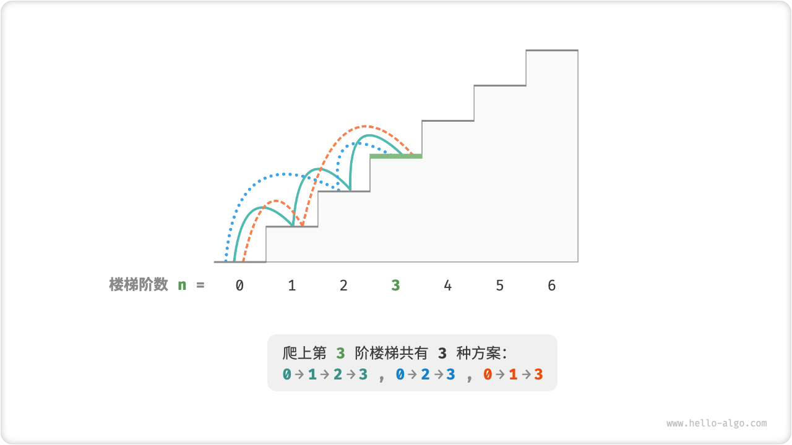
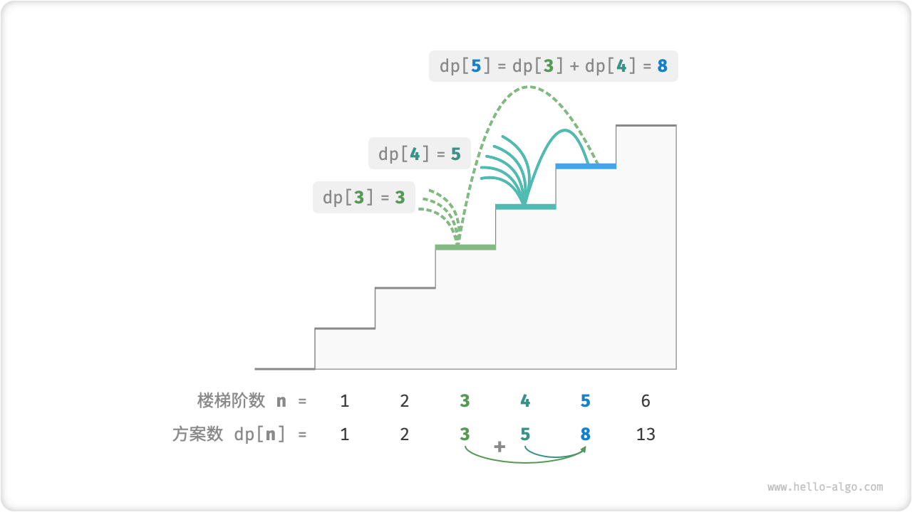
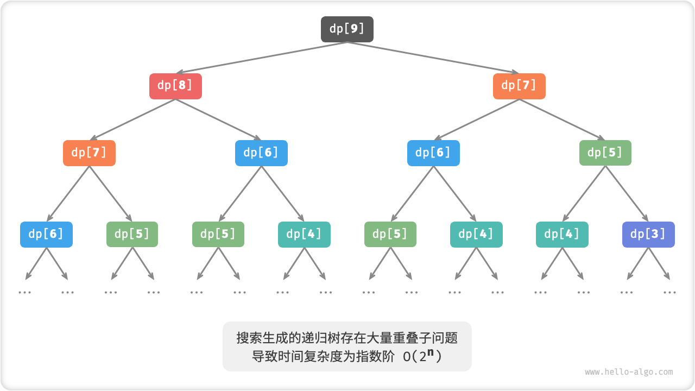
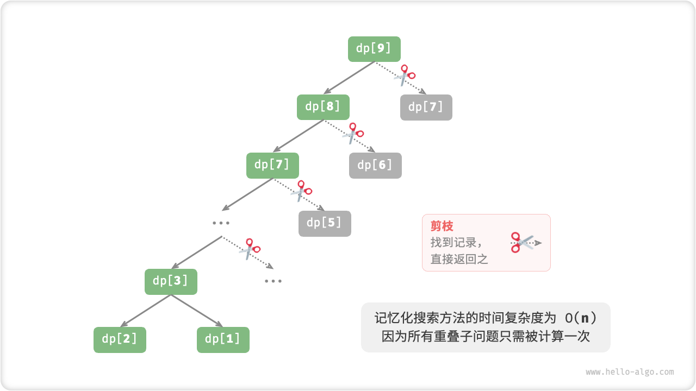
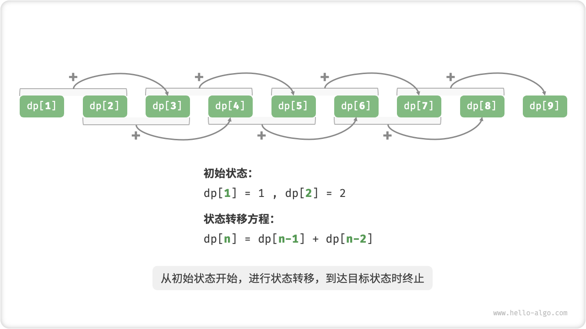

# 14.1 &nbsp; 初探动态规划

「动态规划 Dynamic Programming」是一个重要的算法范式，它将一个问题分解为一系列更小的子问题，并通过存储子问题的解来避免重复计算，从而大幅提升时间效率。

在本节中，我们从一个经典例题入手，先给出它的暴力回溯解法，观察其中包含的重叠子问题，再逐步导出更高效的动态规划解法。

!!! question "爬楼梯"

    给定一个共有 $n$ 阶的楼梯，你每步可以上 $1$ 阶或者 $2$ 阶，请问有多少种方案可以爬到楼顶。

如下图所示，对于一个 $3$ 阶楼梯，共有 $3$ 种方案可以爬到楼顶。



<p align="center"> 图：爬到第 3 阶的方案数量 </p>

本题的目标是求解方案数量，**我们可以考虑通过回溯来穷举所有可能性**。具体来说，将爬楼梯想象为一个多轮选择的过程：从地面出发，每轮选择上 $1$ 阶或 $2$ 阶，每当到达楼梯顶部时就将方案数量加 $1$ ，当越过楼梯顶部时就将其剪枝。

=== "Java"

    ```java title="climbing_stairs_backtrack.java"
    /* 回溯 */
    void backtrack(List<Integer> choices, int state, int n, List<Integer> res) {
        // 当爬到第 n 阶时，方案数量加 1
        if (state == n)
            res.set(0, res.get(0) + 1);
        // 遍历所有选择
        for (Integer choice : choices) {
            // 剪枝：不允许越过第 n 阶
            if (state + choice > n)
                break;
            // 尝试：做出选择，更新状态
            backtrack(choices, state + choice, n, res);
            // 回退
        }
    }

    /* 爬楼梯：回溯 */
    int climbingStairsBacktrack(int n) {
        List<Integer> choices = Arrays.asList(1, 2); // 可选择向上爬 1 或 2 阶
        int state = 0; // 从第 0 阶开始爬
        List<Integer> res = new ArrayList<>();
        res.add(0); // 使用 res[0] 记录方案数量
        backtrack(choices, state, n, res);
        return res.get(0);
    }
    ```

=== "C++"

    ```cpp title="climbing_stairs_backtrack.cpp"
    /* 回溯 */
    void backtrack(vector<int> &choices, int state, int n, vector<int> &res) {
        // 当爬到第 n 阶时，方案数量加 1
        if (state == n)
            res[0]++;
        // 遍历所有选择
        for (auto &choice : choices) {
            // 剪枝：不允许越过第 n 阶
            if (state + choice > n)
                break;
            // 尝试：做出选择，更新状态
            backtrack(choices, state + choice, n, res);
            // 回退
        }
    }

    /* 爬楼梯：回溯 */
    int climbingStairsBacktrack(int n) {
        vector<int> choices = {1, 2}; // 可选择向上爬 1 或 2 阶
        int state = 0;                // 从第 0 阶开始爬
        vector<int> res = {0};        // 使用 res[0] 记录方案数量
        backtrack(choices, state, n, res);
        return res[0];
    }
    ```

=== "Python"

    ```python title="climbing_stairs_backtrack.py"
    def backtrack(choices: list[int], state: int, n: int, res: list[int]) -> int:
        """回溯"""
        # 当爬到第 n 阶时，方案数量加 1
        if state == n:
            res[0] += 1
        # 遍历所有选择
        for choice in choices:
            # 剪枝：不允许越过第 n 阶
            if state + choice > n:
                break
            # 尝试：做出选择，更新状态
            backtrack(choices, state + choice, n, res)
            # 回退

    def climbing_stairs_backtrack(n: int) -> int:
        """爬楼梯：回溯"""
        choices = [1, 2]  # 可选择向上爬 1 或 2 阶
        state = 0  # 从第 0 阶开始爬
        res = [0]  # 使用 res[0] 记录方案数量
        backtrack(choices, state, n, res)
        return res[0]
    ```

=== "Go"

    ```go title="climbing_stairs_backtrack.go"
    /* 回溯 */
    func backtrack(choices []int, state, n int, res []int) {
        // 当爬到第 n 阶时，方案数量加 1
        if state == n {
            res[0] = res[0] + 1
        }
        // 遍历所有选择
        for _, choice := range choices {
            // 剪枝：不允许越过第 n 阶
            if state+choice > n {
                break
            }
            // 尝试：做出选择，更新状态
            backtrack(choices, state+choice, n, res)
            // 回退
        }
    }

    /* 爬楼梯：回溯 */
    func climbingStairsBacktrack(n int) int {
        // 可选择向上爬 1 或 2 阶
        choices := []int{1, 2}
        // 从第 0 阶开始爬
        state := 0
        res := make([]int, 1)
        // 使用 res[0] 记录方案数量
        res[0] = 0
        backtrack(choices, state, n, res)
        return res[0]
    }
    ```

=== "JS"

    ```javascript title="climbing_stairs_backtrack.js"
    /* 回溯 */
    function backtrack(choices, state, n, res) {
        // 当爬到第 n 阶时，方案数量加 1
        if (state === n) res.set(0, res.get(0) + 1);
        // 遍历所有选择
        for (const choice of choices) {
            // 剪枝：不允许越过第 n 阶
            if (state + choice > n) break;
            // 尝试：做出选择，更新状态
            backtrack(choices, state + choice, n, res);
            // 回退
        }
    }

    /* 爬楼梯：回溯 */
    function climbingStairsBacktrack(n) {
        const choices = [1, 2]; // 可选择向上爬 1 或 2 阶
        const state = 0; // 从第 0 阶开始爬
        const res = new Map();
        res.set(0, 0); // 使用 res[0] 记录方案数量
        backtrack(choices, state, n, res);
        return res.get(0);
    }
    ```

=== "TS"

    ```typescript title="climbing_stairs_backtrack.ts"
    /* 回溯 */
    function backtrack(
        choices: number[],
        state: number,
        n: number,
        res: Map<0, any>
    ): void {
        // 当爬到第 n 阶时，方案数量加 1
        if (state === n) res.set(0, res.get(0) + 1);
        // 遍历所有选择
        for (const choice of choices) {
            // 剪枝：不允许越过第 n 阶
            if (state + choice > n) break;
            // 尝试：做出选择，更新状态
            backtrack(choices, state + choice, n, res);
            // 回退
        }
    }

    /* 爬楼梯：回溯 */
    function climbingStairsBacktrack(n: number): number {
        const choices = [1, 2]; // 可选择向上爬 1 或 2 阶
        const state = 0; // 从第 0 阶开始爬
        const res = new Map();
        res.set(0, 0); // 使用 res[0] 记录方案数量
        backtrack(choices, state, n, res);
        return res.get(0);
    }
    ```

=== "C"

    ```c title="climbing_stairs_backtrack.c"
    [class]{}-[func]{backtrack}

    [class]{}-[func]{climbingStairsBacktrack}
    ```

=== "C#"

    ```csharp title="climbing_stairs_backtrack.cs"
    /* 回溯 */
    void backtrack(List<int> choices, int state, int n, List<int> res) {
        // 当爬到第 n 阶时，方案数量加 1
        if (state == n)
            res[0]++;
        // 遍历所有选择
        foreach (int choice in choices) {
            // 剪枝：不允许越过第 n 阶
            if (state + choice > n)
                break;
            // 尝试：做出选择，更新状态
            backtrack(choices, state + choice, n, res);
            // 回退
        }
    }

    /* 爬楼梯：回溯 */
    int climbingStairsBacktrack(int n) {
        List<int> choices = new List<int> { 1, 2 }; // 可选择向上爬 1 或 2 阶
        int state = 0; // 从第 0 阶开始爬
        List<int> res = new List<int> { 0 }; // 使用 res[0] 记录方案数量
        backtrack(choices, state, n, res);
        return res[0];
    }
    ```

=== "Swift"

    ```swift title="climbing_stairs_backtrack.swift"
    /* 回溯 */
    func backtrack(choices: [Int], state: Int, n: Int, res: inout [Int]) {
        // 当爬到第 n 阶时，方案数量加 1
        if state == n {
            res[0] += 1
        }
        // 遍历所有选择
        for choice in choices {
            // 剪枝：不允许越过第 n 阶
            if state + choice > n {
                break
            }
            backtrack(choices: choices, state: state + choice, n: n, res: &res)
        }
    }

    /* 爬楼梯：回溯 */
    func climbingStairsBacktrack(n: Int) -> Int {
        let choices = [1, 2] // 可选择向上爬 1 或 2 阶
        let state = 0 // 从第 0 阶开始爬
        var res: [Int] = []
        res.append(0) // 使用 res[0] 记录方案数量
        backtrack(choices: choices, state: state, n: n, res: &res)
        return res[0]
    }
    ```

=== "Zig"

    ```zig title="climbing_stairs_backtrack.zig"
    // 回溯
    fn backtrack(choices: []i32, state: i32, n: i32, res: std.ArrayList(i32)) void {
        // 当爬到第 n 阶时，方案数量加 1
        if (state == n) {
            res.items[0] = res.items[0] + 1;
        }
        // 遍历所有选择
        for (choices) |choice| {
            // 剪枝：不允许越过第 n 阶
            if (state + choice > n) {
                break;
            }
            // 尝试：做出选择，更新状态
            backtrack(choices, state + choice, n, res);
            // 回退
        }
    }

    // 爬楼梯：回溯
    fn climbingStairsBacktrack(n: usize) !i32 {
        var choices = [_]i32{ 1, 2 }; // 可选择向上爬 1 或 2 阶
        var state: i32 = 0; // 从第 0 阶开始爬
        var res = std.ArrayList(i32).init(std.heap.page_allocator);
        defer res.deinit();
        try res.append(0); // 使用 res[0] 记录方案数量
        backtrack(&choices, state, @intCast(n), res);
        return res.items[0];
    }
    ```

=== "Dart"

    ```dart title="climbing_stairs_backtrack.dart"
    /* 回溯 */
    void backtrack(List<int> choices, int state, int n, List<int> res) {
      // 当爬到第 n 阶时，方案数量加 1
      if (state == n) {
        res[0]++;
      }
      // 遍历所有选择
      for (int choice in choices) {
        // 剪枝：不允许越过第 n 阶
        if (state + choice > n) break;
        // 尝试：做出选择，更新状态
        backtrack(choices, state + choice, n, res);
        // 回退
      }
    }

    /* 爬楼梯：回溯 */
    int climbingStairsBacktrack(int n) {
      List<int> choices = [1, 2]; // 可选择向上爬 1 或 2 阶
      int state = 0; // 从第 0 阶开始爬
      List<int> res = [];
      res.add(0); // 使用 res[0] 记录方案数量
      backtrack(choices, state, n, res);
      return res[0];
    }
    ```

=== "Rust"

    ```rust title="climbing_stairs_backtrack.rs"
    /* 回溯 */
    fn backtrack(choices: &[i32], state: i32, n: i32, res: &mut [i32]) {
        // 当爬到第 n 阶时，方案数量加 1
        if state == n { res[0] = res[0] + 1; }
        // 遍历所有选择
        for &choice in choices {
            // 剪枝：不允许越过第 n 阶
            if state + choice > n { break; }
            // 尝试：做出选择，更新状态
            backtrack(choices, state + choice, n, res);
            // 回退
        }
    }

    /* 爬楼梯：回溯 */
    fn climbing_stairs_backtrack(n: usize) -> i32 {
        let choices = vec![ 1, 2 ]; // 可选择向上爬 1 或 2 阶
        let state = 0; // 从第 0 阶开始爬
        let mut res = Vec::new();
        res.push(0); // 使用 res[0] 记录方案数量
        backtrack(&choices, state, n as i32, &mut res);
        res[0]
    }
    ```

## 14.1.1 &nbsp; 方法一：暴力搜索

回溯算法通常并不显式地对问题进行拆解，而是将问题看作一系列决策步骤，通过试探和剪枝，搜索所有可能的解。

我们可以尝试从问题分解的角度分析这道题。设爬到第 $i$ 阶共有 $dp[i]$ 种方案，那么 $dp[i]$ 就是原问题，其子问题包括:

$$
dp[i-1] , dp[i-2] , \cdots , dp[2] , dp[1]
$$

由于每轮只能上 $1$ 阶或 $2$ 阶，因此当我们站在第 $i$ 阶楼梯上时，上一轮只可能站在第 $i - 1$ 阶或第 $i - 2$ 阶上。换句话说，我们只能从第 $i -1$ 阶或第 $i - 2$ 阶前往第 $i$ 阶。

由此便可得出一个重要推论：**爬到第 $i - 1$ 阶的方案数加上爬到第 $i - 2$ 阶的方案数就等于爬到第 $i$ 阶的方案数**。公式如下：

$$
dp[i] = dp[i-1] + dp[i-2]
$$

这意味着在爬楼梯问题中，各个子问题之间存在递推关系，**原问题的解可以由子问题的解构建得来**。



<p align="center"> 图：方案数量递推关系 </p>

我们可以根据递推公式得到暴力搜索解法：

- 以 $dp[n]$ 为起始点，**递归地将一个较大问题拆解为两个较小问题的和**，直至到达最小子问题 $dp[1]$ 和 $dp[2]$ 时返回。
- 最小子问题的解 $dp[1] = 1$ , $dp[2] = 2$ 是已知的，代表爬到第 $1$ , $2$ 阶分别有 $1$ , $2$ 种方案。

观察以下代码，它和标准回溯代码都属于深度优先搜索，但更加简洁。

=== "Java"

    ```java title="climbing_stairs_dfs.java"
    /* 搜索 */
    int dfs(int i) {
        // 已知 dp[1] 和 dp[2] ，返回之
        if (i == 1 || i == 2)
            return i;
        // dp[i] = dp[i-1] + dp[i-2]
        int count = dfs(i - 1) + dfs(i - 2);
        return count;
    }

    /* 爬楼梯：搜索 */
    int climbingStairsDFS(int n) {
        return dfs(n);
    }
    ```

=== "C++"

    ```cpp title="climbing_stairs_dfs.cpp"
    /* 搜索 */
    int dfs(int i) {
        // 已知 dp[1] 和 dp[2] ，返回之
        if (i == 1 || i == 2)
            return i;
        // dp[i] = dp[i-1] + dp[i-2]
        int count = dfs(i - 1) + dfs(i - 2);
        return count;
    }

    /* 爬楼梯：搜索 */
    int climbingStairsDFS(int n) {
        return dfs(n);
    }
    ```

=== "Python"

    ```python title="climbing_stairs_dfs.py"
    def dfs(i: int) -> int:
        """搜索"""
        # 已知 dp[1] 和 dp[2] ，返回之
        if i == 1 or i == 2:
            return i
        # dp[i] = dp[i-1] + dp[i-2]
        count = dfs(i - 1) + dfs(i - 2)
        return count

    def climbing_stairs_dfs(n: int) -> int:
        """爬楼梯：搜索"""
        return dfs(n)
    ```

=== "Go"

    ```go title="climbing_stairs_dfs.go"
    /* 搜索 */
    func dfs(i int) int {
        // 已知 dp[1] 和 dp[2] ，返回之
        if i == 1 || i == 2 {
            return i
        }
        // dp[i] = dp[i-1] + dp[i-2]
        count := dfs(i-1) + dfs(i-2)
        return count
    }

    /* 爬楼梯：搜索 */
    func climbingStairsDFS(n int) int {
        return dfs(n)
    }
    ```

=== "JS"

    ```javascript title="climbing_stairs_dfs.js"
    /* 搜索 */
    function dfs(i) {
        // 已知 dp[1] 和 dp[2] ，返回之
        if (i === 1 || i === 2) return i;
        // dp[i] = dp[i-1] + dp[i-2]
        const count = dfs(i - 1) + dfs(i - 2);
        return count;
    }

    /* 爬楼梯：搜索 */
    function climbingStairsDFS(n) {
        return dfs(n);
    }
    ```

=== "TS"

    ```typescript title="climbing_stairs_dfs.ts"
    /* 搜索 */
    function dfs(i: number): number {
        // 已知 dp[1] 和 dp[2] ，返回之
        if (i === 1 || i === 2) return i;
        // dp[i] = dp[i-1] + dp[i-2]
        const count = dfs(i - 1) + dfs(i - 2);
        return count;
    }

    /* 爬楼梯：搜索 */
    function climbingStairsDFS(n: number): number {
        return dfs(n);
    }
    ```

=== "C"

    ```c title="climbing_stairs_dfs.c"
    [class]{}-[func]{dfs}

    [class]{}-[func]{climbingStairsDFS}
    ```

=== "C#"

    ```csharp title="climbing_stairs_dfs.cs"
    /* 搜索 */
    int dfs(int i) {
        // 已知 dp[1] 和 dp[2] ，返回之
        if (i == 1 || i == 2)
            return i;
        // dp[i] = dp[i-1] + dp[i-2]
        int count = dfs(i - 1) + dfs(i - 2);
        return count;
    }

    /* 爬楼梯：搜索 */
    int climbingStairsDFS(int n) {
        return dfs(n);
    }
    ```

=== "Swift"

    ```swift title="climbing_stairs_dfs.swift"
    /* 搜索 */
    func dfs(i: Int) -> Int {
        // 已知 dp[1] 和 dp[2] ，返回之
        if i == 1 || i == 2 {
            return i
        }
        // dp[i] = dp[i-1] + dp[i-2]
        let count = dfs(i: i - 1) + dfs(i: i - 2)
        return count
    }

    /* 爬楼梯：搜索 */
    func climbingStairsDFS(n: Int) -> Int {
        dfs(i: n)
    }
    ```

=== "Zig"

    ```zig title="climbing_stairs_dfs.zig"
    // 搜索
    fn dfs(i: usize) i32 {
        // 已知 dp[1] 和 dp[2] ，返回之
        if (i == 1 or i == 2) {
            return @intCast(i);
        }
        // dp[i] = dp[i-1] + dp[i-2]
        var count = dfs(i - 1) + dfs(i - 2);
        return count;
    }

    // 爬楼梯：搜索
    fn climbingStairsDFS(comptime n: usize) i32 {
        return dfs(n);
    }
    ```

=== "Dart"

    ```dart title="climbing_stairs_dfs.dart"
    /* 搜索 */
    int dfs(int i) {
      // 已知 dp[1] 和 dp[2] ，返回之
      if (i == 1 || i == 2) return i;
      // dp[i] = dp[i-1] + dp[i-2]
      int count = dfs(i - 1) + dfs(i - 2);
      return count;
    }

    /* 爬楼梯：搜索 */
    int climbingStairsDFS(int n) {
      return dfs(n);
    }
    ```

=== "Rust"

    ```rust title="climbing_stairs_dfs.rs"
    /* 搜索 */
    fn dfs(i: usize) -> i32 {
        // 已知 dp[1] 和 dp[2] ，返回之
        if i == 1 || i == 2 { return i as i32; }
        // dp[i] = dp[i-1] + dp[i-2]
        let count = dfs(i - 1) + dfs(i - 2);
        count
    }

    /* 爬楼梯：搜索 */
    fn climbing_stairs_dfs(n: usize) -> i32 {
        dfs(n) 
    }
    ```

下图展示了暴力搜索形成的递归树。对于问题 $dp[n]$ ，其递归树的深度为 $n$ ，时间复杂度为 $O(2^n)$ 。指数阶属于爆炸式增长，如果我们输入一个比较大的 $n$ ，则会陷入漫长的等待之中。



<p align="center"> 图：爬楼梯对应递归树 </p>

观察上图发现，**指数阶的时间复杂度是由于「重叠子问题」导致的**。例如：$dp[9]$ 被分解为 $dp[8]$ 和 $dp[7]$ ，$dp[8]$ 被分解为 $dp[7]$ 和 $dp[6]$ ，两者都包含子问题 $dp[7]$ 。

以此类推，子问题中包含更小的重叠子问题，子子孙孙无穷尽也。绝大部分计算资源都浪费在这些重叠的问题上。

## 14.1.2 &nbsp; 方法二：记忆化搜索

为了提升算法效率，**我们希望所有的重叠子问题都只被计算一次**。为此，我们声明一个数组 `mem` 来记录每个子问题的解，并在搜索过程中这样做：

1. 当首次计算 $dp[i]$ 时，我们将其记录至 `mem[i]` ，以便之后使用。
2. 当再次需要计算 $dp[i]$ 时，我们便可直接从 `mem[i]` 中获取结果，从而将重叠子问题剪枝。

=== "Java"

    ```java title="climbing_stairs_dfs_mem.java"
    /* 记忆化搜索 */
    int dfs(int i, int[] mem) {
        // 已知 dp[1] 和 dp[2] ，返回之
        if (i == 1 || i == 2)
            return i;
        // 若存在记录 dp[i] ，则直接返回之
        if (mem[i] != -1)
            return mem[i];
        // dp[i] = dp[i-1] + dp[i-2]
        int count = dfs(i - 1, mem) + dfs(i - 2, mem);
        // 记录 dp[i]
        mem[i] = count;
        return count;
    }

    /* 爬楼梯：记忆化搜索 */
    int climbingStairsDFSMem(int n) {
        // mem[i] 记录爬到第 i 阶的方案总数，-1 代表无记录
        int[] mem = new int[n + 1];
        Arrays.fill(mem, -1);
        return dfs(n, mem);
    }
    ```

=== "C++"

    ```cpp title="climbing_stairs_dfs_mem.cpp"
    /* 记忆化搜索 */
    int dfs(int i, vector<int> &mem) {
        // 已知 dp[1] 和 dp[2] ，返回之
        if (i == 1 || i == 2)
            return i;
        // 若存在记录 dp[i] ，则直接返回之
        if (mem[i] != -1)
            return mem[i];
        // dp[i] = dp[i-1] + dp[i-2]
        int count = dfs(i - 1, mem) + dfs(i - 2, mem);
        // 记录 dp[i]
        mem[i] = count;
        return count;
    }

    /* 爬楼梯：记忆化搜索 */
    int climbingStairsDFSMem(int n) {
        // mem[i] 记录爬到第 i 阶的方案总数，-1 代表无记录
        vector<int> mem(n + 1, -1);
        return dfs(n, mem);
    }
    ```

=== "Python"

    ```python title="climbing_stairs_dfs_mem.py"
    def dfs(i: int, mem: list[int]) -> int:
        """记忆化搜索"""
        # 已知 dp[1] 和 dp[2] ，返回之
        if i == 1 or i == 2:
            return i
        # 若存在记录 dp[i] ，则直接返回之
        if mem[i] != -1:
            return mem[i]
        # dp[i] = dp[i-1] + dp[i-2]
        count = dfs(i - 1, mem) + dfs(i - 2, mem)
        # 记录 dp[i]
        mem[i] = count
        return count

    def climbing_stairs_dfs_mem(n: int) -> int:
        """爬楼梯：记忆化搜索"""
        # mem[i] 记录爬到第 i 阶的方案总数，-1 代表无记录
        mem = [-1] * (n + 1)
        return dfs(n, mem)
    ```

=== "Go"

    ```go title="climbing_stairs_dfs_mem.go"
    /* 记忆化搜索 */
    func dfsMem(i int, mem []int) int {
        // 已知 dp[1] 和 dp[2] ，返回之
        if i == 1 || i == 2 {
            return i
        }
        // 若存在记录 dp[i] ，则直接返回之
        if mem[i] != -1 {
            return mem[i]
        }
        // dp[i] = dp[i-1] + dp[i-2]
        count := dfsMem(i-1, mem) + dfsMem(i-2, mem)
        // 记录 dp[i]
        mem[i] = count
        return count
    }

    /* 爬楼梯：记忆化搜索 */
    func climbingStairsDFSMem(n int) int {
        // mem[i] 记录爬到第 i 阶的方案总数，-1 代表无记录
        mem := make([]int, n+1)
        for i := range mem {
            mem[i] = -1
        }
        return dfsMem(n, mem)
    }
    ```

=== "JS"

    ```javascript title="climbing_stairs_dfs_mem.js"
    /* 记忆化搜索 */
    function dfs(i, mem) {
        // 已知 dp[1] 和 dp[2] ，返回之
        if (i === 1 || i === 2) return i;
        // 若存在记录 dp[i] ，则直接返回之
        if (mem[i] != -1) return mem[i];
        // dp[i] = dp[i-1] + dp[i-2]
        const count = dfs(i - 1, mem) + dfs(i - 2, mem);
        // 记录 dp[i]
        mem[i] = count;
        return count;
    }

    /* 爬楼梯：记忆化搜索 */
    function climbingStairsDFSMem(n) {
        // mem[i] 记录爬到第 i 阶的方案总数，-1 代表无记录
        const mem = new Array(n + 1).fill(-1);
        return dfs(n, mem);
    }
    ```

=== "TS"

    ```typescript title="climbing_stairs_dfs_mem.ts"
    /* 记忆化搜索 */
    function dfs(i: number, mem: number[]): number {
        // 已知 dp[1] 和 dp[2] ，返回之
        if (i === 1 || i === 2) return i;
        // 若存在记录 dp[i] ，则直接返回之
        if (mem[i] != -1) return mem[i];
        // dp[i] = dp[i-1] + dp[i-2]
        const count = dfs(i - 1, mem) + dfs(i - 2, mem);
        // 记录 dp[i]
        mem[i] = count;
        return count;
    }

    /* 爬楼梯：记忆化搜索 */
    function climbingStairsDFSMem(n: number): number {
        // mem[i] 记录爬到第 i 阶的方案总数，-1 代表无记录
        const mem = new Array(n + 1).fill(-1);
        return dfs(n, mem);
    }
    ```

=== "C"

    ```c title="climbing_stairs_dfs_mem.c"
    [class]{}-[func]{dfs}

    [class]{}-[func]{climbingStairsDFSMem}
    ```

=== "C#"

    ```csharp title="climbing_stairs_dfs_mem.cs"
    /* 记忆化搜索 */
    int dfs(int i, int[] mem) {
        // 已知 dp[1] 和 dp[2] ，返回之
        if (i == 1 || i == 2)
            return i;
        // 若存在记录 dp[i] ，则直接返回之
        if (mem[i] != -1)
            return mem[i];
        // dp[i] = dp[i-1] + dp[i-2]
        int count = dfs(i - 1, mem) + dfs(i - 2, mem);
        // 记录 dp[i]
        mem[i] = count;
        return count;
    }

    /* 爬楼梯：记忆化搜索 */
    int climbingStairsDFSMem(int n) {
        // mem[i] 记录爬到第 i 阶的方案总数，-1 代表无记录
        int[] mem = new int[n + 1];
        Array.Fill(mem, -1);
        return dfs(n, mem);
    }
    ```

=== "Swift"

    ```swift title="climbing_stairs_dfs_mem.swift"
    /* 记忆化搜索 */
    func dfs(i: Int, mem: inout [Int]) -> Int {
        // 已知 dp[1] 和 dp[2] ，返回之
        if i == 1 || i == 2 {
            return i
        }
        // 若存在记录 dp[i] ，则直接返回之
        if mem[i] != -1 {
            return mem[i]
        }
        // dp[i] = dp[i-1] + dp[i-2]
        let count = dfs(i: i - 1, mem: &mem) + dfs(i: i - 2, mem: &mem)
        // 记录 dp[i]
        mem[i] = count
        return count
    }

    /* 爬楼梯：记忆化搜索 */
    func climbingStairsDFSMem(n: Int) -> Int {
        // mem[i] 记录爬到第 i 阶的方案总数，-1 代表无记录
        var mem = Array(repeating: -1, count: n + 1)
        return dfs(i: n, mem: &mem)
    }
    ```

=== "Zig"

    ```zig title="climbing_stairs_dfs_mem.zig"
    // 记忆化搜索
    fn dfs(i: usize, mem: []i32) i32 {
        // 已知 dp[1] 和 dp[2] ，返回之
        if (i == 1 or i == 2) {
            return @intCast(i);
        }
        // 若存在记录 dp[i] ，则直接返回之
        if (mem[i] != -1) {
            return mem[i];
        }
        // dp[i] = dp[i-1] + dp[i-2]
        var count = dfs(i - 1, mem) + dfs(i - 2, mem);
        // 记录 dp[i]
        mem[i] = count;
        return count;
    }

    // 爬楼梯：记忆化搜索
    fn climbingStairsDFSMem(comptime n: usize) i32 {
        // mem[i] 记录爬到第 i 阶的方案总数，-1 代表无记录
        var mem = [_]i32{ -1 } ** (n + 1);
        return dfs(n, &mem);
    }
    ```

=== "Dart"

    ```dart title="climbing_stairs_dfs_mem.dart"
    /* 记忆化搜索 */
    int dfs(int i, List<int> mem) {
      // 已知 dp[1] 和 dp[2] ，返回之
      if (i == 1 || i == 2) return i;
      // 若存在记录 dp[i] ，则直接返回之
      if (mem[i] != -1) return mem[i];
      // dp[i] = dp[i-1] + dp[i-2]
      int count = dfs(i - 1, mem) + dfs(i - 2, mem);
      // 记录 dp[i]
      mem[i] = count;
      return count;
    }

    /* 爬楼梯：记忆化搜索 */
    int climbingStairsDFSMem(int n) {
      // mem[i] 记录爬到第 i 阶的方案总数，-1 代表无记录
      List<int> mem = List.filled(n + 1, -1);
      return dfs(n, mem);
    }
    ```

=== "Rust"

    ```rust title="climbing_stairs_dfs_mem.rs"
    /* 记忆化搜索 */
    fn dfs(i: usize, mem: &mut [i32]) -> i32 {
        // 已知 dp[1] 和 dp[2] ，返回之
        if i == 1 || i == 2 { return i as i32; }
        // 若存在记录 dp[i] ，则直接返回之
        if mem[i] != -1 { return mem[i]; }
        // dp[i] = dp[i-1] + dp[i-2]
        let count = dfs(i - 1, mem) + dfs(i - 2, mem);
        // 记录 dp[i]
        mem[i] = count;
        count
    }

    /* 爬楼梯：记忆化搜索 */
    fn climbing_stairs_dfs_mem(n: usize) -> i32 {
        // mem[i] 记录爬到第 i 阶的方案总数，-1 代表无记录
        let mut mem = vec![-1; n + 1];
        dfs(n, &mut mem)
    }
    ```

观察下图，**经过记忆化处理后，所有重叠子问题都只需被计算一次，时间复杂度被优化至 $O(n)$** ，这是一个巨大的飞跃。



<p align="center"> 图：记忆化搜索对应递归树 </p>

## 14.1.3 &nbsp; 方法三：动态规划

**记忆化搜索是一种“从顶至底”的方法**：我们从原问题（根节点）开始，递归地将较大子问题分解为较小子问题，直至解已知的最小子问题（叶节点）。之后，通过回溯将子问题的解逐层收集，构建出原问题的解。

与之相反，**动态规划是一种“从底至顶”的方法**：从最小子问题的解开始，迭代地构建更大子问题的解，直至得到原问题的解。

由于动态规划不包含回溯过程，因此只需使用循环迭代实现，无需使用递归。在以下代码中，我们初始化一个数组 `dp` 来存储子问题的解，它起到了记忆化搜索中数组 `mem` 相同的记录作用。

=== "Java"

    ```java title="climbing_stairs_dp.java"
    /* 爬楼梯：动态规划 */
    int climbingStairsDP(int n) {
        if (n == 1 || n == 2)
            return n;
        // 初始化 dp 表，用于存储子问题的解
        int[] dp = new int[n + 1];
        // 初始状态：预设最小子问题的解
        dp[1] = 1;
        dp[2] = 2;
        // 状态转移：从较小子问题逐步求解较大子问题
        for (int i = 3; i <= n; i++) {
            dp[i] = dp[i - 1] + dp[i - 2];
        }
        return dp[n];
    }
    ```

=== "C++"

    ```cpp title="climbing_stairs_dp.cpp"
    /* 爬楼梯：动态规划 */
    int climbingStairsDP(int n) {
        if (n == 1 || n == 2)
            return n;
        // 初始化 dp 表，用于存储子问题的解
        vector<int> dp(n + 1);
        // 初始状态：预设最小子问题的解
        dp[1] = 1;
        dp[2] = 2;
        // 状态转移：从较小子问题逐步求解较大子问题
        for (int i = 3; i <= n; i++) {
            dp[i] = dp[i - 1] + dp[i - 2];
        }
        return dp[n];
    }
    ```

=== "Python"

    ```python title="climbing_stairs_dp.py"
    def climbing_stairs_dp(n: int) -> int:
        """爬楼梯：动态规划"""
        if n == 1 or n == 2:
            return n
        # 初始化 dp 表，用于存储子问题的解
        dp = [0] * (n + 1)
        # 初始状态：预设最小子问题的解
        dp[1], dp[2] = 1, 2
        # 状态转移：从较小子问题逐步求解较大子问题
        for i in range(3, n + 1):
            dp[i] = dp[i - 1] + dp[i - 2]
        return dp[n]
    ```

=== "Go"

    ```go title="climbing_stairs_dp.go"
    /* 爬楼梯：动态规划 */
    func climbingStairsDP(n int) int {
        if n == 1 || n == 2 {
            return n
        }
        // 初始化 dp 表，用于存储子问题的解
        dp := make([]int, n+1)
        // 初始状态：预设最小子问题的解
        dp[1] = 1
        dp[2] = 2
        // 状态转移：从较小子问题逐步求解较大子问题
        for i := 3; i <= n; i++ {
            dp[i] = dp[i-1] + dp[i-2]
        }
        return dp[n]
    }
    ```

=== "JS"

    ```javascript title="climbing_stairs_dp.js"
    /* 爬楼梯：动态规划 */
    function climbingStairsDP(n) {
        if (n === 1 || n === 2) return n;
        // 初始化 dp 表，用于存储子问题的解
        const dp = new Array(n + 1).fill(-1);
        // 初始状态：预设最小子问题的解
        dp[1] = 1;
        dp[2] = 2;
        // 状态转移：从较小子问题逐步求解较大子问题
        for (let i = 3; i <= n; i++) {
            dp[i] = dp[i - 1] + dp[i - 2];
        }
        return dp[n];
    }
    ```

=== "TS"

    ```typescript title="climbing_stairs_dp.ts"
    /* 爬楼梯：动态规划 */
    function climbingStairsDP(n: number): number {
        if (n === 1 || n === 2) return n;
        // 初始化 dp 表，用于存储子问题的解
        const dp = new Array(n + 1).fill(-1);
        // 初始状态：预设最小子问题的解
        dp[1] = 1;
        dp[2] = 2;
        // 状态转移：从较小子问题逐步求解较大子问题
        for (let i = 3; i <= n; i++) {
            dp[i] = dp[i - 1] + dp[i - 2];
        }
        return dp[n];
    }
    ```

=== "C"

    ```c title="climbing_stairs_dp.c"
    [class]{}-[func]{climbingStairsDP}
    ```

=== "C#"

    ```csharp title="climbing_stairs_dp.cs"
    /* 爬楼梯：动态规划 */
    int climbingStairsDP(int n) {
        if (n == 1 || n == 2)
            return n;
        // 初始化 dp 表，用于存储子问题的解
        int[] dp = new int[n + 1];
        // 初始状态：预设最小子问题的解
        dp[1] = 1;
        dp[2] = 2;
        // 状态转移：从较小子问题逐步求解较大子问题
        for (int i = 3; i <= n; i++) {
            dp[i] = dp[i - 1] + dp[i - 2];
        }
        return dp[n];
    }
    ```

=== "Swift"

    ```swift title="climbing_stairs_dp.swift"
    /* 爬楼梯：动态规划 */
    func climbingStairsDP(n: Int) -> Int {
        if n == 1 || n == 2 {
            return n
        }
        // 初始化 dp 表，用于存储子问题的解
        var dp = Array(repeating: 0, count: n + 1)
        // 初始状态：预设最小子问题的解
        dp[1] = 1
        dp[2] = 2
        // 状态转移：从较小子问题逐步求解较大子问题
        for i in stride(from: 3, through: n, by: 1) {
            dp[i] = dp[i - 1] + dp[i - 2]
        }
        return dp[n]
    }
    ```

=== "Zig"

    ```zig title="climbing_stairs_dp.zig"
    // 爬楼梯：动态规划
    fn climbingStairsDP(comptime n: usize) i32 {
        // 已知 dp[1] 和 dp[2] ，返回之
        if (n == 1 or n == 2) {
            return @intCast(n);
        }
        // 初始化 dp 表，用于存储子问题的解
        var dp = [_]i32{-1} ** (n + 1);
        // 初始状态：预设最小子问题的解
        dp[1] = 1;
        dp[2] = 2;
        // 状态转移：从较小子问题逐步求解较大子问题
        for (3..n + 1) |i| {
            dp[i] = dp[i - 1] + dp[i - 2];
        }
        return dp[n];
    }
    ```

=== "Dart"

    ```dart title="climbing_stairs_dp.dart"
    /* 爬楼梯：动态规划 */
    int climbingStairsDP(int n) {
      if (n == 1 || n == 2) return n;
      // 初始化 dp 表，用于存储子问题的解
      List<int> dp = List.filled(n + 1, 0);
      // 初始状态：预设最小子问题的解
      dp[1] = 1;
      dp[2] = 2;
      // 状态转移：从较小子问题逐步求解较大子问题
      for (int i = 3; i <= n; i++) {
        dp[i] = dp[i - 1] + dp[i - 2];
      }
      return dp[n];
    }
    ```

=== "Rust"

    ```rust title="climbing_stairs_dp.rs"
    /* 爬楼梯：动态规划 */
    fn climbing_stairs_dp(n: usize) -> i32 {
        // 已知 dp[1] 和 dp[2] ，返回之
        if n == 1 || n == 2 { return n as i32; }
        // 初始化 dp 表，用于存储子问题的解
        let mut dp = vec![-1; n + 1];
        // 初始状态：预设最小子问题的解
        dp[1] = 1;
        dp[2] = 2;
        // 状态转移：从较小子问题逐步求解较大子问题
        for i in 3..=n {
            dp[i] = dp[i - 1] + dp[i - 2];
        }
        dp[n]
    }
    ```

与回溯算法一样，动态规划也使用“状态”概念来表示问题求解的某个特定阶段，每个状态都对应一个子问题以及相应的局部最优解。例如，爬楼梯问题的状态定义为当前所在楼梯阶数 $i$ 。

总结以上，动态规划的常用术语包括：

- 将数组 `dp` 称为「$dp$ 表」，$dp[i]$ 表示状态 $i$ 对应子问题的解。
- 将最小子问题对应的状态（即第 $1$ , $2$ 阶楼梯）称为「初始状态」。
- 将递推公式 $dp[i] = dp[i-1] + dp[i-2]$ 称为「状态转移方程」。



<p align="center"> 图：爬楼梯的动态规划过程 </p>

## 14.1.4 &nbsp; 状态压缩

细心的你可能发现，**由于 $dp[i]$ 只与 $dp[i-1]$ 和 $dp[i-2]$ 有关，因此我们无需使用一个数组 `dp` 来存储所有子问题的解**，而只需两个变量滚动前进即可。

=== "Java"

    ```java title="climbing_stairs_dp.java"
    /* 爬楼梯：状态压缩后的动态规划 */
    int climbingStairsDPComp(int n) {
        if (n == 1 || n == 2)
            return n;
        int a = 1, b = 2;
        for (int i = 3; i <= n; i++) {
            int tmp = b;
            b = a + b;
            a = tmp;
        }
        return b;
    }
    ```

=== "C++"

    ```cpp title="climbing_stairs_dp.cpp"
    /* 爬楼梯：状态压缩后的动态规划 */
    int climbingStairsDPComp(int n) {
        if (n == 1 || n == 2)
            return n;
        int a = 1, b = 2;
        for (int i = 3; i <= n; i++) {
            int tmp = b;
            b = a + b;
            a = tmp;
        }
        return b;
    }
    ```

=== "Python"

    ```python title="climbing_stairs_dp.py"
    def climbing_stairs_dp_comp(n: int) -> int:
        """爬楼梯：状态压缩后的动态规划"""
        if n == 1 or n == 2:
            return n
        a, b = 1, 2
        for _ in range(3, n + 1):
            a, b = b, a + b
        return b
    ```

=== "Go"

    ```go title="climbing_stairs_dp.go"
    /* 爬楼梯：状态压缩后的动态规划 */
    func climbingStairsDPComp(n int) int {
        if n == 1 || n == 2 {
            return n
        }
        a, b := 1, 2
        // 状态转移：从较小子问题逐步求解较大子问题
        for i := 3; i <= n; i++ {
            a, b = b, a+b
        }
        return b
    }
    ```

=== "JS"

    ```javascript title="climbing_stairs_dp.js"
    /* 爬楼梯：状态压缩后的动态规划 */
    function climbingStairsDPComp(n) {
        if (n === 1 || n === 2) return n;
        let a = 1,
            b = 2;
        for (let i = 3; i <= n; i++) {
            const tmp = b;
            b = a + b;
            a = tmp;
        }
        return b;
    }
    ```

=== "TS"

    ```typescript title="climbing_stairs_dp.ts"
    /* 爬楼梯：状态压缩后的动态规划 */
    function climbingStairsDPComp(n: number): number {
        if (n === 1 || n === 2) return n;
        let a = 1,
            b = 2;
        for (let i = 3; i <= n; i++) {
            const tmp = b;
            b = a + b;
            a = tmp;
        }
        return b;
    }
    ```

=== "C"

    ```c title="climbing_stairs_dp.c"
    [class]{}-[func]{climbingStairsDPComp}
    ```

=== "C#"

    ```csharp title="climbing_stairs_dp.cs"
    /* 爬楼梯：状态压缩后的动态规划 */
    int climbingStairsDPComp(int n) {
        if (n == 1 || n == 2)
            return n;
        int a = 1, b = 2;
        for (int i = 3; i <= n; i++) {
            int tmp = b;
            b = a + b;
            a = tmp;
        }
        return b;
    }
    ```

=== "Swift"

    ```swift title="climbing_stairs_dp.swift"
    /* 爬楼梯：状态压缩后的动态规划 */
    func climbingStairsDPComp(n: Int) -> Int {
        if n == 1 || n == 2 {
            return n
        }
        var a = 1
        var b = 2
        for _ in stride(from: 3, through: n, by: 1) {
            (a, b) = (b, a + b)
        }
        return b
    }
    ```

=== "Zig"

    ```zig title="climbing_stairs_dp.zig"
    // 爬楼梯：状态压缩后的动态规划
    fn climbingStairsDPComp(comptime n: usize) i32 {
        if (n == 1 or n == 2) {
            return @intCast(n);
        }
        var a: i32 = 1;
        var b: i32 = 2;
        for (3..n + 1) |_| {
            var tmp = b;
            b = a + b;
            a = tmp;
        }
        return b;
    }
    ```

=== "Dart"

    ```dart title="climbing_stairs_dp.dart"
    /* 爬楼梯：状态压缩后的动态规划 */
    int climbingStairsDPComp(int n) {
      if (n == 1 || n == 2) return n;
      int a = 1, b = 2;
      for (int i = 3; i <= n; i++) {
        int tmp = b;
        b = a + b;
        a = tmp;
      }
      return b;
    }
    ```

=== "Rust"

    ```rust title="climbing_stairs_dp.rs"
    /* 爬楼梯：状态压缩后的动态规划 */
    fn climbing_stairs_dp_comp(n: usize) -> i32 {
        if n == 1 || n == 2 { return n as i32; }
        let (mut a, mut b) = (1, 2);
        for _ in 3..=n {
            let tmp = b;
            b = a + b;
            a = tmp;
        }
        b
    }
    ```

观察以上代码，由于省去了数组 `dp` 占用的空间，因此空间复杂度从 $O(n)$ 降低至 $O(1)$ 。

**这种空间优化技巧被称为「状态压缩」**。在常见的动态规划问题中，当前状态仅与前面有限个状态有关，这时我们可以应用状态压缩，只保留必要的状态，通过“降维”来节省内存空间。
