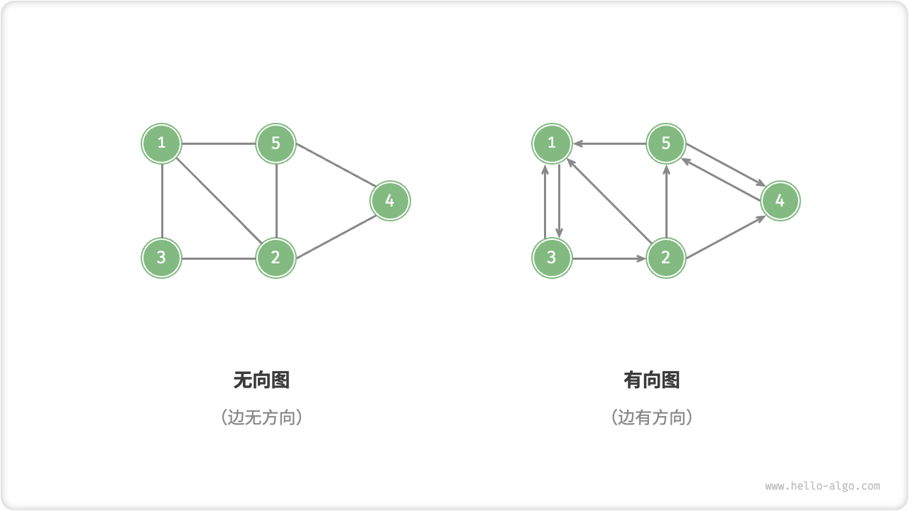
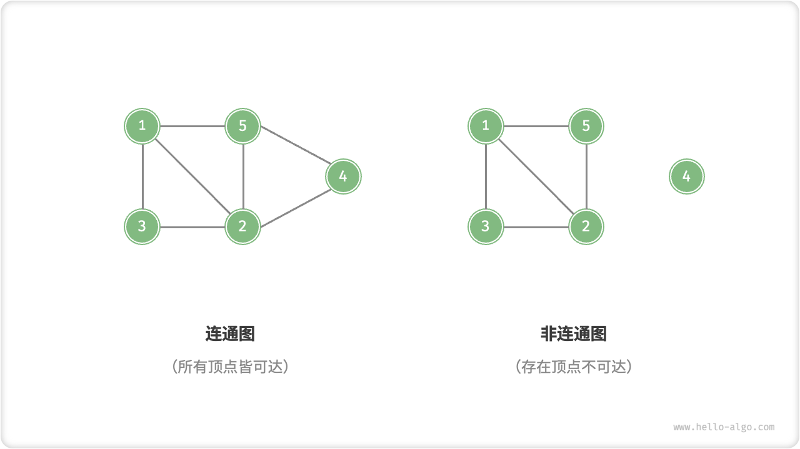
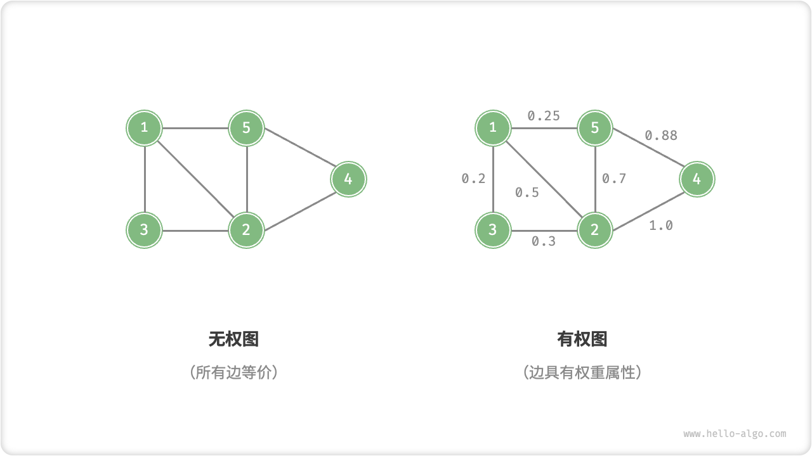
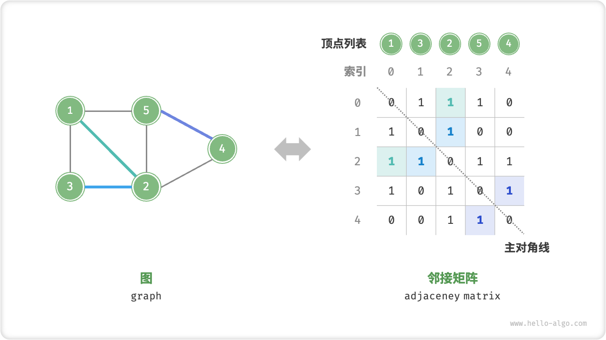
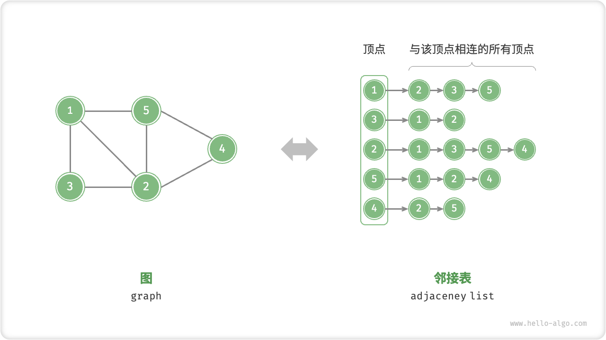

# 9.1. &nbsp; 图（Graph）

「图 Graph」是一种非线性数据结构，由「顶点 Vertex」和「边 Edge」组成。我们可将图 $G$ 抽象地表示为一组顶点 $V$ 和一组边 $E$ 的集合。例如，以下表示一个包含 5 个顶点和 7 条边的图

$$
\begin{aligned}
V & = \{ 1, 2, 3, 4, 5 \} \newline
E & = \{ (1,2), (1,3), (1,5), (2,3), (2,4), (2,5), (4,5) \} \newline
G & = \{ V, E \} \newline
\end{aligned}
$$

 Fig. 链表、树、图之间的关系 

那么，图与其他数据结构的关系是什么？如果我们把「顶点」看作结点，把「边」看作连接各个结点的指针，则可将「图」看成一种从「链表」拓展而来的数据结构。**相比线性关系（链表）和分治关系（树），网络关系（图）的自由度更高，也从而更为复杂**。

## 9.1.1. &nbsp; 图常见类型

根据边是否有方向，分为「无向图 Undirected Graph」和「有向图 Directed Graph」。

- 在无向图中，边表示两顶点之间“双向”的连接关系，例如微信或 QQ 中的“好友关系”；
- 在有向图中，边是有方向的，即 $A \rightarrow B$ 和 $A \leftarrow B$ 两个方向的边是相互独立的，例如微博或抖音上的“关注”与“被关注”关系；

 Fig. 有向图与无向图 

根据所有顶点是否连通，分为「连通图 Connected Graph」和「非连通图 Disconnected Graph」。

- 对于连通图，从某个顶点出发，可以到达其余任意顶点；
- 对于非连通图，从某个顶点出发，至少有一个顶点无法到达；

 Fig. 连通图与非连通图 

我们可以给边添加“权重”变量，得到「有权图 Weighted Graph」。例如，在王者荣耀等游戏中，系统会根据共同游戏时间来计算玩家之间的“亲密度”，这种亲密度网络就可以使用有权图来表示。

 Fig. 有权图与无权图 

## 9.1.2. &nbsp; 图常用术语

- 「邻接 Adjacency」：当两顶点之间有边相连时，称此两顶点“邻接”。例如，上图中顶点 1 的邻接顶点为顶点 2, 3, 5 。
- 「路径 Path」：从顶点 A 到顶点 B 走过的边构成的序列，被称为从 A 到 B 的“路径”。例如，上图中 1, 5, 2, 4 是顶点 1 到顶点 4 的一个路径。
- 「度 Degree」表示一个顶点具有多少条边。对于有向图，「入度 In-Degree」表示有多少条边指向该顶点，「出度 Out-Degree」表示有多少条边从该顶点指出。

## 9.1.3. &nbsp; 图的表示

图的常用表示方法有「邻接矩阵」和「邻接表」。以下使用「无向图」来举例。

### 邻接矩阵

设图的顶点数量为 $n$ ，「邻接矩阵 Adjacency Matrix」使用一个 $n \times n$ 大小的矩阵来表示图，每一行（列）代表一个顶点，矩阵元素代表边，使用 $1$ 或 $0$ 来表示两个顶点之间有边或无边。

如下图所示，记邻接矩阵为 $M$ 、顶点列表为 $V$ ，则矩阵元素 $M[i][j] = 1$ 代表着顶点 $V[i]$ 到顶点 $V[j]$ 之间有边，相反地 $M[i][j] = 0$ 代表两顶点之间无边。

 Fig. 图的邻接矩阵表示 

邻接矩阵具有以下性质：

- 顶点不能与自身相连，因而邻接矩阵主对角线元素没有意义。
- 「无向图」两个方向的边等价，此时邻接矩阵关于主对角线对称。
- 将邻接矩阵的元素从 $1$ , $0$ 替换为权重，则能够表示「有权图」。

使用邻接矩阵表示图时，我们可以直接通过访问矩阵元素来获取边，因此增删查操作的效率很高，时间复杂度均为 $O(1)$ 。然而，矩阵的空间复杂度为 $O(n^2)$ ，内存占用较大。

### 邻接表

「邻接表 Adjacency List」使用 $n$ 个链表来表示图，链表结点表示顶点。第 $i$ 条链表对应顶点 $i$ ，其中存储了该顶点的所有邻接顶点（即与该顶点相连的顶点）。

 Fig. 图的邻接表表示 

邻接表仅存储存在的边，而边的总数往往远小于 $n^2$ ，因此更加节省空间。但是，因为在邻接表中需要通过遍历链表来查找边，所以其时间效率不如邻接矩阵。

观察上图发现，**邻接表结构与哈希表「链地址法」非常相似，因此我们也可以用类似方法来优化效率**。比如，当链表较长时，可以把链表转化为 AVL 树或红黑树，从而将时间效率从 $O(n)$ 优化至 $O(\log n)$ ，还可以通过中序遍历获取有序序列；还可以将链表转化为哈希表，将时间复杂度降低至 $O(1)$ 。

## 9.1.4. &nbsp; 图常见应用

现实中的许多系统都可以使用图来建模，对应的待求解问题也可以被约化为图计算问题。

|          | 顶点 | 边                   | 图计算问题   |
| -------- | ---- | -------------------- | ------------ |
| 社交网络 | 用户 | 好友关系             | 潜在好友推荐 |
| 地铁线路 | 站点 | 站点间的连通性       | 最短路线推荐 |
| 太阳系   | 星体 | 星体间的万有引力作用 | 行星轨道计算 |

