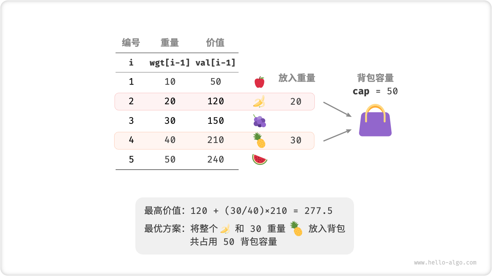
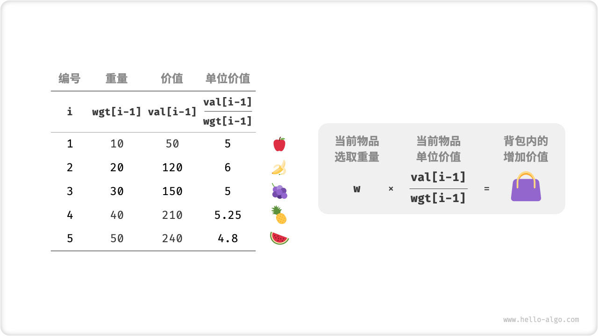
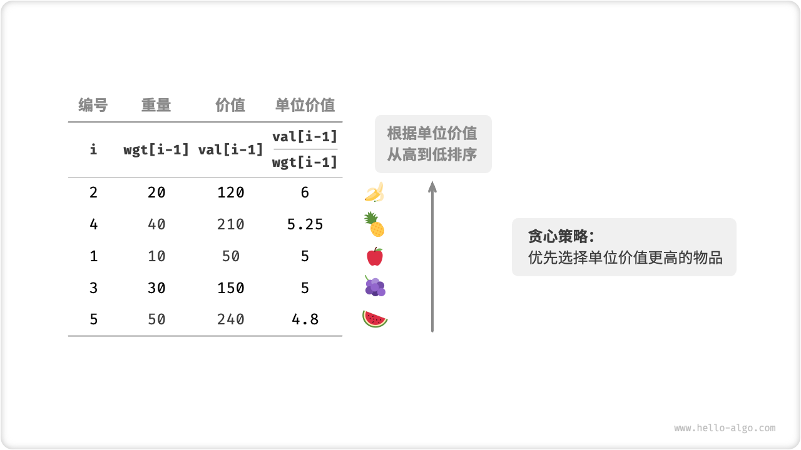
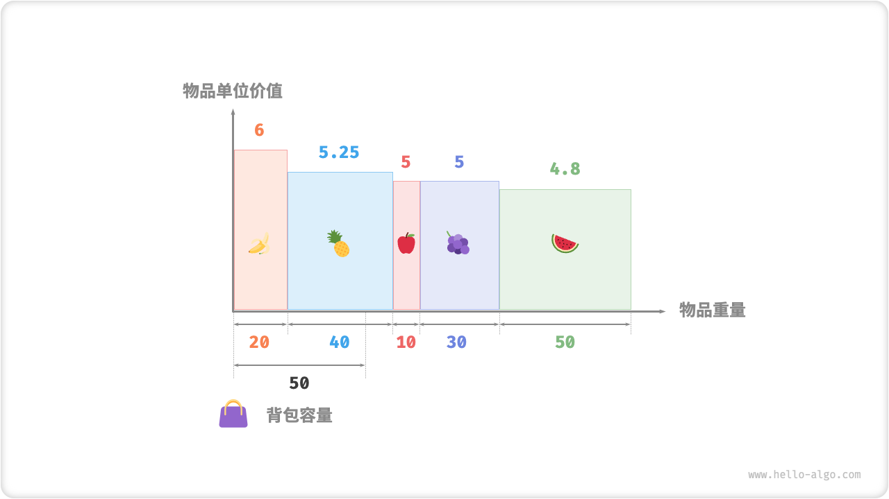

# 15.2. &nbsp; 分数背包问题

分数背包是 0-1 背包的一个变种问题。

!!! question

    给定 $n$ 个物品，第 $i$ 个物品的重量为 $wgt[i-1]$ 、价值为 $val[i-1]$ ，和一个容量为 $cap$ 的背包。每个物品只能选择一次，**但可以选择物品的一部分，价值根据选择的重量比例计算**，问在不超过背包容量下背包中物品的最大价值。



<p align="center"> Fig. 分数背包问题的示例数据 </p>

本题和 0-1 背包整体上非常相似，状态包含当前物品 $i$ 和容量 $c$ ，目标是求不超过背包容量下的最大价值。

不同点在于，本题允许只选择物品的一部分，**这意味着可以对物品任意地进行切分，并按照重量比例来计算物品价值**，因此有：

1. 对于物品 $i$ ，它在单位重量下的价值为 $val[i-1] / wgt[i-1]$ ，简称为单位价值；
2. 假设放入一部分物品 $i$ ，重量为 $w$ ，则背包增加的价值为 $w \times val[i-1] / wgt[i-1]$ ；



<p align="center"> Fig. 物品在单位重量下的价值 </p>

### 贪心策略确定

最大化背包内物品总价值，**本质上是要最大化单位重量下的物品价值**。由此便可推出本题的贪心策略：

1. 将物品按照单位价值从高到低进行排序。
2. 遍历所有物品，**每轮贪心地选择单位价值最高的物品**。
3. 若剩余背包容量不足，则使用当前物品的一部分填满背包即可。



<p align="center"> Fig. 分数背包的贪心策略 </p>

### 代码实现

我们建立了一个物品类 `Item` ，以便将物品按照单位价值进行排序。循环进行贪心选择，当背包已满时跳出并返回解。

=== "Java"

    ```java title="fractional_knapsack.java"
    /* 物品 */
    class Item {
        int w; // 物品重量
        int v; // 物品价值

        public Item(int w, int v) {
            this.w = w;
            this.v = v;
        }
    }

    /* 分数背包：贪心 */
    double fractionalKnapsack(int[] wgt, int[] val, int cap) {
        // 创建物品列表，包含两个属性：重量、价值
        Item[] items = new Item[wgt.length];
        for (int i = 0; i < wgt.length; i++) {
            items[i] = new Item(wgt[i], val[i]);
        }
        // 按照单位价值 item.v / item.w 从高到低进行排序
        Arrays.sort(items, Comparator.comparingDouble(item -> -((double) item.v / item.w)));
        // 循环贪心选择
        double res = 0;
        for (Item item : items) {
            if (item.w <= cap) {
                // 若剩余容量充足，则将当前物品整个装进背包
                res += item.v;
                cap -= item.w;
            } else {
                // 若剩余容量不足，则将当前物品的一部分装进背包
                res += (double) item.v / item.w * cap;
                // 已无剩余容量，因此跳出循环
                break;
            }
        }
        return res;
    }
    ```

=== "C++"

    ```cpp title="fractional_knapsack.cpp"
    /* 物品 */
    class Item {
      public:
        int w; // 物品重量
        int v; // 物品价值

        Item(int w, int v) : w(w), v(v) {
        }
    };

    /* 分数背包：贪心 */
    double fractionalKnapsack(vector<int> &wgt, vector<int> &val, int cap) {
        // 创建物品列表，包含两个属性：重量、价值
        vector<Item> items;
        for (int i = 0; i < wgt.size(); i++) {
            items.push_back(Item(wgt[i], val[i]));
        }
        // 按照单位价值 item.v / item.w 从高到低进行排序
        sort(items.begin(), items.end(), [](Item &a, Item &b) { return (double)a.v / a.w > (double)b.v / b.w; });
        // 循环贪心选择
        double res = 0;
        for (auto &item : items) {
            if (item.w <= cap) {
                // 若剩余容量充足，则将当前物品整个装进背包
                res += item.v;
                cap -= item.w;
            } else {
                // 若剩余容量不足，则将当前物品的一部分装进背包
                res += (double)item.v / item.w * cap;
                // 已无剩余容量，因此跳出循环
                break;
            }
        }
        return res;
    }
    ```

=== "Python"

    ```python title="fractional_knapsack.py"
    class Item:
        """物品"""

        def __init__(self, w: int, v: int):
            self.w = w  # 物品重量
            self.v = v  # 物品价值

    def fractional_knapsack(wgt: list[int], val: list[int], cap: int) -> int:
        """分数背包：贪心"""
        # 创建物品列表，包含两个属性：重量、价值
        items = [Item(w, v) for w, v in zip(wgt, val)]
        # 按照单位价值 item.v / item.w 从高到低进行排序
        items.sort(key=lambda item: item.v / item.w, reverse=True)
        # 循环贪心选择
        res = 0
        for item in items:
            if item.w <= cap:
                # 若剩余容量充足，则将当前物品整个装进背包
                res += item.v
                cap -= item.w
            else:
                # 若剩余容量不足，则将当前物品的一部分装进背包
                res += (item.v / item.w) * cap
                # 已无剩余容量，因此跳出循环
                break
        return res
    ```

=== "Go"

    ```go title="fractional_knapsack.go"
    /* 物品 */
    type Item struct {
        w int // 物品重量
        v int // 物品价值
    }

    /* 分数背包：贪心 */
    func fractionalKnapsack(wgt []int, val []int, cap int) float64 {
        // 创建物品列表，包含两个属性：重量、价值
        items := make([]Item, len(wgt))
        for i := 0; i < len(wgt); i++ {
            items[i] = Item{wgt[i], val[i]}
        }
        // 按照单位价值 item.v / item.w 从高到低进行排序
        sort.Slice(items, func(i, j int) bool {
            return float64(items[i].v)/float64(items[i].w) > float64(items[j].v)/float64(items[j].w)
        })
        // 循环贪心选择
        res := 0.0
        for _, item := range items {
            if item.w <= cap {
                // 若剩余容量充足，则将当前物品整个装进背包
                res += float64(item.v)
                cap -= item.w
            } else {
                // 若剩余容量不足，则将当前物品的一部分装进背包
                res += float64(item.v) / float64(item.w) * float64(cap)
                // 已无剩余容量，因此跳出循环
                break
            }
        }
        return res
    }
    ```

=== "JavaScript"

    ```javascript title="fractional_knapsack.js"
    [class]{Item}-[func]{}

    [class]{}-[func]{fractionalKnapsack}
    ```

=== "TypeScript"

    ```typescript title="fractional_knapsack.ts"
    [class]{Item}-[func]{}

    [class]{}-[func]{fractionalKnapsack}
    ```

=== "C"

    ```c title="fractional_knapsack.c"
    [class]{Item}-[func]{}

    [class]{}-[func]{fractionalKnapsack}
    ```

=== "C#"

    ```csharp title="fractional_knapsack.cs"
    /* 物品 */
    class Item {
        public int w; // 物品重量
        public int v; // 物品价值

        public Item(int w, int v) {
            this.w = w;
            this.v = v;
        }
    }

    /* 分数背包：贪心 */
    double fractionalKnapsack(int[] wgt, int[] val, int cap) {
        // 创建物品列表，包含两个属性：重量、价值
        Item[] items = new Item[wgt.Length];
        for (int i = 0; i < wgt.Length; i++) {
            items[i] = new Item(wgt[i], val[i]);
        }
        // 按照单位价值 item.v / item.w 从高到低进行排序
        Array.Sort(items, (x, y) => (y.v / y.w).CompareTo(x.v / x.w));
        // 循环贪心选择
        double res = 0;
        foreach (Item item in items) {
            if (item.w <= cap) {
                // 若剩余容量充足，则将当前物品整个装进背包
                res += item.v;
                cap -= item.w;
            } else {
                // 若剩余容量不足，则将当前物品的一部分装进背包
                res += (double)item.v / item.w * cap;
                // 已无剩余容量，因此跳出循环
                break;
            }
        }
        return res;
    }
    ```

=== "Swift"

    ```swift title="fractional_knapsack.swift"
    [class]{Item}-[func]{}

    [class]{}-[func]{fractionalKnapsack}
    ```

=== "Zig"

    ```zig title="fractional_knapsack.zig"
    [class]{Item}-[func]{}

    [class]{}-[func]{fractionalKnapsack}
    ```

=== "Dart"

    ```dart title="fractional_knapsack.dart"
    [class]{Item}-[func]{}

    [class]{}-[func]{fractionalKnapsack}
    ```

最差情况下，需要遍历整个物品列表，**因此时间复杂度为 $O(n)$** ，其中 $n$ 为物品数量。

由于初始化了一个 `Item` 对象列表，**因此空间复杂度为 $O(n)$** 。

### 正确性证明

采用反证法。假设物品 $x$ 是单位价值最高的物品，使用某算法求得最大价值为 `res` ，但该解中不包含物品 $x$ 。

现在从背包中拿出单位重量的任意物品，并替换为单位重量的物品 $x$ 。由于物品 $x$ 的单位价值最高，因此替换后的总价值一定大于 `res` 。**这与 `res` 是最优解矛盾，说明最优解中必须包含物品 $x$** 。

对于该解中的其他物品，我们也可以构建出上述矛盾。总而言之，**单位价值更大的物品总是更优选择**，这说明贪心策略是有效的。

如下图所示，如果将物品重量和物品单位价值分别看作一个 2D 图表的横轴和纵轴，则分数背包问题可被转化为“求在有限横轴区间下的最大围成面积”。

通过这个类比，我们可以从几何角度理解贪心策略的有效性。



<p align="center"> Fig. 分数背包问题的几何表示 </p>
