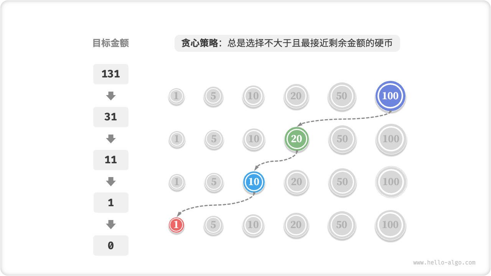
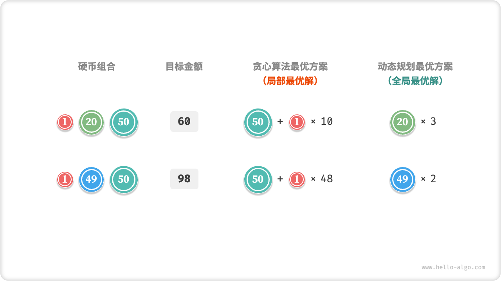

# 15.1 &nbsp; 贪心算法

贪心算法是一种常见的解决优化问题的算法，其基本思想是在问题的每个决策阶段，都选择当前看起来最优的选择，即贪心地做出局部最优的决策，以期望获得全局最优解。贪心算法简洁且高效，在许多实际问题中都有着广泛的应用。

贪心算法和动态规划都常用于解决优化问题。它们之间存在一些相似之处，比如都依赖最优子结构性质，但工作原理是不同的。

- 动态规划会根据之前阶段的所有决策来考虑当前决策，并使用过去子问题的解来构建当前子问题的解。
- 贪心算法不会重新考虑过去的决策，而是一路向前地进行贪心选择，不断缩小问题范围，直至问题被解决。

我们先通过例题“零钱兑换”了解贪心算法的工作原理。这道题已经在动态规划章节中介绍过，相信你对它并不陌生。

!!! question

    给定 $n$ 种硬币，第 $i$ 种硬币的面值为 $coins[i - 1]$ ，目标金额为 $amt$ ，每种硬币可以重复选取，问能够凑出目标金额的最少硬币个数。如果无法凑出目标金额则返回 $-1$ 。

本题的贪心策略如图 15-1 所示。给定目标金额，**我们贪心地选择不大于且最接近它的硬币**，不断循环该步骤，直至凑出目标金额为止。



<p align="center"> 图 15-1 &nbsp; 零钱兑换的贪心策略 </p>

实现代码如下所示。你可能会不由地发出感叹：So Clean ！贪心算法仅用十行代码就解决了零钱兑换问题。

=== "Java"

    ```java title="coin_change_greedy.java"
    /* 零钱兑换：贪心 */
    int coinChangeGreedy(int[] coins, int amt) {
        // 假设 coins 列表有序
        int i = coins.length - 1;
        int count = 0;
        // 循环进行贪心选择，直到无剩余金额
        while (amt > 0) {
            // 找到小于且最接近剩余金额的硬币
            while (i > 0 && coins[i] > amt) {
                i--;
            }
            // 选择 coins[i]
            amt -= coins[i];
            count++;
        }
        // 若未找到可行方案，则返回 -1
        return amt == 0 ? count : -1;
    }
    ```

=== "C++"

    ```cpp title="coin_change_greedy.cpp"
    /* 零钱兑换：贪心 */
    int coinChangeGreedy(vector<int> &coins, int amt) {
        // 假设 coins 列表有序
        int i = coins.size() - 1;
        int count = 0;
        // 循环进行贪心选择，直到无剩余金额
        while (amt > 0) {
            // 找到小于且最接近剩余金额的硬币
            while (i > 0 && coins[i] > amt) {
                i--;
            }
            // 选择 coins[i]
            amt -= coins[i];
            count++;
        }
        // 若未找到可行方案，则返回 -1
        return amt == 0 ? count : -1;
    }
    ```

=== "Python"

    ```python title="coin_change_greedy.py"
    def coin_change_greedy(coins: list[int], amt: int) -> int:
        """零钱兑换：贪心"""
        # 假设 coins 列表有序
        i = len(coins) - 1
        count = 0
        # 循环进行贪心选择，直到无剩余金额
        while amt > 0:
            # 找到小于且最接近剩余金额的硬币
            while i > 0 and coins[i] > amt:
                i -= 1
            # 选择 coins[i]
            amt -= coins[i]
            count += 1
        # 若未找到可行方案，则返回 -1
        return count if amt == 0 else -1
    ```

=== "Go"

    ```go title="coin_change_greedy.go"
    /* 零钱兑换：贪心 */
    func coinChangeGreedy(coins []int, amt int) int {
        // 假设 coins 列表有序
        i := len(coins) - 1
        count := 0
        // 循环进行贪心选择，直到无剩余金额
        for amt > 0 {
            // 找到小于且最接近剩余金额的硬币
            for i > 0 && coins[i] > amt {
                i--
            }
            // 选择 coins[i]
            amt -= coins[i]
            count++
        }
        // 若未找到可行方案，则返回 -1
        if amt != 0 {
            return -1
        }
        return count
    }
    ```

=== "JS"

    ```javascript title="coin_change_greedy.js"
    [class]{}-[func]{coinChangeGreedy}
    ```

=== "TS"

    ```typescript title="coin_change_greedy.ts"
    [class]{}-[func]{coinChangeGreedy}
    ```

=== "C"

    ```c title="coin_change_greedy.c"
    [class]{}-[func]{coinChangeGreedy}
    ```

=== "C#"

    ```csharp title="coin_change_greedy.cs"
    /* 零钱兑换：贪心 */
    int coinChangeGreedy(int[] coins, int amt) {
        // 假设 coins 列表有序
        int i = coins.Length - 1;
        int count = 0;
        // 循环进行贪心选择，直到无剩余金额
        while (amt > 0) {
            // 找到小于且最接近剩余金额的硬币
            while (i > 0 && coins[i] > amt) {
                i--;
            }
            // 选择 coins[i]
            amt -= coins[i];
            count++;
        }
        // 若未找到可行方案，则返回 -1
        return amt == 0 ? count : -1;
    }
    ```

=== "Swift"

    ```swift title="coin_change_greedy.swift"
    [class]{}-[func]{coinChangeGreedy}
    ```

=== "Zig"

    ```zig title="coin_change_greedy.zig"
    [class]{}-[func]{coinChangeGreedy}
    ```

=== "Dart"

    ```dart title="coin_change_greedy.dart"
    /* 零钱兑换：贪心 */
    int coinChangeGreedy(List<int> coins, int amt) {
      // 假设 coins 列表有序
      int i = coins.length - 1;
      int count = 0;
      // 循环进行贪心选择，直到无剩余金额
      while (amt > 0) {
        // 找到小于且最接近剩余金额的硬币
        while (i > 0 && coins[i] > amt) {
          i--;
        }
        // 选择 coins[i]
        amt -= coins[i];
        count++;
      }
      // 若未找到可行方案，则返回 -1
      return amt == 0 ? count : -1;
    }
    ```

=== "Rust"

    ```rust title="coin_change_greedy.rs"
    /* 零钱兑换：贪心 */
    fn coin_change_greedy(coins: &[i32], mut amt: i32) -> i32 {
        // 假设 coins 列表有序
        let mut i = coins.len() - 1;
        let mut count = 0;
        // 循环进行贪心选择，直到无剩余金额
        while amt > 0 {
            // 找到小于且最接近剩余金额的硬币
            while i > 0 && coins[i] > amt {
                i -= 1;
            }
            // 选择 coins[i]
            amt -= coins[i];
            count += 1;
        }
        // 若未找到可行方案，则返回 -1
        if amt == 0 {
            count
        } else {
            -1
        }
    }
    ```

## 15.1.1 &nbsp; 贪心优点与局限性

**贪心算法不仅操作直接、实现简单，而且通常效率也很高**。在以上代码中，记硬币最小面值为 $\min(coins)$ ，则贪心选择最多循环 $amt / \min(coins)$ 次，时间复杂度为 $O(amt / \min(coins))$ 。这比动态规划解法的时间复杂度 $O(n \times amt)$ 提升了一个数量级。

然而，**对于某些硬币面值组合，贪心算法并不能找到最优解**。图 15-2 给出了两个示例。

- **正例 $coins = [1, 5, 10, 20, 50, 100]$**：在该硬币组合下，给定任意 $amt$ ，贪心算法都可以找出最优解。
- **反例 $coins = [1, 20, 50]$**：假设 $amt = 60$ ，贪心算法只能找到 $50 + 1 \times 10$ 的兑换组合，共计 $11$ 枚硬币，但动态规划可以找到最优解 $20 + 20 + 20$ ，仅需 $3$ 枚硬币。
- **反例 $coins = [1, 49, 50]$**：假设 $amt = 98$ ，贪心算法只能找到 $50 + 1 \times 48$ 的兑换组合，共计 $49$ 枚硬币，但动态规划可以找到最优解 $49 + 49$ ，仅需 $2$ 枚硬币。



<p align="center"> 图 15-2 &nbsp; 贪心无法找出最优解的示例 </p>

也就是说，对于零钱兑换问题，贪心算法无法保证找到全局最优解，并且有可能找到非常差的解。它更适合用动态规划解决。

一般情况下，贪心算法适用于以下两类问题。

1. **可以保证找到最优解**：贪心算法在这种情况下往往是最优选择，因为它往往比回溯、动态规划更高效。
2. **可以找到近似最优解**：贪心算法在这种情况下也是可用的。对于很多复杂问题来说，寻找全局最优解是非常困难的，能以较高效率找到次优解也是非常不错的。

## 15.1.2 &nbsp; 贪心算法特性

那么问题来了，什么样的问题适合用贪心算法求解呢？或者说，贪心算法在什么情况下可以保证找到最优解？

相较于动态规划，贪心算法的使用条件更加苛刻，其主要关注问题的两个性质。

- **贪心选择性质**：只有当局部最优选择始终可以导致全局最优解时，贪心算法才能保证得到最优解。
- **最优子结构**：原问题的最优解包含子问题的最优解。

最优子结构已经在动态规划章节中介绍过，不再赘述。值得注意的是，一些问题的最优子结构并不明显，但仍然可使用贪心算法解决。

我们主要探究贪心选择性质的判断方法。虽然它的描述看上去比较简单，**但实际上对于许多问题，证明贪心选择性质不是一件易事**。

例如零钱兑换问题，我们虽然能够容易地举出反例，对贪心选择性质进行证伪，但证实的难度较大。如果问：**满足什么条件的硬币组合可以使用贪心算法求解**？我们往往只能凭借直觉或举例子来给出一个模棱两可的答案，而难以给出严谨的数学证明。

!!! quote

    有一篇论文专门讨论了该问题。作者给出了一个 $O(n^3)$ 时间复杂度的算法，用于判断一个硬币组合是否可以使用贪心算法找出任何金额的最优解。

    Pearson, David. A polynomial-time algorithm for the change-making problem. Operations Research Letters 33.3 (2005): 231-234.

## 15.1.3 &nbsp; 贪心解题步骤

贪心问题的解决流程大体可分为以下三步。

1. **问题分析**：梳理与理解问题特性，包括状态定义、优化目标和约束条件等。这一步在回溯和动态规划中都有涉及。
2. **确定贪心策略**：确定如何在每一步中做出贪心选择。这个策略能够在每一步减小问题的规模，并最终能解决整个问题。
3. **正确性证明**：通常需要证明问题具有贪心选择性质和最优子结构。这个步骤可能需要使用到数学证明，例如归纳法或反证法等。

确定贪心策略是求解问题的核心步骤，但实施起来可能并不容易，主要包含以下原因。

- **不同问题的贪心策略的差异较大**。对于许多问题来说，贪心策略都比较浅显，我们通过一些大概的思考与尝试就能得出。而对于一些复杂问题，贪心策略可能非常隐蔽，这种情况就非常考验个人的解题经验与算法能力了。
- **某些贪心策略具有较强的迷惑性**。当我们满怀信心设计好贪心策略，写出解题代码并提交运行，很可能发现部分测试样例无法通过。这是因为设计的贪心策略只是“部分正确”的，上文介绍的零钱兑换就是个典型案例。

为了保证正确性，我们应该对贪心策略进行严谨的数学证明，**通常需要用到反证法或数学归纳法**。

然而，正确性证明也很可能不是一件易事。如若没有头绪，我们通常会选择面向测试用例进行 Debug ，一步步修改与验证贪心策略。

## 15.1.4 &nbsp; 贪心典型例题

贪心算法常常应用在满足贪心选择性质和最优子结构的优化问题中，以下列举了一些典型的贪心算法问题。

1. **硬币找零问题**：在某些硬币组合下，贪心算法总是可以得到最优解。
2. **区间调度问题**：假设你有一些任务，每个任务在一段时间内进行，你的目标是完成尽可能多的任务。如果每次都选择结束时间最早的任务，那么贪心算法就可以得到最优解。
3. **分数背包问题**：给定一组物品和一个载重量，你的目标是选择一组物品，使得总重量不超过载重量，且总价值最大。如果每次都选择性价比最高（价值 / 重量）的物品，那么贪心算法在一些情况下可以得到最优解。
4. **股票买卖问题**：给定一组股票的历史价格，你可以进行多次买卖，但如果你已经持有股票，那么在卖出之前不能再买，目标是获取最大利润。
5. **霍夫曼编码**：霍夫曼编码是一种用于无损数据压缩的贪心算法。通过构建霍夫曼树，每次选择出现频率最小的两个节点合并，最后得到的霍夫曼树的带权路径长度（即编码长度）最小。
6. **Dijkstra 算法**：它是一种解决给定源顶点到其余各顶点的最短路径问题的贪心算法。
