# 8.1 &nbsp; 堆

「堆 Heap」是一种满足特定条件的完全二叉树，可分为两种类型：

- 「大顶堆 Max Heap」，任意节点的值 $\geq$ 其子节点的值。
- 「小顶堆 Min Heap」，任意节点的值 $\leq$ 其子节点的值。

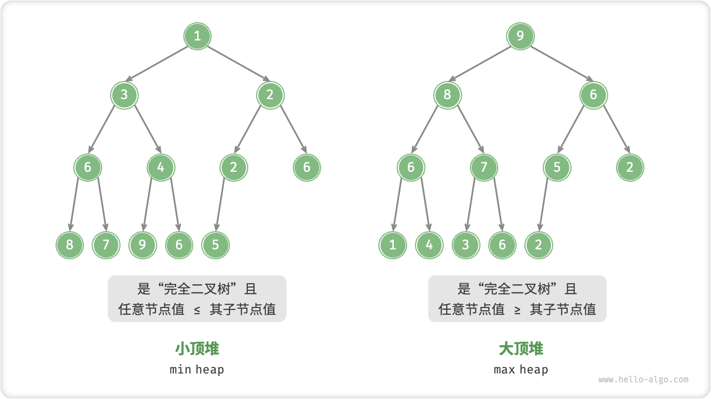

<p align="center"> 图：小顶堆与大顶堆 </p>

堆作为完全二叉树的一个特例，具有以下特性：

- 最底层节点靠左填充，其他层的节点都被填满。
- 我们将二叉树的根节点称为「堆顶」，将底层最靠右的节点称为「堆底」。
- 对于大顶堆（小顶堆），堆顶元素（即根节点）的值分别是最大（最小）的。

## 8.1.1 &nbsp; 堆常用操作

需要指出的是，许多编程语言提供的是「优先队列 Priority Queue」，这是一种抽象数据结构，定义为具有优先级排序的队列。

实际上，**堆通常用作实现优先队列，大顶堆相当于元素按从大到小顺序出队的优先队列**。从使用角度来看，我们可以将「优先队列」和「堆」看作等价的数据结构。因此，本书对两者不做特别区分，统一使用「堆」来命名。

堆的常用操作见下表，方法名需要根据编程语言来确定。
<p align="center"> 表：堆的操作效率 </p>

<div class="center-table" markdown>

| 方法名     | 描述                                         | 时间复杂度  |
| --------- | ------------------------------------------ | ----------- |
| push()    | 元素入堆                                    | $O(\log n)$ |
| pop()     | 堆顶元素出堆                                   | $O(\log n)$ |
| peek()    | 访问堆顶元素（大 / 小顶堆分别为最大 / 小值）       | $O(1)$      |
| size()    | 获取堆的元素数量                               | $O(1)$      |
| isEmpty() | 判断堆是否为空                                 | $O(1)$      |

</div>

在实际应用中，我们可以直接使用编程语言提供的堆类（或优先队列类）。

!!! tip

    类似于排序算法中的“从小到大排列”和“从大到小排列”，我们可以通过修改 Comparator 来实现“小顶堆”与“大顶堆”之间的转换。

=== "Java"

    ```java title="heap.java"
    /* 初始化堆 */
    // 初始化小顶堆
    Queue<Integer> minHeap = new PriorityQueue<>();
    // 初始化大顶堆（使用 lambda 表达式修改 Comparator 即可）
    Queue<Integer> maxHeap = new PriorityQueue<>((a, b) -> b - a);
    
    /* 元素入堆 */
    maxHeap.offer(1);
    maxHeap.offer(3);
    maxHeap.offer(2);
    maxHeap.offer(5);
    maxHeap.offer(4);
    
    /* 获取堆顶元素 */
    int peek = maxHeap.peek(); // 5
    
    /* 堆顶元素出堆 */
    // 出堆元素会形成一个从大到小的序列
    peek = heap.poll();  // 5
    peek = heap.poll();  // 4
    peek = heap.poll();  // 3
    peek = heap.poll();  // 2
    peek = heap.poll();  // 1
    
    /* 获取堆大小 */
    int size = maxHeap.size();
    
    /* 判断堆是否为空 */
    boolean isEmpty = maxHeap.isEmpty();
    
    /* 输入列表并建堆 */
    minHeap = new PriorityQueue<>(Arrays.asList(1, 3, 2, 5, 4));
    ```

=== "C++"

    ```cpp title="heap.cpp"
    /* 初始化堆 */
    // 初始化小顶堆
    priority_queue<int, vector<int>, greater<int>> minHeap;
    // 初始化大顶堆
    priority_queue<int, vector<int>, less<int>> maxHeap;

    /* 元素入堆 */
    maxHeap.push(1);
    maxHeap.push(3);
    maxHeap.push(2);
    maxHeap.push(5);
    maxHeap.push(4);

    /* 获取堆顶元素 */
    int peek = maxHeap.top(); // 5

    /* 堆顶元素出堆 */
    // 出堆元素会形成一个从大到小的序列
    maxHeap.pop(); // 5
    maxHeap.pop(); // 4
    maxHeap.pop(); // 3
    maxHeap.pop(); // 2
    maxHeap.pop(); // 1

    /* 获取堆大小 */
    int size = maxHeap.size();

    /* 判断堆是否为空 */
    bool isEmpty = maxHeap.empty();

    /* 输入列表并建堆 */
    vector<int> input{1, 3, 2, 5, 4};
    priority_queue<int, vector<int>, greater<int>> minHeap(input.begin(), input.end());
    ```

=== "Python"

    ```python title="heap.py"
    # 初始化小顶堆
    min_heap, flag = [], 1
    # 初始化大顶堆
    max_heap, flag = [], -1

    # Python 的 heapq 模块默认实现小顶堆
    # 考虑将“元素取负”后再入堆，这样就可以将大小关系颠倒，从而实现大顶堆
    # 在本示例中，flag = 1 时对应小顶堆，flag = -1 时对应大顶堆

    # 元素入堆
    heapq.heappush(max_heap, flag * 1)
    heapq.heappush(max_heap, flag * 3)
    heapq.heappush(max_heap, flag * 2)
    heapq.heappush(max_heap, flag * 5)
    heapq.heappush(max_heap, flag * 4)

    # 获取堆顶元素
    peek: int = flag * max_heap[0] # 5

    # 堆顶元素出堆
    # 出堆元素会形成一个从大到小的序列
    val = flag * heapq.heappop(max_heap) # 5
    val = flag * heapq.heappop(max_heap) # 4
    val = flag * heapq.heappop(max_heap) # 3
    val = flag * heapq.heappop(max_heap) # 2
    val = flag * heapq.heappop(max_heap) # 1

    # 获取堆大小
    size: int = len(max_heap)

    # 判断堆是否为空
    is_empty: bool = not max_heap

    # 输入列表并建堆
    min_heap: list[int] = [1, 3, 2, 5, 4]
    heapq.heapify(min_heap)
    ```

=== "Go"

    ```go title="heap.go"
    // Go 语言中可以通过实现 heap.Interface 来构建整数大顶堆
    // 实现 heap.Interface 需要同时实现 sort.Interface
    type intHeap []any

    // Push heap.Interface 的方法，实现推入元素到堆
    func (h *intHeap) Push(x any) {
        // Push 和 Pop 使用 pointer receiver 作为参数
        // 因为它们不仅会对切片的内容进行调整，还会修改切片的长度。
        *h = append(*h, x.(int))
    }

    // Pop heap.Interface 的方法，实现弹出堆顶元素
    func (h *intHeap) Pop() any {
        // 待出堆元素存放在最后
        last := (*h)[len(*h)-1]
        *h = (*h)[:len(*h)-1]
        return last
    }

    // Len sort.Interface 的方法
    func (h *intHeap) Len() int {
        return len(*h)
    }

    // Less sort.Interface 的方法
    func (h *intHeap) Less(i, j int) bool {
        // 如果实现小顶堆，则需要调整为小于号
        return (*h)[i].(int) > (*h)[j].(int)
    }

    // Swap sort.Interface 的方法
    func (h *intHeap) Swap(i, j int) {
        (*h)[i], (*h)[j] = (*h)[j], (*h)[i]
    }

    // Top 获取堆顶元素
    func (h *intHeap) Top() any {
        return (*h)[0]
    }

    /* Driver Code */
    func TestHeap(t *testing.T) {
        /* 初始化堆 */
        // 初始化大顶堆
        maxHeap := &intHeap{}
        heap.Init(maxHeap)
        /* 元素入堆 */
        // 调用 heap.Interface 的方法，来添加元素
        heap.Push(maxHeap, 1)
        heap.Push(maxHeap, 3)
        heap.Push(maxHeap, 2)
        heap.Push(maxHeap, 4)
        heap.Push(maxHeap, 5)

        /* 获取堆顶元素 */
        top := maxHeap.Top()
        fmt.Printf("堆顶元素为 %d\n", top)

        /* 堆顶元素出堆 */
        // 调用 heap.Interface 的方法，来移除元素
        heap.Pop(maxHeap) // 5
        heap.Pop(maxHeap) // 4
        heap.Pop(maxHeap) // 3
        heap.Pop(maxHeap) // 2
        heap.Pop(maxHeap) // 1

        /* 获取堆大小 */
        size := len(*maxHeap)
        fmt.Printf("堆元素数量为 %d\n", size)

        /* 判断堆是否为空 */
        isEmpty := len(*maxHeap) == 0
        fmt.Printf("堆是否为空 %t\n", isEmpty)
    }
    ```

=== "JS"

    ```javascript title="heap.js"
    // JavaScript 未提供内置 Heap 类
    ```

=== "TS"

    ```typescript title="heap.ts"
    // TypeScript 未提供内置 Heap 类
    ```

=== "C"

    ```c title="heap.c"
    // C 未提供内置 Heap 类
    ```

=== "C#"

    ```csharp title="heap.cs"
    /* 初始化堆 */
    // 初始化小顶堆
    PriorityQueue<int, int> minHeap = new PriorityQueue<int, int>();
    // 初始化大顶堆（使用 lambda 表达式修改 Comparator 即可）
    PriorityQueue<int, int> maxHeap = new PriorityQueue<int, int>(Comparer<int>.Create((x, y) => y - x));

    /* 元素入堆 */
    maxHeap.Enqueue(1, 1);
    maxHeap.Enqueue(3, 3);
    maxHeap.Enqueue(2, 2);
    maxHeap.Enqueue(5, 5);
    maxHeap.Enqueue(4, 4);

    /* 获取堆顶元素 */
    int peek = maxHeap.Peek();//5

    /* 堆顶元素出堆 */
    // 出堆元素会形成一个从大到小的序列
    peek = maxHeap.Dequeue();  // 5
    peek = maxHeap.Dequeue();  // 4
    peek = maxHeap.Dequeue();  // 3
    peek = maxHeap.Dequeue();  // 2
    peek = maxHeap.Dequeue();  // 1

    /* 获取堆大小 */
    int size = maxHeap.Count;

    /* 判断堆是否为空 */
    bool isEmpty = maxHeap.Count == 0;

    /* 输入列表并建堆 */
    minHeap = new PriorityQueue<int, int>(new List<(int, int)> { (1, 1), (3, 3), (2, 2), (5, 5), (4, 4), });
    ```

=== "Swift"

    ```swift title="heap.swift"
    // Swift 未提供内置 Heap 类
    ```

=== "Zig"

    ```zig title="heap.zig"

    ```

=== "Dart"

    ```dart title="heap.dart"
    // Dart 未提供内置 Heap 类
    ```

=== "Rust"

    ```rust title="heap.rs"

    ```

## 8.1.2 &nbsp; 堆的实现

下文实现的是大顶堆。若要将其转换为小顶堆，只需将所有大小逻辑判断取逆（例如，将 $\geq$ 替换为 $\leq$ ）。感兴趣的读者可以自行实现。

### 堆的存储与表示

我们在二叉树章节中学习到，完全二叉树非常适合用数组来表示。由于堆正是一种完全二叉树，**我们将采用数组来存储堆**。

当使用数组表示二叉树时，元素代表节点值，索引代表节点在二叉树中的位置。**节点指针通过索引映射公式来实现**。

具体而言，给定索引 $i$ ，其左子节点索引为 $2i + 1$ ，右子节点索引为 $2i + 2$ ，父节点索引为 $(i - 1) / 2$（向下取整）。当索引越界时，表示空节点或节点不存在。


<p align="center"> 图：堆的表示与存储 </p>

我们可以将索引映射公式封装成函数，方便后续使用。

=== "Java"

    ```java title="my_heap.java"
    /* 获取左子节点索引 */
    int left(int i) {
        return 2 * i + 1;
    }

    /* 获取右子节点索引 */
    int right(int i) {
        return 2 * i + 2;
    }

    /* 获取父节点索引 */
    int parent(int i) {
        return (i - 1) / 2; // 向下整除
    }
    ```

=== "C++"

    ```cpp title="my_heap.cpp"
    /* 获取左子节点索引 */
    int left(int i) {
        return 2 * i + 1;
    }

    /* 获取右子节点索引 */
    int right(int i) {
        return 2 * i + 2;
    }

    /* 获取父节点索引 */
    int parent(int i) {
        return (i - 1) / 2; // 向下取整
    }
    ```

=== "Python"

    ```python title="my_heap.py"
    def left(self, i: int) -> int:
        """获取左子节点索引"""
        return 2 * i + 1

    def right(self, i: int) -> int:
        """获取右子节点索引"""
        return 2 * i + 2

    def parent(self, i: int) -> int:
        """获取父节点索引"""
        return (i - 1) // 2  # 向下整除
    ```

=== "Go"

    ```go title="my_heap.go"
    /* 获取左子节点索引 */
    func (h *maxHeap) left(i int) int {
        return 2*i + 1
    }

    /* 获取右子节点索引 */
    func (h *maxHeap) right(i int) int {
        return 2*i + 2
    }

    /* 获取父节点索引 */
    func (h *maxHeap) parent(i int) int {
        // 向下整除
        return (i - 1) / 2
    }
    ```

=== "JS"

    ```javascript title="my_heap.js"
    /* 获取左子节点索引 */
    #left(i) {
        return 2 * i + 1;
    }

    /* 获取右子节点索引 */
    #right(i) {
        return 2 * i + 2;
    }

    /* 获取父节点索引 */
    #parent(i) {
        return Math.floor((i - 1) / 2); // 向下整除
    }
    ```

=== "TS"

    ```typescript title="my_heap.ts"
    /* 获取左子节点索引 */
    left(i: number): number {
        return 2 * i + 1;
    }

    /* 获取右子节点索引 */
    right(i: number): number {
        return 2 * i + 2;
    }

    /* 获取父节点索引 */
    parent(i: number): number {
        return Math.floor((i - 1) / 2); // 向下整除
    }
    ```

=== "C"

    ```c title="my_heap.c"
    /* 获取左子节点索引 */
    int left(maxHeap *h, int i) {
        return 2 * i + 1;
    }

    /* 获取右子节点索引 */
    int right(maxHeap *h, int i) {
        return 2 * i + 2;
    }

    /* 获取父节点索引 */
    int parent(maxHeap *h, int i) {
        return (i - 1) / 2;
    }
    ```

=== "C#"

    ```csharp title="my_heap.cs"
    /* 获取左子节点索引 */
    int left(int i) {
        return 2 * i + 1;
    }

    /* 获取右子节点索引 */
    int right(int i) {
        return 2 * i + 2;
    }

    /* 获取父节点索引 */
    int parent(int i) {
        return (i - 1) / 2; // 向下整除
    }
    ```

=== "Swift"

    ```swift title="my_heap.swift"
    /* 获取左子节点索引 */
    func left(i: Int) -> Int {
        2 * i + 1
    }

    /* 获取右子节点索引 */
    func right(i: Int) -> Int {
        2 * i + 2
    }

    /* 获取父节点索引 */
    func parent(i: Int) -> Int {
        (i - 1) / 2 // 向下整除
    }
    ```

=== "Zig"

    ```zig title="my_heap.zig"
    // 获取左子节点索引
    fn left(i: usize) usize {
        return 2 * i + 1;
    }

    // 获取右子节点索引
    fn right(i: usize) usize {
        return 2 * i + 2;
    }

    // 获取父节点索引
    fn parent(i: usize) usize {
        // return (i - 1) / 2; // 向下整除
        return @divFloor(i - 1, 2);
    }
    ```

=== "Dart"

    ```dart title="my_heap.dart"
    /* 获取左子节点索引 */
    int _left(int i) {
      return 2 * i + 1;
    }

    /* 获取右子节点索引 */
    int _right(int i) {
      return 2 * i + 2;
    }

    /* 获取父节点索引 */
    int _parent(int i) {
      return (i - 1) ~/ 2; // 向下整除
    }
    ```

=== "Rust"

    ```rust title="my_heap.rs"
    /* 获取左子节点索引 */
    fn left(i: usize) -> usize {
        2 * i + 1
    }

    /* 获取右子节点索引 */
    fn right(i: usize) -> usize {
        2 * i + 2
    }

    /* 获取父节点索引 */
    fn parent(i: usize) -> usize {
        (i - 1) / 2 // 向下整除
    }
    ```

### 访问堆顶元素

堆顶元素即为二叉树的根节点，也就是列表的首个元素。

=== "Java"

    ```java title="my_heap.java"
    /* 访问堆顶元素 */
    int peek() {
        return maxHeap.get(0);
    }
    ```

=== "C++"

    ```cpp title="my_heap.cpp"
    /* 访问堆顶元素 */
    int peek() {
        return maxHeap[0];
    }
    ```

=== "Python"

    ```python title="my_heap.py"
    def peek(self) -> int:
        """访问堆顶元素"""
        return self.max_heap[0]
    ```

=== "Go"

    ```go title="my_heap.go"
    /* 访问堆顶元素 */
    func (h *maxHeap) peek() any {
        return h.data[0]
    }
    ```

=== "JS"

    ```javascript title="my_heap.js"
    /* 访问堆顶元素 */
    peek() {
        return this.#maxHeap[0];
    }
    ```

=== "TS"

    ```typescript title="my_heap.ts"
    /* 访问堆顶元素 */
    peek(): number {
        return this.maxHeap[0];
    }
    ```

=== "C"

    ```c title="my_heap.c"
    /* 访问堆顶元素 */
    int peek(maxHeap *h) {
        return h->data[0];
    }
    ```

=== "C#"

    ```csharp title="my_heap.cs"
    /* 访问堆顶元素 */
    int peek() {
        return maxHeap[0];
    }
    ```

=== "Swift"

    ```swift title="my_heap.swift"
    /* 访问堆顶元素 */
    func peek() -> Int {
        maxHeap[0]
    }
    ```

=== "Zig"

    ```zig title="my_heap.zig"
    // 访问堆顶元素
    fn peek(self: *Self) T {
        return self.max_heap.?.items[0];
    }  
    ```

=== "Dart"

    ```dart title="my_heap.dart"
    /* 访问堆顶元素 */
    int peek() {
      return _maxHeap[0];
    }
    ```

=== "Rust"

    ```rust title="my_heap.rs"
    /* 访问堆顶元素 */
    fn peek(&self) -> Option<i32> {
        self.max_heap.first().copied()
    }
    ```

### 元素入堆

给定元素 `val` ，我们首先将其添加到堆底。添加之后，由于 val 可能大于堆中其他元素，堆的成立条件可能已被破坏。因此，**需要修复从插入节点到根节点的路径上的各个节点**，这个操作被称为「堆化 Heapify」。

考虑从入堆节点开始，**从底至顶执行堆化**。具体来说，我们比较插入节点与其父节点的值，如果插入节点更大，则将它们交换。然后继续执行此操作，从底至顶修复堆中的各个节点，直至越过根节点或遇到无需交换的节点时结束。

=== "<1>"
    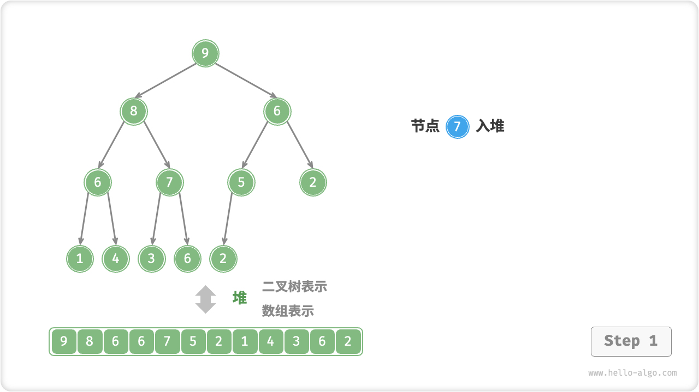

=== "<2>"
    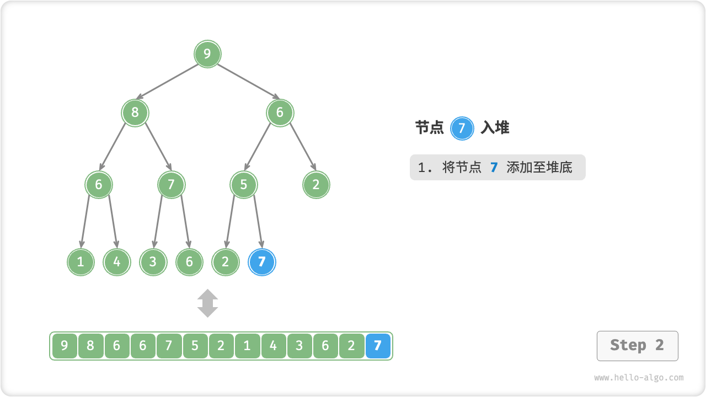

=== "<3>"
    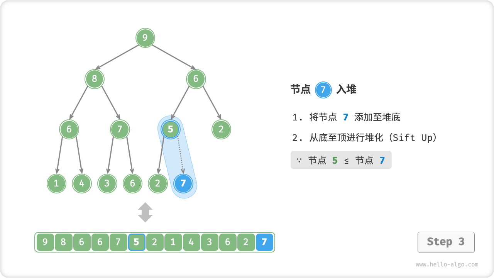

=== "<4>"
    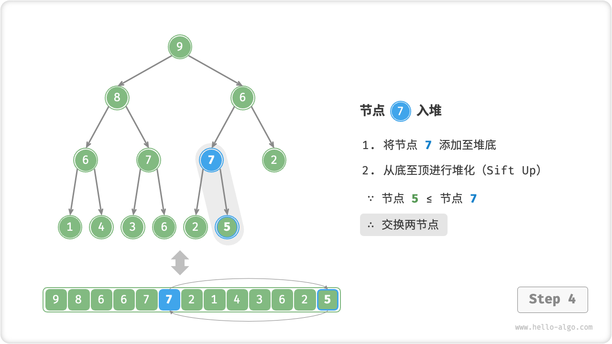

=== "<5>"
    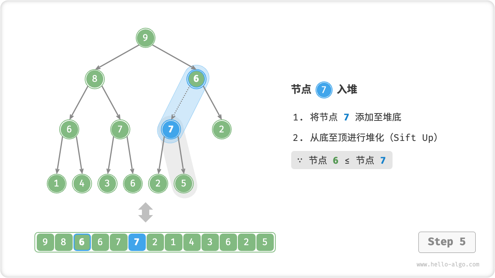

=== "<6>"
    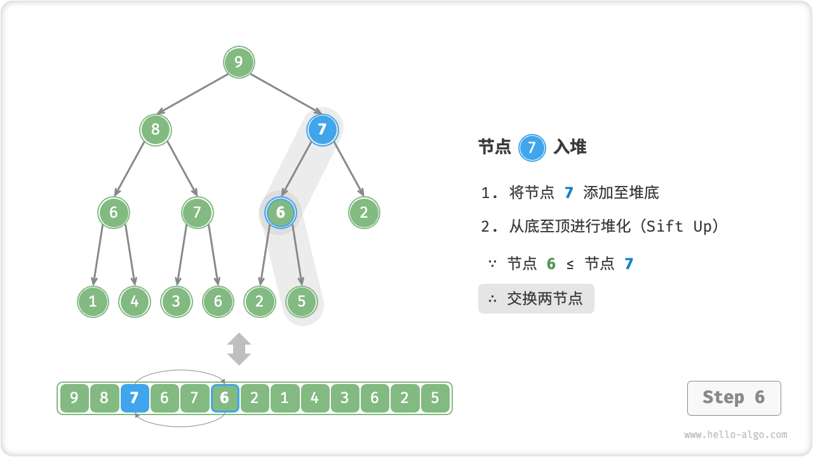

=== "<7>"
    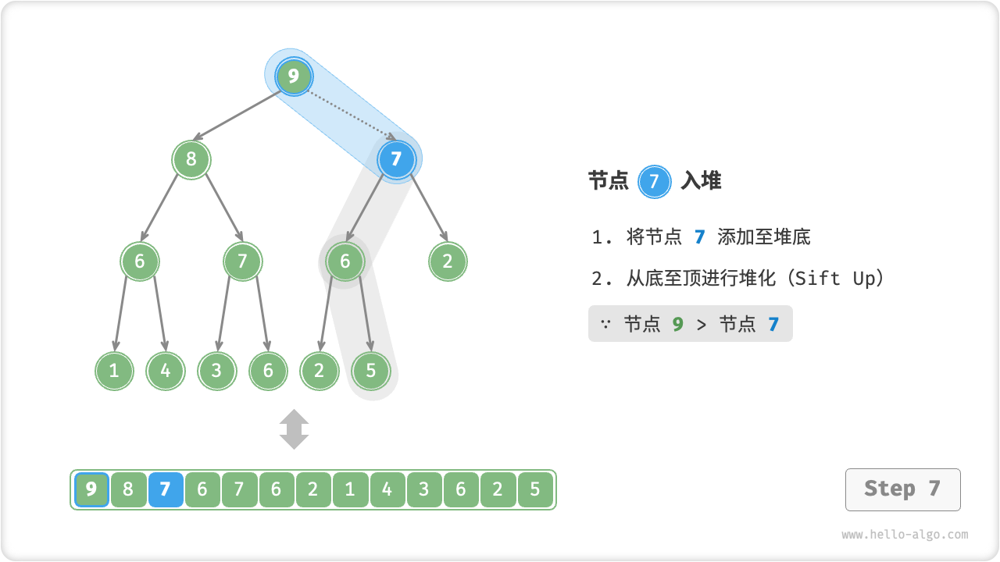

=== "<8>"
    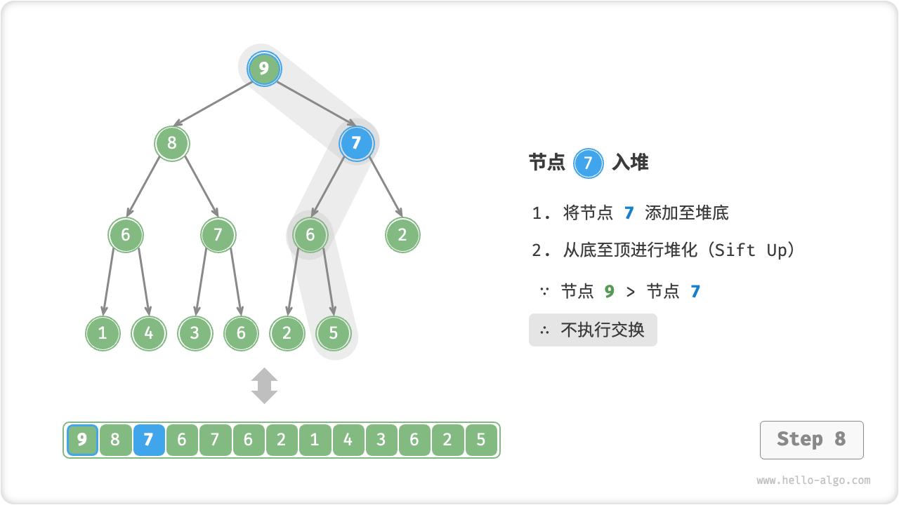

=== "<9>"
    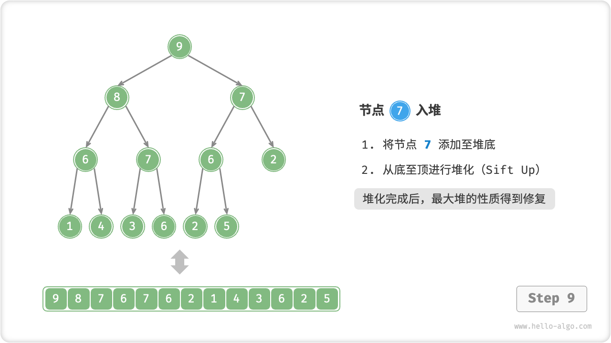

<p align="center"> 图：元素入堆步骤 </p>

设节点总数为 $n$ ，则树的高度为 $O(\log n)$ 。由此可知，堆化操作的循环轮数最多为 $O(\log n)$ ，**元素入堆操作的时间复杂度为 $O(\log n)$** 。

=== "Java"

    ```java title="my_heap.java"
    /* 元素入堆 */
    void push(int val) {
        // 添加节点
        maxHeap.add(val);
        // 从底至顶堆化
        siftUp(size() - 1);
    }

    /* 从节点 i 开始，从底至顶堆化 */
    void siftUp(int i) {
        while (true) {
            // 获取节点 i 的父节点
            int p = parent(i);
            // 当“越过根节点”或“节点无需修复”时，结束堆化
            if (p < 0 || maxHeap.get(i) <= maxHeap.get(p))
                break;
            // 交换两节点
            swap(i, p);
            // 循环向上堆化
            i = p;
        }
    }
    ```

=== "C++"

    ```cpp title="my_heap.cpp"
    /* 元素入堆 */
    void push(int val) {
        // 添加节点
        maxHeap.push_back(val);
        // 从底至顶堆化
        siftUp(size() - 1);
    }

    /* 从节点 i 开始，从底至顶堆化 */
    void siftUp(int i) {
        while (true) {
            // 获取节点 i 的父节点
            int p = parent(i);
            // 当“越过根节点”或“节点无需修复”时，结束堆化
            if (p < 0 || maxHeap[i] <= maxHeap[p])
                break;
            // 交换两节点
            swap(maxHeap[i], maxHeap[p]);
            // 循环向上堆化
            i = p;
        }
    }
    ```

=== "Python"

    ```python title="my_heap.py"
    def push(self, val: int):
        """元素入堆"""
        # 添加节点
        self.max_heap.append(val)
        # 从底至顶堆化
        self.sift_up(self.size() - 1)

    def sift_up(self, i: int):
        """从节点 i 开始，从底至顶堆化"""
        while True:
            # 获取节点 i 的父节点
            p = self.parent(i)
            # 当“越过根节点”或“节点无需修复”时，结束堆化
            if p < 0 or self.max_heap[i] <= self.max_heap[p]:
                break
            # 交换两节点
            self.swap(i, p)
            # 循环向上堆化
            i = p
    ```

=== "Go"

    ```go title="my_heap.go"
    /* 元素入堆 */
    func (h *maxHeap) push(val any) {
        // 添加节点
        h.data = append(h.data, val)
        // 从底至顶堆化
        h.siftUp(len(h.data) - 1)
    }

    /* 从节点 i 开始，从底至顶堆化 */
    func (h *maxHeap) siftUp(i int) {
        for true {
            // 获取节点 i 的父节点
            p := h.parent(i)
            // 当“越过根节点”或“节点无需修复”时，结束堆化
            if p < 0 || h.data[i].(int) <= h.data[p].(int) {
                break
            }
            // 交换两节点
            h.swap(i, p)
            // 循环向上堆化
            i = p
        }
    }
    ```

=== "JS"

    ```javascript title="my_heap.js"
    /* 元素入堆 */
    push(val) {
        // 添加节点
        this.#maxHeap.push(val);
        // 从底至顶堆化
        this.#siftUp(this.size() - 1);
    }

    /* 从节点 i 开始，从底至顶堆化 */
    #siftUp(i) {
        while (true) {
            // 获取节点 i 的父节点
            const p = this.#parent(i);
            // 当“越过根节点”或“节点无需修复”时，结束堆化
            if (p < 0 || this.#maxHeap[i] <= this.#maxHeap[p]) break;
            // 交换两节点
            this.#swap(i, p);
            // 循环向上堆化
            i = p;
        }
    }
    ```

=== "TS"

    ```typescript title="my_heap.ts"
    /* 元素入堆 */
    push(val: number): void {
        // 添加节点
        this.maxHeap.push(val);
        // 从底至顶堆化
        this.siftUp(this.size() - 1);
    }

    /* 从节点 i 开始，从底至顶堆化 */
    siftUp(i: number): void {
        while (true) {
            // 获取节点 i 的父节点
            const p = this.parent(i);
            // 当“越过根节点”或“节点无需修复”时，结束堆化
            if (p < 0 || this.maxHeap[i] <= this.maxHeap[p]) break;
            // 交换两节点
            this.swap(i, p);
            // 循环向上堆化
            i = p;
        }
    }
    ```

=== "C"

    ```c title="my_heap.c"
    /* 元素入堆 */
    void push(maxHeap *h, int val) {
        // 默认情况下，不应该添加这么多节点
        if (h->size == MAX_SIZE) {
            printf("heap is full!");
            return;
        }
        // 添加节点
        h->data[h->size] = val;
        h->size++;

        // 从底至顶堆化
        siftUp(h, h->size - 1);
    }

    /* 从节点 i 开始，从底至顶堆化 */
    void siftUp(maxHeap *h, int i) {
        while (true) {
            // 获取节点 i 的父节点
            int p = parent(h, i);
            // 当“越过根节点”或“节点无需修复”时，结束堆化
            if (p < 0 || h->data[i] <= h->data[p]) {
                break;
            }
            // 交换两节点
            swap(h, i, p);
            // 循环向上堆化
            i = p;
        }
    }
    ```

=== "C#"

    ```csharp title="my_heap.cs"
    /* 元素入堆 */
    void push(int val) {
        // 添加节点
        maxHeap.Add(val);
        // 从底至顶堆化
        siftUp(size() - 1);
    }

    /* 从节点 i 开始，从底至顶堆化 */
    void siftUp(int i) {
        while (true) {
            // 获取节点 i 的父节点
            int p = parent(i);
            // 若“越过根节点”或“节点无需修复”，则结束堆化
            if (p < 0 || maxHeap[i] <= maxHeap[p])
                break;
            // 交换两节点
            swap(i, p);
            // 循环向上堆化
            i = p;
        }
    }
    ```

=== "Swift"

    ```swift title="my_heap.swift"
    /* 元素入堆 */
    func push(val: Int) {
        // 添加节点
        maxHeap.append(val)
        // 从底至顶堆化
        siftUp(i: size() - 1)
    }

    /* 从节点 i 开始，从底至顶堆化 */
    func siftUp(i: Int) {
        var i = i
        while true {
            // 获取节点 i 的父节点
            let p = parent(i: i)
            // 当“越过根节点”或“节点无需修复”时，结束堆化
            if p < 0 || maxHeap[i] <= maxHeap[p] {
                break
            }
            // 交换两节点
            swap(i: i, j: p)
            // 循环向上堆化
            i = p
        }
    }
    ```

=== "Zig"

    ```zig title="my_heap.zig"
    // 元素入堆
    fn push(self: *Self, val: T) !void {
        // 添加节点
        try self.max_heap.?.append(val);
        // 从底至顶堆化
        try self.siftUp(self.size() - 1);
    }  

    // 从节点 i 开始，从底至顶堆化
    fn siftUp(self: *Self, i_: usize) !void {
        var i = i_;
        while (true) {
            // 获取节点 i 的父节点
            var p = parent(i);
            // 当“越过根节点”或“节点无需修复”时，结束堆化
            if (p < 0 or self.max_heap.?.items[i] <= self.max_heap.?.items[p]) break;
            // 交换两节点
            try self.swap(i, p);
            // 循环向上堆化
            i = p;
        }
    }
    ```

=== "Dart"

    ```dart title="my_heap.dart"
    /* 元素入堆 */
    void push(int val) {
      // 添加节点
      _maxHeap.add(val);
      // 从底至顶堆化
      siftUp(size() - 1);
    }

    /* 从节点 i 开始，从底至顶堆化 */
    void siftUp(int i) {
      while (true) {
        // 获取节点 i 的父节点
        int p = _parent(i);
        // 当“越过根节点”或“节点无需修复”时，结束堆化
        if (p < 0 || _maxHeap[i] <= _maxHeap[p]) {
          break;
        }
        // 交换两节点
        _swap(i, p);
        // 循环向上堆化
        i = p;
      }
    }
    ```

=== "Rust"

    ```rust title="my_heap.rs"
    /* 元素入堆 */
    fn push(&mut self, val: i32) {
        // 添加节点
        self.max_heap.push(val);
        // 从底至顶堆化
        self.sift_up(self.size() - 1);
    }

    /* 从节点 i 开始，从底至顶堆化 */
    fn sift_up(&mut self, mut i: usize) {
        loop {
            // 节点 i 已经是堆顶节点了，结束堆化
            if i == 0 {
                break;
            }
            // 获取节点 i 的父节点
            let p = Self::parent(i);
            // 当“节点无需修复”时，结束堆化
            if self.max_heap[i] <= self.max_heap[p] {
                break;
            }
            // 交换两节点
            self.swap(i, p);
            // 循环向上堆化
            i = p;
        }
    }
    ```

### 堆顶元素出堆

堆顶元素是二叉树的根节点，即列表首元素。如果我们直接从列表中删除首元素，那么二叉树中所有节点的索引都会发生变化，这将使得后续使用堆化修复变得困难。为了尽量减少元素索引的变动，我们采取以下操作步骤：

1. 交换堆顶元素与堆底元素（即交换根节点与最右叶节点）。
2. 交换完成后，将堆底从列表中删除（注意，由于已经交换，实际上删除的是原来的堆顶元素）。
3. 从根节点开始，**从顶至底执行堆化**。

顾名思义，**从顶至底堆化的操作方向与从底至顶堆化相反**，我们将根节点的值与其两个子节点的值进行比较，将最大的子节点与根节点交换；然后循环执行此操作，直到越过叶节点或遇到无需交换的节点时结束。

=== "<1>"
    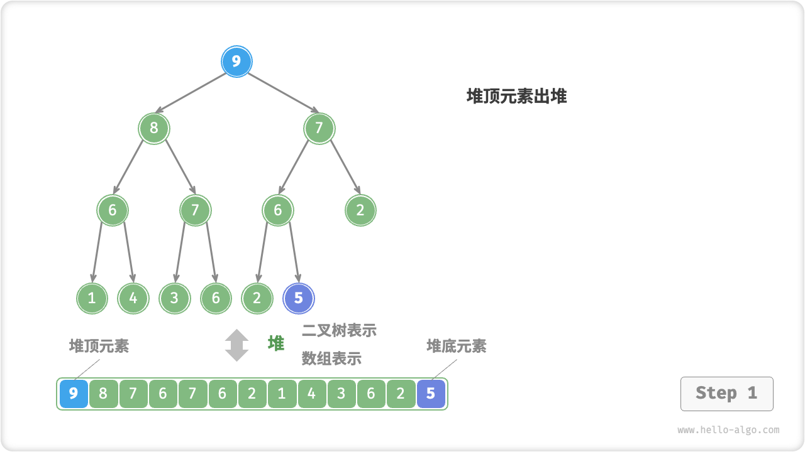

=== "<2>"
    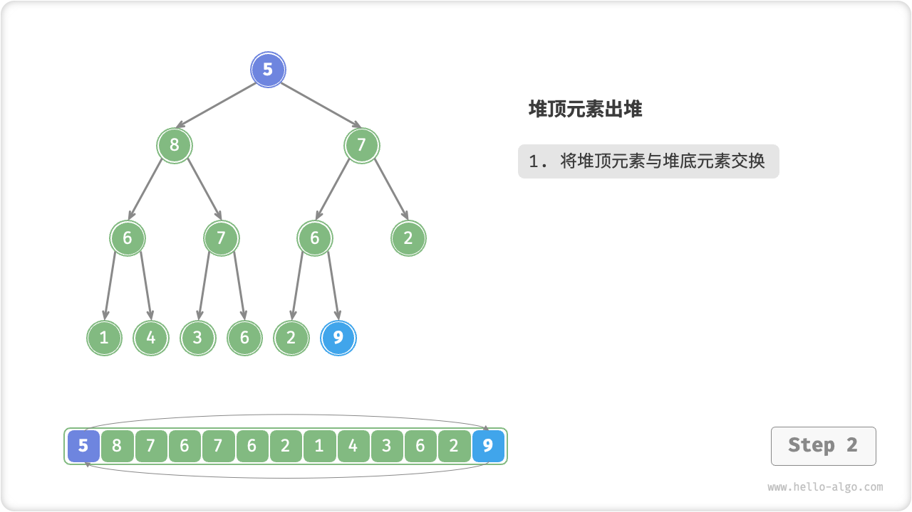

=== "<3>"
    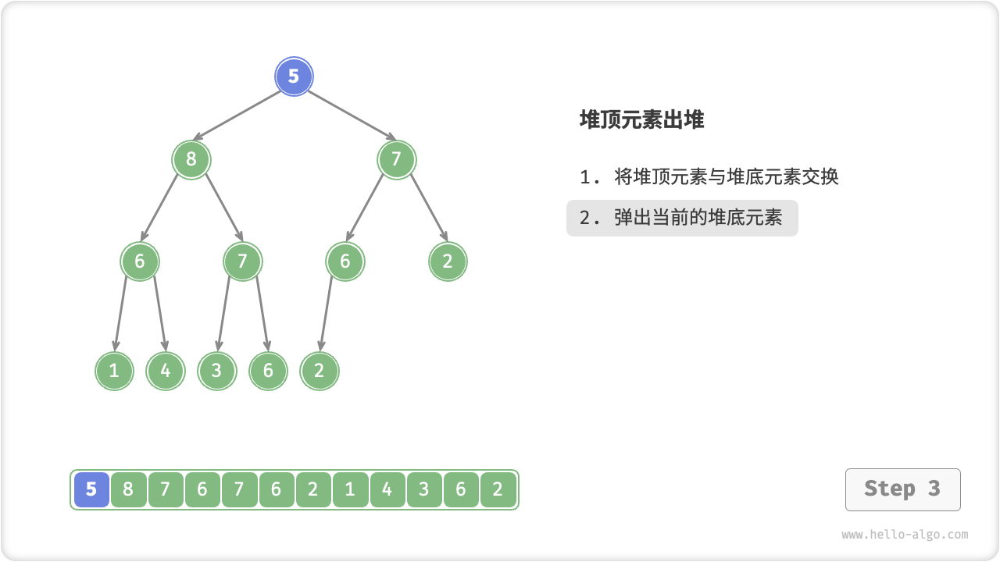

=== "<4>"
    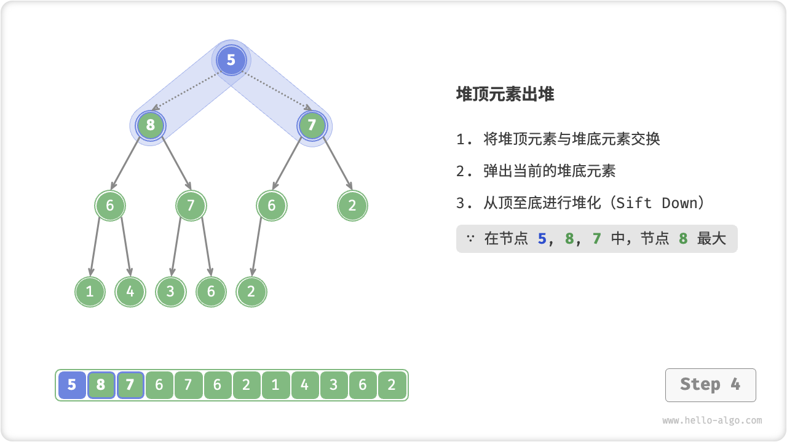

=== "<5>"
    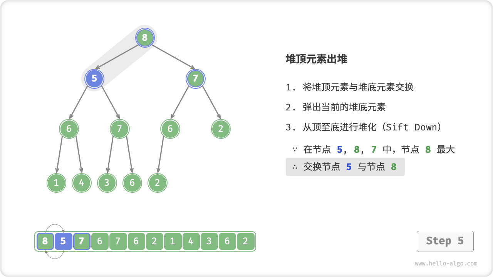

=== "<6>"
    

=== "<7>"
    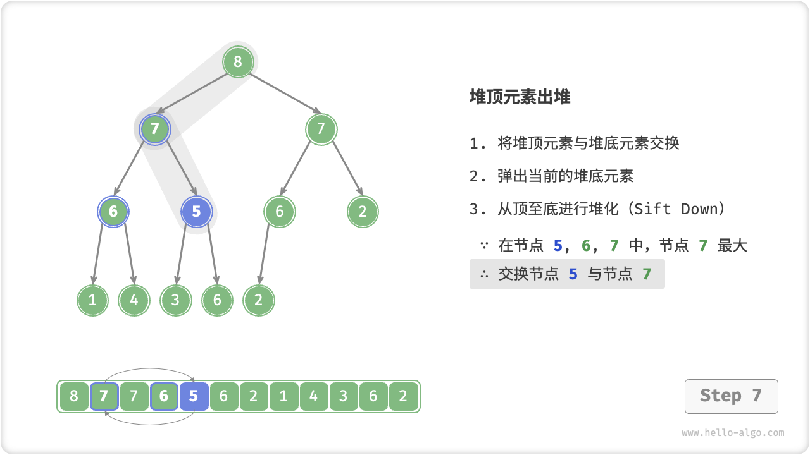

=== "<8>"
    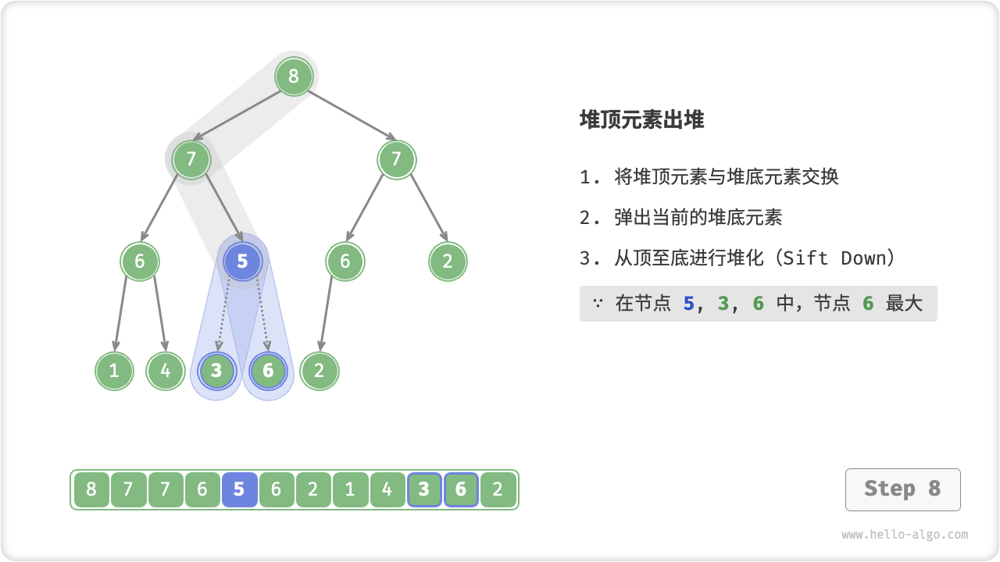

=== "<9>"
    

=== "<10>"
    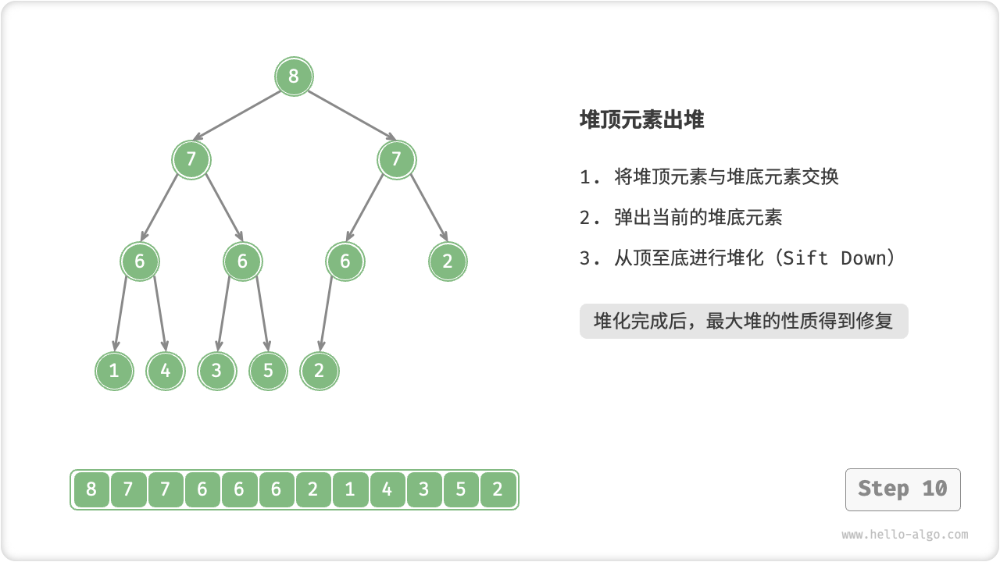

<p align="center"> 图：堆顶元素出堆步骤 </p>

与元素入堆操作相似，堆顶元素出堆操作的时间复杂度也为 $O(\log n)$ 。

=== "Java"

    ```java title="my_heap.java"
    /* 元素出堆 */
    int pop() {
        // 判空处理
        if (isEmpty())
            throw new IndexOutOfBoundsException();
        // 交换根节点与最右叶节点（即交换首元素与尾元素）
        swap(0, size() - 1);
        // 删除节点
        int val = maxHeap.remove(size() - 1);
        // 从顶至底堆化
        siftDown(0);
        // 返回堆顶元素
        return val;
    }

    /* 从节点 i 开始，从顶至底堆化 */
    void siftDown(int i) {
        while (true) {
            // 判断节点 i, l, r 中值最大的节点，记为 ma
            int l = left(i), r = right(i), ma = i;
            if (l < size() && maxHeap.get(l) > maxHeap.get(ma))
                ma = l;
            if (r < size() && maxHeap.get(r) > maxHeap.get(ma))
                ma = r;
            // 若节点 i 最大或索引 l, r 越界，则无需继续堆化，跳出
            if (ma == i)
                break;
            // 交换两节点
            swap(i, ma);
            // 循环向下堆化
            i = ma;
        }
    }
    ```

=== "C++"

    ```cpp title="my_heap.cpp"
    /* 元素出堆 */
    void pop() {
        // 判空处理
        if (empty()) {
            throw out_of_range("堆为空");
        }
        // 交换根节点与最右叶节点（即交换首元素与尾元素）
        swap(maxHeap[0], maxHeap[size() - 1]);
        // 删除节点
        maxHeap.pop_back();
        // 从顶至底堆化
        siftDown(0);
    }

    /* 从节点 i 开始，从顶至底堆化 */
    void siftDown(int i) {
        while (true) {
            // 判断节点 i, l, r 中值最大的节点，记为 ma
            int l = left(i), r = right(i), ma = i;
            // 若节点 i 最大或索引 l, r 越界，则无需继续堆化，跳出
            if (l < size() && maxHeap[l] > maxHeap[ma])
                ma = l;
            if (r < size() && maxHeap[r] > maxHeap[ma])
                ma = r;
            // 若节点 i 最大或索引 l, r 越界，则无需继续堆化，跳出
            if (ma == i)
                break;
            swap(maxHeap[i], maxHeap[ma]);
            // 循环向下堆化
            i = ma;
        }
    }
    ```

=== "Python"

    ```python title="my_heap.py"
    def pop(self) -> int:
        """元素出堆"""
        # 判空处理
        if self.is_empty():
            raise IndexError("堆为空")
        # 交换根节点与最右叶节点（即交换首元素与尾元素）
        self.swap(0, self.size() - 1)
        # 删除节点
        val = self.max_heap.pop()
        # 从顶至底堆化
        self.sift_down(0)
        # 返回堆顶元素
        return val

    def sift_down(self, i: int):
        """从节点 i 开始，从顶至底堆化"""
        while True:
            # 判断节点 i, l, r 中值最大的节点，记为 ma
            l, r, ma = self.left(i), self.right(i), i
            if l < self.size() and self.max_heap[l] > self.max_heap[ma]:
                ma = l
            if r < self.size() and self.max_heap[r] > self.max_heap[ma]:
                ma = r
            # 若节点 i 最大或索引 l, r 越界，则无需继续堆化，跳出
            if ma == i:
                break
            # 交换两节点
            self.swap(i, ma)
            # 循环向下堆化
            i = ma
    ```

=== "Go"

    ```go title="my_heap.go"
    /* 元素出堆 */
    func (h *maxHeap) pop() any {
        // 判空处理
        if h.isEmpty() {
            fmt.Println("error")
            return nil
        }
        // 交换根节点与最右叶节点（即交换首元素与尾元素）
        h.swap(0, h.size()-1)
        // 删除节点
        val := h.data[len(h.data)-1]
        h.data = h.data[:len(h.data)-1]
        // 从顶至底堆化
        h.siftDown(0)

        // 返回堆顶元素
        return val
    }

    /* 从节点 i 开始，从顶至底堆化 */
    func (h *maxHeap) siftDown(i int) {
        for true {
            // 判断节点 i, l, r 中值最大的节点，记为 max
            l, r, max := h.left(i), h.right(i), i
            if l < h.size() && h.data[l].(int) > h.data[max].(int) {
                max = l
            }
            if r < h.size() && h.data[r].(int) > h.data[max].(int) {
                max = r
            }
            // 若节点 i 最大或索引 l, r 越界，则无需继续堆化，跳出
            if max == i {
                break
            }
            // 交换两节点
            h.swap(i, max)
            // 循环向下堆化
            i = max
        }
    }
    ```

=== "JS"

    ```javascript title="my_heap.js"
    /* 元素出堆 */
    pop() {
        // 判空处理
        if (this.isEmpty()) throw new Error('堆为空');
        // 交换根节点与最右叶节点（即交换首元素与尾元素）
        this.#swap(0, this.size() - 1);
        // 删除节点
        const val = this.#maxHeap.pop();
        // 从顶至底堆化
        this.#siftDown(0);
        // 返回堆顶元素
        return val;
    }

    /* 从节点 i 开始，从顶至底堆化 */
    #siftDown(i) {
        while (true) {
            // 判断节点 i, l, r 中值最大的节点，记为 ma
            const l = this.#left(i),
                r = this.#right(i);
            let ma = i;
            if (l < this.size() && this.#maxHeap[l] > this.#maxHeap[ma]) ma = l;
            if (r < this.size() && this.#maxHeap[r] > this.#maxHeap[ma]) ma = r;
            // 若节点 i 最大或索引 l, r 越界，则无需继续堆化，跳出
            if (ma === i) break;
            // 交换两节点
            this.#swap(i, ma);
            // 循环向下堆化
            i = ma;
        }
    }
    ```

=== "TS"

    ```typescript title="my_heap.ts"
    /* 元素出堆 */
    pop(): number {
        // 判空处理
        if (this.isEmpty()) throw new RangeError('Heap is empty.');
        // 交换根节点与最右叶节点（即交换首元素与尾元素）
        this.swap(0, this.size() - 1);
        // 删除节点
        const val = this.maxHeap.pop();
        // 从顶至底堆化
        this.siftDown(0);
        // 返回堆顶元素
        return val;
    }

    /* 从节点 i 开始，从顶至底堆化 */
    siftDown(i: number): void {
        while (true) {
            // 判断节点 i, l, r 中值最大的节点，记为 ma
            const l = this.left(i),
                r = this.right(i);
            let ma = i;
            if (l < this.size() && this.maxHeap[l] > this.maxHeap[ma]) ma = l;
            if (r < this.size() && this.maxHeap[r] > this.maxHeap[ma]) ma = r;
            // 若节点 i 最大或索引 l, r 越界，则无需继续堆化，跳出
            if (ma === i) break;
            // 交换两节点
            this.swap(i, ma);
            // 循环向下堆化
            i = ma;
        }
    }
    ```

=== "C"

    ```c title="my_heap.c"
    /* 元素出堆 */
    int pop(maxHeap *h) {
        // 判空处理
        if (isEmpty(h)) {
            printf("heap is empty!");
            return INT_MAX;
        }
        // 交换根节点与最右叶节点（即交换首元素与尾元素）
        swap(h, 0, size(h) - 1);
        // 删除节点
        int val = h->data[h->size - 1];
        h->size--;
        // 从顶至底堆化
        siftDown(h, 0);

        // 返回堆顶元素
        return val;
    }

    /* 从节点 i 开始，从顶至底堆化 */
    void siftDown(maxHeap *h, int i) {
        while (true) {
            // 判断节点 i, l, r 中值最大的节点，记为 max
            int l = left(h, i);
            int r = right(h, i);
            int max = i;
            if (l < size(h) && h->data[l] > h->data[max]) {
                max = l;
            }
            if (r < size(h) && h->data[r] > h->data[max]) {
                max = r;
            }
            // 若节点 i 最大或索引 l, r 越界，则无需继续堆化，跳出
            if (max == i) {
                break;
            }
            // 交换两节点
            swap(h, i, max);
            // 循环向下堆化
            i = max;
        }
    }
    ```

=== "C#"

    ```csharp title="my_heap.cs"
    /* 元素出堆 */
    int pop() {
        // 判空处理
        if (isEmpty())
            throw new IndexOutOfRangeException();
        // 交换根节点与最右叶节点（即交换首元素与尾元素）
        swap(0, size() - 1);
        // 删除节点
        int val = maxHeap.Last();
        maxHeap.RemoveAt(size() - 1);
        // 从顶至底堆化
        siftDown(0);
        // 返回堆顶元素
        return val;
    }

    /* 从节点 i 开始，从顶至底堆化 */
    void siftDown(int i) {
        while (true) {
            // 判断节点 i, l, r 中值最大的节点，记为 ma
            int l = left(i), r = right(i), ma = i;
            if (l < size() && maxHeap[l] > maxHeap[ma])
                ma = l;
            if (r < size() && maxHeap[r] > maxHeap[ma])
                ma = r;
            // 若“节点 i 最大”或“越过叶节点”，则结束堆化
            if (ma == i) break;
            // 交换两节点
            swap(i, ma);
            // 循环向下堆化
            i = ma;
        }
    }
    ```

=== "Swift"

    ```swift title="my_heap.swift"
    /* 元素出堆 */
    func pop() -> Int {
        // 判空处理
        if isEmpty() {
            fatalError("堆为空")
        }
        // 交换根节点与最右叶节点（即交换首元素与尾元素）
        swap(i: 0, j: size() - 1)
        // 删除节点
        let val = maxHeap.remove(at: size() - 1)
        // 从顶至底堆化
        siftDown(i: 0)
        // 返回堆顶元素
        return val
    }

    /* 从节点 i 开始，从顶至底堆化 */
    func siftDown(i: Int) {
        var i = i
        while true {
            // 判断节点 i, l, r 中值最大的节点，记为 ma
            let l = left(i: i)
            let r = right(i: i)
            var ma = i
            if l < size(), maxHeap[l] > maxHeap[ma] {
                ma = l
            }
            if r < size(), maxHeap[r] > maxHeap[ma] {
                ma = r
            }
            // 若节点 i 最大或索引 l, r 越界，则无需继续堆化，跳出
            if ma == i {
                break
            }
            // 交换两节点
            swap(i: i, j: ma)
            // 循环向下堆化
            i = ma
        }
    }
    ```

=== "Zig"

    ```zig title="my_heap.zig"
    // 元素出堆
    fn pop(self: *Self) !T {
        // 判断处理
        if (self.isEmpty()) unreachable;
        // 交换根节点与最右叶节点（即交换首元素与尾元素）
        try self.swap(0, self.size() - 1);
        // 删除节点
        var val = self.max_heap.?.pop();
        // 从顶至底堆化
        try self.siftDown(0);
        // 返回堆顶元素
        return val;
    } 

    // 从节点 i 开始，从顶至底堆化
    fn siftDown(self: *Self, i_: usize) !void {
        var i = i_;
        while (true) {
            // 判断节点 i, l, r 中值最大的节点，记为 ma
            var l = left(i);
            var r = right(i);
            var ma = i;
            if (l < self.size() and self.max_heap.?.items[l] > self.max_heap.?.items[ma]) ma = l;
            if (r < self.size() and self.max_heap.?.items[r] > self.max_heap.?.items[ma]) ma = r;
            // 若节点 i 最大或索引 l, r 越界，则无需继续堆化，跳出
            if (ma == i) break;
            // 交换两节点
            try self.swap(i, ma);
            // 循环向下堆化
            i = ma;
        }
    }
    ```

=== "Dart"

    ```dart title="my_heap.dart"
    /* 元素出堆 */
    int pop() {
      // 判空处理
      if (isEmpty()) throw Exception('堆为空');
      // 交换根节点与最右叶节点（即交换首元素与尾元素）
      _swap(0, size() - 1);
      // 删除节点
      int val = _maxHeap.removeLast();
      // 从顶至底堆化
      siftDown(0);
      // 返回堆顶元素
      return val;
    }

    /* 从节点 i 开始，从顶至底堆化 */
    void siftDown(int i) {
      while (true) {
        // 判断节点 i, l, r 中值最大的节点，记为 ma
        int l = _left(i);
        int r = _right(i);
        int ma = i;
        if (l < size() && _maxHeap[l] > _maxHeap[ma]) ma = l;
        if (r < size() && _maxHeap[r] > _maxHeap[ma]) ma = r;
        // 若节点 i 最大或索引 l, r 越界，则无需继续堆化，跳出
        if (ma == i) break;
        // 交换两节点
        _swap(i, ma);
        // 循环向下堆化
        i = ma;
      }
    }
    ```

=== "Rust"

    ```rust title="my_heap.rs"
    /* 元素出堆 */
    fn pop(&mut self) -> i32 {
        // 判空处理
        if self.is_empty() {
            panic!("index out of bounds");
        }
        // 交换根节点与最右叶节点（即交换首元素与尾元素）
        self.swap(0, self.size() - 1);
        // 删除节点
        let val = self.max_heap.remove(self.size() - 1);
        // 从顶至底堆化
        self.sift_down(0);
        // 返回堆顶元素
        val
    }

    /* 从节点 i 开始，从顶至底堆化 */
    fn sift_down(&mut self, mut i: usize) {
        loop {
            // 判断节点 i, l, r 中值最大的节点，记为 ma
            let (l, r, mut ma) = (Self::left(i), Self::right(i), i);
            if l < self.size() && self.max_heap[l] > self.max_heap[ma] {
                ma = l;
            }
            if r < self.size() && self.max_heap[r] > self.max_heap[ma] {
                ma = r;
            }
            // 若节点 i 最大或索引 l, r 越界，则无需继续堆化，跳出
            if ma == i {
                break;
            }
            // 交换两节点
            self.swap(i, ma);
            // 循环向下堆化
            i = ma;
        }
    }
    ```

## 8.1.3 &nbsp; 堆常见应用

- **优先队列**：堆通常作为实现优先队列的首选数据结构，其入队和出队操作的时间复杂度均为 $O(\log n)$ ，而建队操作为 $O(n)$ ，这些操作都非常高效。
- **堆排序**：给定一组数据，我们可以用它们建立一个堆，然后不断地执行元素出堆操作，从而得到有序数据。然而，我们通常会使用一种更优雅的方式实现堆排序，详见后续的堆排序章节。
- **获取最大的 $k$ 个元素**：这是一个经典的算法问题，同时也是一种典型应用，例如选择热度前 10 的新闻作为微博热搜，选取销量前 10 的商品等。
