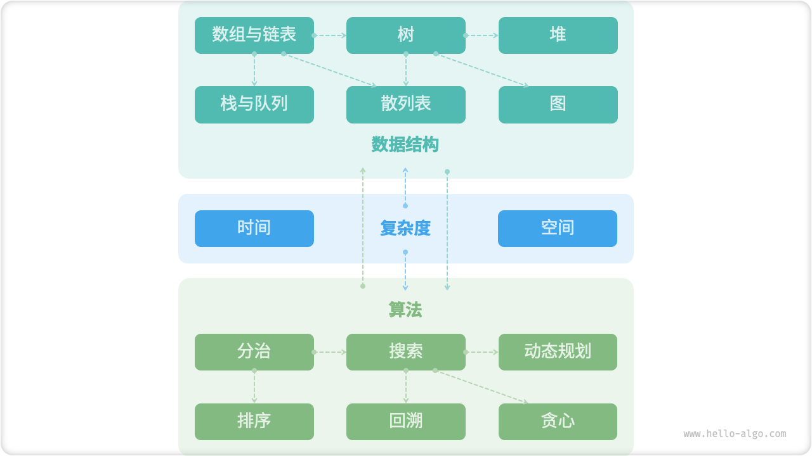

# 0.1. &nbsp; 关于本书

五年前发生的一件事，成为了我职业生涯的重要转折点。当时的我在交大读研，对互联网求职一无所知，但仍然硬着头皮申请了 Microsoft 软件工程师实习。面试官让我在白板上写出“快速排序”代码，我畏畏缩缩地写了一个“冒泡排序”，并且还写错了` (ToT) ` 。从面试官的表情上，我看到了一个大大的 "GG" 。

此次失利倒逼我开始刷算法题。我采用“扫雷游戏”式的学习方法，两眼一抹黑刷题，扫到不会的“雷”就通过查资料把它“排掉”，配合周期性总结，逐渐形成了数据结构与算法的知识图景。幸运地，我在秋招斩获了多家大厂的 Offer 。

回想自己当初在“扫雷式”刷题中被炸的满头包的痛苦，思考良久，**我意识到一本“前期刷题必看”的读物可以使算法小白少走许多弯路**。写作意愿滚滚袭来，那就动笔吧：

<h4 align="center"> Hello，算法！ </h4>

## 0.1.1. &nbsp; 读者对象

如果您是「算法初学者」，完全没有接触过算法，或者已经有少量刷题，对数据结构与算法有朦胧的理解，在会与不会之间反复横跳，那么这本书就是为您而写！

如果您是「算法老手」，已经积累一定刷题量，接触过大多数题型，那么本书可以帮助你回顾与梳理算法知识体系，仓库源代码可以被当作“刷题工具库”或“算法字典”来使用。

如果您是「算法大佬」，希望得到你的宝贵意见建议，或者[一起参与创作](https://www.hello-algo.com/chapter_appendix/contribution/)。

!!! success "前置条件"

    您需要至少具备任一语言的编程基础，能够阅读和编写简单代码。

## 0.1.2. &nbsp; 内容结构

本书主要内容分为复杂度分析、数据结构、算法三个部分。

- **复杂度分析**：数据结构与算法的评价维度、算法效率的评估方法。时间复杂度、空间复杂度，包括推算方法、常见类型、示例等。
- **数据结构**：常用的基本数据类型，数据在内存中的存储方式、数据结构分类方法。数组、链表、栈、队列、散列表、树、堆、图等数据结构，内容包括定义、优劣势、常用操作、常见类型、典型应用、实现方法等。
- **算法**：查找算法、排序算法、搜索与回溯、动态规划、分治算法，内容包括定义、使用场景、优劣势、时空效率、实现方法、示例题目等。

 Fig. Hello 算法内容结构 

## 0.1.3. &nbsp; 致谢

本书的成书过程中，我获得了许多人的帮助，包括但不限于：

- 感谢我的女朋友泡泡担任本书的首位读者，从算法小白的视角为本书的写作提出了许多建议，使这本书更加适合算法初学者来阅读。
- 感谢腾宝、琦宝、飞宝为本书起了个响当当的名字，好听又有梗，直接唤起我最初敲下第一行代码 "Hello, World!" 的回忆。
- 感谢我的导师李博，在小酌畅谈时您告诉我“觉得应该做就去做”，坚定了我写这本书的决心。
- 感谢苏潼为本书设计了封面和 LOGO ，我有些强迫症，前后多次修改，谢谢你的耐心。
- 感谢 @squidfunk 给出的写作排版建议，以及优秀开源项目 [Material-for-MkDocs](https://github.com/squidfunk/mkdocs-material/tree/master) 。

本书鼓励“手脑并用”的学习方式，在这点上受到了《动手学深度学习》很大影响，也在此向各位同学强烈推荐这本著作，包括[中文版](https://github.com/d2l-ai/d2l-zh)、[英文版](https://github.com/d2l-ai/d2l-en)、[李沐老师 bilibili 主页](https://space.bilibili.com/1567748478)。

在写作过程中，我阅读了许多数据结构与算法的教材与文章，这些著作为本书作出了很好的榜样，保证了本书内容的正确性与质量，感谢前辈们的精彩创作！

感谢父母，你们一贯的支持与鼓励给了我自由度来做这些有趣的事。
