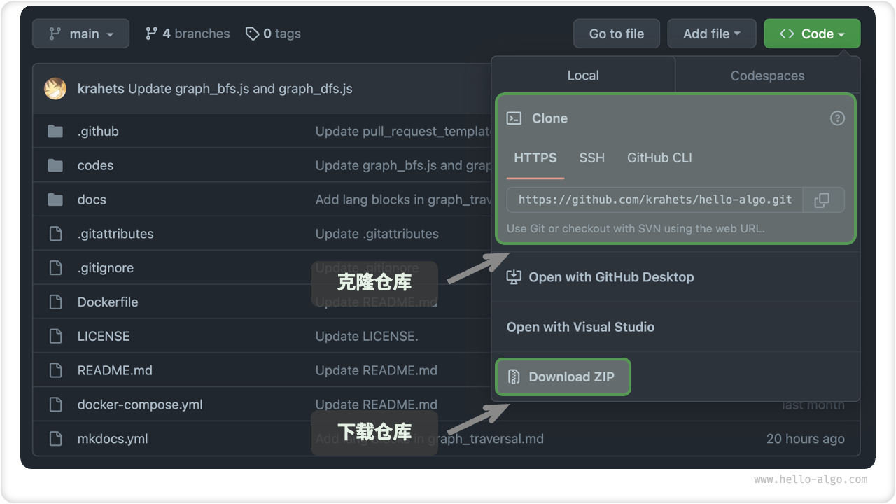
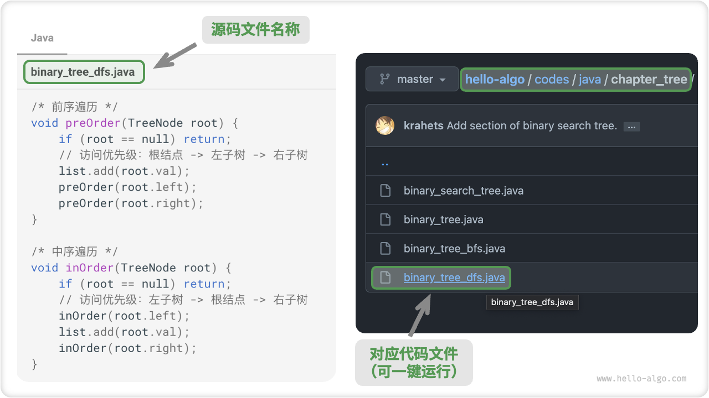

# 0.2. &nbsp; 如何使用本书

**强烈建议通读本节内容，以获取最佳学习体验**。

## 0.2.1. &nbsp; 行文风格约定

标题后标注 `*` 的是选读章节，内容相对较难。如果你的时间有限，建议可以先跳过。

文章中的重要名词会用 `「」` 括号标注，例如 `「数组 Array」` 。建议记住这些名词，包括英文翻译，以便后续阅读文献时使用。

重点内容、总起句、总结句会被 **加粗** ，此类文字值得特别关注。

专有名词和有特指含义的词句会使用 `“ ”` 双引号标注，以避免歧义。

本书部分放弃了编程语言的注释规范，以换取更加紧凑的内容排版。注释主要分为三种类型：标题注释、内容注释、多行注释。

=== "Java"

    ```java title=""
    /* 标题注释，用于标注函数、类、测试样例等 */
    
    // 内容注释，用于详解代码
    
    /**
     * 多行
     * 注释
     */
    ```

=== "C++"

    ```cpp title=""
    /* 标题注释，用于标注函数、类、测试样例等 */
    
    // 内容注释，用于详解代码
    
    /**
     * 多行
     * 注释
     */
    ```

=== "Python"

    ```python title=""
    """ 标题注释，用于标注函数、类、测试样例等 """
    
    # 内容注释，用于详解代码
    
    """
    多行
    注释
    """
    ```

=== "Go"

    ```go title=""
    /* 标题注释，用于标注函数、类、测试样例等 */
    
    // 内容注释，用于详解代码
    
    /**
     * 多行
     * 注释
     */
    ```

=== "JavaScript"

    ```javascript title=""
    /* 标题注释，用于标注函数、类、测试样例等 */
    
    // 内容注释，用于详解代码
    
    /**
     * 多行
     * 注释
     */
    ```

=== "TypeScript"

    ```typescript title=""
    /* 标题注释，用于标注函数、类、测试样例等 */
    
    // 内容注释，用于详解代码
    
    /**
     * 多行
     * 注释
     */
    ```

=== "C"

    ```c title=""
    /* 标题注释，用于标注函数、类、测试样例等 */
    
    // 内容注释，用于详解代码
    
    /**
     * 多行
     * 注释
     */
    ```

=== "C#"

    ```csharp title=""
    /* 标题注释，用于标注函数、类、测试样例等 */
    
    // 内容注释，用于详解代码
    
    /**
     * 多行
     * 注释
     */
    ```

=== "Swift"

    ```swift title=""
    /* 标题注释，用于标注函数、类、测试样例等 */
    
    // 内容注释，用于详解代码
    
    /**
     * 多行
     * 注释
     */
    ```

=== "Zig"

    ```zig title=""
    // 标题注释，用于标注函数、类、测试样例等
    
    // 内容注释，用于详解代码
    
    // 多行
    // 注释
    ```

## 0.2.2. &nbsp; 在动画图解中高效学习

视频和图片相比于文字的信息密度和结构化程度更高，更容易理解。在本书中，**知识重难点会主要以动画、图解的形式呈现**，而文字的作用则是作为动画和图的解释与补充。

阅读本书时，若发现某段内容提供了动画或图解，**建议你以图为主线**，将文字内容（一般在图的上方）对齐到图中内容，综合来理解。


## 0.2.3. &nbsp; 在代码实践中加深理解

本书的配套代码托管在[GitHub 仓库](https://github.com/krahets/hello-algo)，**源代码包含详细注释，配有测试样例，可以直接运行**。

- 若学习时间紧张，**建议至少将所有代码通读并运行一遍**。
- 若时间允许，**强烈建议对照着代码自己敲一遍**。相比于读代码，写代码的过程往往能带来新的收获。

### 1) 安装编程环境

如果没有本地编程环境，可以参照[下节](https://www.hello-algo.com/chapter_preface/installation/)。

### 2) 下载代码仓

如果已经安装 [Git](https://git-scm.com/downloads) ，可以通过命令行来克隆代码仓。

```shell
git clone https://github.com/krahets/hello-algo.git
```

当然，你也可以点击“Download ZIP”直接下载代码压缩包，解压即可。



### 3) 运行源代码

若代码块的顶部标有文件名称，则可在仓库 `codes` 文件夹中找到对应的 **源代码文件**。



源代码文件可以帮助你省去不必要的调试时间，将精力集中在学习内容上。


## 0.2.4. &nbsp; 在提问讨论中共同成长

阅读本书时，请不要“惯着”那些弄不明白的知识点。**欢迎在评论区留下你的问题**，小伙伴们和我都会给予解答，您一般 2 日内会得到回复。

同时，也希望你可以多花时间逛逛评论区。一方面，可以看看大家遇到了什么问题，反过来查漏补缺，这往往可以引起更加深度的思考。另一方面，也希望你可以慷慨地解答小伙伴们的问题、分享自己的见解，大家互相学习与进步！


