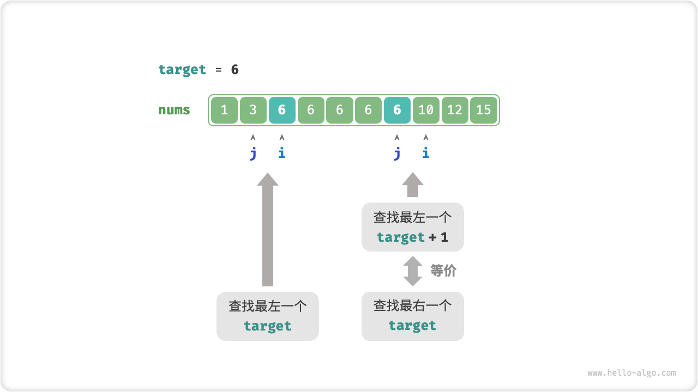

# 10.3 &nbsp; 二分查找边界

## 10.3.1 &nbsp; 查找左边界

!!! question

    给定一个长度为 $n$ 的有序数组 `nums` ，数组可能包含重复元素。请返回数组中最左一个元素 `target` 的索引。若数组中不包含该元素，则返回 $-1$ 。

回忆二分查找插入点的方法，搜索完成后 $i$ 指向最左一个 `target` ，**因此查找插入点本质上是在查找最左一个 `target` 的索引**。

考虑通过查找插入点的函数实现查找左边界。请注意，数组中可能不包含 `target` ，此时有两种可能：

1. 插入点的索引 $i$ 越界；
2. 元素 `nums[i]` 与 `target` 不相等；

当遇到以上两种情况时，直接返回 $-1$ 即可。

=== "Java"

    ```java title="binary_search_edge.java"
    /* 二分查找最左一个 target */
    int binarySearchLeftEdge(int[] nums, int target) {
        // 等价于查找 target 的插入点
        int i = binary_search_insertion.binarySearchInsertion(nums, target);
        // 未找到 target ，返回 -1
        if (i == nums.length || nums[i] != target) {
            return -1;
        }
        // 找到 target ，返回索引 i
        return i;
    }
    ```

=== "C++"

    ```cpp title="binary_search_edge.cpp"
    /* 二分查找最左一个 target */
    int binarySearchLeftEdge(vector<int> &nums, int target) {
        // 等价于查找 target 的插入点
        int i = binarySearchInsertion(nums, target);
        // 未找到 target ，返回 -1
        if (i == nums.size() || nums[i] != target) {
            return -1;
        }
        // 找到 target ，返回索引 i
        return i;
    }
    ```

=== "Python"

    ```python title="binary_search_edge.py"
    def binary_search_left_edge(nums: list[int], target: int) -> int:
        """二分查找最左一个 target"""
        # 等价于查找 target 的插入点
        i = binary_search_insertion(nums, target)
        # 未找到 target ，返回 -1
        if i == len(nums) or nums[i] != target:
            return -1
        # 找到 target ，返回索引 i
        return i
    ```

=== "Go"

    ```go title="binary_search_edge.go"
    [class]{}-[func]{binarySearchLeftEdge}
    ```

=== "JS"

    ```javascript title="binary_search_edge.js"
    [class]{}-[func]{binarySearchLeftEdge}
    ```

=== "TS"

    ```typescript title="binary_search_edge.ts"
    [class]{}-[func]{binarySearchLeftEdge}
    ```

=== "C"

    ```c title="binary_search_edge.c"
    [class]{}-[func]{binarySearchLeftEdge}
    ```

=== "C#"

    ```csharp title="binary_search_edge.cs"
    /* 二分查找最左一个 target */
    int binarySearchLeftEdge(int[] nums, int target) {
        // 等价于查找 target 的插入点
        int i = binary_search_insertion.binarySearchInsertion(nums, target);
        // 未找到 target ，返回 -1
        if (i == nums.Length || nums[i] != target) {
            return -1;
        }
        // 找到 target ，返回索引 i
        return i;
    }
    ```

=== "Swift"

    ```swift title="binary_search_edge.swift"
    /* 二分查找最左一个 target */
    func binarySearchLeftEdge(nums: [Int], target: Int) -> Int {
        // 等价于查找 target 的插入点
        let i = binarySearchInsertion(nums: nums, target: target)
        // 未找到 target ，返回 -1
        if i == nums.count || nums[i] != target {
            return -1
        }
        // 找到 target ，返回索引 i
        return i
    }
    ```

=== "Zig"

    ```zig title="binary_search_edge.zig"
    [class]{}-[func]{binarySearchLeftEdge}
    ```

=== "Dart"

    ```dart title="binary_search_edge.dart"
    /* 二分查找最左一个 target */
    int binarySearchLeftEdge(List<int> nums, int target) {
      // 等价于查找 target 的插入点
      int i = binarySearchInsertion(nums, target);
      // 未找到 target ，返回 -1
      if (i == nums.length || nums[i] != target) {
        return -1;
      }
      // 找到 target ，返回索引 i
      return i;
    }
    ```

=== "Rust"

    ```rust title="binary_search_edge.rs"
    [class]{}-[func]{binary_search_left_edge}
    ```

## 10.3.2 &nbsp; 查找右边界

那么如何查找最右一个 `target` 呢？最直接的方式是修改代码，替换在 `nums[m] == target` 情况下的指针收缩操作。代码在此省略，有兴趣的同学可以自行实现。

下面我们介绍两种更加取巧的方法。

### 1. &nbsp; 复用查找左边界

实际上，我们可以利用查找最左元素的函数来查找最右元素，具体方法为：**将查找最右一个 `target` 转化为查找最左一个 `target + 1`**。

查找完成后，指针 $i$ 指向最左一个 `target + 1`（如果存在），而 $j$ 指向最右一个 `target` ，**因此返回 $j$ 即可**。



<p align="center"> 图：将查找右边界转化为查找左边界 </p>

请注意，返回的插入点是 $i$ ，因此需要将其减 $1$ ，从而获得 $j$ 。

=== "Java"

    ```java title="binary_search_edge.java"
    /* 二分查找最右一个 target */
    int binarySearchRightEdge(int[] nums, int target) {
        // 转化为查找最左一个 target + 1
        int i = binary_search_insertion.binarySearchInsertion(nums, target + 1);
        // j 指向最右一个 target ，i 指向首个大于 target 的元素
        int j = i - 1;
        // 未找到 target ，返回 -1
        if (j == -1 || nums[j] != target) {
            return -1;
        }
        // 找到 target ，返回索引 j
        return j;
    }
    ```

=== "C++"

    ```cpp title="binary_search_edge.cpp"
    /* 二分查找最右一个 target */
    int binarySearchRightEdge(vector<int> &nums, int target) {
        // 转化为查找最左一个 target + 1
        int i = binarySearchInsertion(nums, target + 1);
        // j 指向最右一个 target ，i 指向首个大于 target 的元素
        int j = i - 1;
        // 未找到 target ，返回 -1
        if (j == -1 || nums[j] != target) {
            return -1;
        }
        // 找到 target ，返回索引 j
        return j;
    }
    ```

=== "Python"

    ```python title="binary_search_edge.py"
    def binary_search_right_edge(nums: list[int], target: int) -> int:
        """二分查找最右一个 target"""
        # 转化为查找最左一个 target + 1
        i = binary_search_insertion(nums, target + 1)
        # j 指向最右一个 target ，i 指向首个大于 target 的元素
        j = i - 1
        # 未找到 target ，返回 -1
        if j == -1 or nums[j] != target:
            return -1
        # 找到 target ，返回索引 j
        return j
    ```

=== "Go"

    ```go title="binary_search_edge.go"
    [class]{}-[func]{binarySearchRightEdge}
    ```

=== "JS"

    ```javascript title="binary_search_edge.js"
    [class]{}-[func]{binarySearchRightEdge}
    ```

=== "TS"

    ```typescript title="binary_search_edge.ts"
    [class]{}-[func]{binarySearchRightEdge}
    ```

=== "C"

    ```c title="binary_search_edge.c"
    [class]{}-[func]{binarySearchRightEdge}
    ```

=== "C#"

    ```csharp title="binary_search_edge.cs"
    /* 二分查找最右一个 target */
    int binarySearchRightEdge(int[] nums, int target) {
        // 转化为查找最左一个 target + 1
        int i = binary_search_insertion.binarySearchInsertion(nums, target + 1);
        // j 指向最右一个 target ，i 指向首个大于 target 的元素
        int j = i - 1;
        // 未找到 target ，返回 -1
        if (j == -1 || nums[j] != target) {
            return -1;
        }
        // 找到 target ，返回索引 j
        return j;
    }
    ```

=== "Swift"

    ```swift title="binary_search_edge.swift"
    /* 二分查找最右一个 target */
    func binarySearchRightEdge(nums: [Int], target: Int) -> Int {
        // 转化为查找最左一个 target + 1
        let i = binarySearchInsertion(nums: nums, target: target + 1)
        // j 指向最右一个 target ，i 指向首个大于 target 的元素
        let j = i - 1
        // 未找到 target ，返回 -1
        if j == -1 || nums[j] != target {
            return -1
        }
        // 找到 target ，返回索引 j
        return j
    }
    ```

=== "Zig"

    ```zig title="binary_search_edge.zig"
    [class]{}-[func]{binarySearchRightEdge}
    ```

=== "Dart"

    ```dart title="binary_search_edge.dart"
    /* 二分查找最右一个 target */
    int binarySearchRightEdge(List<int> nums, int target) {
      // 转化为查找最左一个 target + 1
      int i = binarySearchInsertion(nums, target + 1);
      // j 指向最右一个 target ，i 指向首个大于 target 的元素
      int j = i - 1;
      // 未找到 target ，返回 -1
      if (j == -1 || nums[j] != target) {
        return -1;
      }
      // 找到 target ，返回索引 j
      return j;
    }
    ```

=== "Rust"

    ```rust title="binary_search_edge.rs"
    [class]{}-[func]{binary_search_right_edge}
    ```

### 2. &nbsp; 转化为查找元素

我们知道，当数组不包含 `target` 时，最后 $i$ , $j$ 会分别指向首个大于、小于 `target` 的元素。

根据上述结论，我们可以构造一个数组中不存在的元素，用于查找左右边界：

- 查找最左一个 `target` ：可以转化为查找 `target - 0.5` ，并返回指针 $i$ 。
- 查找最右一个 `target` ：可以转化为查找 `target + 0.5` ，并返回指针 $j$ 。


<p align="center"> 图：将查找边界转化为查找元素 </p>

代码在此省略，值得注意的有：

- 给定数组不包含小数，这意味着我们无须关心如何处理相等的情况。
- 因为该方法引入了小数，所以需要将函数中的变量 `target` 改为浮点数类型。
