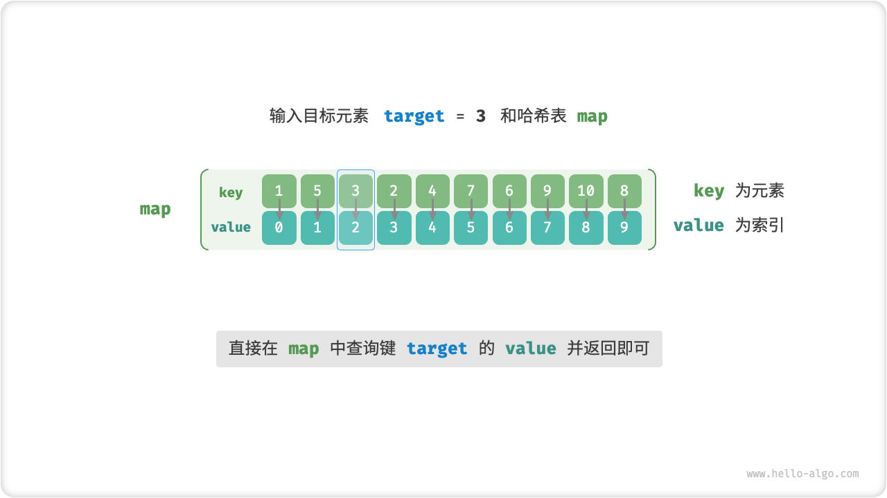

# 10.3. &nbsp; 哈希查找

「哈希查找 Hash Searching」通过使用哈希表来存储所需的键值对，从而可在 $O(1)$ 时间内完成“键 $\rightarrow$ 值”的查找操作。

与线性查找相比，哈希查找通过利用额外空间来提高效率，体现了“以空间换时间”的算法思想。

## 10.3.1. &nbsp; 算法实现

例如，若我们想要在给定数组中找到目标元素 `target` 的索引，则可以使用哈希查找来实现。



<p align="center"> Fig. 哈希查找数组索引 </p>

=== "Java"

    ```java title="hashing_search.java"
    /* 哈希查找（数组） */
    int hashingSearchArray(Map<Integer, Integer> map, int target) {
        // 哈希表的 key: 目标元素，value: 索引
        // 若哈希表中无此 key ，返回 -1
        return map.getOrDefault(target, -1);
    }
    ```

=== "C++"

    ```cpp title="hashing_search.cpp"
    /* 哈希查找（数组） */
    int hashingSearchArray(unordered_map<int, int> map, int target) {
        // 哈希表的 key: 目标元素，value: 索引
        // 若哈希表中无此 key ，返回 -1
        if (map.find(target) == map.end())
            return -1;
        return map[target];
    }
    ```

=== "Python"

    ```python title="hashing_search.py"
    def hashing_search_array(mapp: dict[int, int], target: int) -> int:
        """哈希查找（数组）"""
        # 哈希表的 key: 目标元素，value: 索引
        # 若哈希表中无此 key ，返回 -1
        return mapp.get(target, -1)
    ```

=== "Go"

    ```go title="hashing_search.go"
    /* 哈希查找（数组） */
    func hashingSearchArray(m map[int]int, target int) int {
        // 哈希表的 key: 目标元素，value: 索引
        // 若哈希表中无此 key ，返回 -1
        if index, ok := m[target]; ok {
            return index
        } else {
            return -1
        }
    }
    ```

=== "JavaScript"

    ```javascript title="hashing_search.js"
    /* 哈希查找（数组） */
    function hashingSearchArray(map, target) {
        // 哈希表的 key: 目标元素，value: 索引
        // 若哈希表中无此 key ，返回 -1
        return map.has(target) ? map.get(target) : -1;
    }
    ```

=== "TypeScript"

    ```typescript title="hashing_search.ts"
    /* 哈希查找（数组） */
    function hashingSearchArray(map: Map<number, number>, target: number): number {
        // 哈希表的 key: 目标元素，value: 索引
        // 若哈希表中无此 key ，返回 -1
        return map.has(target) ? (map.get(target) as number) : -1;
    }
    ```

=== "C"

    ```c title="hashing_search.c"
    [class]{}-[func]{hashingSearchArray}
    ```

=== "C#"

    ```csharp title="hashing_search.cs"
    /* 哈希查找（数组） */
    int hashingSearchArray(Dictionary<int, int> map, int target)
    {
        // 哈希表的 key: 目标元素，value: 索引
        // 若哈希表中无此 key ，返回 -1
        return map.GetValueOrDefault(target, -1);
    }
    ```

=== "Swift"

    ```swift title="hashing_search.swift"
    /* 哈希查找（数组） */
    func hashingSearchArray(map: [Int: Int], target: Int) -> Int {
        // 哈希表的 key: 目标元素，value: 索引
        // 若哈希表中无此 key ，返回 -1
        return map[target, default: -1]
    }
    ```

=== "Zig"

    ```zig title="hashing_search.zig"
    // 哈希查找（数组）
    fn hashingSearchArray(comptime T: type, map: std.AutoHashMap(T, T), target: T) T {
        // 哈希表的 key: 目标元素，value: 索引
        // 若哈希表中无此 key ，返回 -1   
        if (map.getKey(target) == null) return -1;
        return map.get(target).?;
    }
    ```

同样，若要根据目标节点值 target 查找对应的链表节点对象，也可以采用哈希查找方法。


<p align="center"> Fig. 哈希查找链表节点 </p>

=== "Java"

    ```java title="hashing_search.java"
    /* 哈希查找（链表） */
    ListNode hashingSearchLinkedList(Map<Integer, ListNode> map, int target) {
        // 哈希表的 key: 目标节点值，value: 节点对象
        // 若哈希表中无此 key ，返回 null
        return map.getOrDefault(target, null);
    }
    ```

=== "C++"

    ```cpp title="hashing_search.cpp"
    /* 哈希查找（链表） */
    ListNode *hashingSearchLinkedList(unordered_map<int, ListNode *> map, int target) {
        // 哈希表的 key: 目标节点值，value: 节点对象
        // 若哈希表中无此 key ，返回 nullptr
        if (map.find(target) == map.end())
            return nullptr;
        return map[target];
    }
    ```

=== "Python"

    ```python title="hashing_search.py"
    def hashing_search_linkedlist(
        mapp: dict[int, ListNode], target: int
    ```

=== "Go"

    ```go title="hashing_search.go"
    /* 哈希查找（链表） */
    func hashingSearchLinkedList(m map[int]*ListNode, target int) *ListNode {
        // 哈希表的 key: 目标节点值，value: 节点对象
        // 若哈希表中无此 key ，返回 nil
        if node, ok := m[target]; ok {
            return node
        } else {
            return nil
        }
    }
    ```

=== "JavaScript"

    ```javascript title="hashing_search.js"
    /* 哈希查找（链表） */
    function hashingSearchLinkedList(map, target) {
        // 哈希表的 key: 目标节点值，value: 节点对象
        // 若哈希表中无此 key ，返回 null
        return map.has(target) ? map.get(target) : null;
    }
    ```

=== "TypeScript"

    ```typescript title="hashing_search.ts"
    /* 哈希查找（链表） */
    function hashingSearchLinkedList(map: Map<number, ListNode>, target: number): ListNode | null {
        // 哈希表的 key: 目标节点值，value: 节点对象
        // 若哈希表中无此 key ，返回 null
        return map.has(target) ? (map.get(target) as ListNode) : null;
    }
    ```

=== "C"

    ```c title="hashing_search.c"
    [class]{}-[func]{hashingSearchLinkedList}
    ```

=== "C#"

    ```csharp title="hashing_search.cs"
    /* 哈希查找（链表） */
    ListNode? hashingSearchLinkedList(Dictionary<int, ListNode> map, int target)
    {

        // 哈希表的 key: 目标节点值，value: 节点对象
        // 若哈希表中无此 key ，返回 null
        return map.GetValueOrDefault(target);
    }
    ```

=== "Swift"

    ```swift title="hashing_search.swift"
    /* 哈希查找（链表） */
    func hashingSearchLinkedList(map: [Int: ListNode], target: Int) -> ListNode? {
        // 哈希表的 key: 目标节点值，value: 节点对象
        // 若哈希表中无此 key ，返回 null
        return map[target]
    }
    ```

=== "Zig"

    ```zig title="hashing_search.zig"
    // 哈希查找（链表）
    fn hashingSearchLinkedList(comptime T: type, map: std.AutoHashMap(T, *inc.ListNode(T)), target: T) ?*inc.ListNode(T) {
        // 哈希表的 key: 目标节点值，value: 节点对象
        // 若哈希表中无此 key ，返回 null 
        if (map.getKey(target) == null) return null;
        return map.get(target);
    }
    ```

## 10.3.2. &nbsp; 复杂度分析

**时间复杂度 $O(1)$** ：哈希表的查找操作使用 $O(1)$ 时间。

**空间复杂度 $O(n)$** ：其中 $n$ 是数组或链表的长度。

## 10.3.3. &nbsp; 优点与局限性

哈希查找的性能表现相当优秀，查找、插入、删除操作的平均时间复杂度均为 $O(1)$ 。尽管如此，哈希查找仍然存在一些问题：

- 辅助哈希表需要占用 $O(n)$ 的额外空间，意味着需要预留更多的计算机内存；
- 构建和维护哈希表需要时间，因此哈希查找不适用于高频增删、低频查找的场景；
- 当哈希冲突严重时，哈希表可能退化为链表，导致时间复杂度劣化至 $O(n)$ ；
- 当数据量较小时，线性查找可能比哈希查找更快。这是因为计算哈希函数可能比遍历一个小型数组更慢；

因此，在实际应用中，我们需要根据具体情况灵活选择解决方案。
