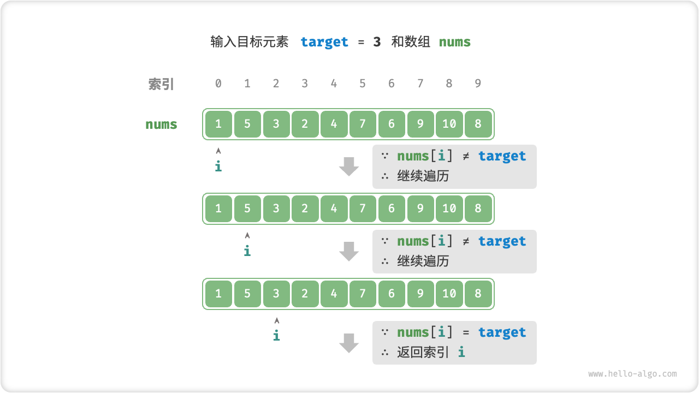

# 10.1. 线性查找

「线性查找 Linear Search」是一种最基础的查找方法，其从数据结构的一端开始，依次访问每个元素，直到另一端后停止。

## 10.1.1. 算法实现

线性查找实质上就是遍历数据结构 + 判断条件。比如，我们想要在数组 `nums` 中查找目标元素 `target` 的对应索引，那么可以在数组中进行线性查找。



=== "Java"

    ```java title="linear_search.java"
    /* 线性查找（数组） */
    int linearSearchArray(int[] nums, int target) {
        // 遍历数组
        for (int i = 0; i < nums.length; i++) {
            // 找到目标元素，返回其索引
            if (nums[i] == target)
                return i;
        }
        // 未找到目标元素，返回 -1
        return -1;
    }
    ```

=== "C++"

    ```cpp title="linear_search.cpp"
    /* 线性查找（数组） */
    int linearSearchArray(vector<int>& nums, int target) {
        // 遍历数组
        for (int i = 0; i < nums.size(); i++) {
            // 找到目标元素，返回其索引
            if (nums[i] == target)
                return i;
        }
        // 未找到目标元素，返回 -1
        return -1;
    }
    ```

=== "Python"

    ```python title="linear_search.py"
    """ 线性查找（数组） """
    def linear_search_array(nums, target):
        # 遍历数组
        for i in range(len(nums)):
            if nums[i] == target:  # 找到目标元素，返回其索引
                return i
        return -1                  # 未找到目标元素，返回 -1
    ```

=== "Go"

    ```go title="linear_search.go"
    /* 线性查找（数组） */
    func linearSearchArray(nums []int, target int) int {
        // 遍历数组
        for i := 0; i < len(nums); i++ {
            // 找到目标元素，返回其索引
            if nums[i] == target {
                return i
            }
        }
        // 未找到目标元素，返回 -1
        return -1
    }
    ```

=== "JavaScript"

    ```javascript title="linear_search.js"
    /* 线性查找（数组） */
    function linearSearchArray(nums, target) {
        // 遍历数组
        for (let i = 0; i < nums.length; i++) {
            // 找到目标元素，返回其索引
            if (nums[i] === target) {
                return i;
            }
        }
        // 未找到目标元素，返回 -1
        return -1; 
    }
    ```

=== "TypeScript"

    ```typescript title="linear_search.ts"
    /* 线性查找（数组）*/
    function linearSearchArray(nums: number[], target: number): number {
        // 遍历数组
        for (let i = 0; i < nums.length; i++) {
            // 找到目标元素，返回其索引
            if (nums[i] === target) {
                return i;
            }
        }
        // 未找到目标元素，返回 -1
        return -1;
    }
    ```

=== "C"

    ```c title="linear_search.c"
    [class]{}-[func]{linearSearchArray}
    ```

=== "C#"

    ```csharp title="linear_search.cs"
    /* 线性查找（数组） */
    int linearSearchArray(int[] nums, int target)
    {
        // 遍历数组
        for (int i = 0; i < nums.Length; i++)
        {
            // 找到目标元素，返回其索引
            if (nums[i] == target)
                return i;
        }
        // 未找到目标元素，返回 -1
        return -1;
    }
    ```

=== "Swift"

    ```swift title="linear_search.swift"
    /* 线性查找（数组） */
    func linearSearchArray(nums: [Int], target: Int) -> Int {
        // 遍历数组
        for i in nums.indices {
            // 找到目标元素，返回其索引
            if nums[i] == target {
                return i
            }
        }
        // 未找到目标元素，返回 -1
        return -1
    }
    ```

=== "Zig"

    ```zig title="linear_search.zig"
    // 线性查找（数组）
    fn linearSearchArray(comptime T: type, nums: std.ArrayList(T), target: T) T {
        // 遍历数组
        for (nums.items) |num, i| {
            // 找到目标元素， 返回其索引
            if (num == target) {
                return @intCast(T, i);
            }
        }
        // 未找到目标元素，返回 -1
        return -1;
    }
    ```

再比如，我们想要在给定一个目标结点值 `target` ，返回此结点对象，也可以在链表中进行线性查找。

=== "Java"

    ```java title="linear_search.java"
    /* 线性查找（链表） */
    ListNode linearSearchLinkedList(ListNode head, int target) {
        // 遍历链表
        while (head != null) {
            // 找到目标结点，返回之
            if (head.val == target)
                return head;
            head = head.next;
        }
        // 未找到目标结点，返回 null
        return null;
    }
    ```

=== "C++"

    ```cpp title="linear_search.cpp"
    /* 线性查找（链表） */
    ListNode* linearSearchLinkedList(ListNode* head, int target) {
        // 遍历链表
        while (head != nullptr) {
            // 找到目标结点，返回之
            if (head->val == target)
                return head;
            head = head->next;
        }
        // 未找到目标结点，返回 nullptr
        return nullptr;
    }
    ```

=== "Python"

    ```python title="linear_search.py"
    """ 线性查找（链表） """
    def linear_search_linkedlist(head, target):
        # 遍历链表
        while head:
            if head.val == target: # 找到目标结点，返回之
                return head
            head = head.next
        return None                # 未找到目标结点，返回 None
    ```

=== "Go"

    ```go title="linear_search.go"
    /* 线性查找（链表） */
    func linearSearchLinkedList(node *ListNode, target int) *ListNode {
        // 遍历链表
        for node != nil {
            // 找到目标结点，返回之
            if node.Val == target {
                return node
            }
            node = node.Next
        }
        // 未找到目标元素，返回 nil
        return nil
    }
    ```

=== "JavaScript"

    ```javascript title="linear_search.js"
    /* 线性查找（链表）*/
    function linearSearchLinkedList(head, target) {
        // 遍历链表
        while(head) {
            // 找到目标结点，返回之
            if(head.val === target) {
                return head;
            }
            head = head.next;
        }
        // 未找到目标结点，返回 null
        return null;
    }
    ```

=== "TypeScript"

    ```typescript title="linear_search.ts"
    /* 线性查找（链表）*/
    function linearSearchLinkedList(head: ListNode | null, target: number): ListNode | null {
        // 遍历链表
        while (head) {
            // 找到目标结点，返回之
            if (head.val === target) {
                return head;
            }
            head = head.next;
        }
        // 未找到目标结点，返回 null
        return null;
    }
    ```

=== "C"

    ```c title="linear_search.c"
    [class]{}-[func]{linearSearchLinkedList}
    ```

=== "C#"

    ```csharp title="linear_search.cs"
    /* 线性查找（链表） */
    ListNode? linearSearchLinkedList(ListNode head, int target)
    {
        // 遍历链表
        while (head != null)
        {
            // 找到目标结点，返回之
            if (head.val == target)
                return head;
            head = head.next;
        }
        // 未找到目标结点，返回 null
        return null;
    }
    ```

=== "Swift"

    ```swift title="linear_search.swift"
    /* 线性查找（链表） */
    func linearSearchLinkedList(head: ListNode?, target: Int) -> ListNode? {
        var head = head
        // 遍历链表
        while head != nil {
            // 找到目标结点，返回之
            if head?.val == target {
                return head
            }
            head = head?.next
        }
        // 未找到目标结点，返回 null
        return nil
    }
    ```

=== "Zig"

    ```zig title="linear_search.zig"
    // 线性查找（链表）
    fn linearSearchLinkedList(comptime T: type, node: ?*inc.ListNode(T), target: T) ?*inc.ListNode(T) {
        var head = node;
        // 遍历链表
        while (head != null) {
            // 找到目标结点，返回之
            if (head.?.val == target) return head;
            head = head.?.next;
        }
        return null;
    }
    ```

## 10.1.2. 复杂度分析

**时间复杂度 $O(n)$** ：其中 $n$ 为数组或链表长度。

**空间复杂度 $O(1)$** ：无需使用额外空间。

## 10.1.3. 优点与缺点

**线性查找的通用性极佳**。由于线性查找是依次访问元素的，即没有跳跃访问元素，因此数组或链表皆适用。

**线性查找的时间复杂度太高**。在数据量 $n$ 很大时，查找效率很低。
