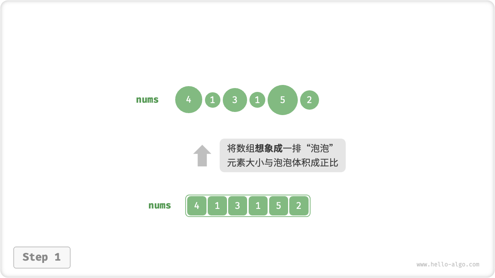
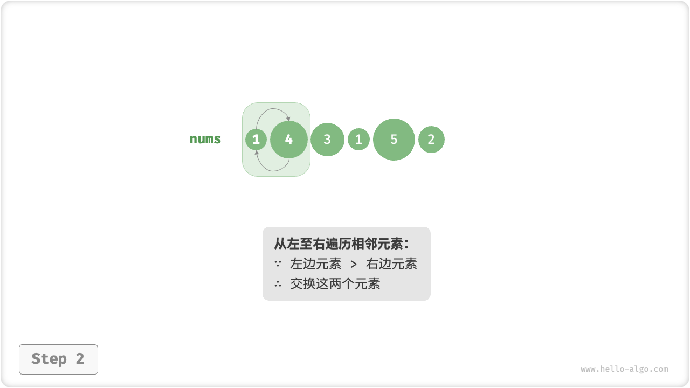
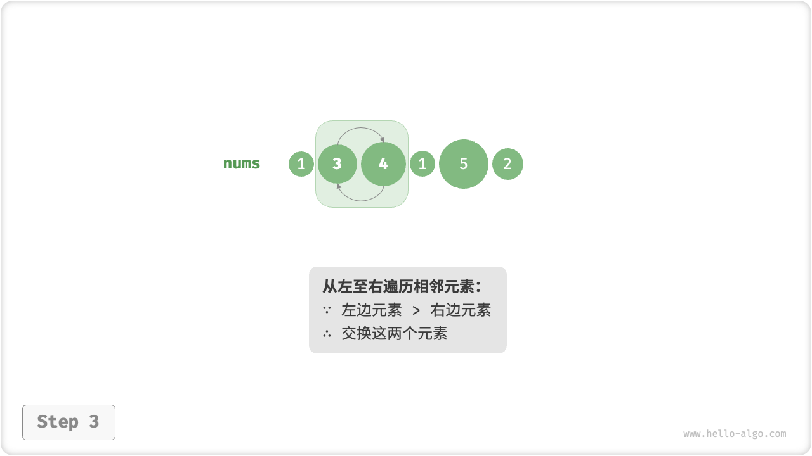
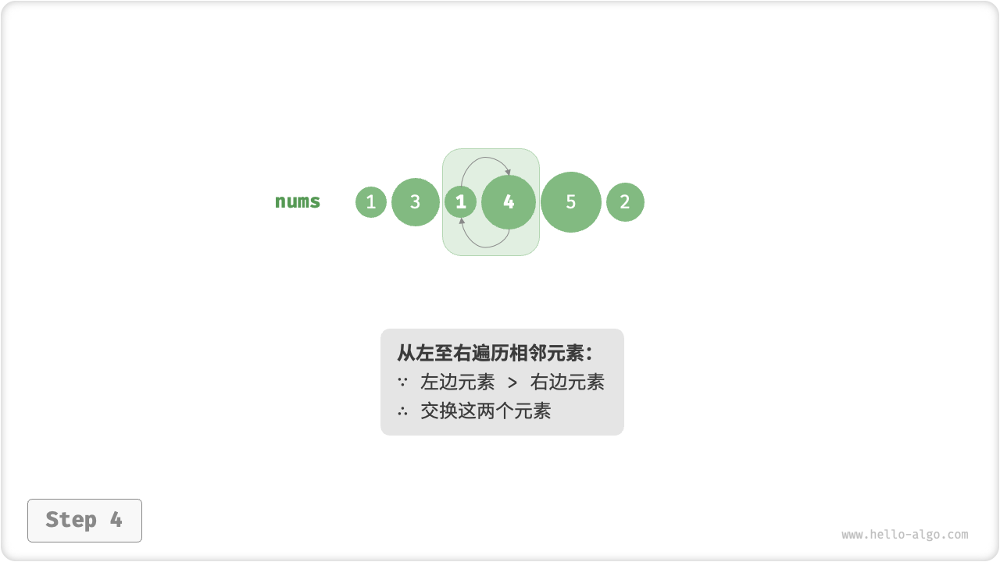
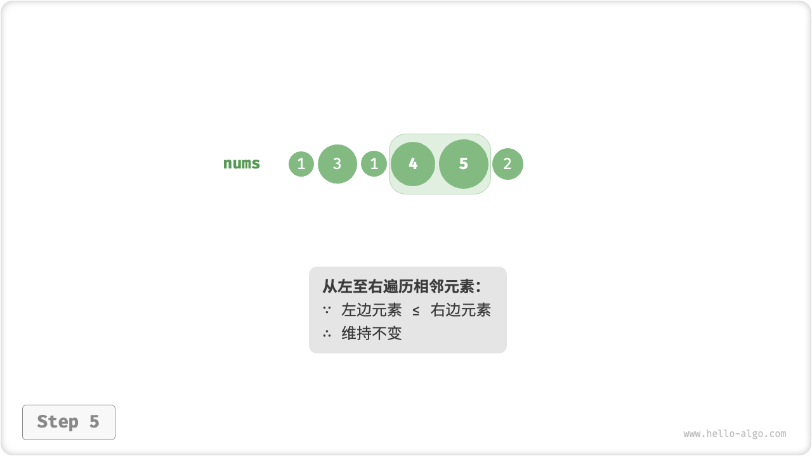
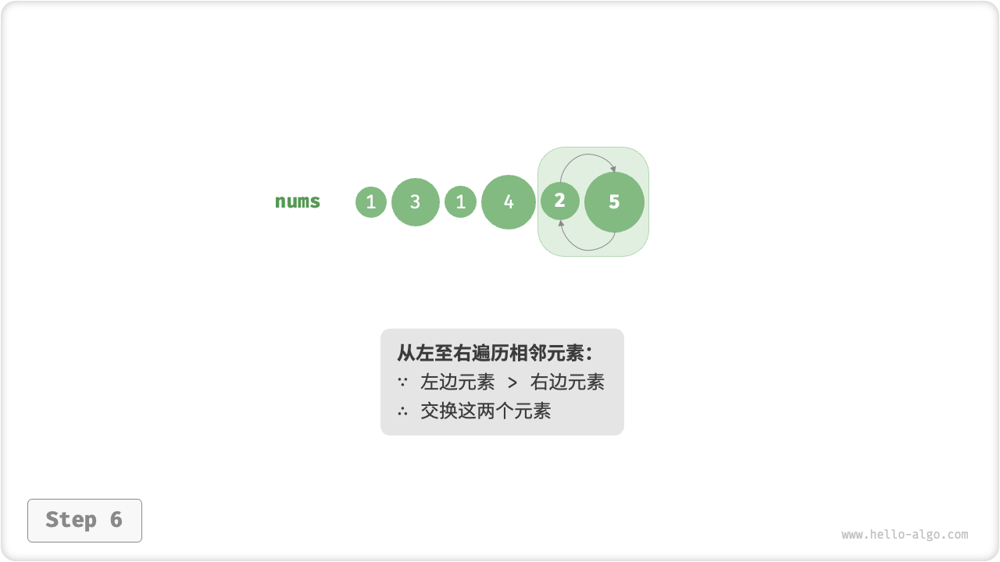
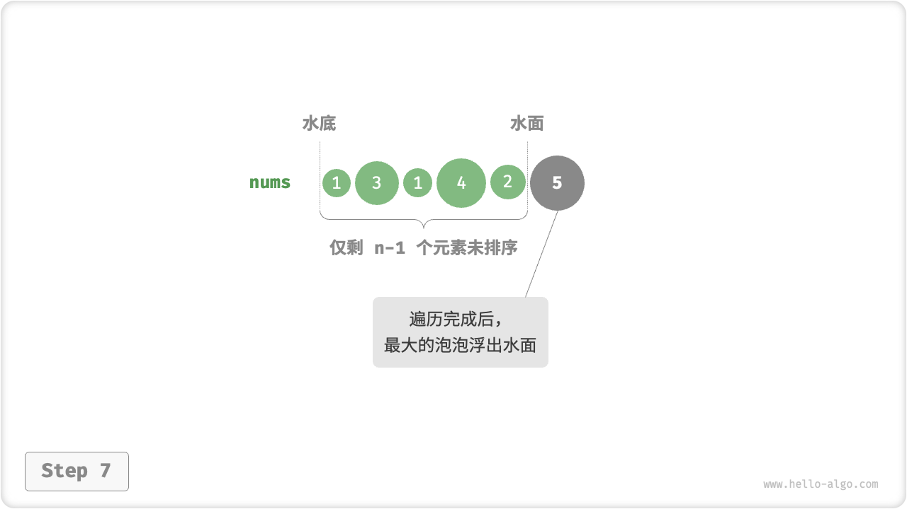
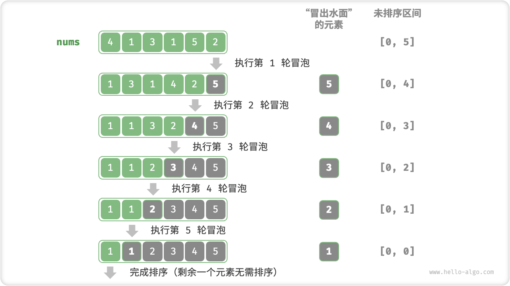

# 11.3 &nbsp; 冒泡排序

「冒泡排序 bubble sort」通过连续地比较与交换相邻元素实现排序。这个过程就像气泡从底部升到顶部一样，因此得名冒泡排序。

如图 11-4 所示，冒泡过程可以利用元素交换操作来模拟：从数组最左端开始向右遍历，依次比较相邻元素大小，如果“左元素 > 右元素”就交换它俩。遍历完成后，最大的元素会被移动到数组的最右端。

=== "<1>"
    

=== "<2>"
    

=== "<3>"
    

=== "<4>"
    

=== "<5>"
    

=== "<6>"
    

=== "<7>"
    

<p align="center"> 图 11-4 &nbsp; 利用元素交换操作模拟冒泡 </p>

## 11.3.1 &nbsp; 算法流程

设数组的长度为 $n$ ，冒泡排序的步骤如图 11-5 所示。

1. 首先，对 $n$ 个元素执行“冒泡”，**将数组的最大元素交换至正确位置**，
2. 接下来，对剩余 $n - 1$ 个元素执行“冒泡”，**将第二大元素交换至正确位置**。
3. 以此类推，经过 $n - 1$ 轮“冒泡”后，**前 $n - 1$ 大的元素都被交换至正确位置**。
4. 仅剩的一个元素必定是最小元素，无须排序，因此数组排序完成。



<p align="center"> 图 11-5 &nbsp; 冒泡排序流程 </p>

=== "Java"

    ```java title="bubble_sort.java"
    /* 冒泡排序 */
    void bubbleSort(int[] nums) {
        // 外循环：未排序区间为 [0, i]
        for (int i = nums.length - 1; i > 0; i--) {
            // 内循环：将未排序区间 [0, i] 中的最大元素交换至该区间的最右端
            for (int j = 0; j < i; j++) {
                if (nums[j] > nums[j + 1]) {
                    // 交换 nums[j] 与 nums[j + 1]
                    int tmp = nums[j];
                    nums[j] = nums[j + 1];
                    nums[j + 1] = tmp;
                }
            }
        }
    }
    ```

=== "C++"

    ```cpp title="bubble_sort.cpp"
    /* 冒泡排序 */
    void bubbleSort(vector<int> &nums) {
        // 外循环：未排序区间为 [0, i]
        for (int i = nums.size() - 1; i > 0; i--) {
            // 内循环：将未排序区间 [0, i] 中的最大元素交换至该区间的最右端
            for (int j = 0; j < i; j++) {
                if (nums[j] > nums[j + 1]) {
                    // 交换 nums[j] 与 nums[j + 1]
                    // 这里使用了 std::swap() 函数
                    swap(nums[j], nums[j + 1]);
                }
            }
        }
    }
    ```

=== "Python"

    ```python title="bubble_sort.py"
    def bubble_sort(nums: list[int]):
        """冒泡排序"""
        n = len(nums)
        # 外循环：未排序区间为 [0, i]
        for i in range(n - 1, 0, -1):
            # 内循环：将未排序区间 [0, i] 中的最大元素交换至该区间的最右端
            for j in range(i):
                if nums[j] > nums[j + 1]:
                    # 交换 nums[j] 与 nums[j + 1]
                    nums[j], nums[j + 1] = nums[j + 1], nums[j]
    ```

=== "Go"

    ```go title="bubble_sort.go"
    /* 冒泡排序 */
    func bubbleSort(nums []int) {
        // 外循环：未排序区间为 [0, i]
        for i := len(nums) - 1; i > 0; i-- {
            // 内循环：将未排序区间 [0, i] 中的最大元素交换至该区间的最右端
            for j := 0; j < i; j++ {
                if nums[j] > nums[j+1] {
                    // 交换 nums[j] 与 nums[j + 1]
                    nums[j], nums[j+1] = nums[j+1], nums[j]
                }
            }
        }
    }
    ```

=== "JS"

    ```javascript title="bubble_sort.js"
    /* 冒泡排序 */
    function bubbleSort(nums) {
        // 外循环：未排序区间为 [0, i]
        for (let i = nums.length - 1; i > 0; i--) {
            // 内循环：将未排序区间 [0, i] 中的最大元素交换至该区间的最右端
            for (let j = 0; j < i; j++) {
                if (nums[j] > nums[j + 1]) {
                    // 交换 nums[j] 与 nums[j + 1]
                    let tmp = nums[j];
                    nums[j] = nums[j + 1];
                    nums[j + 1] = tmp;
                }
            }
        }
    }
    ```

=== "TS"

    ```typescript title="bubble_sort.ts"
    /* 冒泡排序 */
    function bubbleSort(nums: number[]): void {
        // 外循环：未排序区间为 [0, i]
        for (let i = nums.length - 1; i > 0; i--) {
            // 内循环：将未排序区间 [0, i] 中的最大元素交换至该区间的最右端
            for (let j = 0; j < i; j++) {
                if (nums[j] > nums[j + 1]) {
                    // 交换 nums[j] 与 nums[j + 1]
                    let tmp = nums[j];
                    nums[j] = nums[j + 1];
                    nums[j + 1] = tmp;
                }
            }
        }
    }
    ```

=== "C"

    ```c title="bubble_sort.c"
    /* 冒泡排序 */
    void bubbleSort(int nums[], int size) {
        // 外循环：未排序区间为 [0, i]
        for (int i = 0; i < size - 1; i++) {
            // 内循环：将未排序区间 [0, i] 中的最大元素交换至该区间的最右端
            for (int j = 0; j < size - 1 - i; j++) {
                if (nums[j] > nums[j + 1]) {
                    int temp = nums[j];
                    nums[j] = nums[j + 1];
                    nums[j + 1] = temp;
                }
            }
        }
    }
    ```

=== "C#"

    ```csharp title="bubble_sort.cs"
    /* 冒泡排序 */
    void bubbleSort(int[] nums) {
        // 外循环：未排序区间为 [0, i]
        for (int i = nums.Length - 1; i > 0; i--) {
            // 内循环：将未排序区间 [0, i] 中的最大元素交换至该区间的最右端 
            for (int j = 0; j < i; j++) {
                if (nums[j] > nums[j + 1]) {
                    // 交换 nums[j] 与 nums[j + 1]
                    int tmp = nums[j];
                    nums[j] = nums[j + 1];
                    nums[j + 1] = tmp;
                }
            }
        }
    }
    ```

=== "Swift"

    ```swift title="bubble_sort.swift"
    /* 冒泡排序 */
    func bubbleSort(nums: inout [Int]) {
        // 外循环：未排序区间为 [0, i]
        for i in stride(from: nums.count - 1, to: 0, by: -1) {
            // 内循环：将未排序区间 [0, i] 中的最大元素交换至该区间的最右端 
            for j in stride(from: 0, to: i, by: 1) {
                if nums[j] > nums[j + 1] {
                    // 交换 nums[j] 与 nums[j + 1]
                    let tmp = nums[j]
                    nums[j] = nums[j + 1]
                    nums[j + 1] = tmp
                }
            }
        }
    }
    ```

=== "Zig"

    ```zig title="bubble_sort.zig"
    // 冒泡排序
    fn bubbleSort(nums: []i32) void {
        // 外循环：未排序区间为 [0, i]
        var i: usize = nums.len - 1;
        while (i > 0) : (i -= 1) {
            var j: usize = 0;
            // 内循环：将未排序区间 [0, i] 中的最大元素交换至该区间的最右端 
            while (j < i) : (j += 1) {
                if (nums[j] > nums[j + 1]) {
                    // 交换 nums[j] 与 nums[j + 1]
                    var tmp = nums[j];
                    nums[j] = nums[j + 1];
                    nums[j + 1] = tmp;
                }
            }
        }
    }
    ```

=== "Dart"

    ```dart title="bubble_sort.dart"
    /* 冒泡排序 */
    void bubbleSort(List<int> nums) {
      // 外循环：未排序区间为 [0, i]
      for (int i = nums.length - 1; i > 0; i--) {
        // 内循环：将未排序区间 [0, i] 中的最大元素交换至该区间的最右端
        for (int j = 0; j < i; j++) {
          if (nums[j] > nums[j + 1]) {
            // 交换 nums[j] 与 nums[j + 1]
            int tmp = nums[j];
            nums[j] = nums[j + 1];
            nums[j + 1] = tmp;
          }
        }
      }
    }
    ```

=== "Rust"

    ```rust title="bubble_sort.rs"
    /* 冒泡排序 */
    fn bubble_sort(nums: &mut [i32]) {
        // 外循环：未排序区间为 [0, i]
        for i in (1..nums.len()).rev() {
            // 内循环：将未排序区间 [0, i] 中的最大元素交换至该区间的最右端 
            for j in 0..i {
                if nums[j] > nums[j + 1] {
                    // 交换 nums[j] 与 nums[j + 1]
                    let tmp = nums[j];
                    nums[j] = nums[j + 1];
                    nums[j + 1] = tmp;
                }
            }
        }
    }
    ```

## 11.3.2 &nbsp; 效率优化

我们发现，如果某轮“冒泡”中没有执行任何交换操作，说明数组已经完成排序，可直接返回结果。因此，可以增加一个标志位 `flag` 来监测这种情况，一旦出现就立即返回。

经过优化，冒泡排序的最差和平均时间复杂度仍为 $O(n^2)$ ；但当输入数组完全有序时，可达到最佳时间复杂度 $O(n)$ 。

=== "Java"

    ```java title="bubble_sort.java"
    /* 冒泡排序（标志优化） */
    void bubbleSortWithFlag(int[] nums) {
        // 外循环：未排序区间为 [0, i]
        for (int i = nums.length - 1; i > 0; i--) {
            boolean flag = false; // 初始化标志位
            // 内循环：将未排序区间 [0, i] 中的最大元素交换至该区间的最右端
            for (int j = 0; j < i; j++) {
                if (nums[j] > nums[j + 1]) {
                    // 交换 nums[j] 与 nums[j + 1]
                    int tmp = nums[j];
                    nums[j] = nums[j + 1];
                    nums[j + 1] = tmp;
                    flag = true; // 记录交换元素
                }
            }
            if (!flag)
                break; // 此轮冒泡未交换任何元素，直接跳出
        }
    }
    ```

=== "C++"

    ```cpp title="bubble_sort.cpp"
    /* 冒泡排序（标志优化）*/
    void bubbleSortWithFlag(vector<int> &nums) {
        // 外循环：未排序区间为 [0, i]
        for (int i = nums.size() - 1; i > 0; i--) {
            bool flag = false; // 初始化标志位
            // 内循环：将未排序区间 [0, i] 中的最大元素交换至该区间的最右端
            for (int j = 0; j < i; j++) {
                if (nums[j] > nums[j + 1]) {
                    // 交换 nums[j] 与 nums[j + 1]
                    // 这里使用了 std::swap() 函数
                    swap(nums[j], nums[j + 1]);
                    flag = true; // 记录交换元素
                }
            }
            if (!flag)
                break; // 此轮冒泡未交换任何元素，直接跳出
        }
    }
    ```

=== "Python"

    ```python title="bubble_sort.py"
    def bubble_sort_with_flag(nums: list[int]):
        """冒泡排序（标志优化）"""
        n = len(nums)
        # 外循环：未排序区间为 [0, i]
        for i in range(n - 1, 0, -1):
            flag = False  # 初始化标志位
            # 内循环：将未排序区间 [0, i] 中的最大元素交换至该区间的最右端
            for j in range(i):
                if nums[j] > nums[j + 1]:
                    # 交换 nums[j] 与 nums[j + 1]
                    nums[j], nums[j + 1] = nums[j + 1], nums[j]
                    flag = True  # 记录交换元素
            if not flag:
                break  # 此轮冒泡未交换任何元素，直接跳出
    ```

=== "Go"

    ```go title="bubble_sort.go"
    /* 冒泡排序（标志优化）*/
    func bubbleSortWithFlag(nums []int) {
        // 外循环：未排序区间为 [0, i]
        for i := len(nums) - 1; i > 0; i-- {
            flag := false // 初始化标志位
            // 内循环：将未排序区间 [0, i] 中的最大元素交换至该区间的最右端
            for j := 0; j < i; j++ {
                if nums[j] > nums[j+1] {
                    // 交换 nums[j] 与 nums[j + 1]
                    nums[j], nums[j+1] = nums[j+1], nums[j]
                    flag = true // 记录交换元素
                }
            }
            if flag == false { // 此轮冒泡未交换任何元素，直接跳出
                break
            }
        }
    }
    ```

=== "JS"

    ```javascript title="bubble_sort.js"
    /* 冒泡排序（标志优化）*/
    function bubbleSortWithFlag(nums) {
        // 外循环：未排序区间为 [0, i]
        for (let i = nums.length - 1; i > 0; i--) {
            let flag = false; // 初始化标志位
            // 内循环：将未排序区间 [0, i] 中的最大元素交换至该区间的最右端
            for (let j = 0; j < i; j++) {
                if (nums[j] > nums[j + 1]) {
                    // 交换 nums[j] 与 nums[j + 1]
                    let tmp = nums[j];
                    nums[j] = nums[j + 1];
                    nums[j + 1] = tmp;
                    flag = true; // 记录交换元素
                }
            }
            if (!flag) break; // 此轮冒泡未交换任何元素，直接跳出
        }
    }
    ```

=== "TS"

    ```typescript title="bubble_sort.ts"
    /* 冒泡排序（标志优化）*/
    function bubbleSortWithFlag(nums: number[]): void {
        // 外循环：未排序区间为 [0, i]
        for (let i = nums.length - 1; i > 0; i--) {
            let flag = false; // 初始化标志位
            // 内循环：将未排序区间 [0, i] 中的最大元素交换至该区间的最右端
            for (let j = 0; j < i; j++) {
                if (nums[j] > nums[j + 1]) {
                    // 交换 nums[j] 与 nums[j + 1]
                    let tmp = nums[j];
                    nums[j] = nums[j + 1];
                    nums[j + 1] = tmp;
                    flag = true; // 记录交换元素
                }
            }
            if (!flag) break; // 此轮冒泡未交换任何元素，直接跳出
        }
    }
    ```

=== "C"

    ```c title="bubble_sort.c"
    /* 冒泡排序（标志优化）*/
    void bubbleSortWithFlag(int nums[], int size) {
        // 外循环：未排序区间为 [0, i]
        for (int i = 0; i < size - 1; i++) {
            bool flag = false;
            // 内循环：将未排序区间 [0, i] 中的最大元素交换至该区间的最右端
            for (int j = 0; j < size - 1 - i; j++) {
                if (nums[j] > nums[j + 1]) {
                    int temp = nums[j];
                    nums[j] = nums[j + 1];
                    nums[j + 1] = temp;
                    flag = true;
                }
            }
            if (!flag)
                break;
        }
    }
    ```

=== "C#"

    ```csharp title="bubble_sort.cs"
    /* 冒泡排序（标志优化）*/
    void bubbleSortWithFlag(int[] nums) {
        // 外循环：未排序区间为 [0, i]
        for (int i = nums.Length - 1; i > 0; i--) {
            bool flag = false; // 初始化标志位
            // 内循环：将未排序区间 [0, i] 中的最大元素交换至该区间的最右端 
            for (int j = 0; j < i; j++) {
                if (nums[j] > nums[j + 1]) {
                    // 交换 nums[j] 与 nums[j + 1]
                    int tmp = nums[j];
                    nums[j] = nums[j + 1];
                    nums[j + 1] = tmp;
                    flag = true;  // 记录交换元素
                }
            }
            if (!flag) break;     // 此轮冒泡未交换任何元素，直接跳出
        }
    }
    ```

=== "Swift"

    ```swift title="bubble_sort.swift"
    /* 冒泡排序（标志优化）*/
    func bubbleSortWithFlag(nums: inout [Int]) {
        // 外循环：未排序区间为 [0, i]
        for i in stride(from: nums.count - 1, to: 0, by: -1) {
            var flag = false // 初始化标志位
            for j in stride(from: 0, to: i, by: 1) {
                if nums[j] > nums[j + 1] {
                    // 交换 nums[j] 与 nums[j + 1]
                    let tmp = nums[j]
                    nums[j] = nums[j + 1]
                    nums[j + 1] = tmp
                    flag = true // 记录交换元素
                }
            }
            if !flag { // 此轮冒泡未交换任何元素，直接跳出
                break
            }
        }
    }
    ```

=== "Zig"

    ```zig title="bubble_sort.zig"
    // 冒泡排序（标志优化）
    fn bubbleSortWithFlag(nums: []i32) void {
        // 外循环：未排序区间为 [0, i]
        var i: usize = nums.len - 1;
        while (i > 0) : (i -= 1) {
            var flag = false;   // 初始化标志位
            var j: usize = 0;
            // 内循环：将未排序区间 [0, i] 中的最大元素交换至该区间的最右端 
            while (j < i) : (j += 1) {
                if (nums[j] > nums[j + 1]) {
                    // 交换 nums[j] 与 nums[j + 1]
                    var tmp = nums[j];
                    nums[j] = nums[j + 1];
                    nums[j + 1] = tmp;
                    flag = true;
                }
            }
            if (!flag) break;   // 此轮冒泡未交换任何元素，直接跳出
        }
    }
    ```

=== "Dart"

    ```dart title="bubble_sort.dart"
    /* 冒泡排序（标志优化）*/
    void bubbleSortWithFlag(List<int> nums) {
      // 外循环：未排序区间为 [0, i]
      for (int i = nums.length - 1; i > 0; i--) {
        bool flag = false; // 初始化标志位
        // 内循环：将未排序区间 [0, i] 中的最大元素交换至该区间的最右端
        for (int j = 0; j < i; j++) {
          if (nums[j] > nums[j + 1]) {
            // 交换 nums[j] 与 nums[j + 1]
            int tmp = nums[j];
            nums[j] = nums[j + 1];
            nums[j + 1] = tmp;
            flag = true; // 记录交换元素
          }
        }
        if (!flag) break; // 此轮冒泡未交换任何元素，直接跳出
      }
    }
    ```

=== "Rust"

    ```rust title="bubble_sort.rs"
    /* 冒泡排序（标志优化） */
    fn bubble_sort_with_flag(nums: &mut [i32]) {
        // 外循环：未排序区间为 [0, i]
        for i in (1..nums.len()).rev() {
            let mut flag = false; // 初始化标志位
            // 内循环：将未排序区间 [0, i] 中的最大元素交换至该区间的最右端 
            for j in 0..i {
                if nums[j] > nums[j + 1] {
                    // 交换 nums[j] 与 nums[j + 1]
                    let tmp = nums[j];
                    nums[j] = nums[j + 1];
                    nums[j + 1] = tmp;
                    flag = true;  // 记录交换元素
                }
            }
            if !flag {break};  // 此轮冒泡未交换任何元素，直接跳出
        }
    }
    ```

## 11.3.3 &nbsp; 算法特性

- **时间复杂度为 $O(n^2)$、自适应排序**：各轮“冒泡”遍历的数组长度依次为 $n - 1$、$n - 2$、$\dots$、$2$、$1$ ，总和为 $(n - 1) n / 2$ 。在引入 `flag` 优化后，最佳时间复杂度可达到 $O(n)$ 。
- **空间复杂度为 $O(1)$、原地排序**：指针 $i$ 和 $j$ 使用常数大小的额外空间。
- **稳定排序**：由于在“冒泡”中遇到相等元素不交换。
