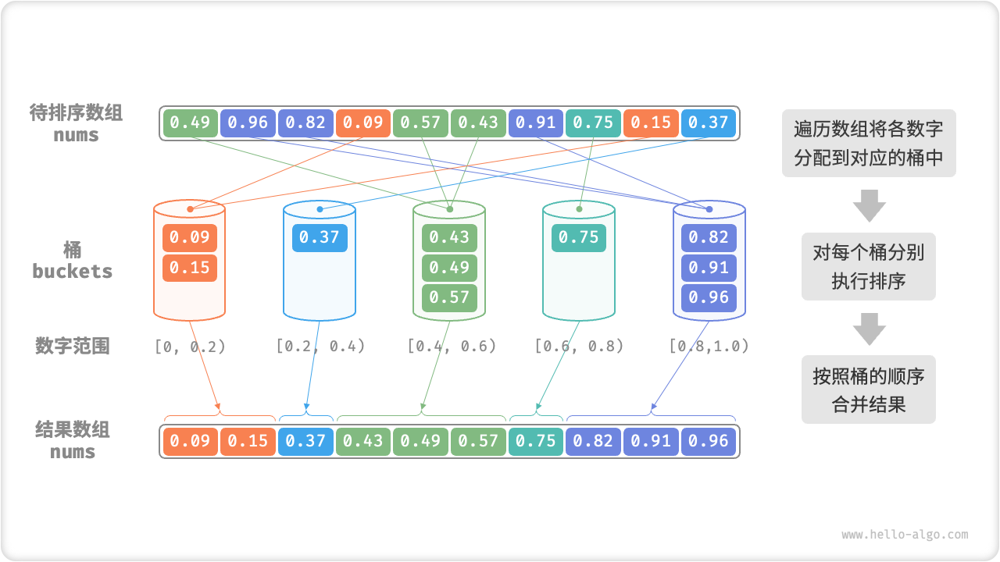
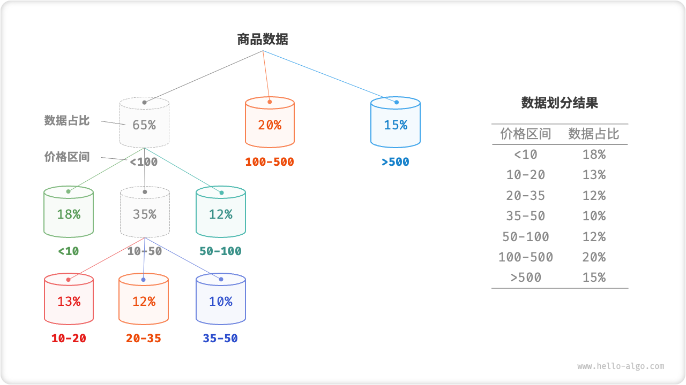
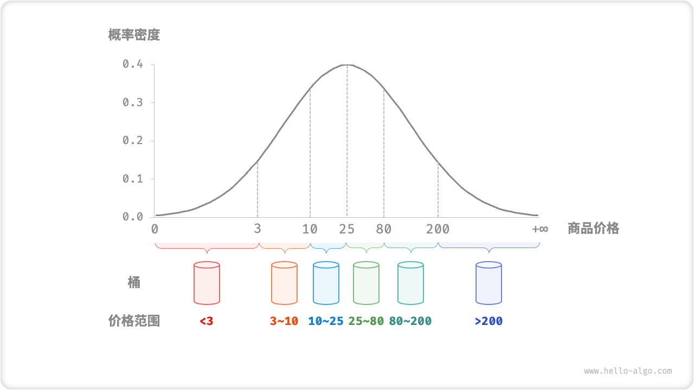

# 11.6. &nbsp; 桶排序

前述的几种排序算法都属于“基于比较的排序算法”，它们通过比较元素间的大小来实现排序。此类排序算法的时间复杂度无法超越 $O(n \log n)$ 。接下来，我们将探讨几种“非比较排序算法”，它们的时间复杂度可以达到线性水平。

「桶排序 Bucket Sort」是分治思想的一个典型应用。它通过设置一些具有大小顺序的桶，每个桶对应一个数据范围，将数据平均分配到各个桶中；然后，在每个桶内部分别执行排序；最终按照桶的顺序将所有数据合并。

## 11.6.1. &nbsp; 算法流程

考虑一个长度为 $n$ 的数组，元素是范围 $[0, 1)$ 的浮点数。桶排序的流程如下：

1. 初始化 $k$ 个桶，将 $n$ 个元素分配到 $k$ 个桶中；
2. 对每个桶分别执行排序（本文采用编程语言的内置排序函数）；
3. 按照桶的从小到大的顺序，合并结果；



<p align="center"> Fig. 桶排序算法流程 </p>

=== "Java"

    ```java title="bucket_sort.java"
    /* 桶排序 */
    void bucketSort(float[] nums) {
        // 初始化 k = n/2 个桶，预期向每个桶分配 2 个元素
        int k = nums.length / 2;
        List<List<Float>> buckets = new ArrayList<>();
        for (int i = 0; i < k; i++) {
            buckets.add(new ArrayList<>());
        }
        // 1. 将数组元素分配到各个桶中
        for (float num : nums) {
            // 输入数据范围 [0, 1)，使用 num * k 映射到索引范围 [0, k-1]
            int i = (int) num * k;
            // 将 num 添加进桶 i
            buckets.get(i).add(num);
        }
        // 2. 对各个桶执行排序
        for (List<Float> bucket : buckets) {
            // 使用内置排序函数，也可以替换成其他排序算法
            Collections.sort(bucket);
        }
        // 3. 遍历桶合并结果
        int i = 0;
        for (List<Float> bucket : buckets) {
            for (float num : bucket) {
                nums[i++] = num;
            }
        }
    }
    ```

=== "C++"

    ```cpp title="bucket_sort.cpp"
    /* 桶排序 */
    void bucketSort(vector<float> &nums) {
        // 初始化 k = n/2 个桶，预期向每个桶分配 2 个元素
        int k = nums.size() / 2;
        vector<vector<float>> buckets(k);
        // 1. 将数组元素分配到各个桶中
        for (float num : nums) {
            // 输入数据范围 [0, 1)，使用 num * k 映射到索引范围 [0, k-1]
            int i = num * k;
            // 将 num 添加进桶 bucket_idx
            buckets[i].push_back(num);
        }
        // 2. 对各个桶执行排序
        for (vector<float> &bucket : buckets) {
            // 使用内置排序函数，也可以替换成其他排序算法
            sort(bucket.begin(), bucket.end());
        }
        // 3. 遍历桶合并结果
        int i = 0;
        for (vector<float> &bucket : buckets) {
            for (float num : bucket) {
                nums[i++] = num;
            }
        }
    }
    ```

=== "Python"

    ```python title="bucket_sort.py"
    def bucket_sort(nums: list[float]) -> None:
        """桶排序"""
        # 初始化 k = n/2 个桶，预期向每个桶分配 2 个元素
        k = len(nums) // 2
        buckets = [[] for _ in range(k)]
        # 1. 将数组元素分配到各个桶中
        for num in nums:
            # 输入数据范围 [0, 1)，使用 num * k 映射到索引范围 [0, k-1]
            i = int(num * k)
            # 将 num 添加进桶 i
            buckets[i].append(num)
        # 2. 对各个桶执行排序5
        for bucket in buckets:
            # 使用内置排序函数，也可以替换成其他排序算法
            bucket.sort()
        # 3. 遍历桶合并结果
        i = 0
        for bucket in buckets:
            for num in bucket:
                nums[i] = num
                i += 1
    ```

=== "Go"

    ```go title="bucket_sort.go"
    /* 桶排序 */
    func bucketSort(nums []float64) {
        // 初始化 k = n/2 个桶，预期向每个桶分配 2 个元素
        k := len(nums) / 2
        buckets := make([][]float64, k)
        for i := 0; i < k; i++ {
            buckets[i] = make([]float64, 0)
        }
        // 1. 将数组元素分配到各个桶中
        for _, num := range nums {
            // 输入数据范围 [0, 1)，使用 num * k 映射到索引范围 [0, k-1]
            i := int(num) * k
            // 将 num 添加进桶 i
            buckets[i] = append(buckets[i], num)
        }
        // 2. 对各个桶执行排序
        for i := 0; i < k; i++ {
            // 使用内置切片排序函数，也可以替换成其他排序算法
            sort.Float64s(buckets[i])
        }
        // 3. 遍历桶合并结果
        i := 0
        for _, bucket := range buckets {
            for _, num := range bucket {
                nums[i] = num
                i++
            }
        }
    }
    ```

=== "JavaScript"

    ```javascript title="bucket_sort.js"
    /* 桶排序 */
    function bucketSort(nums) {
        // 初始化 k = n/2 个桶，预期向每个桶分配 2 个元素
        const k = nums.length / 2;
        const buckets = [];
        for (let i = 0; i < k; i++) {
            buckets.push([]);
        }
        // 1. 将数组元素分配到各个桶中
        for (const num of nums) {
            // 输入数据范围 [0, 1)，使用 num * k 映射到索引范围 [0, k-1]
            const i = Math.floor(num * k);
            // 将 num 添加进桶 i
            buckets[i].push(num);
        }
        // 2. 对各个桶执行排序
        for (const bucket of buckets) {
            // 使用内置排序函数，也可以替换成其他排序算法
            bucket.sort((a, b) => a - b);
        }
        // 3. 遍历桶合并结果
        let i = 0;
        for (const bucket of buckets) {
            for (const num of bucket) {
                nums[i++] = num;
            }
        }
    }
    ```

=== "TypeScript"

    ```typescript title="bucket_sort.ts"
    /* 桶排序 */
    function bucketSort(nums: number[]): void {
        // 初始化 k = n/2 个桶，预期向每个桶分配 2 个元素
        const k = nums.length / 2;
        const buckets: number[][] = [];
        for (let i = 0; i < k; i++) {
            buckets.push([]);
        }
        // 1. 将数组元素分配到各个桶中
        for (const num of nums) {
            // 输入数据范围 [0, 1)，使用 num * k 映射到索引范围 [0, k-1]
            const i = Math.floor(num * k);
            // 将 num 添加进桶 i
            buckets[i].push(num);
        }
        // 2. 对各个桶执行排序
        for (const bucket of buckets) {
            // 使用内置排序函数，也可以替换成其他排序算法
            bucket.sort((a, b) => a - b);
        }
        // 3. 遍历桶合并结果
        let i = 0;
        for (const bucket of buckets) {
            for (const num of bucket) {
                nums[i++] = num;
            }
        }
    }
    ```

=== "C"

    ```c title="bucket_sort.c"
    [class]{}-[func]{bucketSort}
    ```

=== "C#"

    ```csharp title="bucket_sort.cs"
    [class]{bucket_sort}-[func]{bucketSort}
    ```

=== "Swift"

    ```swift title="bucket_sort.swift"
    /* 桶排序 */
    func bucketSort(nums: inout [Double]) {
        // 初始化 k = n/2 个桶，预期向每个桶分配 2 个元素
        let k = nums.count / 2
        var buckets = (0 ..< k).map { _ in [Double]() }
        // 1. 将数组元素分配到各个桶中
        for num in nums {
            // 输入数据范围 [0, 1)，使用 num * k 映射到索引范围 [0, k-1]
            let i = Int(num) * k
            // 将 num 添加进桶 i
            buckets[i].append(num)
        }
        // 2. 对各个桶执行排序
        for i in buckets.indices {
            // 使用内置排序函数，也可以替换成其他排序算法
            buckets[i].sort()
        }
        // 3. 遍历桶合并结果
        var i = nums.startIndex
        for bucket in buckets {
            for num in bucket {
                nums[i] = num
                nums.formIndex(after: &i)
            }
        }
    }
    ```

=== "Zig"

    ```zig title="bucket_sort.zig"
    [class]{}-[func]{bucketSort}
    ```

!!! question "桶排序的适用场景是什么？"

    桶排序适用于处理体量很大的数据。例如，输入数据包含 100 万个元素，由于空间限制，系统内存无法一次性加载所有数据。此时，可以将数据分成 1000 个桶，然后分别对每个桶进行排序，最后将结果合并。

## 11.6.2. &nbsp; 算法特性

**时间复杂度 $O(n + k)$** ：假设元素在各个桶内平均分布，那么每个桶内的元素数量为 $\frac{n}{k}$ 。假设排序单个桶使用 $O(\frac{n}{k} \log\frac{n}{k})$ 时间，则排序所有桶使用 $O(n \log\frac{n}{k})$ 时间。**当桶数量 $k$ 比较大时，时间复杂度则趋向于 $O(n)$** 。合并结果时需要遍历 $n$ 个桶，花费 $O(k)$ 时间。

在最坏情况下，所有数据被分配到一个桶中，且排序该桶使用 $O(n^2)$ 时间，因此是“自适应排序”。

**空间复杂度 $O(n + k)$** ：需要借助 $k$ 个桶和总共 $n$ 个元素的额外空间，属于“非原地排序”。

桶排序是否稳定取决于排序桶内元素的算法是否稳定。

## 11.6.3. &nbsp; 如何实现平均分配

桶排序的时间复杂度理论上可以达到 $O(n)$ ，**关键在于将元素均匀分配到各个桶中**，因为实际数据往往不是均匀分布的。例如，我们想要将淘宝上的所有商品按价格范围平均分配到 10 个桶中，但商品价格分布不均，低于 100 元的非常多，高于 1000 元的非常少。若将价格区间平均划分为 10 份，各个桶中的商品数量差距会非常大。

为实现平均分配，我们可以先设定一个大致的分界线，将数据粗略地分到 3 个桶中。**分配完毕后，再将商品较多的桶继续划分为 3 个桶，直至所有桶中的元素数量大致相等**。这种方法本质上是创建一个递归树，使叶节点的值尽可能平均。当然，不一定要每轮将数据划分为 3 个桶，具体划分方式可根据数据特点灵活选择。



<p align="center"> Fig. 递归划分桶 </p>

如果我们提前知道商品价格的概率分布，**则可以根据数据概率分布设置每个桶的价格分界线**。值得注意的是，数据分布并不一定需要特意统计，也可以根据数据特点采用某种概率模型进行近似。如下图所示，我们假设商品价格服从正态分布，这样就可以合理地设定价格区间，从而将商品平均分配到各个桶中。



<p align="center"> Fig. 根据概率分布划分桶 </p>
