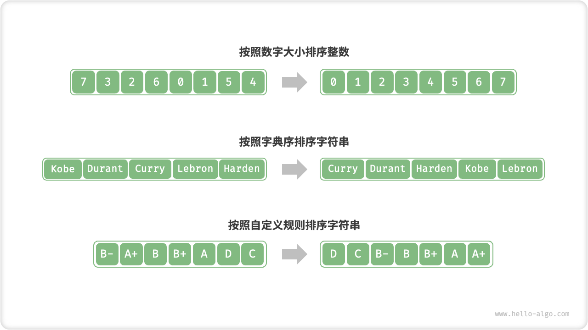

# 11.1. 排序简介

「排序算法 Sorting Algorithm」使得列表中的所有元素按照从小到大的顺序排列。

- 待排序的列表的 **元素类型** 可以是整数、浮点数、字符、或字符串；
- 排序算法可以根据需要设定 **判断规则**，例如数字大小、字符 ASCII 码顺序、自定义规则；



<p align="center"> Fig. 排序中的不同元素类型和判断规则 </p>

## 11.1.1. 评价维度

排序算法主要可根据 **稳定性 、就地性 、自适应性 、比较类** 来分类。

### 稳定性

- 「稳定排序」在完成排序后，**不改变** 相等元素在数组中的相对顺序。
- 「非稳定排序」在完成排序后，相等元素在数组中的相对位置 **可能被改变**。

假设我们有一个存储学生信息的表格，第 1, 2 列分别是姓名和年龄。那么在以下示例中，「非稳定排序」会导致输入数据的有序性丢失。因此「稳定排序」是很好的特性，**在多级排序中是必须的**。

```shell
# 输入数据是按照姓名排序好的
# (name, age)
  ('A', 19)
  ('B', 18)
  ('C', 21)
  ('D', 19)
  ('E', 23)

# 假设使用非稳定排序算法按年龄排序列表，
# 结果中 ('D', 19) 和 ('A', 19) 的相对位置改变，
# 输入数据按姓名排序的性质丢失
  ('B', 18)
  ('D', 19)
  ('A', 19)
  ('C', 21)
  ('E', 23)
```

### 就地性

- 「原地排序」无需辅助数据，不使用额外空间；
- 「非原地排序」需要借助辅助数据，使用额外空间；

「原地排序」不使用额外空间，可以节约内存；并且一般情况下，由于数据操作减少，原地排序的运行效率也更高。

### 自适应性

- 「自适应排序」的时间复杂度受输入数据影响，即最佳 / 最差 / 平均时间复杂度不相等。
- 「非自适应排序」的时间复杂度恒定，与输入数据无关。

我们希望 **最差 = 平均**，即不希望排序算法的运行效率在某些输入数据下发生劣化。

### 比较类

- 「比较类排序」基于元素之间的比较算子（小于、相等、大于）来决定元素的相对顺序。
- 「非比较类排序」不基于元素之间的比较算子来决定元素的相对顺序。

「比较类排序」的时间复杂度最优为 $O(n \log n)$ ；而「非比较类排序」可以达到 $O(n)$ 的时间复杂度，但通用性较差。

## 11.1.2. 理想排序算法

- **运行快**，即时间复杂度低；
- **稳定排序**，即排序后相等元素的相对位置不变化；
- **原地排序**，即运行中不使用额外的辅助空间；
- **正向自适应性**，即算法的运行效率不会在某些输入数据下发生劣化；

然而，**没有排序算法同时具备以上所有特性**。排序算法的选型使用取决于具体的列表类型、列表长度、元素分布等因素。
