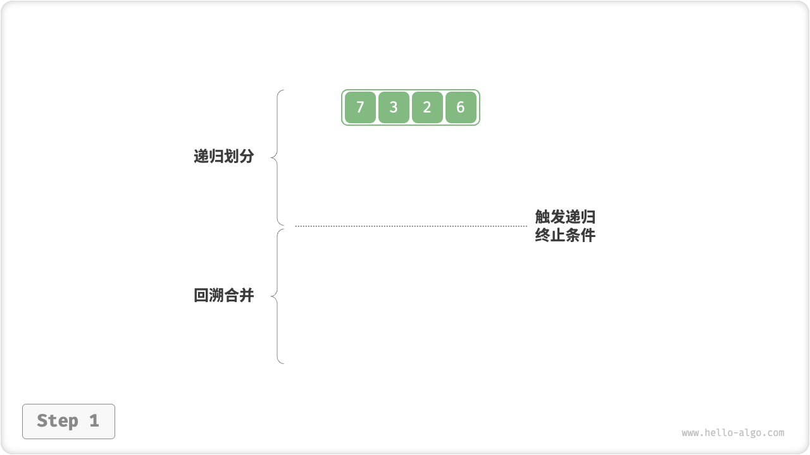
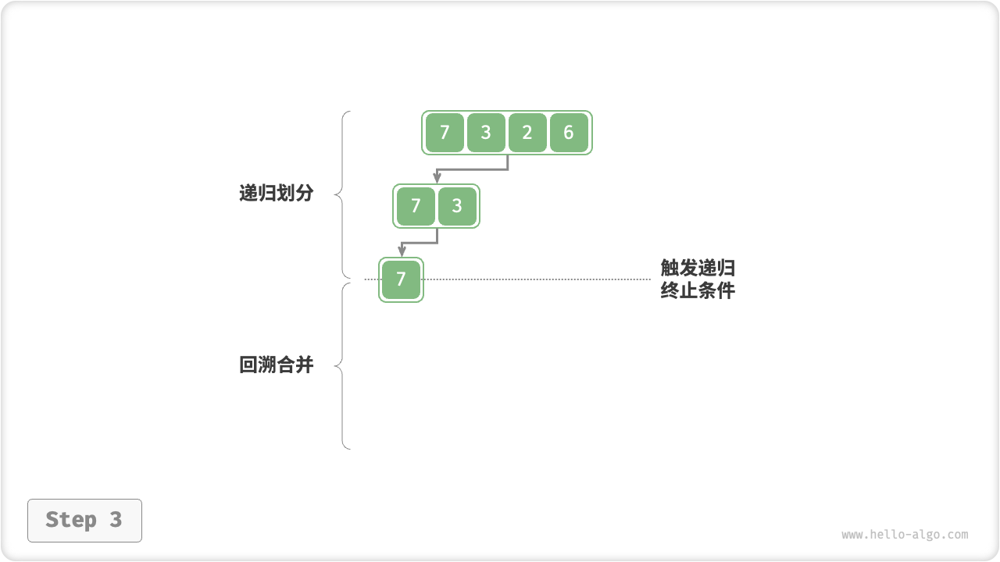
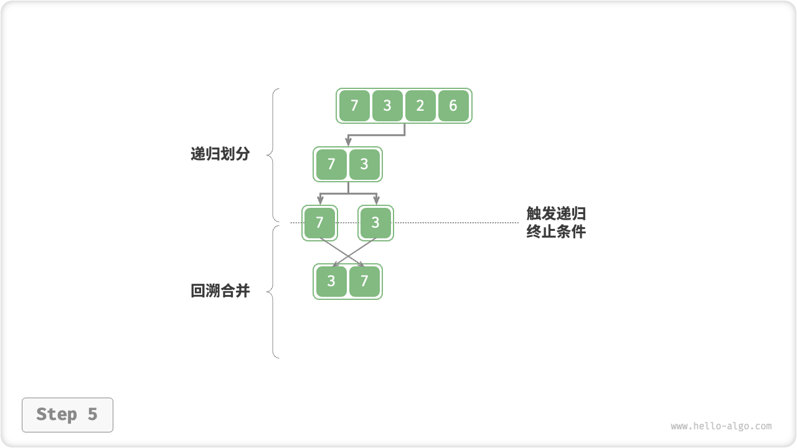
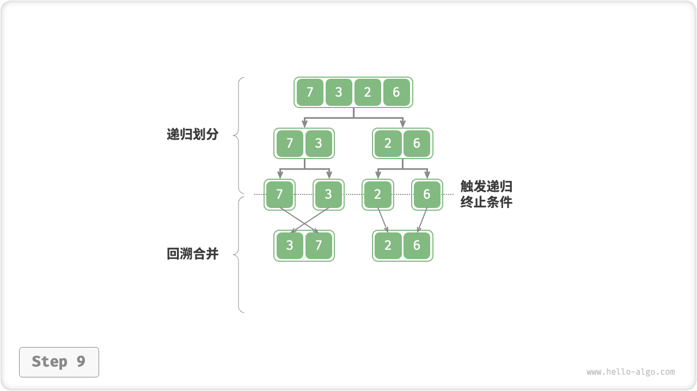

# 11.5. &nbsp; 归并排序

「归并排序 Merge Sort」是算法中“分治思想”的典型体现，其有「划分」和「合并」两个阶段：

1. **划分阶段**：通过递归不断 **将数组从中点位置划分开**，将长数组的排序问题转化为短数组的排序问题；
2. **合并阶段**：划分到子数组长度为 1 时，开始向上合并，不断将 **左、右两个短排序数组** 合并为 **一个长排序数组**，直至合并至原数组时完成排序；


<p align="center"> Fig. 归并排序两阶段：划分与合并 </p>

## 11.5.1. &nbsp; 算法流程

**「递归划分」** 从顶至底递归地 **将数组从中点切为两个子数组**，直至长度为 1 ；

1. 计算数组中点 `mid` ，递归划分左子数组（区间 `[left, mid]` ）和右子数组（区间 `[mid + 1, right]` ）；
2. 递归执行 `1.` 步骤，直至子数组区间长度为 1 时，终止递归划分；

**「回溯合并」** 从底至顶地将左子数组和右子数组合并为一个 **有序数组** ；

需要注意，由于从长度为 1 的子数组开始合并，所以 **每个子数组都是有序的**。因此，合并任务本质是要 **将两个有序子数组合并为一个有序数组**。

=== "<1>"
    

=== "<2>"
    

=== "<3>"
    

=== "<4>"
    

=== "<5>"
    

=== "<6>"
    

=== "<7>"
    

=== "<8>"
    

=== "<9>"
    

=== "<10>"
    

观察发现，归并排序的递归顺序就是二叉树的「后序遍历」。

- **后序遍历**：先递归左子树、再递归右子树、最后处理根结点。
- **归并排序**：先递归左子树、再递归右子树、最后处理合并。

=== "Java"

    ```java title="merge_sort.java"
    /* 合并左子数组和右子数组 */
    // 左子数组区间 [left, mid]
    // 右子数组区间 [mid + 1, right]
    void merge(int[] nums, int left, int mid, int right) {
        // 初始化辅助数组
        int[] tmp = Arrays.copyOfRange(nums, left, right + 1);   
        // 左子数组的起始索引和结束索引  
        int leftStart = left - left, leftEnd = mid - left;
        // 右子数组的起始索引和结束索引       
        int rightStart = mid + 1 - left, rightEnd = right - left;
        // i, j 分别指向左子数组、右子数组的首元素
        int i = leftStart, j = rightStart;                
        // 通过覆盖原数组 nums 来合并左子数组和右子数组
        for (int k = left; k <= right; k++) {
            // 若“左子数组已全部合并完”，则选取右子数组元素，并且 j++
            if (i > leftEnd)
                nums[k] = tmp[j++];
            // 否则，若“右子数组已全部合并完”或“左子数组元素 <= 右子数组元素”，则选取左子数组元素，并且 i++
            else if (j > rightEnd || tmp[i] <= tmp[j])
                nums[k] = tmp[i++];
            // 否则，若“左右子数组都未全部合并完”且“左子数组元素 > 右子数组元素”，则选取右子数组元素，并且 j++
            else
                nums[k] = tmp[j++];
        }
    }

    /* 归并排序 */
    void mergeSort(int[] nums, int left, int right) {
        // 终止条件
        if (left >= right) return;       // 当子数组长度为 1 时终止递归
        // 划分阶段
        int mid = (left + right) / 2;    // 计算中点
        mergeSort(nums, left, mid);      // 递归左子数组
        mergeSort(nums, mid + 1, right); // 递归右子数组
        // 合并阶段
        merge(nums, left, mid, right);
    }
    ```

=== "C++"

    ```cpp title="merge_sort.cpp"
    /* 合并左子数组和右子数组 */
    // 左子数组区间 [left, mid]
    // 右子数组区间 [mid + 1, right]
    void merge(vector<int>& nums, int left, int mid, int right) {
        // 初始化辅助数组
        vector<int> tmp(nums.begin() + left, nums.begin() + right + 1);   
        // 左子数组的起始索引和结束索引  
        int leftStart = left - left, leftEnd = mid - left;
        // 右子数组的起始索引和结束索引       
        int rightStart = mid + 1 - left, rightEnd = right - left;
        // i, j 分别指向左子数组、右子数组的首元素
        int i = leftStart, j = rightStart;                
        // 通过覆盖原数组 nums 来合并左子数组和右子数组
        for (int k = left; k <= right; k++) {
            // 若“左子数组已全部合并完”，则选取右子数组元素，并且 j++
            if (i > leftEnd)
                nums[k] = tmp[j++];
            // 否则，若“右子数组已全部合并完”或“左子数组元素 <= 右子数组元素”，则选取左子数组元素，并且 i++
            else if (j > rightEnd || tmp[i] <= tmp[j])
                nums[k] = tmp[i++];
            // 否则，若“左右子数组都未全部合并完”且“左子数组元素 > 右子数组元素”，则选取右子数组元素，并且 j++
            else
                nums[k] = tmp[j++];
        }
    }

    /* 归并排序 */
    void mergeSort(vector<int>& nums, int left, int right) {
        // 终止条件
        if (left >= right) return;       // 当子数组长度为 1 时终止递归
        // 划分阶段
        int mid = (left + right) / 2;    // 计算中点
        mergeSort(nums, left, mid);      // 递归左子数组
        mergeSort(nums, mid + 1, right); // 递归右子数组
        // 合并阶段
        merge(nums, left, mid, right);
    }
    ```

=== "Python"

    ```python title="merge_sort.py"
    """ 合并左子数组和右子数组 """
    # 左子数组区间 [left, mid]
    # 右子数组区间 [mid + 1, right]
    def merge(nums, left, mid, right):
        # 初始化辅助数组 借助 copy模块
        tmp = nums[left:right + 1]
        # 左子数组的起始索引和结束索引
        left_start, left_end = left - left, mid - left
        # 右子数组的起始索引和结束索引
        right_start, right_end = mid + 1 - left, right - left
        # i, j 分别指向左子数组、右子数组的首元素
        i, j = left_start, right_start
        # 通过覆盖原数组 nums 来合并左子数组和右子数组
        for k in range(left, right + 1):
            # 若“左子数组已全部合并完”，则选取右子数组元素，并且 j++
            if i > left_end:
                nums[k] = tmp[j]
                j += 1
            # 否则，若“右子数组已全部合并完”或“左子数组元素 <= 右子数组元素”，则选取左子数组元素，并且 i++
            elif j > right_end or tmp[i] <= tmp[j]:
                nums[k] = tmp[i]
                i += 1
            # 否则，若“左右子数组都未全部合并完”且“左子数组元素 > 右子数组元素”，则选取右子数组元素，并且 j++
            else:
                nums[k] = tmp[j]
                j += 1

    """ 归并排序 """
    def merge_sort(nums, left, right):
        # 终止条件
        if left >= right:
            return                        # 当子数组长度为 1 时终止递归
        # 划分阶段
        mid = (left + right) // 2         # 计算中点
        merge_sort(nums, left, mid)       # 递归左子数组
        merge_sort(nums, mid + 1, right)  # 递归右子数组
        # 合并阶段
        merge(nums, left, mid, right)
    ```

=== "Go"

    ```go title="merge_sort.go"
    /*
        合并左子数组和右子数组
        左子数组区间 [left, mid]
        右子数组区间 [mid + 1, right]
    */
    func merge(nums []int, left, mid, right int) {
        // 初始化辅助数组 借助 copy 模块
        tmp := make([]int, right-left+1)
        for i := left; i <= right; i++ {
            tmp[i-left] = nums[i]
        }
        // 左子数组的起始索引和结束索引
        leftStart, leftEnd := left-left, mid-left
        // 右子数组的起始索引和结束索引
        rightStart, rightEnd := mid+1-left, right-left
        // i, j 分别指向左子数组、右子数组的首元素
        i, j := leftStart, rightStart
        // 通过覆盖原数组 nums 来合并左子数组和右子数组
        for k := left; k <= right; k++ {
            // 若“左子数组已全部合并完”，则选取右子数组元素，并且 j++
            if i > leftEnd {
                nums[k] = tmp[j]
                j++
                // 否则，若“右子数组已全部合并完”或“左子数组元素 <= 右子数组元素”，则选取左子数组元素，并且 i++
            } else if j > rightEnd || tmp[i] <= tmp[j] {
                nums[k] = tmp[i]
                i++
                // 否则，若“左右子数组都未全部合并完”且“左子数组元素 > 右子数组元素”，则选取右子数组元素，并且 j++
            } else {
                nums[k] = tmp[j]
                j++
            }
        }
    }

    func mergeSort(nums []int, left, right int) {
        // 终止条件
        if left >= right {
            return
        }
        // 划分阶段
        mid := (left + right) / 2
        mergeSort(nums, left, mid)
        mergeSort(nums, mid+1, right)
        // 合并阶段
        merge(nums, left, mid, right)
    }
    ```

=== "JavaScript"

    ```javascript title="merge_sort.js"
    /* 合并左子数组和右子数组 */
    // 左子数组区间 [left, mid]
    // 右子数组区间 [mid + 1, right]
    function merge(nums, left, mid, right) {
        // 初始化辅助数组
        let tmp = nums.slice(left, right + 1);   
        // 左子数组的起始索引和结束索引  
        let leftStart = left - left, leftEnd = mid - left;
        // 右子数组的起始索引和结束索引       
        let rightStart = mid + 1 - left, rightEnd = right - left;
        // i, j 分别指向左子数组、右子数组的首元素
        let i = leftStart, j = rightStart;                
        // 通过覆盖原数组 nums 来合并左子数组和右子数组
        for (let k = left; k <= right; k++) {
            // 若“左子数组已全部合并完”，则选取右子数组元素，并且 j++
            if (i > leftEnd) {
                nums[k] = tmp[j++];
            // 否则，若“右子数组已全部合并完”或“左子数组元素 <= 右子数组元素”，则选取左子数组元素，并且 i++
            } else if (j > rightEnd || tmp[i] <= tmp[j]) {
                nums[k] = tmp[i++];
            // 否则，若“左右子数组都未全部合并完”且“左子数组元素 > 右子数组元素”，则选取右子数组元素，并且 j++
            } else {
                nums[k] = tmp[j++];
            }
        }
    }
    
    /* 归并排序 */
    function mergeSort(nums, left, right) {
        // 终止条件
        if (left >= right) return;       // 当子数组长度为 1 时终止递归
        // 划分阶段
        let mid = Math.floor((left + right) / 2);    // 计算中点
        mergeSort(nums, left, mid);      // 递归左子数组
        mergeSort(nums, mid + 1, right); // 递归右子数组
        // 合并阶段
        merge(nums, left, mid, right);
    }
    ```

=== "TypeScript"

    ```typescript title="merge_sort.ts"
    /* 合并左子数组和右子数组 */
    // 左子数组区间 [left, mid]
    // 右子数组区间 [mid + 1, right]
    function merge(nums: number[], left: number, mid: number, right: number): void {
        // 初始化辅助数组
        let tmp = nums.slice(left, right + 1);
        // 左子数组的起始索引和结束索引
        let leftStart = left - left, leftEnd = mid - left;
        // 右子数组的起始索引和结束索引
        let rightStart = mid + 1 - left, rightEnd = right - left;
        // i, j 分别指向左子数组、右子数组的首元素
        let i = leftStart, j = rightStart;
        // 通过覆盖原数组 nums 来合并左子数组和右子数组
        for (let k = left; k <= right; k++) {
            // 若“左子数组已全部合并完”，则选取右子数组元素，并且 j++
            if (i > leftEnd) {
                nums[k] = tmp[j++];
                // 否则，若“右子数组已全部合并完”或“左子数组元素 <= 右子数组元素”，则选取左子数组元素，并且 i++
            } else if (j > rightEnd || tmp[i] <= tmp[j]) {
                nums[k] = tmp[i++];
                // 否则，若“左右子数组都未全部合并完”且“左子数组元素 > 右子数组元素”，则选取右子数组元素，并且 j++
            } else {
                nums[k] = tmp[j++];
            }
        }
    }

    /* 归并排序 */
    function mergeSort(nums: number[], left: number, right: number): void {
        // 终止条件
        if (left >= right) return; // 当子数组长度为 1 时终止递归
        // 划分阶段
        let mid = Math.floor((left + right) / 2); // 计算中点
        mergeSort(nums, left, mid); // 递归左子数组
        mergeSort(nums, mid + 1, right); // 递归右子数组
        // 合并阶段
        merge(nums, left, mid, right);
    }
    ```

=== "C"

    ```c title="merge_sort.c"

    ```

=== "C#"

    ```csharp title="merge_sort.cs"
    /* 合并左子数组和右子数组 */
    // 左子数组区间 [left, mid]
    // 右子数组区间 [mid + 1, right]
    void merge(int[] nums, int left, int mid, int right)
    {
        // 初始化辅助数组
        int[] tmp = nums[left..(right + 1)];
        // 左子数组的起始索引和结束索引  
        int leftStart = left - left, leftEnd = mid - left;
        // 右子数组的起始索引和结束索引       
        int rightStart = mid + 1 - left, rightEnd = right - left;
        // i, j 分别指向左子数组、右子数组的首元素
        int i = leftStart, j = rightStart;
        // 通过覆盖原数组 nums 来合并左子数组和右子数组
        for (int k = left; k <= right; k++)
        {
            // 若“左子数组已全部合并完”，则选取右子数组元素，并且 j++
            if (i > leftEnd)
                nums[k] = tmp[j++];
            // 否则，若“右子数组已全部合并完”或“左子数组元素 <= 右子数组元素”，则选取左子数组元素，并且 i++
            else if (j > rightEnd || tmp[i] <= tmp[j])
                nums[k] = tmp[i++];
            // 否则，若“左右子数组都未全部合并完”且“左子数组元素 > 右子数组元素”，则选取右子数组元素，并且 j++
            else
                nums[k] = tmp[j++];
        }
    }

    /* 归并排序 */
    void mergeSort(int[] nums, int left, int right)
    {
        // 终止条件
        if (left >= right) return;       // 当子数组长度为 1 时终止递归
        // 划分阶段
        int mid = (left + right) / 2;    // 计算中点
        mergeSort(nums, left, mid);      // 递归左子数组
        mergeSort(nums, mid + 1, right); // 递归右子数组
        // 合并阶段
        merge(nums, left, mid, right);
    }
    ```

=== "Swift"

    ```swift title="merge_sort.swift"
    /**
    * 合并左子数组和右子数组
    * 左子数组区间 [left, mid]
    * 右子数组区间 [mid + 1, right]
    */
    func merge(nums: inout [Int], left: Int, mid: Int, right: Int) {
        // 初始化辅助数组
        let tmp = Array(nums[left ..< (right + 1)])
        // 左子数组的起始索引和结束索引
        let leftStart = left - left
        let leftEnd = mid - left
        // 右子数组的起始索引和结束索引
        let rightStart = mid + 1 - left
        let rightEnd = right - left
        // i, j 分别指向左子数组、右子数组的首元素
        var i = leftStart
        var j = rightStart
        // 通过覆盖原数组 nums 来合并左子数组和右子数组
        for k in left ... right {
            // 若“左子数组已全部合并完”，则选取右子数组元素，并且 j++
            if i > leftEnd {
                nums[k] = tmp[j]
                j += 1
            }
            // 否则，若“右子数组已全部合并完”或“左子数组元素 <= 右子数组元素”，则选取左子数组元素，并且 i++
            else if j > rightEnd || tmp[i] <= tmp[j] {
                nums[k] = tmp[i]
                i += 1
            }
            // 否则，若“左右子数组都未全部合并完”且“左子数组元素 > 右子数组元素”，则选取右子数组元素，并且 j++
            else {
                nums[k] = tmp[j]
                j += 1
            }
        }
    }

    /* 归并排序 */
    func mergeSort(nums: inout [Int], left: Int, right: Int) {
        // 终止条件
        if left >= right { // 当子数组长度为 1 时终止递归
            return
        }
        // 划分阶段
        let mid = (left + right) / 2 // 计算中点
        mergeSort(nums: &nums, left: left, right: mid) // 递归左子数组
        mergeSort(nums: &nums, left: mid + 1, right: right) // 递归右子数组
        // 合并阶段
        merge(nums: &nums, left: left, mid: mid, right: right)
    }
    ```

=== "Zig"

    ```zig title="merge_sort.zig"

    ```

下面重点解释一下合并方法 `merge()` 的流程：

1. 初始化一个辅助数组 `tmp` 暂存待合并区间 `[left, right]` 内的元素，后续通过覆盖原数组 `nums` 的元素来实现合并；
2. 初始化指针 `i` , `j` , `k` 分别指向左子数组、右子数组、原数组的首元素；
3. 循环判断 `tmp[i]` 和 `tmp[j]` 的大小，将较小的先覆盖至 `nums[k]` ，指针 `i` , `j` 根据判断结果交替前进（指针 `k` 也前进），直至两个子数组都遍历完，即可完成合并。

合并方法 `merge()` 代码中的主要难点：

- `nums` 的待合并区间为 `[left, right]` ，而因为 `tmp` 只复制了 `nums` 该区间元素，所以 `tmp` 对应区间为 `[0, right - left]` ，**需要特别注意代码中各个变量的含义**。
- 判断 `tmp[i]` 和 `tmp[j]` 的大小的操作中，还 **需考虑当子数组遍历完成后的索引越界问题**，即 `i > leftEnd` 和 `j > rightEnd` 的情况，索引越界的优先级是最高的，例如如果左子数组已经被合并完了，那么不用继续判断，直接合并右子数组元素即可。

## 11.5.2. &nbsp; 算法特性

- **时间复杂度 $O(n \log n)$** ：划分形成高度为 $\log n$ 的递归树，每层合并的总操作数量为 $n$ ，总体使用 $O(n \log n)$ 时间。
- **空间复杂度 $O(n)$** ：需借助辅助数组实现合并，使用 $O(n)$ 大小的额外空间；递归深度为 $\log n$ ，使用 $O(\log n)$ 大小的栈帧空间。
- **非原地排序**：辅助数组需要使用 $O(n)$ 额外空间。
- **稳定排序**：在合并时可保证相等元素的相对位置不变。
- **非自适应排序**：对于任意输入数据，归并排序的时间复杂度皆相同。

## 11.5.3. &nbsp; 链表排序 *

归并排序有一个很特别的优势，用于排序链表时有很好的性能表现，**空间复杂度可被优化至 $O(1)$** ，这是因为：

- 由于链表可仅通过改变指针来实现结点增删，因此“将两个短有序链表合并为一个长有序链表”无需使用额外空间，即回溯合并阶段不用像排序数组一样建立辅助数组 `tmp` ；
- 通过使用「迭代」代替「递归划分」，可省去递归使用的栈帧空间；

> 详情参考：[148. 排序链表](https://leetcode-cn.com/problems/sort-list/solution/sort-list-gui-bing-pai-xu-lian-biao-by-jyd/)
