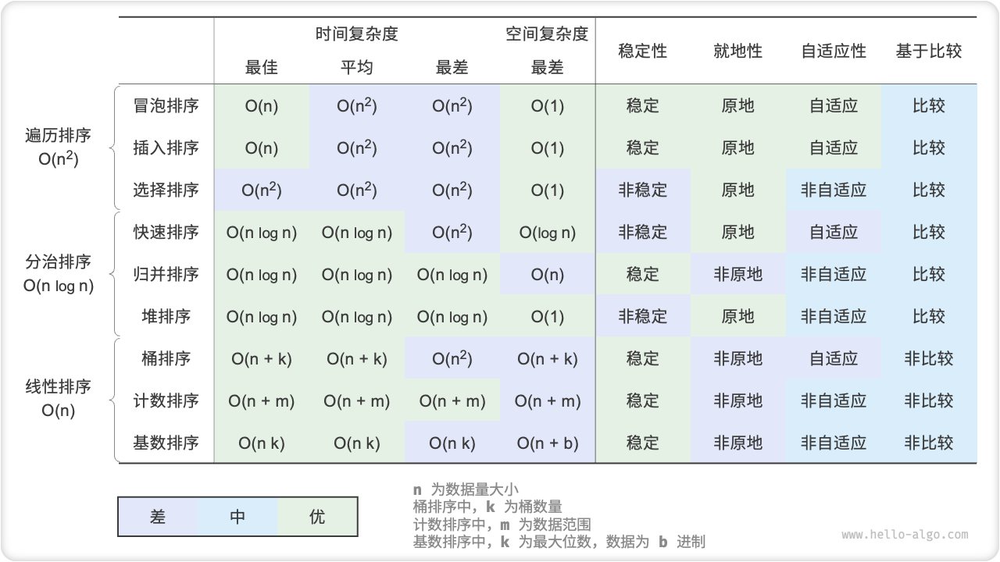

# 11.6. &nbsp; 小结

- 冒泡排序通过交换相邻元素来实现排序。通过增加标志位实现提前返回，我们可将冒泡排序的最佳时间复杂度优化至 $O(N)$ 。
- 插入排序每轮将待排序区间内元素插入至已排序区间的正确位置，从而实现排序。插入排序的时间复杂度虽为 $O(N^2)$ ，但因为总体操作少而很受欢迎，一般用于小数据量的排序工作。
- 快速排序基于哨兵划分操作实现排序。在哨兵划分中，有可能每次都选取到最差的基准数，从而导致时间复杂度劣化至 $O(N^2)$ ，通过引入中位数基准数或随机基准数可大大降低劣化概率。尾递归方法可以有效减小递归深度，将空间复杂度优化至 $O(\log N)$ 。
- 归并排序包含划分和合并两个阶段，是分而治之的标准体现。对于归并排序，排序数组需要借助辅助数组，空间复杂度为 $O(N)$ ；而排序链表的空间复杂度可以被优化至 $O(1)$ 。
- 下图总结对比了各个排序算法的运行效率与特性。其中，桶排序中 $k$ 为桶的数量；基数排序仅适用于正整数、字符串、特定格式的浮点数，$k$ 为最大数字的位数。

 Fig. 排序算法对比 

- 总体来看，我们追求运行快、稳定、原地、正向自适应性的排序。显然，如同其它数据结构与算法一样，同时满足这些条件的排序算法并不存在，我们需要根据问题特点来选择排序算法。
