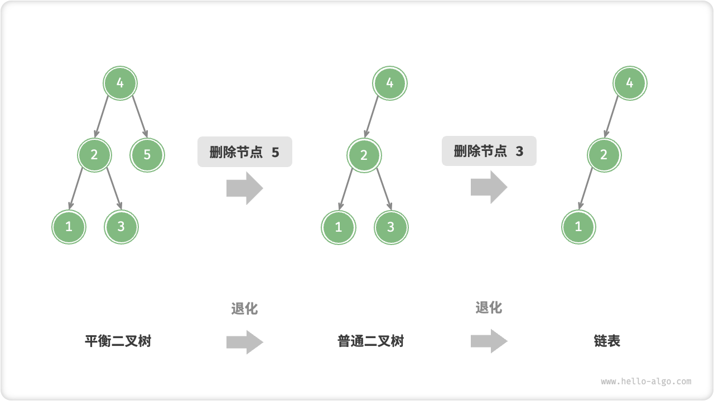
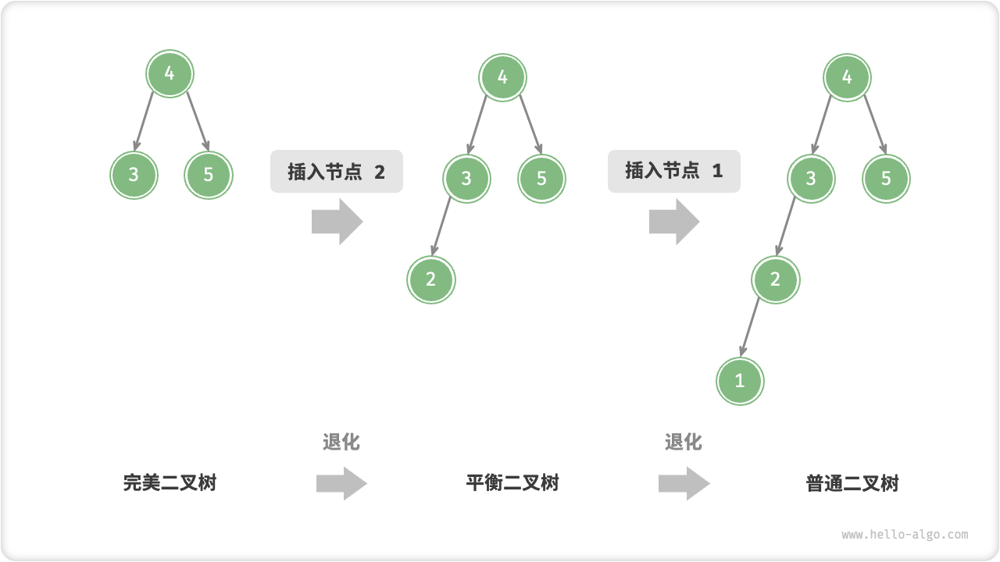
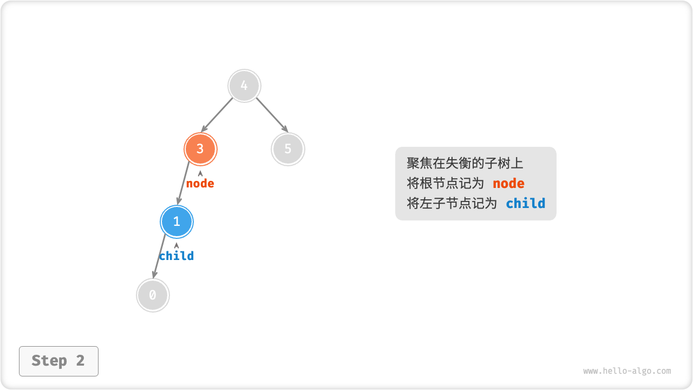
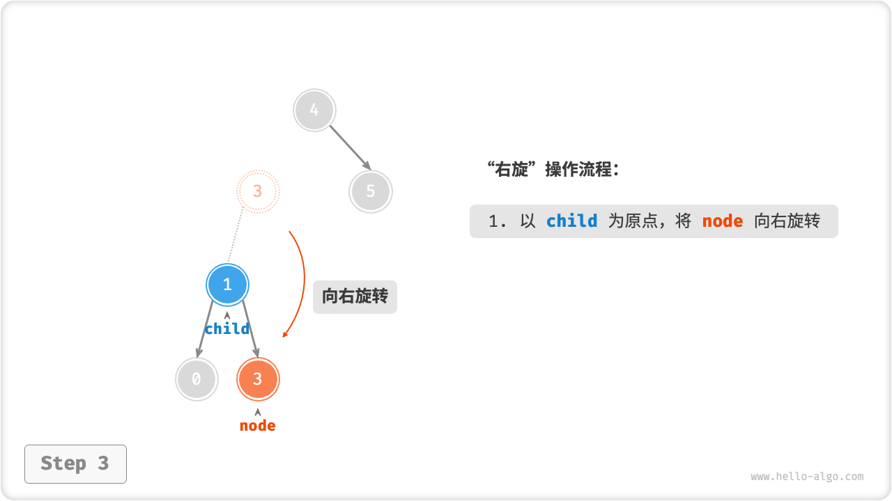
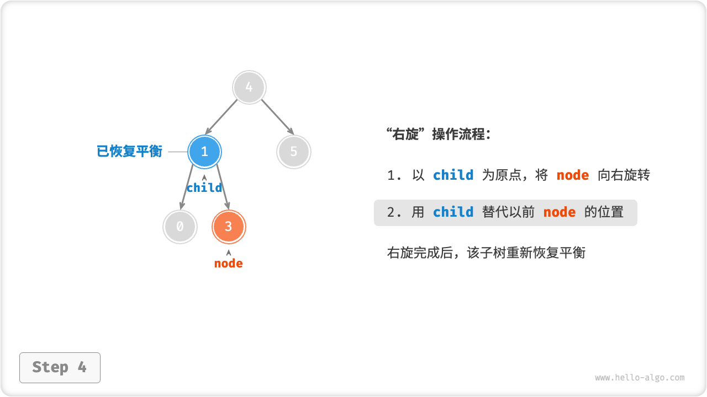
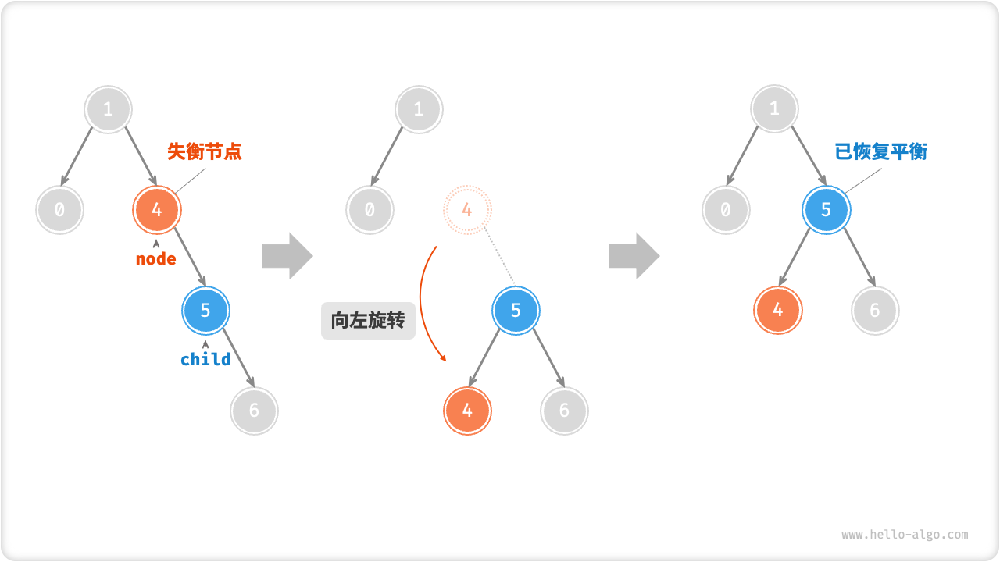
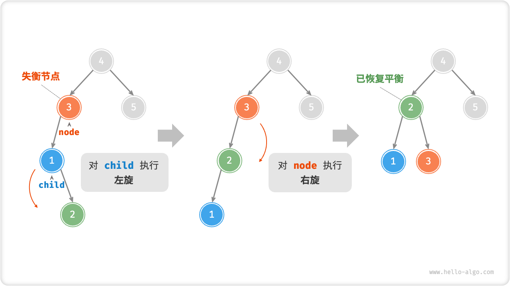

# 7.4. &nbsp; AVL 树 *

在「二叉搜索树」章节中提到，在进行多次插入与删除操作后，二叉搜索树可能会退化为链表。此时所有操作的时间复杂度都会由 $O(\log n)$ 劣化至 $O(n)$ 。

如下图所示，执行两步删除节点后，该二叉搜索树就会退化为链表。



<p align="center"> Fig. AVL 树在删除节点后发生退化 </p>

再比如，在以下完美二叉树中插入两个节点后，树严重向左偏斜，查找操作的时间复杂度也随之发生劣化。



<p align="center"> Fig. AVL 树在插入节点后发生退化 </p>

G. M. Adelson-Velsky 和 E. M. Landis 在其 1962 年发表的论文 "An algorithm for the organization of information" 中提出了「AVL 树」。**论文中描述了一系列操作，使得在不断添加与删除节点后，AVL 树仍然不会发生退化**，进而使得各种操作的时间复杂度均能保持在 $O(\log n)$ 级别。

换言之，在频繁增删查改的使用场景中，AVL 树可始终保持很高的数据增删查改效率，具有很好的应用价值。

## 7.4.1. &nbsp; AVL 树常见术语

「AVL 树」既是「二叉搜索树」又是「平衡二叉树」，同时满足这两种二叉树的所有性质，因此又被称为「平衡二叉搜索树」。

### 节点高度

在 AVL 树的操作中，需要获取节点「高度 Height」，所以给 AVL 树的节点类添加 `height` 变量。

=== "Java"

    ```java title=""
    /* AVL 树节点类 */
    class TreeNode {
        public int val;        // 节点值
        public int height;     // 节点高度
        public TreeNode left;  // 左子节点
        public TreeNode right; // 右子节点
        public TreeNode(int x) { val = x; }
    }
    ```

=== "C++"

    ```cpp title=""
    /* AVL 树节点类 */
    struct TreeNode {
        int val{};          // 节点值
        int height = 0;     // 节点高度
        TreeNode *left{};   // 左子节点
        TreeNode *right{};  // 右子节点
        TreeNode() = default;
        explicit TreeNode(int x) : val(x){}
    };
    ```

=== "Python"

    ```python title=""
    """ AVL 树节点类 """
    class TreeNode:
        def __init__(self, val: int):
            self.val: int = val                    # 节点值
            self.height: int = 0                   # 节点高度
            self.left: Optional[TreeNode] = None   # 左子节点引用
            self.right: Optional[TreeNode] = None  # 右子节点引用
    ```

=== "Go"

    ```go title=""
    /* AVL 树节点类 */
    type TreeNode struct {
        Val    int       // 节点值
        Height int       // 节点高度
        Left   *TreeNode // 左子节点引用
        Right  *TreeNode // 右子节点引用
    }
    ```

=== "JavaScript"

    ```javascript title=""
    class TreeNode {
        val; // 节点值
        height; //节点高度
        left; // 左子节点指针
        right; // 右子节点指针
        constructor(val, left, right, height) {
            this.val = val === undefined ? 0 : val;
            this.height = height === undefined ? 0 : height;
            this.left = left === undefined ? null : left;
            this.right = right === undefined ? null : right;
        }
    }
    ```

=== "TypeScript"

    ```typescript title=""
    class TreeNode {
        val: number;            // 节点值
        height: number;         // 节点高度
        left: TreeNode | null;  // 左子节点指针
        right: TreeNode | null; // 右子节点指针
        constructor(val?: number, height?: number, left?: TreeNode | null, right?: TreeNode | null) {
            this.val = val === undefined ? 0 : val;
            this.height = height === undefined ? 0 : height; 
            this.left = left === undefined ? null : left; 
            this.right = right === undefined ? null : right; 
        }
    }
    ```

=== "C"

    ```c title=""

    ```

=== "C#"

    ```csharp title=""
    /* AVL 树节点类 */
    class TreeNode {
        public int val;          // 节点值
        public int height;       // 节点高度
        public TreeNode? left;   // 左子节点
        public TreeNode? right;  // 右子节点
        public TreeNode(int x) { val = x; }
    }
    ```

=== "Swift"

    ```swift title=""
    /* AVL 树节点类 */
    class TreeNode {
        var val: Int // 节点值
        var height: Int // 节点高度
        var left: TreeNode? // 左子节点
        var right: TreeNode? // 右子节点

        init(x: Int) {
            val = x
            height = 0
        }
    }
    ```

=== "Zig"

    ```zig title=""

    ```

「节点高度」是最远叶节点到该节点的距离，即走过的「边」的数量。需要特别注意，**叶节点的高度为 0 ，空节点的高度为 -1**。我们封装两个工具函数，分别用于获取与更新节点的高度。

=== "Java"

    ```java title="avl_tree.java"
    /* 获取节点高度 */
    int height(TreeNode node) {
        // 空节点高度为 -1 ，叶节点高度为 0
        return node == null ? -1 : node.height;
    }

    /* 更新节点高度 */
    void updateHeight(TreeNode node) {
        // 节点高度等于最高子树高度 + 1
        node.height = Math.max(height(node.left), height(node.right)) + 1;
    }
    ```

=== "C++"

    ```cpp title="avl_tree.cpp"
    /* 获取节点高度 */
    int height(TreeNode* node) {
        // 空节点高度为 -1 ，叶节点高度为 0
        return node == nullptr ? -1 : node->height;
    }

    /* 更新节点高度 */
    void updateHeight(TreeNode* node) {
        // 节点高度等于最高子树高度 + 1
        node->height = max(height(node->left), height(node->right)) + 1;
    }
    ```

=== "Python"

    ```python title="avl_tree.py"
    def height(self, node: TreeNode | None) -> int:
        """ 获取节点高度 """
        # 空节点高度为 -1 ，叶节点高度为 0
        if node is not None:
            return node.height
        return -1

    def __update_height(self, node: TreeNode | None):
        """ 更新节点高度 """
        # 节点高度等于最高子树高度 + 1
        node.height = max([self.height(node.left), self.height(node.right)]) + 1
    ```

=== "Go"

    ```go title="avl_tree.go"
    /* 获取节点高度 */
    func (t *aVLTree) height(node *TreeNode) int {
        // 空节点高度为 -1 ，叶节点高度为 0
        if node != nil {
            return node.Height
        }
        return -1
    }

    /* 更新节点高度 */
    func (t *aVLTree) updateHeight(node *TreeNode) {
        lh := t.height(node.Left)
        rh := t.height(node.Right)
        // 节点高度等于最高子树高度 + 1
        if lh > rh {
            node.Height = lh + 1
        } else {
            node.Height = rh + 1
        }
    }
    ```

=== "JavaScript"

    ```javascript title="avl_tree.js"
    /* 获取节点高度 */
    height(node) {
        // 空节点高度为 -1 ，叶节点高度为 0
        return node === null ? -1 : node.height;
    }

    /* 更新节点高度 */
    #updateHeight(node) {
        // 节点高度等于最高子树高度 + 1
        node.height = Math.max(this.height(node.left), this.height(node.right)) + 1;
    }
    ```

=== "TypeScript"

    ```typescript title="avl_tree.ts"
    /* 获取节点高度 */
    height(node: TreeNode): number {
        // 空节点高度为 -1 ，叶节点高度为 0
        return node === null ? -1 : node.height;
    }

    /* 更新节点高度 */
    updateHeight(node: TreeNode): void {
        // 节点高度等于最高子树高度 + 1
        node.height = Math.max(this.height(node.left), this.height(node.right)) + 1;
    }
    ```

=== "C"

    ```c title="avl_tree.c"
    [class]{aVLTree}-[func]{height}

    [class]{aVLTree}-[func]{updateHeight}
    ```

=== "C#"

    ```csharp title="avl_tree.cs"
    /* 获取节点高度 */
    int height(TreeNode? node)
    {
        // 空节点高度为 -1 ，叶节点高度为 0
        return node == null ? -1 : node.height;
    }

    /* 更新节点高度 */
    void updateHeight(TreeNode node)
    {
        // 节点高度等于最高子树高度 + 1
        node.height = Math.Max(height(node.left), height(node.right)) + 1;
    }
    ```

=== "Swift"

    ```swift title="avl_tree.swift"
    /* 获取节点高度 */
    func height(node: TreeNode?) -> Int {
        // 空节点高度为 -1 ，叶节点高度为 0
        node == nil ? -1 : node!.height
    }

    /* 更新节点高度 */
    func updateHeight(node: TreeNode?) {
        // 节点高度等于最高子树高度 + 1
        node?.height = max(height(node: node?.left), height(node: node?.right)) + 1
    }
    ```

=== "Zig"

    ```zig title="avl_tree.zig"
    // 获取节点高度
    fn height(self: *Self, node: ?*inc.TreeNode(T)) i32 {
        _ = self;
        // 空节点高度为 -1 ，叶节点高度为 0
        return if (node == null) -1 else node.?.height;
    }

    // 更新节点高度
    fn updateHeight(self: *Self, node: ?*inc.TreeNode(T)) void {
        // 节点高度等于最高子树高度 + 1
        node.?.height = std.math.max(self.height(node.?.left), self.height(node.?.right)) + 1;
    }
    ```

### 节点平衡因子

节点的「平衡因子 Balance Factor」是 **节点的左子树高度减去右子树高度**，并定义空节点的平衡因子为 0 。同样地，我们将获取节点平衡因子封装成函数，以便后续使用。

=== "Java"

    ```java title="avl_tree.java"
    /* 获取平衡因子 */
    int balanceFactor(TreeNode node) {
        // 空节点平衡因子为 0
        if (node == null) return 0;
        // 节点平衡因子 = 左子树高度 - 右子树高度
        return height(node.left) - height(node.right);
    }
    ```

=== "C++"

    ```cpp title="avl_tree.cpp"
    /* 获取平衡因子 */
    int balanceFactor(TreeNode* node) {
        // 空节点平衡因子为 0
        if (node == nullptr) return 0;
        // 节点平衡因子 = 左子树高度 - 右子树高度
        return height(node->left) - height(node->right);
    }
    ```

=== "Python"

    ```python title="avl_tree.py"
    def balance_factor(self, node: TreeNode | None) -> int:
        """ 获取平衡因子 """
        # 空节点平衡因子为 0
        if node is None:
            return 0
        # 节点平衡因子 = 左子树高度 - 右子树高度
        return self.height(node.left) - self.height(node.right)
    ```

=== "Go"

    ```go title="avl_tree.go"
    /* 获取平衡因子 */
    func (t *aVLTree) balanceFactor(node *TreeNode) int {
        // 空节点平衡因子为 0
        if node == nil {
            return 0
        }
        // 节点平衡因子 = 左子树高度 - 右子树高度
        return t.height(node.Left) - t.height(node.Right)
    }
    ```

=== "JavaScript"

    ```javascript title="avl_tree.js"
    /* 获取平衡因子 */
    balanceFactor(node) {
        // 空节点平衡因子为 0
        if (node === null) return 0;
        // 节点平衡因子 = 左子树高度 - 右子树高度
        return this.height(node.left) - this.height(node.right);
    }
    ```

=== "TypeScript"

    ```typescript title="avl_tree.ts"
    /* 获取平衡因子 */
    balanceFactor(node: TreeNode): number {
        // 空节点平衡因子为 0
        if (node === null) return 0;
        // 节点平衡因子 = 左子树高度 - 右子树高度
        return this.height(node.left) - this.height(node.right);
    }
    ```

=== "C"

    ```c title="avl_tree.c"
    [class]{aVLTree}-[func]{balanceFactor}
    ```

=== "C#"

    ```csharp title="avl_tree.cs"
    /* 获取平衡因子 */
    int balanceFactor(TreeNode? node)
    {
        // 空节点平衡因子为 0
        if (node == null) return 0;
        // 节点平衡因子 = 左子树高度 - 右子树高度
        return height(node.left) - height(node.right);
    }
    ```

=== "Swift"

    ```swift title="avl_tree.swift"
    /* 获取平衡因子 */
    func balanceFactor(node: TreeNode?) -> Int {
        // 空节点平衡因子为 0
        guard let node = node else { return 0 }
        // 节点平衡因子 = 左子树高度 - 右子树高度
        return height(node: node.left) - height(node: node.right)
    }
    ```

=== "Zig"

    ```zig title="avl_tree.zig"
    // 获取平衡因子
    fn balanceFactor(self: *Self, node: ?*inc.TreeNode(T)) i32 {
        // 空节点平衡因子为 0
        if (node == null) return 0;
        // 节点平衡因子 = 左子树高度 - 右子树高度
        return self.height(node.?.left) - self.height(node.?.right);
    }
    ```

!!! note

    设平衡因子为 $f$ ，则一棵 AVL 树的任意节点的平衡因子皆满足 $-1 \le f \le 1$ 。

## 7.4.2. &nbsp; AVL 树旋转

AVL 树的独特之处在于「旋转 Rotation」的操作，其可 **在不影响二叉树中序遍历序列的前提下，使失衡节点重新恢复平衡**。换言之，旋转操作既可以使树保持为「二叉搜索树」，也可以使树重新恢复为「平衡二叉树」。

我们将平衡因子的绝对值 $> 1$ 的节点称为「失衡节点」。根据节点的失衡情况，旋转操作分为 **右旋、左旋、先右旋后左旋、先左旋后右旋**，接下来我们来一起来看看它们是如何操作的。

### Case 1 - 右旋

如下图所示（节点下方为「平衡因子」），从底至顶看，二叉树中首个失衡节点是 **节点 3**。我们聚焦在以该失衡节点为根节点的子树上，将该节点记为 `node` ，将其左子节点记为 `child` ，执行「右旋」操作。完成右旋后，该子树已经恢复平衡，并且仍然为二叉搜索树。

=== "<1>"
    

=== "<2>"
    

=== "<3>"
    

=== "<4>"
    

进而，如果节点 `child` 本身有右子节点（记为 `grandChild` ），则需要在「右旋」中添加一步：将 `grandChild` 作为 `node` 的左子节点。


<p align="center"> Fig. 有 grandChild 的右旋操作 </p>

“向右旋转”是一种形象化的说法，实际需要通过修改节点指针实现，代码如下所示。

=== "Java"

    ```java title="avl_tree.java"
    /* 右旋操作 */
    TreeNode rightRotate(TreeNode node) {
        TreeNode child = node.left;
        TreeNode grandChild = child.right;
        // 以 child 为原点，将 node 向右旋转
        child.right = node;
        node.left = grandChild;
        // 更新节点高度
        updateHeight(node);
        updateHeight(child);
        // 返回旋转后子树的根节点
        return child;
    }
    ```

=== "C++"

    ```cpp title="avl_tree.cpp"
    /* 右旋操作 */
    TreeNode* rightRotate(TreeNode* node) {
        TreeNode* child = node->left;
        TreeNode* grandChild = child->right;
        // 以 child 为原点，将 node 向右旋转
        child->right = node;
        node->left = grandChild;
        // 更新节点高度
        updateHeight(node);
        updateHeight(child);
        // 返回旋转后子树的根节点
        return child;
    }
    ```

=== "Python"

    ```python title="avl_tree.py"
    def __right_rotate(self, node: TreeNode | None) -> TreeNode | None:
        """ 右旋操作 """
        child = node.left
        grand_child = child.right
        # 以 child 为原点，将 node 向右旋转
        child.right = node
        node.left = grand_child
        # 更新节点高度
        self.__update_height(node)
        self.__update_height(child)
        # 返回旋转后子树的根节点
        return child
    ```

=== "Go"

    ```go title="avl_tree.go"
    /* 右旋操作 */
    func (t *aVLTree) rightRotate(node *TreeNode) *TreeNode {
        child := node.Left
        grandChild := child.Right
        // 以 child 为原点，将 node 向右旋转
        child.Right = node
        node.Left = grandChild
        // 更新节点高度
        t.updateHeight(node)
        t.updateHeight(child)
        // 返回旋转后子树的根节点
        return child
    }
    ```

=== "JavaScript"

    ```javascript title="avl_tree.js"
    /* 右旋操作 */
    #rightRotate(node) {
        const child = node.left;
        const grandChild = child.right;
        // 以 child 为原点，将 node 向右旋转
        child.right = node;
        node.left = grandChild;
        // 更新节点高度
        this.#updateHeight(node);
        this.#updateHeight(child);
        // 返回旋转后子树的根节点
        return child;
    }
    ```

=== "TypeScript"

    ```typescript title="avl_tree.ts"
    /* 右旋操作 */
    rightRotate(node: TreeNode): TreeNode {
        const child = node.left;
        const grandChild = child.right;
        // 以 child 为原点，将 node 向右旋转
        child.right = node;
        node.left = grandChild;
        // 更新节点高度
        this.updateHeight(node);
        this.updateHeight(child);
        // 返回旋转后子树的根节点
        return child;
    }
    ```

=== "C"

    ```c title="avl_tree.c"
    [class]{aVLTree}-[func]{rightRotate}
    ```

=== "C#"

    ```csharp title="avl_tree.cs"
    /* 右旋操作 */
    TreeNode? rightRotate(TreeNode? node)
    {
        TreeNode? child = node.left;
        TreeNode? grandChild = child?.right;
        // 以 child 为原点，将 node 向右旋转
        child.right = node;
        node.left = grandChild;
        // 更新节点高度
        updateHeight(node);
        updateHeight(child);
        // 返回旋转后子树的根节点
        return child;
    }
    ```

=== "Swift"

    ```swift title="avl_tree.swift"
    /* 右旋操作 */
    func rightRotate(node: TreeNode?) -> TreeNode? {
        let child = node?.left
        let grandChild = child?.right
        // 以 child 为原点，将 node 向右旋转
        child?.right = node
        node?.left = grandChild
        // 更新节点高度
        updateHeight(node: node)
        updateHeight(node: child)
        // 返回旋转后子树的根节点
        return child
    }
    ```

=== "Zig"

    ```zig title="avl_tree.zig"
    // 右旋操作
    fn rightRotate(self: *Self, node: ?*inc.TreeNode(T)) ?*inc.TreeNode(T) {
        var child = node.?.left;
        var grandChild = child.?.right;
        // 以 child 为原点，将 node 向右旋转
        child.?.right = node;
        node.?.left = grandChild;
        // 更新节点高度
        self.updateHeight(node);
        self.updateHeight(child);
        // 返回旋转后子树的根节点
        return child;
    }
    ```

### Case 2 - 左旋

类似地，如果将取上述失衡二叉树的“镜像”，那么则需要「左旋」操作。



<p align="center"> Fig. 左旋操作 </p>

同理，若节点 `child` 本身有左子节点（记为 `grandChild` ），则需要在「左旋」中添加一步：将 `grandChild` 作为 `node` 的右子节点。


<p align="center"> Fig. 有 grandChild 的左旋操作 </p>

观察发现，**「左旋」和「右旋」操作是镜像对称的，两者对应解决的两种失衡情况也是对称的**。根据对称性，我们可以很方便地从「右旋」推导出「左旋」。具体地，只需将「右旋」代码中的把所有的 `left` 替换为 `right` 、所有的 `right` 替换为 `left` ，即可得到「左旋」代码。

=== "Java"

    ```java title="avl_tree.java"
    /* 左旋操作 */
    TreeNode leftRotate(TreeNode node) {
        TreeNode child = node.right;
        TreeNode grandChild = child.left;
        // 以 child 为原点，将 node 向左旋转
        child.left = node;
        node.right = grandChild;
        // 更新节点高度
        updateHeight(node);
        updateHeight(child);
        // 返回旋转后子树的根节点
        return child;
    }
    ```

=== "C++"

    ```cpp title="avl_tree.cpp"
    /* 左旋操作 */
    TreeNode* leftRotate(TreeNode* node) {
        TreeNode* child = node->right;
        TreeNode* grandChild = child->left;
        // 以 child 为原点，将 node 向左旋转
        child->left = node;
        node->right = grandChild;
        // 更新节点高度
        updateHeight(node);
        updateHeight(child);
        // 返回旋转后子树的根节点
        return child;
    }
    ```

=== "Python"

    ```python title="avl_tree.py"
    def __left_rotate(self, node: TreeNode | None) -> TreeNode | None:
        """ 左旋操作 """
        child = node.right
        grand_child = child.left
        # 以 child 为原点，将 node 向左旋转
        child.left = node
        node.right = grand_child
        # 更新节点高度
        self.__update_height(node)
        self.__update_height(child)
        # 返回旋转后子树的根节点
        return child
    ```

=== "Go"

    ```go title="avl_tree.go"
    /* 左旋操作 */
    func (t *aVLTree) leftRotate(node *TreeNode) *TreeNode {
        child := node.Right
        grandChild := child.Left
        // 以 child 为原点，将 node 向左旋转
        child.Left = node
        node.Right = grandChild
        // 更新节点高度
        t.updateHeight(node)
        t.updateHeight(child)
        // 返回旋转后子树的根节点
        return child
    }
    ```

=== "JavaScript"

    ```javascript title="avl_tree.js"
    /* 左旋操作 */
    #leftRotate(node) {
        const child = node.right;
        const grandChild = child.left;
        // 以 child 为原点，将 node 向左旋转
        child.left = node;
        node.right = grandChild;
        // 更新节点高度
        this.#updateHeight(node);
        this.#updateHeight(child);
        // 返回旋转后子树的根节点
        return child;
    }
    ```

=== "TypeScript"

    ```typescript title="avl_tree.ts"
    /* 左旋操作 */
    leftRotate(node: TreeNode): TreeNode {
        const child = node.right;
        const grandChild = child.left;
        // 以 child 为原点，将 node 向左旋转
        child.left = node;
        node.right = grandChild;
        // 更新节点高度
        this.updateHeight(node);
        this.updateHeight(child);
        // 返回旋转后子树的根节点
        return child;
    }
    ```

=== "C"

    ```c title="avl_tree.c"
    [class]{aVLTree}-[func]{leftRotate}
    ```

=== "C#"

    ```csharp title="avl_tree.cs"
    /* 左旋操作 */
    TreeNode? leftRotate(TreeNode? node)
    {
        TreeNode? child = node.right;
        TreeNode? grandChild = child?.left;
        // 以 child 为原点，将 node 向左旋转
        child.left = node;
        node.right = grandChild;
        // 更新节点高度
        updateHeight(node);
        updateHeight(child);
        // 返回旋转后子树的根节点
        return child;
    }
    ```

=== "Swift"

    ```swift title="avl_tree.swift"
    /* 左旋操作 */
    func leftRotate(node: TreeNode?) -> TreeNode? {
        let child = node?.right
        let grandChild = child?.left
        // 以 child 为原点，将 node 向左旋转
        child?.left = node
        node?.right = grandChild
        // 更新节点高度
        updateHeight(node: node)
        updateHeight(node: child)
        // 返回旋转后子树的根节点
        return child
    }
    ```

=== "Zig"

    ```zig title="avl_tree.zig"
    // 左旋操作
    fn leftRotate(self: *Self, node: ?*inc.TreeNode(T)) ?*inc.TreeNode(T) {
        var child = node.?.right;
        var grandChild = child.?.left;
        // 以 child 为原点，将 node 向左旋转
        child.?.left = node;
        node.?.right = grandChild;
        // 更新节点高度
        self.updateHeight(node);
        self.updateHeight(child);
        // 返回旋转后子树的根节点
        return child;
    }
    ```

### Case 3 - 先左后右

对于下图的失衡节点 3 ，**单一使用左旋或右旋都无法使子树恢复平衡**，此时需要「先左旋后右旋」，即先对 `child` 执行「左旋」，再对 `node` 执行「右旋」。



<p align="center"> Fig. 先左旋后右旋 </p>

### Case 4 - 先右后左

同理，取以上失衡二叉树的镜像，则需要「先右旋后左旋」，即先对 `child` 执行「右旋」，然后对 `node` 执行「左旋」。


<p align="center"> Fig. 先右旋后左旋 </p>

### 旋转的选择

下图描述的四种失衡情况与上述 Cases 逐个对应，分别需采用 **右旋、左旋、先右后左、先左后右** 的旋转操作。


<p align="center"> Fig. AVL 树的四种旋转情况 </p>

具体地，在代码中使用 **失衡节点的平衡因子、较高一侧子节点的平衡因子** 来确定失衡节点属于上图中的哪种情况。

<div class="center-table" markdown>

| 失衡节点的平衡因子 | 子节点的平衡因子 | 应采用的旋转方法 |
| ------------------ | ---------------- | ---------------- |
| $>0$ （即左偏树）  | $\geq 0$         | 右旋             |
| $>0$ （即左偏树）  | $<0$             | 先左旋后右旋     |
| $<0$ （即右偏树）  | $\leq 0$         | 左旋             |
| $<0$ （即右偏树）  | $>0$             | 先右旋后左旋     |

</div>

为方便使用，我们将旋转操作封装成一个函数。至此，**我们可以使用此函数来旋转各种失衡情况，使失衡节点重新恢复平衡**。

=== "Java"

    ```java title="avl_tree.java"
    /* 执行旋转操作，使该子树重新恢复平衡 */
    TreeNode rotate(TreeNode node) {
        // 获取节点 node 的平衡因子
        int balanceFactor = balanceFactor(node);
        // 左偏树
        if (balanceFactor > 1) {
            if (balanceFactor(node.left) >= 0) {
                // 右旋
                return rightRotate(node);
            } else {
                // 先左旋后右旋
                node.left = leftRotate(node.left);
                return rightRotate(node);
            }
        }
        // 右偏树
        if (balanceFactor < -1) {
            if (balanceFactor(node.right) <= 0) {
                // 左旋
                return leftRotate(node);
            } else {
                // 先右旋后左旋
                node.right = rightRotate(node.right);
                return leftRotate(node);
            }
        }
        // 平衡树，无需旋转，直接返回
        return node;
    }
    ```

=== "C++"

    ```cpp title="avl_tree.cpp"
    /* 执行旋转操作，使该子树重新恢复平衡 */
    TreeNode* rotate(TreeNode* node) {
        // 获取节点 node 的平衡因子
        int _balanceFactor = balanceFactor(node);
        // 左偏树
        if (_balanceFactor > 1) {
            if (balanceFactor(node->left) >= 0) {
                // 右旋
                return rightRotate(node);
            } else {
                // 先左旋后右旋
                node->left = leftRotate(node->left);
                return rightRotate(node);
            }
        }
        // 右偏树
        if (_balanceFactor < -1) {
            if (balanceFactor(node->right) <= 0) {
                // 左旋
                return leftRotate(node);
            } else {
                // 先右旋后左旋
                node->right = rightRotate(node->right);
                return leftRotate(node);
            }
        }
        // 平衡树，无需旋转，直接返回
        return node;
    }
    ```

=== "Python"

    ```python title="avl_tree.py"
    def __rotate(self, node: TreeNode | None) -> TreeNode | None:
        """ 执行旋转操作，使该子树重新恢复平衡 """
        # 获取节点 node 的平衡因子
        balance_factor = self.balance_factor(node)
        # 左偏树
        if balance_factor > 1:
            if self.balance_factor(node.left) >= 0:
                # 右旋
                return self.__right_rotate(node)
            else:
                # 先左旋后右旋
                node.left = self.__left_rotate(node.left)
                return self.__right_rotate(node)
        # 右偏树
        elif balance_factor < -1:
            if self.balance_factor(node.right) <= 0:
                # 左旋
                return self.__left_rotate(node)
            else:
                # 先右旋后左旋
                node.right = self.__right_rotate(node.right)
                return self.__left_rotate(node)
        # 平衡树，无需旋转，直接返回
        return node
    ```

=== "Go"

    ```go title="avl_tree.go"
    /* 执行旋转操作，使该子树重新恢复平衡 */
    func (t *aVLTree) rotate(node *TreeNode) *TreeNode {
        // 获取节点 node 的平衡因子
        // Go 推荐短变量，这里 bf 指代 t.balanceFactor
        bf := t.balanceFactor(node)
        // 左偏树
        if bf > 1 {
            if t.balanceFactor(node.Left) >= 0 {
                // 右旋
                return t.rightRotate(node)
            } else {
                // 先左旋后右旋
                node.Left = t.leftRotate(node.Left)
                return t.rightRotate(node)
            }
        }
        // 右偏树
        if bf < -1 {
            if t.balanceFactor(node.Right) <= 0 {
                // 左旋
                return t.leftRotate(node)
            } else {
                // 先右旋后左旋
                node.Right = t.rightRotate(node.Right)
                return t.leftRotate(node)
            }
        }
        // 平衡树，无需旋转，直接返回
        return node
    }
    ```

=== "JavaScript"

    ```javascript title="avl_tree.js"
    /* 执行旋转操作，使该子树重新恢复平衡 */
    #rotate(node) {
        // 获取节点 node 的平衡因子
        const balanceFactor = this.balanceFactor(node);
        // 左偏树
        if (balanceFactor > 1) {
            if (this.balanceFactor(node.left) >= 0) {
                // 右旋
                return this.#rightRotate(node);
            } else {
                // 先左旋后右旋
                node.left = this.#leftRotate(node.left);
                return this.#rightRotate(node);
            }
        }
        // 右偏树
        if (balanceFactor < -1) {
            if (this.balanceFactor(node.right) <= 0) {
                // 左旋
                return this.#leftRotate(node);
            } else {
                // 先右旋后左旋
                node.right = this.#rightRotate(node.right);
                return this.#leftRotate(node);
            }
        }
        // 平衡树，无需旋转，直接返回
        return node;
    }
    ```

=== "TypeScript"

    ```typescript title="avl_tree.ts"
    /* 执行旋转操作，使该子树重新恢复平衡 */
    rotate(node: TreeNode): TreeNode {
        // 获取节点 node 的平衡因子
        const balanceFactor = this.balanceFactor(node);
        // 左偏树
        if (balanceFactor > 1) {
            if (this.balanceFactor(node.left) >= 0) {
                // 右旋
                return this.rightRotate(node);
            } else {
                // 先左旋后右旋
                node.left = this.leftRotate(node.left);
                return this.rightRotate(node);
            }
        }
        // 右偏树
        if (balanceFactor < -1) {
            if (this.balanceFactor(node.right) <= 0) {
                // 左旋
                return this.leftRotate(node);
            } else {
                // 先右旋后左旋
                node.right = this.rightRotate(node.right);
                return this.leftRotate(node);
            }
        }
        // 平衡树，无需旋转，直接返回
        return node;
    }
    ```

=== "C"

    ```c title="avl_tree.c"
    [class]{aVLTree}-[func]{rotate}
    ```

=== "C#"

    ```csharp title="avl_tree.cs"
    /* 执行旋转操作，使该子树重新恢复平衡 */
    TreeNode? rotate(TreeNode? node)
    {
        // 获取节点 node 的平衡因子
        int balanceFactorInt = balanceFactor(node);
        // 左偏树
        if (balanceFactorInt > 1)
        {
            if (balanceFactor(node.left) >= 0)
            {
                // 右旋
                return rightRotate(node);
            }
            else
            {
                // 先左旋后右旋
                node.left = leftRotate(node?.left);
                return rightRotate(node);
            }
        }
        // 右偏树
        if (balanceFactorInt < -1)
        {
            if (balanceFactor(node.right) <= 0)
            {
                // 左旋
                return leftRotate(node);
            }
            else
            {
                // 先右旋后左旋
                node.right = rightRotate(node?.right);
                return leftRotate(node);
            }
        }
        // 平衡树，无需旋转，直接返回
        return node;
    }
    ```

=== "Swift"

    ```swift title="avl_tree.swift"
    /* 执行旋转操作，使该子树重新恢复平衡 */
    func rotate(node: TreeNode?) -> TreeNode? {
        // 获取节点 node 的平衡因子
        let balanceFactor = balanceFactor(node: node)
        // 左偏树
        if balanceFactor > 1 {
            if self.balanceFactor(node: node?.left) >= 0 {
                // 右旋
                return rightRotate(node: node)
            } else {
                // 先左旋后右旋
                node?.left = leftRotate(node: node?.left)
                return rightRotate(node: node)
            }
        }
        // 右偏树
        if balanceFactor < -1 {
            if self.balanceFactor(node: node?.right) <= 0 {
                // 左旋
                return leftRotate(node: node)
            } else {
                // 先右旋后左旋
                node?.right = rightRotate(node: node?.right)
                return leftRotate(node: node)
            }
        }
        // 平衡树，无需旋转，直接返回
        return node
    }
    ```

=== "Zig"

    ```zig title="avl_tree.zig"
    // 执行旋转操作，使该子树重新恢复平衡
    fn rotate(self: *Self, node: ?*inc.TreeNode(T)) ?*inc.TreeNode(T) {
        // 获取节点 node 的平衡因子
        var balance_factor = self.balanceFactor(node);
        // 左偏树
        if (balance_factor > 1) {
            if (self.balanceFactor(node.?.left) >= 0) {
                // 右旋
                return self.rightRotate(node);
            } else {
                // 先左旋后右旋
                node.?.left = self.leftRotate(node.?.left);
                return self.rightRotate(node);
            }
        }
        // 右偏树
        if (balance_factor < -1) {
            if (self.balanceFactor(node.?.right) <= 0) {
                // 左旋
                return self.leftRotate(node);
            } else {
                // 先右旋后左旋
                node.?.right = self.rightRotate(node.?.right);
                return self.leftRotate(node);
            }
        }
        // 平衡树，无需旋转，直接返回
        return node;
    }
    ```

## 7.4.3. &nbsp; AVL 树常用操作

### 插入节点

「AVL 树」的节点插入操作与「二叉搜索树」主体类似。不同的是，在插入节点后，从该节点到根节点的路径上会出现一系列「失衡节点」。所以，**我们需要从该节点开始，从底至顶地执行旋转操作，使所有失衡节点恢复平衡**。

=== "Java"

    ```java title="avl_tree.java"
    /* 插入节点 */
    TreeNode insert(int val) {
        root = insertHelper(root, val);
        return root;
    }

    /* 递归插入节点（辅助方法） */
    TreeNode insertHelper(TreeNode node, int val) {
        if (node == null) return new TreeNode(val);
        /* 1. 查找插入位置，并插入节点 */
        if (val < node.val)
            node.left = insertHelper(node.left, val);
        else if (val > node.val)
            node.right = insertHelper(node.right, val);
        else
            return node;     // 重复节点不插入，直接返回
        updateHeight(node);  // 更新节点高度
        /* 2. 执行旋转操作，使该子树重新恢复平衡 */
        node = rotate(node);
        // 返回子树的根节点
        return node;
    }
    ```

=== "C++"

    ```cpp title="avl_tree.cpp"
    /* 插入节点 */
    TreeNode* insert(int val) {
        root = insertHelper(root, val);
        return root;
    }

    /* 递归插入节点（辅助方法） */
    TreeNode* insertHelper(TreeNode* node, int val) {
        if (node == nullptr)
            return new TreeNode(val);
        /* 1. 查找插入位置，并插入节点 */
        if (val < node->val)
            node->left = insertHelper(node->left, val);
        else if (val > node->val)
            node->right = insertHelper(node->right, val);
        else
            return node;     // 重复节点不插入，直接返回
        updateHeight(node);  // 更新节点高度
        /* 2. 执行旋转操作，使该子树重新恢复平衡 */
        node = rotate(node);
        // 返回子树的根节点
        return node;
    }
    ```

=== "Python"

    ```python title="avl_tree.py"
    def insert(self, val) -> TreeNode:
        """ 插入节点 """
        self.__root = self.__insert_helper(self.__root, val)
        return self.__root

    def __insert_helper(self, node: TreeNode | None, val: int) -> TreeNode:
        """ 递归插入节点（辅助方法）"""
        if node is None:
            return TreeNode(val)
        # 1. 查找插入位置，并插入节点
        if val < node.val:
            node.left = self.__insert_helper(node.left, val)
        elif val > node.val:
            node.right = self.__insert_helper(node.right, val)
        else:
            # 重复节点不插入，直接返回
            return node
        # 更新节点高度
        self.__update_height(node)
        # 2. 执行旋转操作，使该子树重新恢复平衡
        return self.__rotate(node)
    ```

=== "Go"

    ```go title="avl_tree.go"
    /* 插入节点 */
    func (t *aVLTree) insert(val int) *TreeNode {
        t.root = t.insertHelper(t.root, val)
        return t.root
    }

    /* 递归插入节点（辅助方法） */
    func (t *aVLTree) insertHelper(node *TreeNode, val int) *TreeNode {
        if node == nil {
            return NewTreeNode(val)
        }
        /* 1. 查找插入位置，并插入节点 */
        if val < node.Val {
            node.Left = t.insertHelper(node.Left, val)
        } else if val > node.Val {
            node.Right = t.insertHelper(node.Right, val)
        } else {
            // 重复节点不插入，直接返回
            return node
        }
        // 更新节点高度
        t.updateHeight(node)
        /* 2. 执行旋转操作，使该子树重新恢复平衡 */
        node = t.rotate(node)
        // 返回子树的根节点
        return node
    }
    ```

=== "JavaScript"

    ```javascript title="avl_tree.js"
    /* 插入节点 */
    insert(val) {
        this.root = this.#insertHelper(this.root, val);
        return this.root;
    }

    /* 递归插入节点（辅助方法） */
    #insertHelper(node, val) {
        if (node === null) return new TreeNode(val);
        /* 1. 查找插入位置，并插入节点 */
        if (val < node.val) node.left = this.#insertHelper(node.left, val);
        else if (val > node.val) node.right = this.#insertHelper(node.right, val);
        else return node; // 重复节点不插入，直接返回
        this.#updateHeight(node); // 更新节点高度
        /* 2. 执行旋转操作，使该子树重新恢复平衡 */
        node = this.#rotate(node);
        // 返回子树的根节点
        return node;
    }
    ```

=== "TypeScript"

    ```typescript title="avl_tree.ts"
    /* 插入节点 */
    insert(val: number): TreeNode {
        this.root = this.insertHelper(this.root, val);
        return this.root;
    }

    /* 递归插入节点（辅助方法） */
    insertHelper(node: TreeNode, val: number): TreeNode {
        if (node === null) return new TreeNode(val);
        /* 1. 查找插入位置，并插入节点 */
        if (val < node.val) {
            node.left = this.insertHelper(node.left, val);
        } else if (val > node.val) {
            node.right = this.insertHelper(node.right, val);
        } else {
            return node; // 重复节点不插入，直接返回
        }
        this.updateHeight(node); // 更新节点高度
        /* 2. 执行旋转操作，使该子树重新恢复平衡 */
        node = this.rotate(node);
        // 返回子树的根节点
        return node;
    }
    ```

=== "C"

    ```c title="avl_tree.c"
    [class]{aVLTree}-[func]{insert}

    [class]{aVLTree}-[func]{insertHelper}
    ```

=== "C#"

    ```csharp title="avl_tree.cs"
    /* 插入节点 */
    TreeNode? insert(int val)
    {
        root = insertHelper(root, val);
        return root;
    }

    /* 递归插入节点（辅助方法） */
    TreeNode? insertHelper(TreeNode? node, int val)
    {
        if (node == null) return new TreeNode(val);
        /* 1. 查找插入位置，并插入节点 */
        if (val < node.val)
            node.left = insertHelper(node.left, val);
        else if (val > node.val)
            node.right = insertHelper(node.right, val);
        else
            return node;     // 重复节点不插入，直接返回
        updateHeight(node);  // 更新节点高度
        /* 2. 执行旋转操作，使该子树重新恢复平衡 */
        node = rotate(node);
        // 返回子树的根节点
        return node;
    }
    ```

=== "Swift"

    ```swift title="avl_tree.swift"
    /* 插入节点 */
    @discardableResult
    func insert(val: Int) -> TreeNode? {
        root = insertHelper(node: root, val: val)
        return root
    }

    /* 递归插入节点（辅助方法） */
    func insertHelper(node: TreeNode?, val: Int) -> TreeNode? {
        var node = node
        if node == nil {
            return TreeNode(x: val)
        }
        /* 1. 查找插入位置，并插入节点 */
        if val < node!.val {
            node?.left = insertHelper(node: node?.left, val: val)
        } else if val > node!.val {
            node?.right = insertHelper(node: node?.right, val: val)
        } else {
            return node // 重复节点不插入，直接返回
        }
        updateHeight(node: node) // 更新节点高度
        /* 2. 执行旋转操作，使该子树重新恢复平衡 */
        node = rotate(node: node)
        // 返回子树的根节点
        return node
    }
    ```

=== "Zig"

    ```zig title="avl_tree.zig"
    // 插入节点
    fn insert(self: *Self, val: T) !?*inc.TreeNode(T) {
        self.root = try self.insertHelper(self.root, val);
        return self.root;
    }

    // 递归插入节点（辅助方法）
    fn insertHelper(self: *Self, node_: ?*inc.TreeNode(T), val: T) !?*inc.TreeNode(T) {
        var node = node_;
        if (node == null) {
            var tmp_node = try self.mem_allocator.create(inc.TreeNode(T));
            tmp_node.init(val);
            return tmp_node;
        }
        // 1. 查找插入位置，并插入节点
        if (val < node.?.val) {
            node.?.left = try self.insertHelper(node.?.left, val);
        } else if (val > node.?.val) {
            node.?.right = try self.insertHelper(node.?.right, val);
        } else {
            return node;            // 重复节点不插入，直接返回
        }
        self.updateHeight(node);    // 更新节点高度
        // 2. 执行旋转操作，使该子树重新恢复平衡
        node = self.rotate(node);
        // 返回子树的根节点
        return node;
    }
    ```

### 删除节点

「AVL 树」删除节点操作与「二叉搜索树」删除节点操作总体相同。类似地，**在删除节点后，也需要从底至顶地执行旋转操作，使所有失衡节点恢复平衡**。

=== "Java"

    ```java title="avl_tree.java"
    /* 删除节点 */
    TreeNode remove(int val) {
        root = removeHelper(root, val);
        return root;
    }

    /* 递归删除节点（辅助方法） */
    TreeNode removeHelper(TreeNode node, int val) {
        if (node == null) return null;
        /* 1. 查找节点，并删除之 */
        if (val < node.val)
            node.left = removeHelper(node.left, val);
        else if (val > node.val)
            node.right = removeHelper(node.right, val);
        else {
            if (node.left == null || node.right == null) {
                TreeNode child = node.left != null ? node.left : node.right;
                // 子节点数量 = 0 ，直接删除 node 并返回
                if (child == null)
                    return null;
                // 子节点数量 = 1 ，直接删除 node
                else
                    node = child;
            } else {
                // 子节点数量 = 2 ，则将中序遍历的下个节点删除，并用该节点替换当前节点
                TreeNode temp = getInOrderNext(node.right);
                node.right = removeHelper(node.right, temp.val);
                node.val = temp.val;
            }
        }
        updateHeight(node);  // 更新节点高度
        /* 2. 执行旋转操作，使该子树重新恢复平衡 */
        node = rotate(node);
        // 返回子树的根节点
        return node;
    }

    /* 获取中序遍历中的下一个节点（仅适用于 root 有左子节点的情况） */
    TreeNode getInOrderNext(TreeNode node) {
        if (node == null) return node;
        // 循环访问左子节点，直到叶节点时为最小节点，跳出
        while (node.left != null) {
            node = node.left;
        }
        return node;
    }
    ```

=== "C++"

    ```cpp title="avl_tree.cpp"
    /* 删除节点 */
    TreeNode* remove(int val) {
        root = removeHelper(root, val);
        return root;
    }

    /* 递归删除节点（辅助方法） */
    TreeNode* removeHelper(TreeNode* node, int val) {
        if (node == nullptr)
            return nullptr;
        /* 1. 查找节点，并删除之 */
        if (val < node->val)
            node->left = removeHelper(node->left, val);
        else if (val > node->val)
            node->right = removeHelper(node->right, val);
        else {
            if (node->left == nullptr || node->right == nullptr) {
                TreeNode* child = node->left != nullptr ? node->left : node->right;
                // 子节点数量 = 0 ，直接删除 node 并返回
                if (child == nullptr) {
                    delete node;
                    return nullptr;
                }
                // 子节点数量 = 1 ，直接删除 node
                else {
                    delete node;
                    node = child;
                }
            } else {
                // 子节点数量 = 2 ，则将中序遍历的下个节点删除，并用该节点替换当前节点
                TreeNode* temp = getInOrderNext(node->right);
                int tempVal = temp->val;
                node->right = removeHelper(node->right, temp->val);
                node->val = tempVal;
            }
        }
        updateHeight(node);  // 更新节点高度
        /* 2. 执行旋转操作，使该子树重新恢复平衡 */
        node = rotate(node);
        // 返回子树的根节点
        return node;
    }

    /* 获取中序遍历中的下一个节点（仅适用于 root 有左子节点的情况） */
    TreeNode* getInOrderNext(TreeNode* node) {
        if (node == nullptr)
            return node;
        // 循环访问左子节点，直到叶节点时为最小节点，跳出
        while (node->left != nullptr) {
            node = node->left;
        }
        return node;
    }
    ```

=== "Python"

    ```python title="avl_tree.py"
    def remove(self, val: int) -> TreeNode | None:
        """ 删除节点 """
        self.__root = self.__remove_helper(self.__root, val)
        return self.__root 

    def __remove_helper(self, node: TreeNode | None, val: int) -> TreeNode | None:
        """ 递归删除节点（辅助方法） """
        if node is None:
            return None
        # 1. 查找节点，并删除之
        if val < node.val:
            node.left = self.__remove_helper(node.left, val)
        elif val > node.val:
            node.right = self.__remove_helper(node.right, val)
        else:
            if node.left is None or node.right is None:
                child = node.left or node.right
                # 子节点数量 = 0 ，直接删除 node 并返回
                if child is None:
                    return None
                # 子节点数量 = 1 ，直接删除 node
                else:
                    node = child
            else:  # 子节点数量 = 2 ，则将中序遍历的下个节点删除，并用该节点替换当前节点
                temp = self.__get_inorder_next(node.right)
                node.right = self.__remove_helper(node.right, temp.val)
                node.val = temp.val
        # 更新节点高度
        self.__update_height(node)
        # 2. 执行旋转操作，使该子树重新恢复平衡
        return self.__rotate(node)

    def __get_inorder_next(self, node: TreeNode | None) -> TreeNode | None:
        """ 获取中序遍历中的下一个节点（仅适用于 root 有左子节点的情况） """
        if node is None:
            return None
        # 循环访问左子节点，直到叶节点时为最小节点，跳出
        while node.left is not None:
            node = node.left
        return node
    ```

=== "Go"

    ```go title="avl_tree.go"
    /* 删除节点 */
    func (t *aVLTree) remove(val int) *TreeNode {
        root := t.removeHelper(t.root, val)
        return root
    }

    /* 递归删除节点（辅助方法） */
    func (t *aVLTree) removeHelper(node *TreeNode, val int) *TreeNode {
        if node == nil {
            return nil
        }
        /* 1. 查找节点，并删除之 */
        if val < node.Val {
            node.Left = t.removeHelper(node.Left, val)
        } else if val > node.Val {
            node.Right = t.removeHelper(node.Right, val)
        } else {
            if node.Left == nil || node.Right == nil {
                child := node.Left
                if node.Right != nil {
                    child = node.Right
                }
                // 子节点数量 = 0 ，直接删除 node 并返回
                if child == nil {
                    return nil
                } else {
                    // 子节点数量 = 1 ，直接删除 node
                    node = child
                }
            } else {
                // 子节点数量 = 2 ，则将中序遍历的下个节点删除，并用该节点替换当前节点
                temp := t.getInOrderNext(node.Right)
                node.Right = t.removeHelper(node.Right, temp.Val)
                node.Val = temp.Val
            }
        }
        // 更新节点高度
        t.updateHeight(node)
        /* 2. 执行旋转操作，使该子树重新恢复平衡 */
        node = t.rotate(node)
        // 返回子树的根节点
        return node
    }

    /* 获取中序遍历中的下一个节点（仅适用于 root 有左子节点的情况） */
    func (t *aVLTree) getInOrderNext(node *TreeNode) *TreeNode {
        if node == nil {
            return node
        }
        // 循环访问左子节点，直到叶节点时为最小节点，跳出
        for node.Left != nil {
            node = node.Left
        }
        return node
    }
    ```

=== "JavaScript"

    ```javascript title="avl_tree.js"
    /* 删除节点 */
    remove(val) {
        this.root = this.#removeHelper(this.root, val);
        return this.root;
    }

    /* 递归删除节点（辅助方法） */
    #removeHelper(node, val) {
        if (node === null) return null;
        /* 1. 查找节点，并删除之 */
        if (val < node.val) node.left = this.#removeHelper(node.left, val);
        else if (val > node.val) node.right = this.#removeHelper(node.right, val);
        else {
            if (node.left === null || node.right === null) {
                const child = node.left !== null ? node.left : node.right;
                // 子节点数量 = 0 ，直接删除 node 并返回
                if (child === null) return null;
                // 子节点数量 = 1 ，直接删除 node
                else node = child;
            } else {
                // 子节点数量 = 2 ，则将中序遍历的下个节点删除，并用该节点替换当前节点
                const temp = this.#getInOrderNext(node.right);
                node.right = this.#removeHelper(node.right, temp.val);
                node.val = temp.val;
            }
        }
        this.#updateHeight(node); // 更新节点高度
        /* 2. 执行旋转操作，使该子树重新恢复平衡 */
        node = this.#rotate(node);
        // 返回子树的根节点
        return node;
    }

    /* 获取中序遍历中的下一个节点（仅适用于 root 有左子节点的情况） */
    #getInOrderNext(node) {
        if (node === null) return node;
        // 循环访问左子节点，直到叶节点时为最小节点，跳出
        while (node.left !== null) {
            node = node.left;
        }
        return node;
    }
    ```

=== "TypeScript"

    ```typescript title="avl_tree.ts"
    /* 删除节点 */
    remove(val: number): TreeNode {
        this.root = this.removeHelper(this.root, val);
        return this.root;
    }

    /* 递归删除节点（辅助方法） */
    removeHelper(node: TreeNode, val: number): TreeNode {
        if (node === null) return null;
        /* 1. 查找节点，并删除之 */
        if (val < node.val) {
            node.left = this.removeHelper(node.left, val);
        } else if (val > node.val) {
            node.right = this.removeHelper(node.right, val);
        } else {
            if (node.left === null || node.right === null) {
                const child = node.left !== null ? node.left : node.right;
                // 子节点数量 = 0 ，直接删除 node 并返回
                if (child === null) {
                    return null;
                } else {
                    // 子节点数量 = 1 ，直接删除 node
                    node = child;
                }
            } else {
                // 子节点数量 = 2 ，则将中序遍历的下个节点删除，并用该节点替换当前节点
                const temp = this.getInOrderNext(node.right);
                node.right = this.removeHelper(node.right, temp.val);
                node.val = temp.val;
            }
        }
        this.updateHeight(node); // 更新节点高度
        /* 2. 执行旋转操作，使该子树重新恢复平衡 */
        node = this.rotate(node);
        // 返回子树的根节点
        return node;
    }

    /* 获取中序遍历中的下一个节点（仅适用于 root 有左子节点的情况） */
    getInOrderNext(node: TreeNode): TreeNode {
        if (node === null) return node;
        // 循环访问左子节点，直到叶节点时为最小节点，跳出
        while (node.left !== null) {
            node = node.left;
        }
        return node;
    }
    ```

=== "C"

    ```c title="avl_tree.c"
    [class]{aVLTree}-[func]{remove}

    [class]{aVLTree}-[func]{removeHelper}

    [class]{aVLTree}-[func]{getInOrderNext}
    ```

=== "C#"

    ```csharp title="avl_tree.cs"
    /* 删除节点 */
    TreeNode? remove(int val)
    {
        root = removeHelper(root, val);
        return root;
    }

    /* 递归删除节点（辅助方法） */
    TreeNode? removeHelper(TreeNode? node, int val)
    {
        if (node == null) return null;
        /* 1. 查找节点，并删除之 */
        if (val < node.val)
            node.left = removeHelper(node.left, val);
        else if (val > node.val)
            node.right = removeHelper(node.right, val);
        else
        {
            if (node.left == null || node.right == null)
            {
                TreeNode? child = node.left != null ? node.left : node.right;
                // 子节点数量 = 0 ，直接删除 node 并返回
                if (child == null)
                    return null;
                // 子节点数量 = 1 ，直接删除 node
                else
                    node = child;
            }
            else
            {
                // 子节点数量 = 2 ，则将中序遍历的下个节点删除，并用该节点替换当前节点
                TreeNode? temp = getInOrderNext(node.right);
                node.right = removeHelper(node.right, temp.val);
                node.val = temp.val;
            }
        }
        updateHeight(node);  // 更新节点高度
        /* 2. 执行旋转操作，使该子树重新恢复平衡 */
        node = rotate(node);
        // 返回子树的根节点
        return node;
    }

    /* 获取中序遍历中的下一个节点（仅适用于 root 有左子节点的情况） */
    TreeNode? getInOrderNext(TreeNode? node)
    {
        if (node == null) return node;
        // 循环访问左子节点，直到叶节点时为最小节点，跳出
        while (node.left != null)
        {
            node = node.left;
        }
        return node;
    }
    ```

=== "Swift"

    ```swift title="avl_tree.swift"
    /* 删除节点 */
    @discardableResult
    func remove(val: Int) -> TreeNode? {
        root = removeHelper(node: root, val: val)
        return root
    }

    /* 递归删除节点（辅助方法） */
    func removeHelper(node: TreeNode?, val: Int) -> TreeNode? {
        var node = node
        if node == nil {
            return nil
        }
        /* 1. 查找节点，并删除之 */
        if val < node!.val {
            node?.left = removeHelper(node: node?.left, val: val)
        } else if val > node!.val {
            node?.right = removeHelper(node: node?.right, val: val)
        } else {
            if node?.left == nil || node?.right == nil {
                let child = node?.left != nil ? node?.left : node?.right
                // 子节点数量 = 0 ，直接删除 node 并返回
                if child == nil {
                    return nil
                }
                // 子节点数量 = 1 ，直接删除 node
                else {
                    node = child
                }
            } else {
                // 子节点数量 = 2 ，则将中序遍历的下个节点删除，并用该节点替换当前节点
                let temp = getInOrderNext(node: node?.right)
                node?.right = removeHelper(node: node?.right, val: temp!.val)
                node?.val = temp!.val
            }
        }
        updateHeight(node: node) // 更新节点高度
        /* 2. 执行旋转操作，使该子树重新恢复平衡 */
        node = rotate(node: node)
        // 返回子树的根节点
        return node
    }

    /* 获取中序遍历中的下一个节点（仅适用于 root 有左子节点的情况） */
    func getInOrderNext(node: TreeNode?) -> TreeNode? {
        var node = node
        if node == nil {
            return node
        }
        // 循环访问左子节点，直到叶节点时为最小节点，跳出
        while node?.left != nil {
            node = node?.left
        }
        return node
    }
    ```

=== "Zig"

    ```zig title="avl_tree.zig"
    // 删除节点
    fn remove(self: *Self, val: T) ?*inc.TreeNode(T) {
       self.root = self.removeHelper(self.root, val);
        return self.root;
    }

    // 递归删除节点（辅助方法）
    fn removeHelper(self: *Self, node_: ?*inc.TreeNode(T), val: T) ?*inc.TreeNode(T) {
        var node = node_;
        if (node == null) return null;
        // 1. 查找节点，并删除之
        if (val < node.?.val) {
            node.?.left = self.removeHelper(node.?.left, val);
        } else if (val > node.?.val) {
            node.?.right = self.removeHelper(node.?.right, val);
        } else {
            if (node.?.left == null or node.?.right == null) {
                var child = if (node.?.left != null) node.?.left else node.?.right;
                // 子节点数量 = 0 ，直接删除 node 并返回
                if (child == null) {
                    return null;
                // 子节点数量 = 1 ，直接删除 node
                } else {
                    node = child;
                }
            } else {
                // 子节点数量 = 2 ，则将中序遍历的下个节点删除，并用该节点替换当前节点
                var temp = self.getInOrderNext(node.?.right);
                node.?.right = self.removeHelper(node.?.right, temp.?.val);
                node.?.val = temp.?.val;
            }
        }
        self.updateHeight(node);    // 更新节点高度
        // 2. 执行旋转操作，使该子树重新恢复平衡
        node = self.rotate(node);
        // 返回子树的根节点
        return node;
    }

    // 获取中序遍历中的下一个节点（仅适用于 root 有左子节点的情况）
    fn getInOrderNext(self: *Self, node_: ?*inc.TreeNode(T)) ?*inc.TreeNode(T) {
        _ = self;
        var node = node_;
        if (node == null) return node;
        // 循环访问左子节点，直到叶节点时为最小节点，跳出
        while (node.?.left != null) {
            node = node.?.left;
        }
        return node;
    }
    ```

### 查找节点

「AVL 树」的节点查找操作与「二叉搜索树」一致，在此不再赘述。

## 7.4.4. &nbsp; AVL 树典型应用

- 组织存储大型数据，适用于高频查找、低频增删场景；
- 用于建立数据库中的索引系统；

!!! question "为什么红黑树比 AVL 树更受欢迎？"

    红黑树的平衡条件相对宽松，因此在红黑树中插入与删除节点所需的旋转操作相对更少，节点增删操作相比 AVL 树的效率更高。
