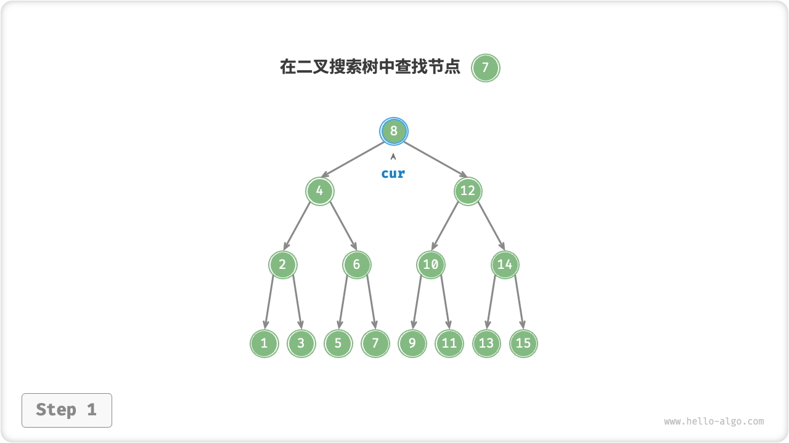
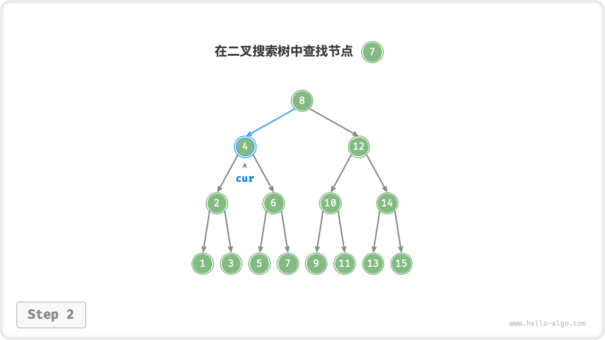
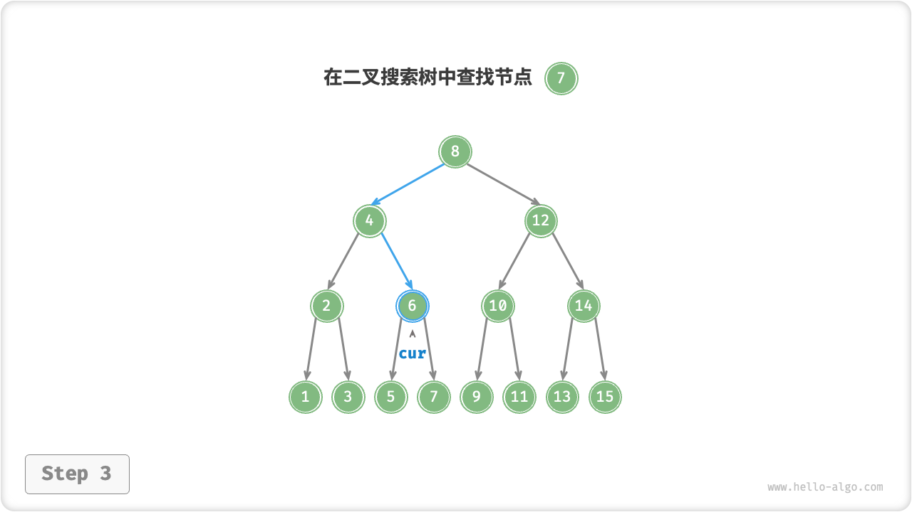
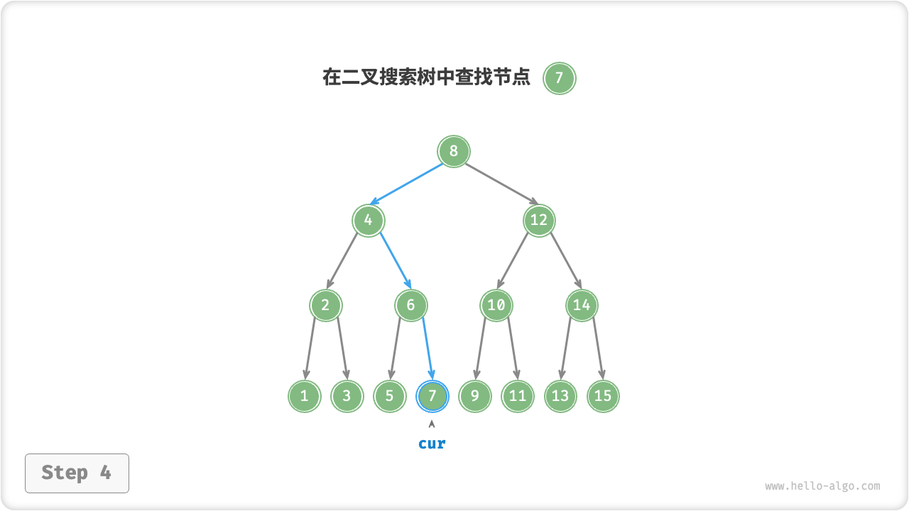
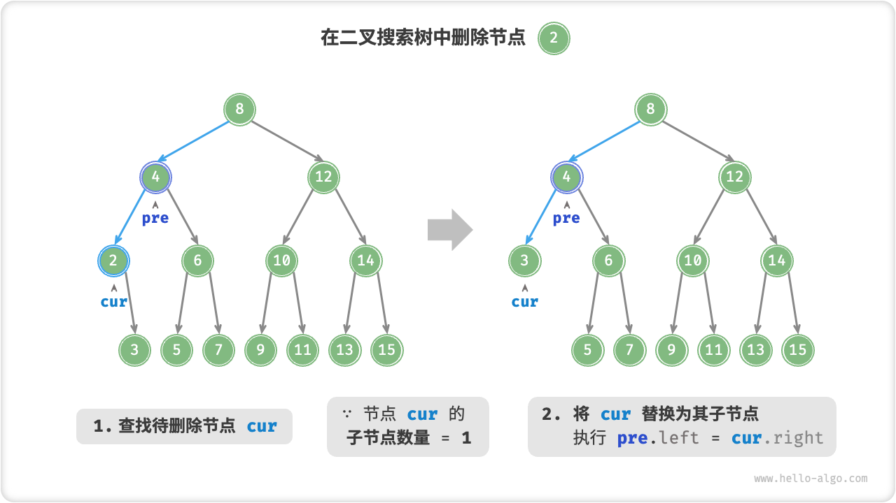
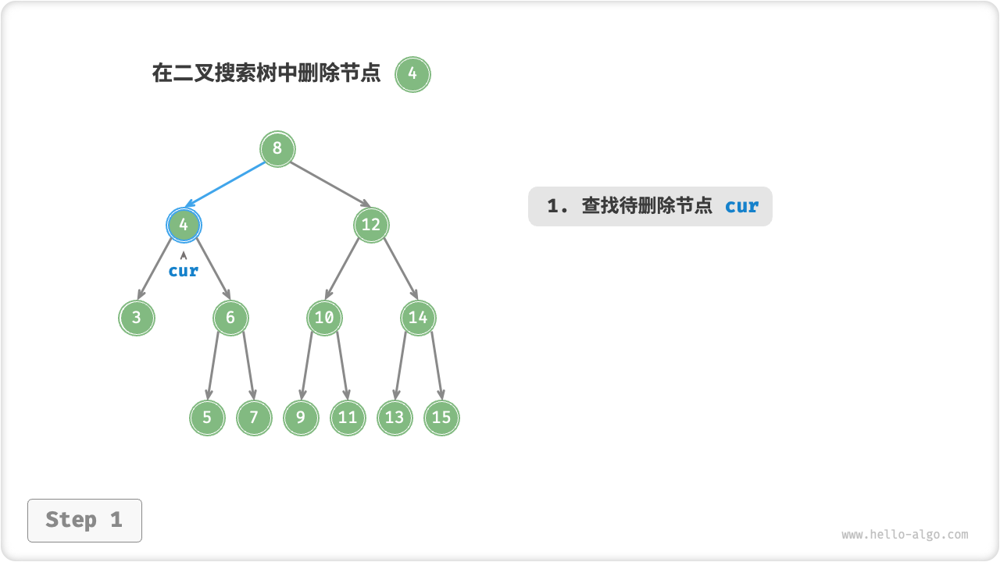
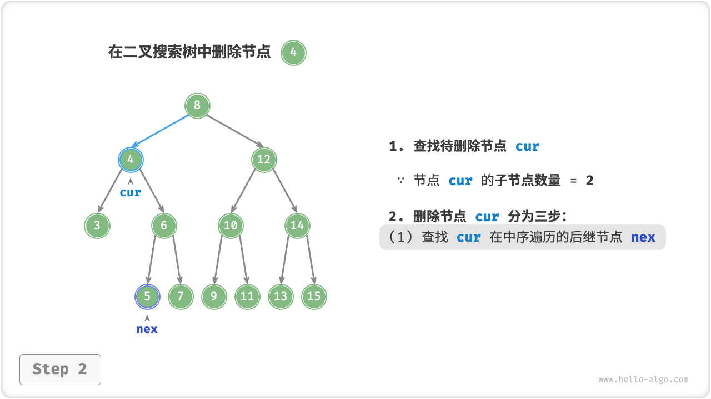
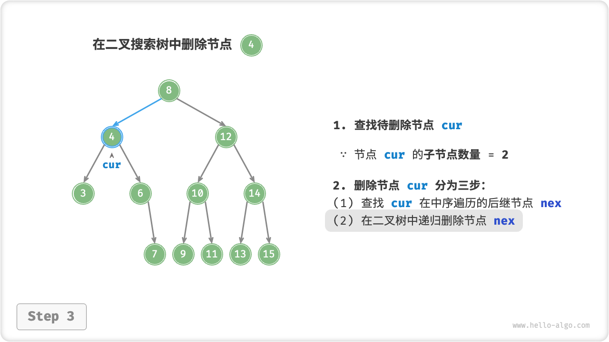
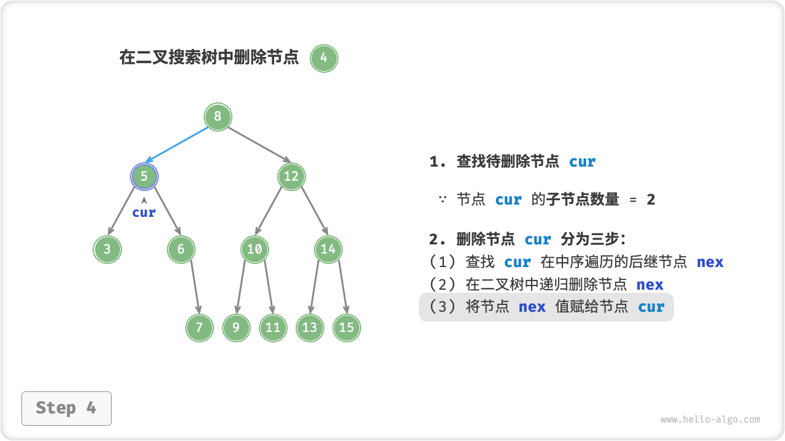

# 7.4. &nbsp; 二叉搜索树

「二叉搜索树 Binary Search Tree」满足以下条件：

1. 对于根节点，左子树中所有节点的值 $<$ 根节点的值 $<$ 右子树中所有节点的值；
2. 任意节点的左、右子树也是二叉搜索树，即同样满足条件 `1.` ；


<p align="center"> Fig. 二叉搜索树 </p>

## 7.4.1. &nbsp; 二叉搜索树的操作

### 查找节点

给定目标节点值 `num` ，可以根据二叉搜索树的性质来查找。我们声明一个节点 `cur` ，从二叉树的根节点 `root` 出发，循环比较节点值 `cur.val` 和 `num` 之间的大小关系

- 若 `cur.val < num` ，说明目标节点在 `cur` 的右子树中，因此执行 `cur = cur.right` ；
- 若 `cur.val > num` ，说明目标节点在 `cur` 的左子树中，因此执行 `cur = cur.left` ；
- 若 `cur.val = num` ，说明找到目标节点，跳出循环并返回该节点；

=== "<1>"
    

=== "<2>"
    

=== "<3>"
    

=== "<4>"
    

二叉搜索树的查找操作与二分查找算法的工作原理一致，都是每轮排除一半情况。循环次数最多为二叉树的高度，当二叉树平衡时，使用 $O(\log n)$ 时间。

=== "Java"

    ```java title="binary_search_tree.java"
    /* 查找节点 */
    TreeNode search(int num) {
        TreeNode cur = root;
        // 循环查找，越过叶节点后跳出
        while (cur != null) {
            // 目标节点在 cur 的右子树中
            if (cur.val < num)
                cur = cur.right;
            // 目标节点在 cur 的左子树中
            else if (cur.val > num)
                cur = cur.left;
            // 找到目标节点，跳出循环
            else
                break;
        }
        // 返回目标节点
        return cur;
    }
    ```

=== "C++"

    ```cpp title="binary_search_tree.cpp"
    /* 查找节点 */
    TreeNode *search(int num) {
        TreeNode *cur = root;
        // 循环查找，越过叶节点后跳出
        while (cur != nullptr) {
            // 目标节点在 cur 的右子树中
            if (cur->val < num)
                cur = cur->right;
            // 目标节点在 cur 的左子树中
            else if (cur->val > num)
                cur = cur->left;
            // 找到目标节点，跳出循环
            else
                break;
        }
        // 返回目标节点
        return cur;
    }
    ```

=== "Python"

    ```python title="binary_search_tree.py"
    def search(self, num: int) -> TreeNode | None:
        """查找节点"""
        cur: TreeNode | None = self.root
        # 循环查找，越过叶节点后跳出
        while cur is not None:
            # 目标节点在 cur 的右子树中
            if cur.val < num:
                cur = cur.right
            # 目标节点在 cur 的左子树中
            elif cur.val > num:
                cur = cur.left
            # 找到目标节点，跳出循环
            else:
                break
        return cur
    ```

=== "Go"

    ```go title="binary_search_tree.go"
    /* 查找节点 */
    func (bst *binarySearchTree) search(num int) *TreeNode {
        node := bst.root
        // 循环查找，越过叶节点后跳出
        for node != nil {
            if node.Val < num {
                // 目标节点在 cur 的右子树中
                node = node.Right
            } else if node.Val > num {
                // 目标节点在 cur 的左子树中
                node = node.Left
            } else {
                // 找到目标节点，跳出循环
                break
            }
        }
        // 返回目标节点
        return node
    }
    ```

=== "JavaScript"

    ```javascript title="binary_search_tree.js"
    /* 查找节点 */
    function search(num) {
        let cur = root;
        // 循环查找，越过叶节点后跳出
        while (cur !== null) {
            // 目标节点在 cur 的右子树中
            if (cur.val < num) cur = cur.right;
            // 目标节点在 cur 的左子树中
            else if (cur.val > num) cur = cur.left;
            // 找到目标节点，跳出循环
            else break;
        }
        // 返回目标节点
        return cur;
    }
    ```

=== "TypeScript"

    ```typescript title="binary_search_tree.ts"
    /* 查找节点 */
    function search(num: number): TreeNode | null {
        let cur = root;
        // 循环查找，越过叶节点后跳出
        while (cur !== null) {
            if (cur.val < num) {
                cur = cur.right; // 目标节点在 cur 的右子树中
            } else if (cur.val > num) {
                cur = cur.left; // 目标节点在 cur 的左子树中
            } else {
                break; // 找到目标节点，跳出循环
            }
        }
        // 返回目标节点
        return cur;
    }
    ```

=== "C"

    ```c title="binary_search_tree.c"
    /* 查找节点 */
    TreeNode *search(binarySearchTree *bst, int num) {
        TreeNode *cur = bst->root;
        // 循环查找，越过叶节点后跳出
        while (cur != NULL) {
            if (cur->val < num) {
                // 目标节点在 cur 的右子树中
                cur = cur->right;
            } else if (cur->val > num) {
                // 目标节点在 cur 的左子树中
                cur = cur->left;
            } else {
                // 找到目标节点，跳出循环
                break;
            }
        }
        // 返回目标节点
        return cur;
    }
    ```

=== "C#"

    ```csharp title="binary_search_tree.cs"
    /* 查找节点 */
    TreeNode? search(int num) {
        TreeNode? cur = root;
        // 循环查找，越过叶节点后跳出
        while (cur != null) {
            // 目标节点在 cur 的右子树中
            if (cur.val < num) cur =
                cur.right;
            // 目标节点在 cur 的左子树中
            else if (cur.val > num)
                cur = cur.left;
            // 找到目标节点，跳出循环
            else
                break;
        }
        // 返回目标节点
        return cur;
    }
    ```

=== "Swift"

    ```swift title="binary_search_tree.swift"
    /* 查找节点 */
    func search(num: Int) -> TreeNode? {
        var cur = root
        // 循环查找，越过叶节点后跳出
        while cur != nil {
            // 目标节点在 cur 的右子树中
            if cur!.val < num {
                cur = cur?.right
            }
            // 目标节点在 cur 的左子树中
            else if cur!.val > num {
                cur = cur?.left
            }
            // 找到目标节点，跳出循环
            else {
                break
            }
        }
        // 返回目标节点
        return cur
    }
    ```

=== "Zig"

    ```zig title="binary_search_tree.zig"
    // 查找节点
    fn search(self: *Self, num: T) ?*inc.TreeNode(T) {
        var cur = self.root;
        // 循环查找，越过叶节点后跳出
        while (cur != null) {
            // 目标节点在 cur 的右子树中
            if (cur.?.val < num) {
                cur = cur.?.right;
            // 目标节点在 cur 的左子树中
            } else if (cur.?.val > num) {
                cur = cur.?.left;
            // 找到目标节点，跳出循环
            } else {
                break;
            }
        }
        // 返回目标节点
        return cur;
    }
    ```

=== "Dart"

    ```dart title="binary_search_tree.dart"
    [class]{BinarySearchTree}-[func]{search}
    ```

### 插入节点

给定一个待插入元素 `num` ，为了保持二叉搜索树“左子树 < 根节点 < 右子树”的性质，插入操作分为两步：

1. **查找插入位置**：与查找操作相似，从根节点出发，根据当前节点值和 `num` 的大小关系循环向下搜索，直到越过叶节点（遍历至 $\text{None}$ ）时跳出循环；
2. **在该位置插入节点**：初始化节点 `num` ，将该节点置于 $\text{None}$ 的位置；

二叉搜索树不允许存在重复节点，否则将违反其定义。因此，若待插入节点在树中已存在，则不执行插入，直接返回。


<p align="center"> Fig. 在二叉搜索树中插入节点 </p>

=== "Java"

    ```java title="binary_search_tree.java"
    /* 插入节点 */
    void insert(int num) {
        // 若树为空，直接提前返回
        if (root == null)
            return;
        TreeNode cur = root, pre = null;
        // 循环查找，越过叶节点后跳出
        while (cur != null) {
            // 找到重复节点，直接返回
            if (cur.val == num)
                return;
            pre = cur;
            // 插入位置在 cur 的右子树中
            if (cur.val < num)
                cur = cur.right;
            // 插入位置在 cur 的左子树中
            else
                cur = cur.left;
        }
        // 插入节点
        TreeNode node = new TreeNode(num);
        if (pre.val < num)
            pre.right = node;
        else
            pre.left = node;
    }
    ```

=== "C++"

    ```cpp title="binary_search_tree.cpp"
    /* 插入节点 */
    void insert(int num) {
        // 若树为空，直接提前返回
        if (root == nullptr)
            return;
        TreeNode *cur = root, *pre = nullptr;
        // 循环查找，越过叶节点后跳出
        while (cur != nullptr) {
            // 找到重复节点，直接返回
            if (cur->val == num)
                return;
            pre = cur;
            // 插入位置在 cur 的右子树中
            if (cur->val < num)
                cur = cur->right;
            // 插入位置在 cur 的左子树中
            else
                cur = cur->left;
        }
        // 插入节点
        TreeNode *node = new TreeNode(num);
        if (pre->val < num)
            pre->right = node;
        else
            pre->left = node;
    }
    ```

=== "Python"

    ```python title="binary_search_tree.py"
    def insert(self, num: int) -> None:
        """插入节点"""
        # 若树为空，直接提前返回
        if self.root is None:
            return

        # 循环查找，越过叶节点后跳出
        cur, pre = self.root, None
        while cur is not None:
            # 找到重复节点，直接返回
            if cur.val == num:
                return
            pre = cur
            # 插入位置在 cur 的右子树中
            if cur.val < num:
                cur = cur.right
            # 插入位置在 cur 的左子树中
            else:
                cur = cur.left

        # 插入节点
        node = TreeNode(num)
        if pre.val < num:
            pre.right = node
        else:
            pre.left = node
    ```

=== "Go"

    ```go title="binary_search_tree.go"
    /* 插入节点 */
    func (bst *binarySearchTree) insert(num int) {
        cur := bst.root
        // 若树为空，直接提前返回
        if cur == nil {
            return
        }
        // 待插入节点之前的节点位置
        var pre *TreeNode = nil
        // 循环查找，越过叶节点后跳出
        for cur != nil {
            if cur.Val == num {
                return
            }
            pre = cur
            if cur.Val < num {
                cur = cur.Right
            } else {
                cur = cur.Left
            }
        }
        // 插入节点
        node := NewTreeNode(num)
        if pre.Val < num {
            pre.Right = node
        } else {
            pre.Left = node
        }
    }
    ```

=== "JavaScript"

    ```javascript title="binary_search_tree.js"
    /* 插入节点 */
    function insert(num) {
        // 若树为空，直接提前返回
        if (root === null) return;
        let cur = root,
            pre = null;
        // 循环查找，越过叶节点后跳出
        while (cur !== null) {
            // 找到重复节点，直接返回
            if (cur.val === num) return;
            pre = cur;
            // 插入位置在 cur 的右子树中
            if (cur.val < num) cur = cur.right;
            // 插入位置在 cur 的左子树中
            else cur = cur.left;
        }
        // 插入节点
        let node = new TreeNode(num);
        if (pre.val < num) pre.right = node;
        else pre.left = node;
    }
    ```

=== "TypeScript"

    ```typescript title="binary_search_tree.ts"
    /* 插入节点 */
    function insert(num: number): void {
        // 若树为空，直接提前返回
        if (root === null) {
            return;
        }
        let cur = root,
            pre: TreeNode | null = null;
        // 循环查找，越过叶节点后跳出
        while (cur !== null) {
            if (cur.val === num) {
                return; // 找到重复节点，直接返回
            }
            pre = cur;
            if (cur.val < num) {
                cur = cur.right as TreeNode; // 插入位置在 cur 的右子树中
            } else {
                cur = cur.left as TreeNode; // 插入位置在 cur 的左子树中
            }
        }
        // 插入节点
        let node = new TreeNode(num);
        if (pre!.val < num) {
            pre!.right = node;
        } else {
            pre!.left = node;
        }
    }
    ```

=== "C"

    ```c title="binary_search_tree.c"
    /* 插入节点 */
    void insert(binarySearchTree *bst, int num) {
        // 若树为空，直接提前返回
        if (bst->root == NULL)
            return;
        TreeNode *cur = bst->root, *pre = NULL;
        // 循环查找，越过叶节点后跳出
        while (cur != NULL) {
            // 找到重复节点，直接返回
            if (cur->val == num) {
                return;
            }
            pre = cur;
            if (cur->val < num) {
                // 插入位置在 cur 的右子树中
                cur = cur->right;
            } else {
                // 插入位置在 cur 的左子树中
                cur = cur->left;
            }
        }
        // 插入节点
        TreeNode *node = newTreeNode(num);
        if (pre->val < num) {
            pre->right = node;
        } else {
            pre->left = node;
        }
    }
    ```

=== "C#"

    ```csharp title="binary_search_tree.cs"
    /* 插入节点 */
    void insert(int num) {
        // 若树为空，直接提前返回
        if (root == null)
            return;
        TreeNode? cur = root, pre = null;
        // 循环查找，越过叶节点后跳出
        while (cur != null) {
            // 找到重复节点，直接返回
            if (cur.val == num)
                return;
            pre = cur;
            // 插入位置在 cur 的右子树中
            if (cur.val < num)
                cur = cur.right;
            // 插入位置在 cur 的左子树中
            else
                cur = cur.left;
        }

        // 插入节点
        TreeNode node = new TreeNode(num);
        if (pre != null) {
            if (pre.val < num)
                pre.right = node;
            else
                pre.left = node;
        }
    }
    ```

=== "Swift"

    ```swift title="binary_search_tree.swift"
    /* 插入节点 */
    func insert(num: Int) {
        // 若树为空，直接提前返回
        if root == nil {
            return
        }
        var cur = root
        var pre: TreeNode?
        // 循环查找，越过叶节点后跳出
        while cur != nil {
            // 找到重复节点，直接返回
            if cur!.val == num {
                return
            }
            pre = cur
            // 插入位置在 cur 的右子树中
            if cur!.val < num {
                cur = cur?.right
            }
            // 插入位置在 cur 的左子树中
            else {
                cur = cur?.left
            }
        }
        // 插入节点
        let node = TreeNode(x: num)
        if pre!.val < num {
            pre?.right = node
        } else {
            pre?.left = node
        }
    }
    ```

=== "Zig"

    ```zig title="binary_search_tree.zig"
    // 插入节点
    fn insert(self: *Self, num: T) !void {
        // 若树为空，直接提前返回
        if (self.root == null) return;
        var cur = self.root;
        var pre: ?*inc.TreeNode(T) = null;
        // 循环查找，越过叶节点后跳出
        while (cur != null) {
            // 找到重复节点，直接返回
            if (cur.?.val == num) return;
            pre = cur;
            // 插入位置在 cur 的右子树中
            if (cur.?.val < num) {
                cur = cur.?.right;
            // 插入位置在 cur 的左子树中
            } else {
                cur = cur.?.left;
            }
        }
        // 插入节点
        var node = try self.mem_allocator.create(inc.TreeNode(T));
        node.init(num);
        if (pre.?.val < num) {
            pre.?.right = node;
        } else {
            pre.?.left = node;
        }
    }
    ```

=== "Dart"

    ```dart title="binary_search_tree.dart"
    [class]{BinarySearchTree}-[func]{insert}
    ```

为了插入节点，我们需要利用辅助节点 `pre` 保存上一轮循环的节点，这样在遍历至 $\text{None}$ 时，我们可以获取到其父节点，从而完成节点插入操作。

与查找节点相同，插入节点使用 $O(\log n)$ 时间。

### 删除节点

与插入节点类似，我们需要在删除操作后维持二叉搜索树的“左子树 < 根节点 < 右子树”的性质。首先，我们需要在二叉树中执行查找操作，获取待删除节点。接下来，根据待删除节点的子节点数量，删除操作需分为三种情况：

当待删除节点的子节点数量 $= 0$ 时，表示待删除节点是叶节点，可以直接删除。


<p align="center"> Fig. 在二叉搜索树中删除节点（度为 0） </p>

当待删除节点的子节点数量 $= 1$ 时，将待删除节点替换为其子节点即可。



<p align="center"> Fig. 在二叉搜索树中删除节点（度为 1） </p>

当待删除节点的子节点数量 $= 2$ 时，删除操作分为三步：

1. 找到待删除节点在“中序遍历序列”中的下一个节点，记为 `tmp` ；
2. 在树中递归删除节点 `tmp` ；
3. 用 `tmp` 的值覆盖待删除节点的值；

=== "<1>"
    

=== "<2>"
    

=== "<3>"
    

=== "<4>"
    

删除节点操作同样使用 $O(\log n)$ 时间，其中查找待删除节点需要 $O(\log n)$ 时间，获取中序遍历后继节点需要 $O(\log n)$ 时间。

=== "Java"

    ```java title="binary_search_tree.java"
    /* 删除节点 */
    void remove(int num) {
        // 若树为空，直接提前返回
        if (root == null)
            return;
        TreeNode cur = root, pre = null;
        // 循环查找，越过叶节点后跳出
        while (cur != null) {
            // 找到待删除节点，跳出循环
            if (cur.val == num)
                break;
            pre = cur;
            // 待删除节点在 cur 的右子树中
            if (cur.val < num)
                cur = cur.right;
            // 待删除节点在 cur 的左子树中
            else
                cur = cur.left;
        }
        // 若无待删除节点，则直接返回
        if (cur == null)
            return;
        // 子节点数量 = 0 or 1
        if (cur.left == null || cur.right == null) {
            // 当子节点数量 = 0 / 1 时， child = null / 该子节点
            TreeNode child = cur.left != null ? cur.left : cur.right;
            // 删除节点 cur
            if (cur != root) {
                if (pre.left == cur)
                    pre.left = child;
                else
                    pre.right = child;
            } else {
                // 若删除节点为根节点，则重新指定根节点
                root = child;
            }
        }
        // 子节点数量 = 2
        else {
            // 获取中序遍历中 cur 的下一个节点
            TreeNode tmp = cur.right;
            while (tmp.left != null) {
                tmp = tmp.left;
            }
            // 递归删除节点 tmp
            remove(tmp.val);
            // 用 tmp 覆盖 cur
            cur.val = tmp.val;
        }
    }
    ```

=== "C++"

    ```cpp title="binary_search_tree.cpp"
    /* 删除节点 */
    void remove(int num) {
        // 若树为空，直接提前返回
        if (root == nullptr)
            return;
        TreeNode *cur = root, *pre = nullptr;
        // 循环查找，越过叶节点后跳出
        while (cur != nullptr) {
            // 找到待删除节点，跳出循环
            if (cur->val == num)
                break;
            pre = cur;
            // 待删除节点在 cur 的右子树中
            if (cur->val < num)
                cur = cur->right;
            // 待删除节点在 cur 的左子树中
            else
                cur = cur->left;
        }
        // 若无待删除节点，则直接返回
        if (cur == nullptr)
            return;
        // 子节点数量 = 0 or 1
        if (cur->left == nullptr || cur->right == nullptr) {
            // 当子节点数量 = 0 / 1 时， child = nullptr / 该子节点
            TreeNode *child = cur->left != nullptr ? cur->left : cur->right;
            // 删除节点 cur
            if (cur != root) {
                if (pre->left == cur)
                    pre->left = child;
                else
                    pre->right = child;
            } else {
                // 若删除节点为根节点，则重新指定根节点
                root = child;
            }
            // 释放内存
            delete cur;
        }
        // 子节点数量 = 2
        else {
            // 获取中序遍历中 cur 的下一个节点
            TreeNode *tmp = cur->right;
            while (tmp->left != nullptr) {
                tmp = tmp->left;
            }
            int tmpVal = tmp->val;
            // 递归删除节点 tmp
            remove(tmp->val);
            // 用 tmp 覆盖 cur
            cur->val = tmpVal;
        }
    }
    ```

=== "Python"

    ```python title="binary_search_tree.py"
    def remove(self, num: int) -> None:
        """删除节点"""
        # 若树为空，直接提前返回
        if self.root is None:
            return

        # 循环查找，越过叶节点后跳出
        cur, pre = self.root, None
        while cur is not None:
            # 找到待删除节点，跳出循环
            if cur.val == num:
                break
            pre = cur
            # 待删除节点在 cur 的右子树中
            if cur.val < num:
                cur = cur.right
            # 待删除节点在 cur 的左子树中
            else:
                cur = cur.left
        # 若无待删除节点，则直接返回
        if cur is None:
            return

        # 子节点数量 = 0 or 1
        if cur.left is None or cur.right is None:
            # 当子节点数量 = 0 / 1 时， child = null / 该子节点
            child = cur.left or cur.right
            # 删除节点 cur
            if cur != self.root:
                if pre.left == cur:
                    pre.left = child
                else:
                    pre.right = child
            else:
                # 若删除节点为根节点，则重新指定根节点
                self.__root = cur
        # 子节点数量 = 2
        else:
            # 获取中序遍历中 cur 的下一个节点
            tmp: TreeNode = cur.right
            while tmp.left is not None:
                tmp = tmp.left
            # 递归删除节点 tmp
            self.remove(tmp.val)
            # 用 tmp 覆盖 cur
            cur.val = tmp.val
    ```

=== "Go"

    ```go title="binary_search_tree.go"
    /* 删除节点 */
    func (bst *binarySearchTree) remove(num int) {
        cur := bst.root
        // 若树为空，直接提前返回
        if cur == nil {
            return
        }
        // 待删除节点之前的节点位置
        var pre *TreeNode = nil
        // 循环查找，越过叶节点后跳出
        for cur != nil {
            if cur.Val == num {
                break
            }
            pre = cur
            if cur.Val < num {
                // 待删除节点在右子树中
                cur = cur.Right
            } else {
                // 待删除节点在左子树中
                cur = cur.Left
            }
        }
        // 若无待删除节点，则直接返回
        if cur == nil {
            return
        }
        // 子节点数为 0 或 1
        if cur.Left == nil || cur.Right == nil {
            var child *TreeNode = nil
            // 取出待删除节点的子节点
            if cur.Left != nil {
                child = cur.Left
            } else {
                child = cur.Right
            }
            // 删除节点 cur
            if cur != bst.root {
                if pre.Left == cur {
                    pre.Left = child
                } else {
                    pre.Right = child
                }
            } else {
                // 若删除节点为根节点，则重新指定根节点
                bst.root = child
            }
            // 子节点数为 2
        } else {
            // 获取中序遍历中待删除节点 cur 的下一个节点
            tmp := cur.Right
            for tmp.Left != nil {
                tmp = tmp.Left
            }
            // 递归删除节点 tmp
            bst.remove(tmp.Val)
            // 用 tmp 覆盖 cur
            cur.Val = tmp.Val
        }
    }
    ```

=== "JavaScript"

    ```javascript title="binary_search_tree.js"
    /* 删除节点 */
    function remove(num) {
        // 若树为空，直接提前返回
        if (root === null) return;
        let cur = root,
            pre = null;
        // 循环查找，越过叶节点后跳出
        while (cur !== null) {
            // 找到待删除节点，跳出循环
            if (cur.val === num) break;
            pre = cur;
            // 待删除节点在 cur 的右子树中
            if (cur.val < num) cur = cur.right;
            // 待删除节点在 cur 的左子树中
            else cur = cur.left;
        }
        // 若无待删除节点，则直接返回
        if (cur === null) return;
        // 子节点数量 = 0 or 1
        if (cur.left === null || cur.right === null) {
            // 当子节点数量 = 0 / 1 时， child = null / 该子节点
            let child = cur.left !== null ? cur.left : cur.right;
            // 删除节点 cur
            if (cur != root) {
                if (pre.left === cur) pre.left = child;
                else pre.right = child;
            } else {
                // 若删除节点为根节点，则重新指定根节点
                root = child;
            }
        }
        // 子节点数量 = 2
        else {
            // 获取中序遍历中 cur 的下一个节点
            let tmp = cur.right;
            while (tmp.left !== null) {
                tmp = tmp.left;
            }
            // 递归删除节点 tmp
            remove(tmp.val);
            // 用 tmp 覆盖 cur
            cur.val = tmp.val;
        }
    }
    ```

=== "TypeScript"

    ```typescript title="binary_search_tree.ts"
    /* 删除节点 */
    function remove(num: number): void {
        // 若树为空，直接提前返回
        if (root === null) {
            return;
        }
        let cur = root,
            pre: TreeNode | null = null;
        // 循环查找，越过叶节点后跳出
        while (cur !== null) {
            // 找到待删除节点，跳出循环
            if (cur.val === num) {
                break;
            }
            pre = cur;
            if (cur.val < num) {
                cur = cur.right as TreeNode; // 待删除节点在 cur 的右子树中
            } else {
                cur = cur.left as TreeNode; // 待删除节点在 cur 的左子树中
            }
        }
        // 若无待删除节点，则直接返回
        if (cur === null) {
            return;
        }
        // 子节点数量 = 0 or 1
        if (cur.left === null || cur.right === null) {
            // 当子节点数量 = 0 / 1 时， child = null / 该子节点
            let child = cur.left !== null ? cur.left : cur.right;
            // 删除节点 cur
            if (cur != root) {
                if (pre!.left === cur) {
                    pre!.left = child;
                } else {
                    pre!.right = child;
                }
            } else {
                // 若删除节点为根节点，则重新指定根节点
                root = child;
            }
        }
        // 子节点数量 = 2
        else {
            // 获取中序遍历中 cur 的下一个节点
            let tmp = cur.right;
            while (tmp.left !== null) {
                tmp = tmp.left;
            }
            // 递归删除节点 tmp
            remove(tmp!.val);
            // 用 tmp 覆盖 cur
            cur.val = tmp.val;
        }
    }
    ```

=== "C"

    ```c title="binary_search_tree.c"
    /* 删除节点 */
    // 由于引入了 stdio.h ，此处无法使用 remove 关键词
    void removeNode(binarySearchTree *bst, int num) {
        // 若树为空，直接提前返回
        if (bst->root == NULL)
            return;
        TreeNode *cur = bst->root, *pre = NULL;
        // 循环查找，越过叶节点后跳出
        while (cur != NULL) {
            // 找到待删除节点，跳出循环
            if (cur->val == num)
                break;
            pre = cur;
            if (cur->val < num) {
                // 待删除节点在 root 的右子树中
                cur = cur->right;
            } else {
                // 待删除节点在 root 的左子树中
                cur = cur->left;
            }
        }
        // 若无待删除节点，则直接返回
        if (cur == NULL)
            return;
        // 判断待删除节点是否存在子节点
        if (cur->left == NULL || cur->right == NULL) {
            /* 子节点数量 = 0 or 1 */
            // 当子节点数量 = 0 / 1 时， child = nullptr / 该子节点
            TreeNode *child = cur->left != NULL ? cur->left : cur->right;
            // 删除节点 cur
            if (pre->left == cur) {
                pre->left = child;
            } else {
                pre->right = child;
            }
        } else {
            /* 子节点数量 = 2 */
            // 获取中序遍历中 cur 的下一个节点
            TreeNode *tmp = cur->right;
            while (tmp->left != NULL) {
                tmp = tmp->left;
            }
            int tmpVal = tmp->val;
            // 递归删除节点 tmp
            removeNode(bst, tmp->val);
            // 用 tmp 覆盖 cur
            cur->val = tmpVal;
        }
    }
    ```

=== "C#"

    ```csharp title="binary_search_tree.cs"
    /* 删除节点 */
    void remove(int num) {
        // 若树为空，直接提前返回
        if (root == null)
            return;
        TreeNode? cur = root, pre = null;
        // 循环查找，越过叶节点后跳出
        while (cur != null) {
            // 找到待删除节点，跳出循环
            if (cur.val == num)
                break;
            pre = cur;
            // 待删除节点在 cur 的右子树中
            if (cur.val < num)
                cur = cur.right;
            // 待删除节点在 cur 的左子树中
            else
                cur = cur.left;
        }
        // 若无待删除节点，则直接返回
        if (cur == null || pre == null)
            return;
        // 子节点数量 = 0 or 1
        if (cur.left == null || cur.right == null) {
            // 当子节点数量 = 0 / 1 时， child = null / 该子节点
            TreeNode? child = cur.left != null ? cur.left : cur.right;
            // 删除节点 cur
            if (cur != root) {
                if (pre.left == cur)
                    pre.left = child;
                else
                    pre.right = child;
            } else {
                // 若删除节点为根节点，则重新指定根节点
                root = child;
            }
        }
        // 子节点数量 = 2
        else {
            // 获取中序遍历中 cur 的下一个节点
            TreeNode? tmp = cur.right;
            while (tmp.left != null) {
                tmp = tmp.left;
            }
            // 递归删除节点 tmp
            remove(tmp.val);
            // 用 tmp 覆盖 cur
            cur.val = tmp.val;
        }
    }
    ```

=== "Swift"

    ```swift title="binary_search_tree.swift"
    /* 删除节点 */
    @discardableResult
    func remove(num: Int) {
        // 若树为空，直接提前返回
        if root == nil {
            return
        }
        var cur = root
        var pre: TreeNode?
        // 循环查找，越过叶节点后跳出
        while cur != nil {
            // 找到待删除节点，跳出循环
            if cur!.val == num {
                break
            }
            pre = cur
            // 待删除节点在 cur 的右子树中
            if cur!.val < num {
                cur = cur?.right
            }
            // 待删除节点在 cur 的左子树中
            else {
                cur = cur?.left
            }
        }
        // 若无待删除节点，则直接返回
        if cur == nil {
            return
        }
        // 子节点数量 = 0 or 1
        if cur?.left == nil || cur?.right == nil {
            // 当子节点数量 = 0 / 1 时， child = null / 该子节点
            let child = cur?.left != nil ? cur?.left : cur?.right
            // 删除节点 cur
            if cur != root {
                if pre?.left === cur {
                    pre?.left = child
                } else {
                    pre?.right = child
                }
            } else {
                // 若删除节点为根节点，则重新指定根节点
                root = cur;
            }
        }
        // 子节点数量 = 2
        else {
            // 获取中序遍历中 cur 的下一个节点
            var tmp = cur?.right
            while tmp?.left != nil {
                tmp = tmp?.left
            }
            // 递归删除节点 tmp
            remove(num: tmp!.val)
            // 用 tmp 覆盖 cur
            cur?.val = tmp!.val
        }
    }
    ```

=== "Zig"

    ```zig title="binary_search_tree.zig"
    // 删除节点
    fn remove(self: *Self, num: T) !void {
        // 若树为空，直接提前返回
        if (self.root == null) return;
        var cur = self.root;
        var pre: ?*inc.TreeNode(T) = null;
        // 循环查找，越过叶节点后跳出
        while (cur != null) {
            // 找到待删除节点，跳出循环
            if (cur.?.val == num) break;
            pre = cur;
            // 待删除节点在 cur 的右子树中
            if (cur.?.val < num) {
                cur = cur.?.right;
            // 待删除节点在 cur 的左子树中
            } else {
                cur = cur.?.left;
            }
        }
        // 若无待删除节点，则直接返回
        if (cur == null) return;
        // 子节点数量 = 0 or 1
        if (cur.?.left == null or cur.?.right == null) {
            // 当子节点数量 = 0 / 1 时， child = null / 该子节点
            var child = if (cur.?.left != null) cur.?.left else cur.?.right;
            // 删除节点 cur
            if (pre.?.left == cur) {
                pre.?.left = child;
            } else {
                pre.?.right = child;
            }
        // 子节点数量 = 2
        } else {
            // 获取中序遍历中 cur 的下一个节点
            var tmp = cur.?.right;
            while (tmp.?.left != null) {
                tmp = tmp.?.left;
            }
            var tmpVal = tmp.?.val;
            // 递归删除节点 tmp
            _ = self.remove(tmp.?.val);
            // 用 tmp 覆盖 cur
            cur.?.val = tmpVal;
        }
    }
    ```

=== "Dart"

    ```dart title="binary_search_tree.dart"
    [class]{BinarySearchTree}-[func]{remove}
    ```

### 排序

我们知道，二叉树的中序遍历遵循“左 $\rightarrow$ 根 $\rightarrow$ 右”的遍历顺序，而二叉搜索树满足“左子节点 $<$ 根节点 $<$ 右子节点”的大小关系。因此，在二叉搜索树中进行中序遍历时，总是会优先遍历下一个最小节点，从而得出一个重要性质：**二叉搜索树的中序遍历序列是升序的**。

利用中序遍历升序的性质，我们在二叉搜索树中获取有序数据仅需 $O(n)$ 时间，无需额外排序，非常高效。


<p align="center"> Fig. 二叉搜索树的中序遍历序列 </p>

## 7.4.2. &nbsp; 二叉搜索树的效率

给定一组数据，我们考虑使用数组或二叉搜索树存储。

观察可知，二叉搜索树的各项操作的时间复杂度都是对数阶，具有稳定且高效的性能表现。只有在高频添加、低频查找删除的数据适用场景下，数组比二叉搜索树的效率更高。

<div class="center-table" markdown>

|          | 无序数组 | 二叉搜索树  |
| -------- | -------- | ----------- |
| 查找元素 | $O(n)$   | $O(\log n)$ |
| 插入元素 | $O(1)$   | $O(\log n)$ |
| 删除元素 | $O(n)$   | $O(\log n)$ |

</div>

在理想情况下，二叉搜索树是“平衡”的，这样就可以在 $\log n$ 轮循环内查找任意节点。

然而，如果我们在二叉搜索树中不断地插入和删除节点，可能导致二叉树退化为链表，这时各种操作的时间复杂度也会退化为 $O(n)$ 。


<p align="center"> Fig. 二叉搜索树的平衡与退化 </p>

## 7.4.3. &nbsp; 二叉搜索树常见应用

- 用作系统中的多级索引，实现高效的查找、插入、删除操作。
- 作为某些搜索算法的底层数据结构。
- 用于存储数据流，以保持其有序状态。
