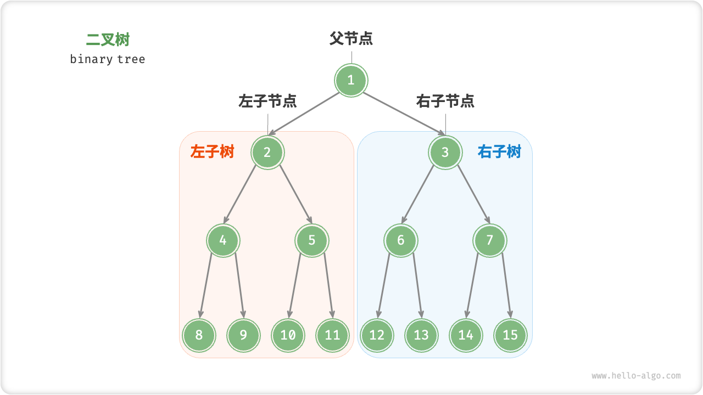
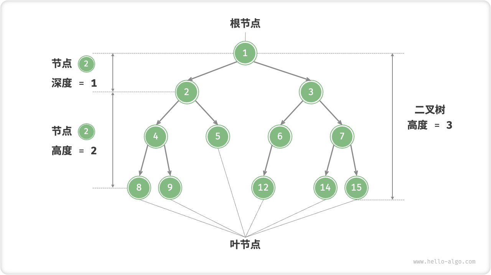
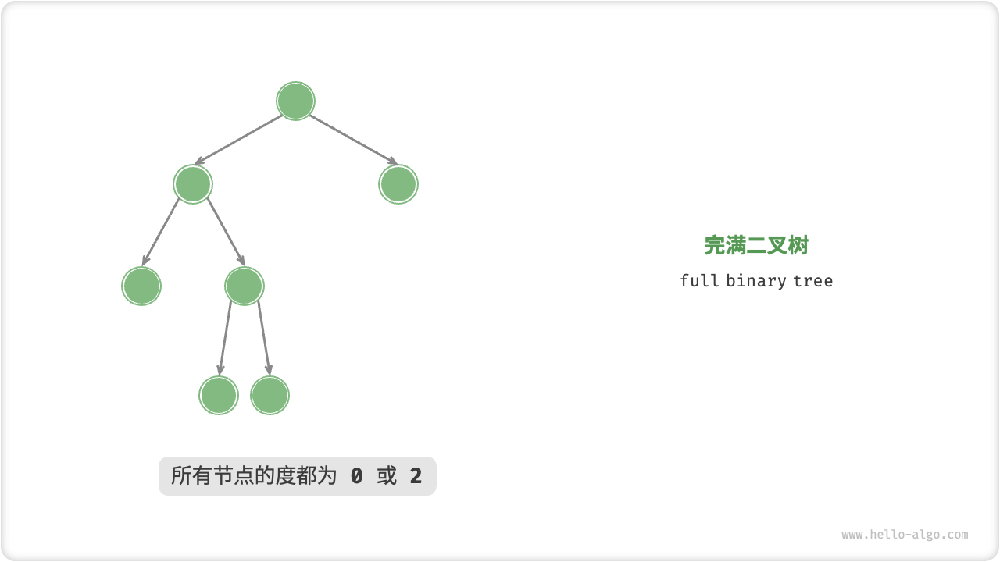
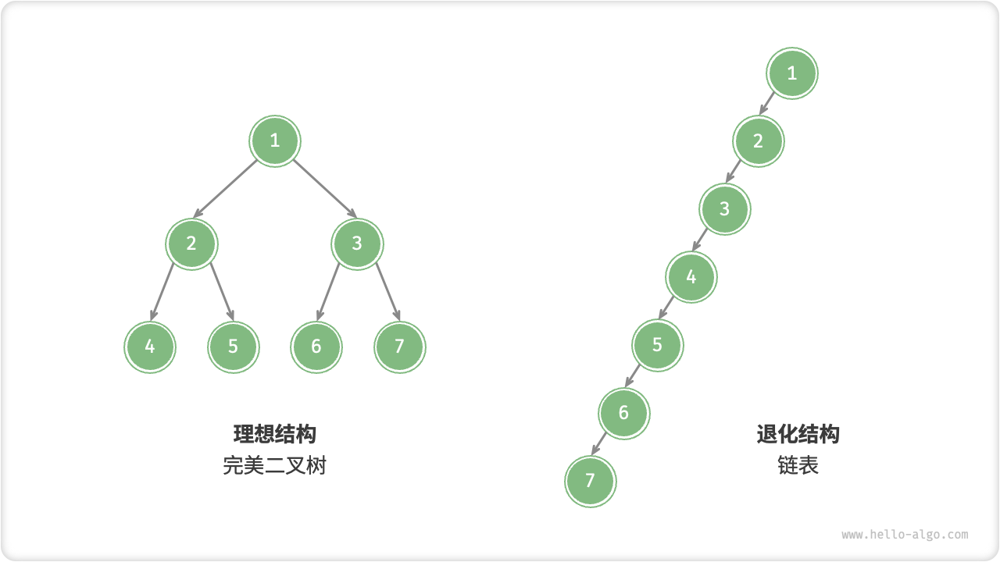

# 7.1 &nbsp; 二叉树

「二叉树 binary tree」是一种非线性数据结构，代表着祖先与后代之间的派生关系，体现着“一分为二”的分治逻辑。与链表类似，二叉树的基本单元是节点，每个节点包含：值、左子节点引用、右子节点引用。

=== "Java"

    ```java title=""
    /* 二叉树节点类 */
    class TreeNode {
        int val;         // 节点值
        TreeNode left;   // 左子节点引用
        TreeNode right;  // 右子节点引用
        TreeNode(int x) { val = x; }
    }
    ```

=== "C++"

    ```cpp title=""
    /* 二叉树节点结构体 */
    struct TreeNode {
        int val;          // 节点值
        TreeNode *left;   // 左子节点指针
        TreeNode *right;  // 右子节点指针
        TreeNode(int x) : val(x), left(nullptr), right(nullptr) {}
    };
    ```

=== "Python"

    ```python title=""
    class TreeNode:
        """二叉树节点类"""
        def __init__(self, val: int):
            self.val: int = val                   # 节点值
            self.left: Optional[TreeNode] = None  # 左子节点引用
            self.right: Optional[TreeNode] = None # 右子节点引用
    ```

=== "Go"

    ```go title=""
    /* 二叉树节点结构体 */
    type TreeNode struct {
        Val   int
        Left  *TreeNode
        Right *TreeNode
    }
    /* 节点初始化方法 */
    func NewTreeNode(v int) *TreeNode {
        return &TreeNode{
            Left:  nil, // 左子节点指针
            Right: nil, // 右子节点指针
            Val:   v,   // 节点值
        }
    }
    ```

=== "JS"

    ```javascript title=""
    /* 二叉树节点类 */
    function TreeNode(val, left, right) {
        this.val = (val === undefined ? 0 : val); // 节点值
        this.left = (left === undefined ? null : left); // 左子节点引用
        this.right = (right === undefined ? null : right); // 右子节点引用
    }
    ```

=== "TS"

    ```typescript title=""
    /* 二叉树节点类 */
    class TreeNode {
        val: number;
        left: TreeNode | null;
        right: TreeNode | null;
    
        constructor(val?: number, left?: TreeNode | null, right?: TreeNode | null) {
            this.val = val === undefined ? 0 : val; // 节点值
            this.left = left === undefined ? null : left; // 左子节点引用
            this.right = right === undefined ? null : right; // 右子节点引用
        }
    }
    ```

=== "C"

    ```c title=""
    /* 二叉树节点结构体 */
    struct TreeNode {
        int val;                // 节点值
        int height;             // 节点高度
        struct TreeNode *left;  // 左子节点指针
        struct TreeNode *right; // 右子节点指针
    };

    typedef struct TreeNode TreeNode;

    /* 构造函数 */
    TreeNode *newTreeNode(int val) {
        TreeNode *node;

        node = (TreeNode *)malloc(sizeof(TreeNode));
        node->val = val;
        node->height = 0;
        node->left = NULL;
        node->right = NULL;
        return node;
    }
    ```

=== "C#"

    ```csharp title=""
    /* 二叉树节点类 */
    class TreeNode {
        int val;          // 节点值
        TreeNode? left;   // 左子节点引用
        TreeNode? right;  // 右子节点引用
        TreeNode(int x) { val = x; }
    }
    ```

=== "Swift"

    ```swift title=""
    /* 二叉树节点类 */
    class TreeNode {
        var val: Int // 节点值
        var left: TreeNode? // 左子节点引用
        var right: TreeNode? // 右子节点引用

        init(x: Int) {
            val = x
        }
    }
    ```

=== "Zig"

    ```zig title=""

    ```

=== "Dart"

    ```dart title=""
    /* 二叉树节点类 */
    class TreeNode {
      int val;         // 节点值
      TreeNode? left;  // 左子节点引用
      TreeNode? right; // 右子节点引用
      TreeNode(this.val, [this.left, this.right]);
    }
    ```

=== "Rust"

    ```rust title=""

    ```

每个节点都有两个引用（指针），分别指向「左子节点 left-child node」和「右子节点 right-child node」，该节点被称为这两个子节点的「父节点 parent node」。当给定一个二叉树的节点时，我们将该节点的左子节点及其以下节点形成的树称为该节点的「左子树 left subtree」，同理可得「右子树 right subtree」。

**在二叉树中，除叶节点外，其他所有节点都包含子节点和非空子树**。如图 7-1 所示，如果将“节点 2”视为父节点，则其左子节点和右子节点分别是“节点 4”和“节点 5”，左子树是“节点 4 及其以下节点形成的树”，右子树是“节点 5 及其以下节点形成的树”。



<p align="center"> 图 7-1 &nbsp; 父节点、子节点、子树 </p>

## 7.1.1 &nbsp; 二叉树常见术语

二叉树的常用术语如图 7-2 所示。

- 「根节点 root node」：位于二叉树顶层的节点，没有父节点。
- 「叶节点 leaf node」：没有子节点的节点，其两个指针均指向 $\text{None}$ 。
- 「边 edge」：连接两个节点的线段，即节点引用（指针）。
- 节点所在的「层 level」：从顶至底递增，根节点所在层为 1 。
- 节点的「度 degree」：节点的子节点的数量。在二叉树中，度的取值范围是 0、1、2 。
- 二叉树的「高度 height」：从根节点到最远叶节点所经过的边的数量。
- 节点的「深度 depth」：从根节点到该节点所经过的边的数量。
- 节点的「高度 height」：从最远叶节点到该节点所经过的边的数量。



<p align="center"> 图 7-2 &nbsp; 二叉树的常用术语 </p>

!!! tip

    请注意，我们通常将“高度”和“深度”定义为“走过边的数量”，但有些题目或教材可能会将其定义为“走过节点的数量”。在这种情况下，高度和深度都需要加 1 。

## 7.1.2 &nbsp; 二叉树基本操作

### 1. &nbsp; 初始化二叉树

与链表类似，首先初始化节点，然后构建引用（指针）。

=== "Java"

    ```java title="binary_tree.java"
    // 初始化节点
    TreeNode n1 = new TreeNode(1);
    TreeNode n2 = new TreeNode(2);
    TreeNode n3 = new TreeNode(3);
    TreeNode n4 = new TreeNode(4);
    TreeNode n5 = new TreeNode(5);
    // 构建引用指向（即指针）
    n1.left = n2;
    n1.right = n3;
    n2.left = n4;
    n2.right = n5;
    ```

=== "C++"

    ```cpp title="binary_tree.cpp"
    /* 初始化二叉树 */
    // 初始化节点
    TreeNode* n1 = new TreeNode(1);
    TreeNode* n2 = new TreeNode(2);
    TreeNode* n3 = new TreeNode(3);
    TreeNode* n4 = new TreeNode(4);
    TreeNode* n5 = new TreeNode(5);
    // 构建引用指向（即指针）
    n1->left = n2;
    n1->right = n3;
    n2->left = n4;
    n2->right = n5;
    ```

=== "Python"

    ```python title="binary_tree.py"
    # 初始化二叉树
    # 初始化节点
    n1 = TreeNode(val=1)
    n2 = TreeNode(val=2)
    n3 = TreeNode(val=3)
    n4 = TreeNode(val=4)
    n5 = TreeNode(val=5)
    # 构建引用指向（即指针）
    n1.left = n2
    n1.right = n3
    n2.left = n4
    n2.right = n5
    ```

=== "Go"

    ```go title="binary_tree.go"
    /* 初始化二叉树 */
    // 初始化节点
    n1 := NewTreeNode(1)
    n2 := NewTreeNode(2)
    n3 := NewTreeNode(3)
    n4 := NewTreeNode(4)
    n5 := NewTreeNode(5)
    // 构建引用指向（即指针）
    n1.Left = n2
    n1.Right = n3
    n2.Left = n4
    n2.Right = n5
    ```

=== "JS"

    ```javascript title="binary_tree.js"
    /* 初始化二叉树 */
    // 初始化节点
    let n1 = new TreeNode(1),
        n2 = new TreeNode(2),
        n3 = new TreeNode(3),
        n4 = new TreeNode(4),
        n5 = new TreeNode(5);
    // 构建引用指向（即指针）
    n1.left = n2;
    n1.right = n3;
    n2.left = n4;
    n2.right = n5;
    ```

=== "TS"

    ```typescript title="binary_tree.ts"
    /* 初始化二叉树 */
    // 初始化节点
    let n1 = new TreeNode(1),
        n2 = new TreeNode(2),
        n3 = new TreeNode(3),
        n4 = new TreeNode(4),
        n5 = new TreeNode(5);
    // 构建引用指向（即指针）
    n1.left = n2;
    n1.right = n3;
    n2.left = n4;
    n2.right = n5;
    ```

=== "C"

    ```c title="binary_tree.c"
    /* 初始化二叉树 */
    // 初始化节点
    TreeNode *n1 = newTreeNode(1);
    TreeNode *n2 = newTreeNode(2);
    TreeNode *n3 = newTreeNode(3);
    TreeNode *n4 = newTreeNode(4);
    TreeNode *n5 = newTreeNode(5);
    // 构建引用指向（即指针）
    n1->left = n2;
    n1->right = n3;
    n2->left = n4;
    n2->right = n5;
    ```

=== "C#"

    ```csharp title="binary_tree.cs"
    /* 初始化二叉树 */
    // 初始化节点
    TreeNode n1 = new TreeNode(1);
    TreeNode n2 = new TreeNode(2);
    TreeNode n3 = new TreeNode(3);
    TreeNode n4 = new TreeNode(4);
    TreeNode n5 = new TreeNode(5);
    // 构建引用指向（即指针）
    n1.left = n2;
    n1.right = n3;
    n2.left = n4;
    n2.right = n5;
    ```

=== "Swift"

    ```swift title="binary_tree.swift"
    // 初始化节点
    let n1 = TreeNode(x: 1)
    let n2 = TreeNode(x: 2)
    let n3 = TreeNode(x: 3)
    let n4 = TreeNode(x: 4)
    let n5 = TreeNode(x: 5)
    // 构建引用指向（即指针）
    n1.left = n2
    n1.right = n3
    n2.left = n4
    n2.right = n5
    ```

=== "Zig"

    ```zig title="binary_tree.zig"

    ```

=== "Dart"

    ```dart title="binary_tree.dart"
    /* 初始化二叉树 */
    // 初始化节点
    TreeNode n1 = new TreeNode(1);
    TreeNode n2 = new TreeNode(2);
    TreeNode n3 = new TreeNode(3);
    TreeNode n4 = new TreeNode(4);
    TreeNode n5 = new TreeNode(5);
    // 构建引用指向（即指针）
    n1.left = n2;
    n1.right = n3;
    n2.left = n4;
    n2.right = n5;
    ```

=== "Rust"

    ```rust title="binary_tree.rs"

    ```

### 2. &nbsp; 插入与删除节点

与链表类似，在二叉树中插入与删除节点可以通过修改指针来实现。图 7-3 给出了一个示例。


<p align="center"> 图 7-3 &nbsp; 在二叉树中插入与删除节点 </p>

=== "Java"

    ```java title="binary_tree.java"
    TreeNode P = new TreeNode(0);
    // 在 n1 -> n2 中间插入节点 P
    n1.left = P;
    P.left = n2;
    // 删除节点 P
    n1.left = n2;
    ```

=== "C++"

    ```cpp title="binary_tree.cpp"
    /* 插入与删除节点 */
    TreeNode* P = new TreeNode(0);
    // 在 n1 -> n2 中间插入节点 P
    n1->left = P;
    P->left = n2;
    // 删除节点 P
    n1->left = n2;
    ```

=== "Python"

    ```python title="binary_tree.py"
    # 插入与删除节点
    p = TreeNode(0)
    # 在 n1 -> n2 中间插入节点 P
    n1.left = p
    p.left = n2
    # 删除节点 P
    n1.left = n2
    ```

=== "Go"

    ```go title="binary_tree.go"
    /* 插入与删除节点 */
    // 在 n1 -> n2 中间插入节点 P
    p := NewTreeNode(0)
    n1.Left = p
    p.Left = n2
    // 删除节点 P
    n1.Left = n2
    ```

=== "JS"

    ```javascript title="binary_tree.js"
    /* 插入与删除节点 */
    let P = new TreeNode(0);
    // 在 n1 -> n2 中间插入节点 P
    n1.left = P;
    P.left = n2;
    // 删除节点 P
    n1.left = n2;
    ```

=== "TS"

    ```typescript title="binary_tree.ts"
    /* 插入与删除节点 */
    const P = new TreeNode(0);
    // 在 n1 -> n2 中间插入节点 P
    n1.left = P;
    P.left = n2;
    // 删除节点 P
    n1.left = n2;
    ```

=== "C"

    ```c title="binary_tree.c"
    /* 插入与删除节点 */
    TreeNode *P = newTreeNode(0);
    // 在 n1 -> n2 中间插入节点 P
    n1->left = P;
    P->left = n2;
    // 删除节点 P
    n1->left = n2;
    ```

=== "C#"

    ```csharp title="binary_tree.cs"
    /* 插入与删除节点 */
    TreeNode P = new TreeNode(0);
    // 在 n1 -> n2 中间插入节点 P
    n1.left = P;
    P.left = n2;
    // 删除节点 P
    n1.left = n2;
    ```

=== "Swift"

    ```swift title="binary_tree.swift"
    let P = TreeNode(x: 0)
    // 在 n1 -> n2 中间插入节点 P
    n1.left = P
    P.left = n2
    // 删除节点 P
    n1.left = n2
    ```

=== "Zig"

    ```zig title="binary_tree.zig"

    ```

=== "Dart"

    ```dart title="binary_tree.dart"
    /* 插入与删除节点 */
    TreeNode P = new TreeNode(0);
    // 在 n1 -> n2 中间插入节点 P
    n1.left = P;
    P.left = n2;
    // 删除节点 P
    n1.left = n2;
    ```

=== "Rust"

    ```rust title="binary_tree.rs"

    ```

!!! note

    需要注意的是，插入节点可能会改变二叉树的原有逻辑结构，而删除节点通常意味着删除该节点及其所有子树。因此，在二叉树中，插入与删除操作通常是由一套操作配合完成的，以实现有实际意义的操作。

## 7.1.3 &nbsp; 常见二叉树类型

### 1. &nbsp; 完美二叉树

「完美二叉树 perfect binary tree」除了最底层外，其余所有层的节点都被完全填满。在完美二叉树中，叶节点的度为 $0$ ，其余所有节点的度都为 $2$ ；若树高度为 $h$ ，则节点总数为 $2^{h+1} - 1$ ，呈现标准的指数级关系，反映了自然界中常见的细胞分裂现象。

!!! tip

    请注意，在中文社区中，完美二叉树常被称为「满二叉树」。


<p align="center"> 图 7-4 &nbsp; 完美二叉树 </p>

### 2. &nbsp; 完全二叉树

如图 7-5 所示，「完全二叉树 complete binary tree」只有最底层的节点未被填满，且最底层节点尽量靠左填充。


<p align="center"> 图 7-5 &nbsp; 完全二叉树 </p>

### 3. &nbsp; 完满二叉树

如图 7-6 所示，「完满二叉树 full binary tree」除了叶节点之外，其余所有节点都有两个子节点。



<p align="center"> 图 7-6 &nbsp; 完满二叉树 </p>

### 4. &nbsp; 平衡二叉树

如图 7-7 所示，「平衡二叉树 balanced binary tree」中任意节点的左子树和右子树的高度之差的绝对值不超过 1 。


<p align="center"> 图 7-7 &nbsp; 平衡二叉树 </p>

## 7.1.4 &nbsp; 二叉树的退化

当二叉树的每层节点都被填满时，达到“完美二叉树”；而当所有节点都偏向一侧时，二叉树退化为“链表”。

- 完美二叉树是理想情况，可以充分发挥二叉树“分治”的优势。
- 链表则是另一个极端，各项操作都变为线性操作，时间复杂度退化至 $O(n)$ 。



<p align="center"> 图 7-8 &nbsp; 二叉树的最佳与最差结构 </p>

如表 7-1 所示，在最佳和最差结构下，二叉树的叶节点数量、节点总数、高度等达到极大或极小值。

<p align="center"> 表 7-1 &nbsp; 二叉树的最佳与最差情况 </p>

<div class="center-table" markdown>

|                               | 完美二叉树 | 链表         |
| ----------------------------- | ---------- | ---------- |
| 第 $i$ 层的节点数量    | $2^{i-1}$          | $1$     |
| 高度 $h$ 树的叶节点数量 | $2^h$          | $1$     |
| 高度 $h$ 树的节点总数 | $2^{h+1} - 1$      | $h + 1$     |
| 节点总数 $n$ 树的高度 | $\log_2 (n+1) - 1$ | $n - 1$     |

</div>
