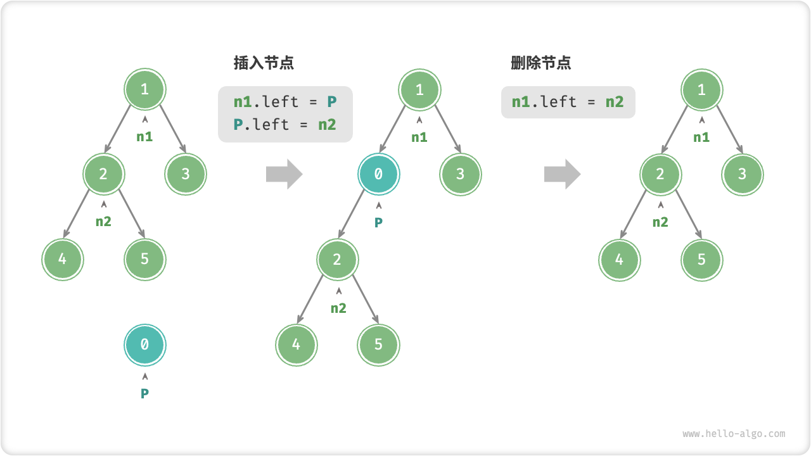
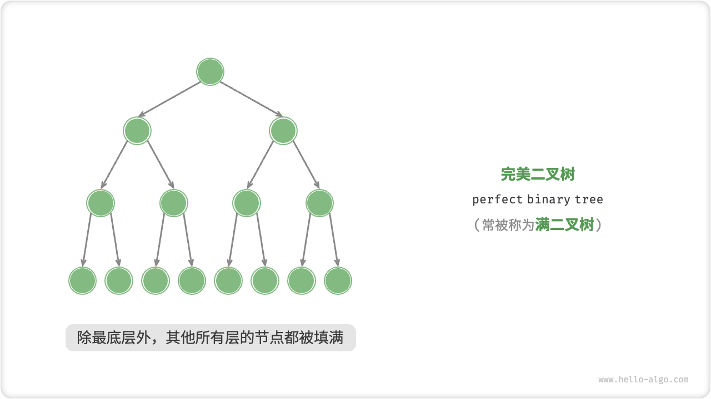
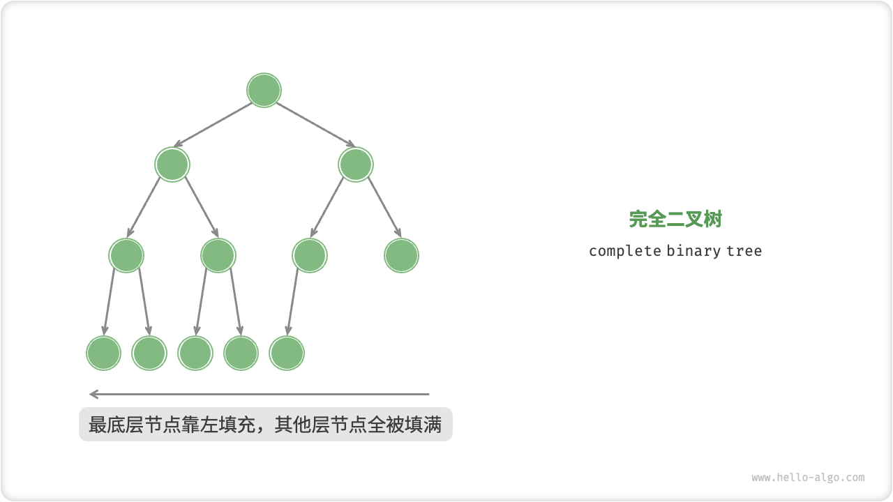
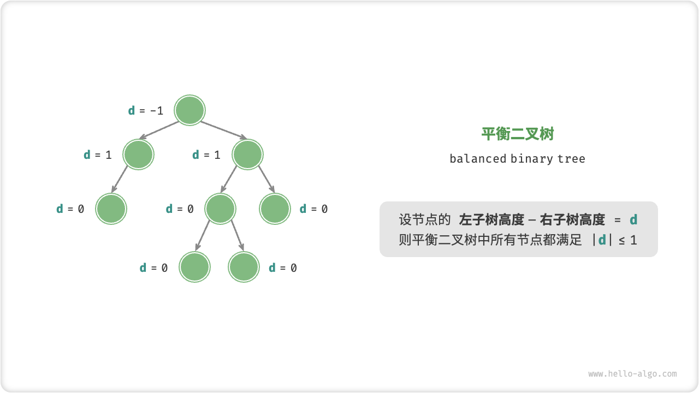

# 7.1. &nbsp; 二叉树

「二叉树 Binary Tree」是一种非线性数据结构，代表着祖先与后代之间的派生关系，体现着“一分为二”的分治逻辑。类似于链表，二叉树也是以节点为单位存储的，节点包含「值」和两个「指针」。

=== "Java"

    ```java title=""
    /* 二叉树节点类 */
    class TreeNode {
        int val;         // 节点值
        TreeNode left;   // 左子节点指针
        TreeNode right;  // 右子节点指针
        TreeNode(int x) { val = x; }
    }
    ```

=== "C++"

    ```cpp title=""
    /* 二叉树节点结构体 */
    struct TreeNode {
        int val;          // 节点值
        TreeNode *left;   // 左子节点指针
        TreeNode *right;  // 右子节点指针
        TreeNode(int x) : val(x), left(nullptr), right(nullptr) {}
    };
    ```

=== "Python"

    ```python title=""
    """ 二叉树节点类 """
    class TreeNode:
        def __init__(self, val: int):
            self.val: int = val                   # 节点值
            self.left: Optional[TreeNode] = None  # 左子节点指针
            self.right: Optional[TreeNode] = None # 右子节点指针
    ```

=== "Go"

    ```go title=""
    /* 二叉树节点结构体 */
    type TreeNode struct {
        Val   int
        Left  *TreeNode
        Right *TreeNode
    }
    /* 节点初始化方法 */
    func NewTreeNode(v int) *TreeNode {
        return &TreeNode{
            Left:  nil,
            Right: nil,
            Val:   v,
        }
    }
    ```

=== "JavaScript"

    ```javascript title=""
    /* 二叉树节点类 */
    function TreeNode(val, left, right) {
        this.val = (val === undefined ? 0 : val); // 节点值
        this.left = (left === undefined ? null : left); // 左子节点指针
        this.right = (right === undefined ? null : right); // 右子节点指针
    }
    ```

=== "TypeScript"

    ```typescript title=""
    /* 二叉树节点类 */
    class TreeNode {
        val: number;
        left: TreeNode | null;
        right: TreeNode | null;
    
        constructor(val?: number, left?: TreeNode | null, right?: TreeNode | null) {
            this.val = val === undefined ? 0 : val; // 节点值
            this.left = left === undefined ? null : left; // 左子节点指针
            this.right = right === undefined ? null : right; // 右子节点指针
        }
    }
    ```

=== "C"

    ```c title=""
    
    ```

=== "C#"

    ```csharp title=""
    /* 二叉树节点类 */
    class TreeNode {
        int val;          // 节点值
        TreeNode? left;   // 左子节点指针
        TreeNode? right;  // 右子节点指针
        TreeNode(int x) { val = x; }
    }
    ```

=== "Swift"

    ```swift title=""
    /* 二叉树节点类 */
    class TreeNode {
        var val: Int // 节点值
        var left: TreeNode? // 左子节点指针
        var right: TreeNode? // 右子节点指针

        init(x: Int) {
            val = x
        }
    }
    ```

=== "Zig"

    ```zig title=""

    ```

节点的两个指针分别指向「左子节点」和「右子节点」，并且称该节点为两个子节点的「父节点」。给定二叉树某节点，将“左子节点及其以下节点形成的树”称为该节点的「左子树」，右子树同理。

除了叶节点外，每个节点都有子节点和子树。例如，若将下图的“节点 2”看作父节点，那么其左子节点和右子节点分别为“节点 4”和“节点 5”，左子树和右子树分别为“节点 4 及其以下节点形成的树”和“节点 5 及其以下节点形成的树”。


<p align="center"> Fig. 父节点、子节点、子树 </p>

## 7.1.1. &nbsp; 二叉树常见术语

二叉树的术语较多，建议尽量理解并记住。后续可能遗忘，可以在需要使用时回来查看确认。

- 「根节点 Root Node」：二叉树最顶层的节点，其没有父节点；
- 「叶节点 Leaf Node」：没有子节点的节点，其两个指针都指向 $\text{null}$ ；
- 节点所处「层 Level」：从顶至底依次增加，根节点所处层为 1 ；
- 节点「度 Degree」：节点的子节点数量。二叉树中，度的范围是 0, 1, 2 ；
- 「边 Edge」：连接两个节点的边，即节点指针；
- 二叉树「高度」：二叉树中根节点到最远叶节点走过边的数量；
- 节点「深度 Depth」 ：根节点到该节点走过边的数量；
- 节点「高度 Height」：最远叶节点到该节点走过边的数量；


<p align="center"> Fig. 二叉树的常用术语 </p>

!!! tip "高度与深度的定义"

    值得注意，我们通常将「高度」和「深度」定义为“走过边的数量”，而有些题目或教材会将其定义为“走过节点的数量”，此时高度或深度都需要 + 1 。

## 7.1.2. &nbsp; 二叉树基本操作

**初始化二叉树**。与链表类似，先初始化节点，再构建引用指向（即指针）。

=== "Java"

    ```java title="binary_tree.java"
    // 初始化节点
    TreeNode n1 = new TreeNode(1);
    TreeNode n2 = new TreeNode(2);
    TreeNode n3 = new TreeNode(3);
    TreeNode n4 = new TreeNode(4);
    TreeNode n5 = new TreeNode(5);
    // 构建引用指向（即指针）
    n1.left = n2;
    n1.right = n3;
    n2.left = n4;
    n2.right = n5;
    ```

=== "C++"

    ```cpp title="binary_tree.cpp"
    /* 初始化二叉树 */
    // 初始化节点
    TreeNode* n1 = new TreeNode(1);
    TreeNode* n2 = new TreeNode(2);
    TreeNode* n3 = new TreeNode(3);
    TreeNode* n4 = new TreeNode(4);
    TreeNode* n5 = new TreeNode(5);
    // 构建引用指向（即指针）
    n1->left = n2;
    n1->right = n3;
    n2->left = n4;
    n2->right = n5;
    ```

=== "Python"

    ```python title="binary_tree.py"
    """ 初始化二叉树 """
    # 初始化节点
    n1 = TreeNode(val=1)
    n2 = TreeNode(val=2)
    n3 = TreeNode(val=3)
    n4 = TreeNode(val=4)
    n5 = TreeNode(val=5)
    # 构建引用指向（即指针）
    n1.left = n2
    n1.right = n3
    n2.left = n4
    n2.right = n5
    ```

=== "Go"

    ```go title="binary_tree.go"
    /* 初始化二叉树 */
    // 初始化节点
    n1 := NewTreeNode(1)
    n2 := NewTreeNode(2)
    n3 := NewTreeNode(3)
    n4 := NewTreeNode(4)
    n5 := NewTreeNode(5)
    // 构建引用指向（即指针）
    n1.Left = n2
    n1.Right = n3
    n2.Left = n4
    n2.Right = n5
    ```

=== "JavaScript"

    ```javascript title="binary_tree.js"
    /* 初始化二叉树 */
    // 初始化节点
    let n1 = new TreeNode(1),
        n2 = new TreeNode(2),
        n3 = new TreeNode(3),
        n4 = new TreeNode(4),
        n5 = new TreeNode(5);
    // 构建引用指向（即指针）
    n1.left = n2;
    n1.right = n3;
    n2.left = n4;
    n2.right = n5;
    ```

=== "TypeScript"

    ```typescript title="binary_tree.ts"
    /* 初始化二叉树 */
    // 初始化节点
    let n1 = new TreeNode(1),
        n2 = new TreeNode(2),
        n3 = new TreeNode(3),
        n4 = new TreeNode(4),
        n5 = new TreeNode(5);
    // 构建引用指向（即指针）
    n1.left = n2;
    n1.right = n3;
    n2.left = n4;
    n2.right = n5;
    ```

=== "C"

    ```c title="binary_tree.c"
    
    ```

=== "C#"

    ```csharp title="binary_tree.cs"
    /* 初始化二叉树 */
    // 初始化节点
    TreeNode n1 = new TreeNode(1);
    TreeNode n2 = new TreeNode(2);
    TreeNode n3 = new TreeNode(3);
    TreeNode n4 = new TreeNode(4);
    TreeNode n5 = new TreeNode(5);
    // 构建引用指向（即指针）
    n1.left = n2;
    n1.right = n3;
    n2.left = n4;
    n2.right = n5;
    ```

=== "Swift"

    ```swift title="binary_tree.swift"
    // 初始化节点
    let n1 = TreeNode(x: 1)
    let n2 = TreeNode(x: 2)
    let n3 = TreeNode(x: 3)
    let n4 = TreeNode(x: 4)
    let n5 = TreeNode(x: 5)
    // 构建引用指向（即指针）
    n1.left = n2
    n1.right = n3
    n2.left = n4
    n2.right = n5
    ```

=== "Zig"

    ```zig title="binary_tree.zig"

    ```

**插入与删除节点**。与链表类似，插入与删除节点都可以通过修改指针实现。



<p align="center"> Fig. 在二叉树中插入与删除节点 </p>

=== "Java"

    ```java title="binary_tree.java"
    TreeNode P = new TreeNode(0);
    // 在 n1 -> n2 中间插入节点 P
    n1.left = P;
    P.left = n2;
    // 删除节点 P
    n1.left = n2;
    ```

=== "C++"

    ```cpp title="binary_tree.cpp"
    /* 插入与删除节点 */
    TreeNode* P = new TreeNode(0);
    // 在 n1 -> n2 中间插入节点 P
    n1->left = P;
    P->left = n2;
    // 删除节点 P
    n1->left = n2;
    ```

=== "Python"

    ```python title="binary_tree.py"
    """ 插入与删除节点 """
    p = TreeNode(0)
    # 在 n1 -> n2 中间插入节点 P
    n1.left = p
    p.left = n2
    # 删除节点 P
    n1.left = n2
    ```

=== "Go"

    ```go title="binary_tree.go"
    /* 插入与删除节点 */
    // 在 n1 -> n2 中间插入节点 P
    p := NewTreeNode(0)
    n1.Left = p
    p.Left = n2
    // 删除节点 P
    n1.Left = n2
    ```

=== "JavaScript"

    ```javascript title="binary_tree.js"
    /* 插入与删除节点 */
    let P = new TreeNode(0);
    // 在 n1 -> n2 中间插入节点 P
    n1.left = P;
    P.left = n2;
    // 删除节点 P
    n1.left = n2;
    ```

=== "TypeScript"

    ```typescript title="binary_tree.ts"
    /* 插入与删除节点 */
    const P = new TreeNode(0);
    // 在 n1 -> n2 中间插入节点 P
    n1.left = P;
    P.left = n2;
    // 删除节点 P
    n1.left = n2;
    ```

=== "C"

    ```c title="binary_tree.c"
    
    ```

=== "C#"

    ```csharp title="binary_tree.cs"
    /* 插入与删除节点 */
    TreeNode P = new TreeNode(0);
    // 在 n1 -> n2 中间插入节点 P
    n1.left = P;
    P.left = n2;
    // 删除节点 P
    n1.left = n2;
    ```

=== "Swift"

    ```swift title="binary_tree.swift"
    let P = TreeNode(x: 0)
    // 在 n1 -> n2 中间插入节点 P
    n1.left = P
    P.left = n2
    // 删除节点 P
    n1.left = n2
    ```

=== "Zig"

    ```zig title="binary_tree.zig"

    ```

!!! note

    插入节点会改变二叉树的原有逻辑结构，删除节点往往意味着删除了该节点的所有子树。因此，二叉树中的插入与删除一般都是由一套操作配合完成的，这样才能实现有意义的操作。

## 7.1.3. &nbsp; 常见二叉树类型

### 完美二叉树

「完美二叉树 Perfect Binary Tree」的所有层的节点都被完全填满。在完美二叉树中，叶节点的度为 $0$ ，其余所有节点的度都为 $2$ ；若树高度 $= h$ ，则节点总数 $= 2^{h+1} - 1$ ，呈标准的指数级关系，反映着自然界中常见的细胞分裂。

!!! tip

    在中文社区中，完美二叉树常被称为「满二叉树」，请注意与完满二叉树区分。



<p align="center"> Fig. 完美二叉树 </p>

### 完全二叉树

「完全二叉树 Complete Binary Tree」只有最底层的节点未被填满，且最底层节点尽量靠左填充。

**完全二叉树非常适合用数组来表示**。如果按照层序遍历序列的顺序来存储，那么空节点 `null` 一定全部出现在序列的尾部，因此我们就可以不用存储这些 null 了。



<p align="center"> Fig. 完全二叉树 </p>

### 完满二叉树

「完满二叉树 Full Binary Tree」除了叶节点之外，其余所有节点都有两个子节点。


<p align="center"> Fig. 完满二叉树 </p>

### 平衡二叉树

「平衡二叉树 Balanced Binary Tree」中任意节点的左子树和右子树的高度之差的绝对值 $\leq 1$ 。



<p align="center"> Fig. 平衡二叉树 </p>

## 7.1.4. &nbsp; 二叉树的退化

当二叉树的每层的节点都被填满时，达到「完美二叉树」；而当所有节点都偏向一边时，二叉树退化为「链表」。

- 完美二叉树是一个二叉树的“最佳状态”，可以完全发挥出二叉树“分治”的优势；
- 链表则是另一个极端，各项操作都变为线性操作，时间复杂度退化至 $O(n)$ ；


<p align="center"> Fig. 二叉树的最佳与最二叉树的最佳和最差结构差情况 </p>

如下表所示，在最佳和最差结构下，二叉树的叶节点数量、节点总数、高度等达到极大或极小值。

<div class="center-table" markdown>

|                               | 完美二叉树 | 链表         |
| ----------------------------- | ---------- | ---------- |
| 第 $i$ 层的节点数量    | $2^{i-1}$          | $1$     |
| 树的高度为 $h$ 时的叶节点数量 | $2^h$          | $1$     |
| 树的高度为 $h$ 时的节点总数 | $2^{h+1} - 1$      | $h + 1$     |
| 树的节点总数为 $n$ 时的高度 | $\log_2 (n+1) - 1$ | $n - 1$     |

</div>

## 7.1.5. &nbsp; 二叉树表示方式 *

我们一般使用二叉树的「链表表示」，即存储单位为节点 `TreeNode` ，节点之间通过指针（引用）相连接。本文前述示例代码展示了二叉树在链表表示下的各项基本操作。

那能否可以用「数组表示」二叉树呢？答案是肯定的。先来分析一个简单案例，给定一个「完美二叉树」，将节点按照层序遍历的顺序编号（从 0 开始），那么可以推导得出父节点索引与子节点索引之间的「映射公式」：**设节点的索引为 $i$ ，则该节点的左子节点索引为 $2i + 1$ 、右子节点索引为 $2i + 2$** 。

**本质上，映射公式的作用就是链表中的指针**。对于层序遍历序列中的任意节点，我们都可以使用映射公式来访问子节点。因此，可以直接使用层序遍历序列（即数组）来表示完美二叉树。


<p align="center"> Fig. 完美二叉树的数组表示 </p>

然而，完美二叉树只是个例，二叉树中间层往往存在许多空节点（即 `null` ），而层序遍历序列并不包含这些空节点，并且我们无法单凭序列来猜测空节点的数量和分布位置，**即理论上存在许多种二叉树都符合该层序遍历序列**。显然，这种情况无法使用数组来存储二叉树。


<p align="center"> Fig. 给定数组对应多种二叉树可能性 </p>

为了解决此问题，考虑按照完美二叉树的形式来表示所有二叉树，**即在序列中使用特殊符号来显式地表示“空位”**。如下图所示，这样处理后，序列（数组）就可以唯一表示二叉树了。

=== "Java"

    ```java title=""
    /* 二叉树的数组表示 */
    // 使用 int 的包装类 Integer ，就可以使用 null 来标记空位
    Integer[] tree = { 1, 2, 3, 4, null, 6, 7, 8, 9, null, null, 12, null, null, 15 };
    ```

=== "C++"

    ```cpp title=""
    /* 二叉树的数组表示 */
    // 为了符合数据类型为 int ，使用 int 最大值标记空位
    // 该方法的使用前提是没有节点的值 = INT_MAX
    vector<int> tree = { 1, 2, 3, 4, INT_MAX, 6, 7, 8, 9, INT_MAX, INT_MAX, 12, INT_MAX, INT_MAX, 15 };
    ```

=== "Python"

    ```python title=""
    """ 二叉树的数组表示 """
    # 直接使用 None 来表示空位
    tree = [1, 2, 3, 4, None, 6, 7, 8, 9, None, None, 12, None, None, 15]
    ```

=== "Go"

    ```go title=""
    /* 二叉树的数组表示 */
    // 使用 any 类型的切片, 就可以使用 nil 来标记空位
    tree := []any{1, 2, 3, 4, nil, 6, 7, 8, 9, nil, nil, 12, nil, nil, 15}
    ```

=== "JavaScript"

    ```javascript title=""
    /* 二叉树的数组表示 */
    // 直接使用 null 来表示空位
    let tree = [1, 2, 3, 4, null, 6, 7, 8, 9, null, null, 12, null, null, 15];
    ```

=== "TypeScript"

    ```typescript title=""
    /* 二叉树的数组表示 */
    // 直接使用 null 来表示空位
    let tree: (number | null)[] = [1, 2, 3, 4, null, 6, 7, 8, 9, null, null, 12, null, null, 15];
    ```

=== "C"

    ```c title=""
    
    ```

=== "C#"

    ```csharp title=""
    /* 二叉树的数组表示 */
    // 使用 int? 可空类型 ，就可以使用 null 来标记空位
    int?[] tree = { 1, 2, 3, 4, null, 6, 7, 8, 9, null, null, 12, null, null, 15 };
    ```

=== "Swift"

    ```swift title=""
    /* 二叉树的数组表示 */
    // 使用 Int? 可空类型 ，就可以使用 nil 来标记空位
    let tree: [Int?] = [1, 2, 3, 4, nil, 6, 7, 8, 9, nil, nil, 12, nil, nil, 15]
    ```

=== "Zig"

    ```zig title=""

    ```


<p align="center"> Fig. 任意类型二叉树的数组表示 </p>

回顾「完全二叉树」的定义，其只有最底层有空节点，并且最底层的节点尽量靠左，因而所有空节点都一定出现在层序遍历序列的末尾。**因为我们先验地确定了空位的位置，所以在使用数组表示完全二叉树时，可以省略存储“空位”**。因此，完全二叉树非常适合使用数组来表示。


<p align="center"> Fig. 完全二叉树的数组表示 </p>

数组表示有两个优点： 一是不需要存储指针，节省空间；二是可以随机访问节点。然而，当二叉树中的“空位”很多时，数组中只包含很少节点的数据，空间利用率很低。
