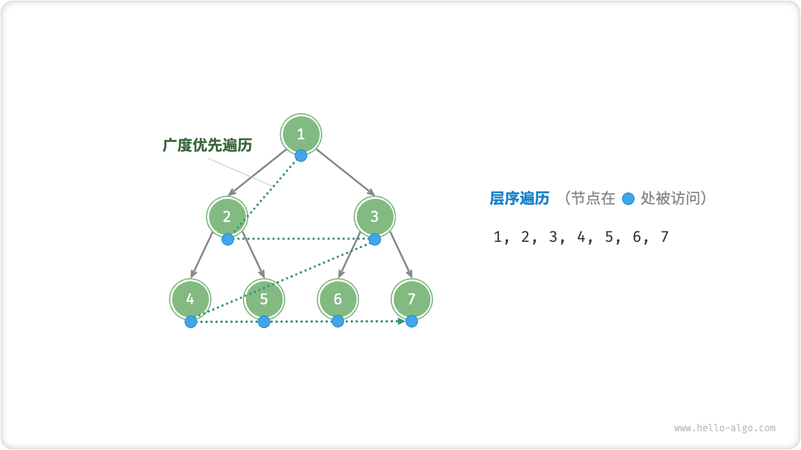
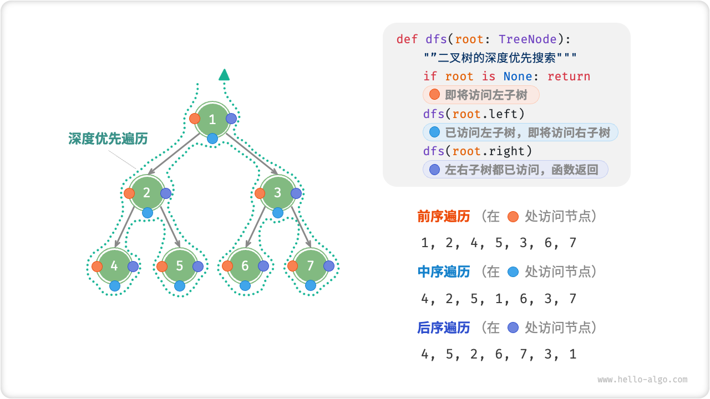
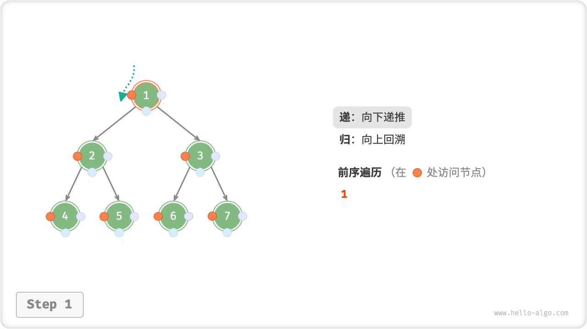
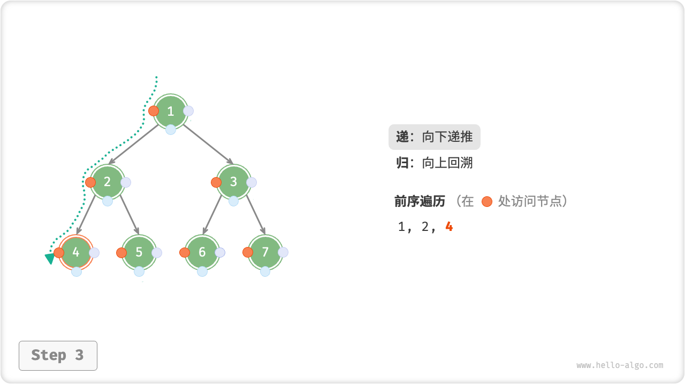
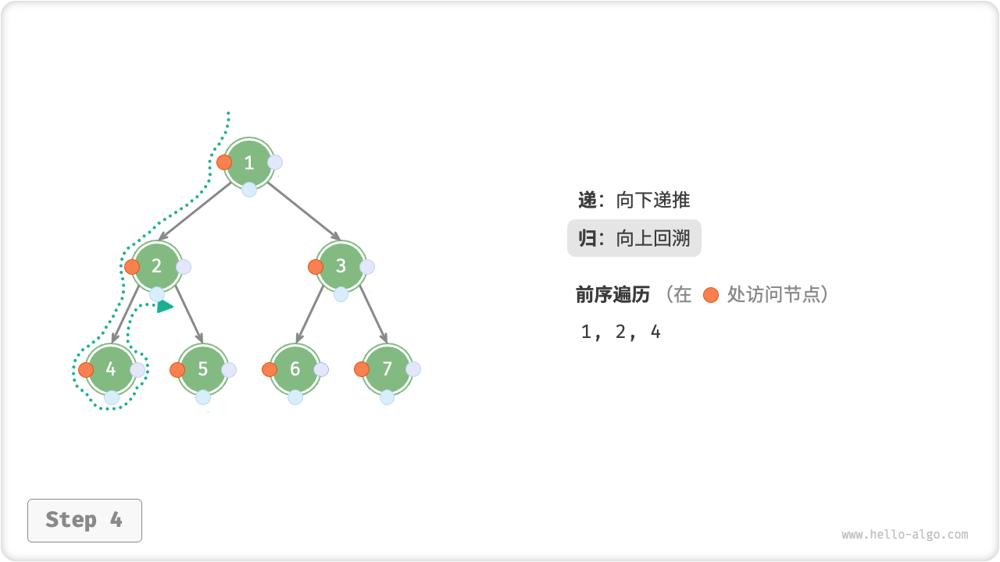
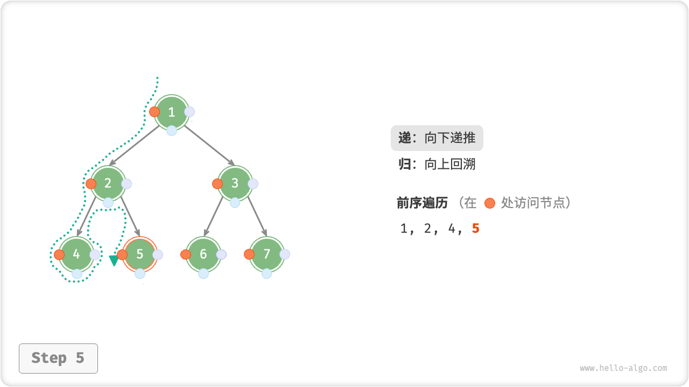
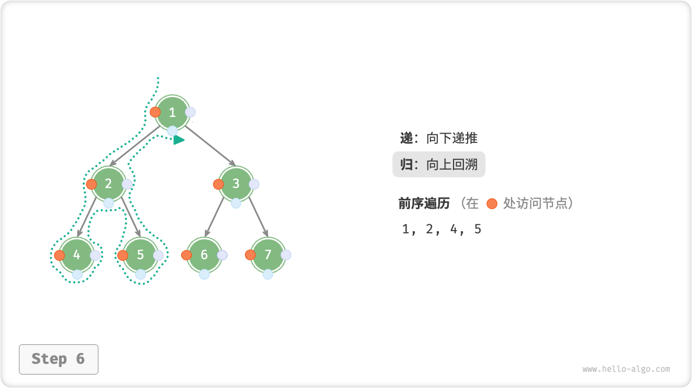
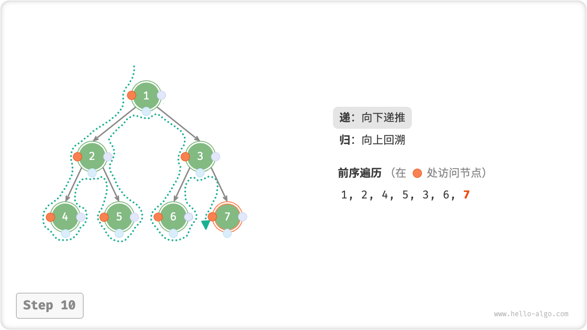
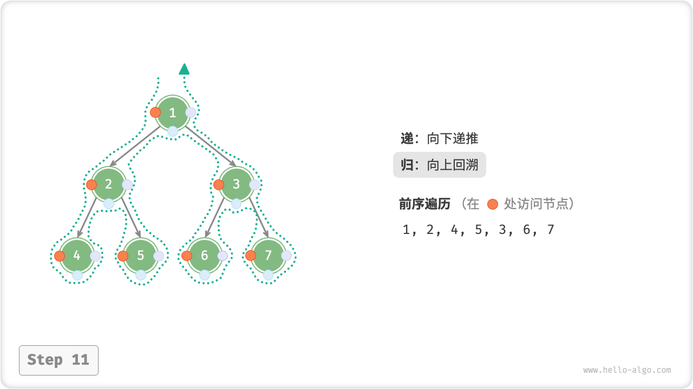

# 7.2 &nbsp; 二叉树遍历

从物理结构的角度来看，树是一种基于链表的数据结构，因此其遍历方式是通过指针逐个访问节点。然而，树是一种非线性数据结构，这使得遍历树比遍历链表更加复杂，需要借助搜索算法来实现。

二叉树常见的遍历方式包括层序遍历、前序遍历、中序遍历和后序遍历等。

## 7.2.1 &nbsp; 层序遍历

「层序遍历 level-order traversal」从顶部到底部逐层遍历二叉树，并在每一层按照从左到右的顺序访问节点。

层序遍历本质上属于「广度优先遍历 breadth-first traversal」，它体现了一种“一圈一圈向外扩展”的逐层遍历方式。



<p align="center"> 图：二叉树的层序遍历 </p>

广度优先遍历通常借助“队列”来实现。队列遵循“先进先出”的规则，而广度优先遍历则遵循“逐层推进”的规则，两者背后的思想是一致的。

=== "Java"

    ```java title="binary_tree_bfs.java"
    /* 层序遍历 */
    List<Integer> levelOrder(TreeNode root) {
        // 初始化队列，加入根节点
        Queue<TreeNode> queue = new LinkedList<>();
        queue.add(root);
        // 初始化一个列表，用于保存遍历序列
        List<Integer> list = new ArrayList<>();
        while (!queue.isEmpty()) {
            TreeNode node = queue.poll(); // 队列出队
            list.add(node.val);           // 保存节点值
            if (node.left != null)
                queue.offer(node.left);   // 左子节点入队
            if (node.right != null)
                queue.offer(node.right);  // 右子节点入队
        }
        return list;
    }
    ```

=== "C++"

    ```cpp title="binary_tree_bfs.cpp"
    /* 层序遍历 */
    vector<int> levelOrder(TreeNode *root) {
        // 初始化队列，加入根节点
        queue<TreeNode *> queue;
        queue.push(root);
        // 初始化一个列表，用于保存遍历序列
        vector<int> vec;
        while (!queue.empty()) {
            TreeNode *node = queue.front();
            queue.pop();              // 队列出队
            vec.push_back(node->val); // 保存节点值
            if (node->left != nullptr)
                queue.push(node->left); // 左子节点入队
            if (node->right != nullptr)
                queue.push(node->right); // 右子节点入队
        }
        return vec;
    }
    ```

=== "Python"

    ```python title="binary_tree_bfs.py"
    def level_order(root: TreeNode | None) -> list[int]:
        """层序遍历"""
        # 初始化队列，加入根节点
        queue: deque[TreeNode] = deque()
        queue.append(root)
        # 初始化一个列表，用于保存遍历序列
        res = []
        while queue:
            node: TreeNode = queue.popleft()  # 队列出队
            res.append(node.val)  # 保存节点值
            if node.left is not None:
                queue.append(node.left)  # 左子节点入队
            if node.right is not None:
                queue.append(node.right)  # 右子节点入队
        return res
    ```

=== "Go"

    ```go title="binary_tree_bfs.go"
    /* 层序遍历 */
    func levelOrder(root *TreeNode) []any {
        // 初始化队列，加入根节点
        queue := list.New()
        queue.PushBack(root)
        // 初始化一个切片，用于保存遍历序列
        nums := make([]any, 0)
        for queue.Len() > 0 {
            // 队列出队
            node := queue.Remove(queue.Front()).(*TreeNode)
            // 保存节点值
            nums = append(nums, node.Val)
            if node.Left != nil {
                // 左子节点入队
                queue.PushBack(node.Left)
            }
            if node.Right != nil {
                // 右子节点入队
                queue.PushBack(node.Right)
            }
        }
        return nums
    }
    ```

=== "JS"

    ```javascript title="binary_tree_bfs.js"
    /* 层序遍历 */
    function levelOrder(root) {
        // 初始化队列，加入根节点
        const queue = [root];
        // 初始化一个列表，用于保存遍历序列
        const list = [];
        while (queue.length) {
            let node = queue.shift(); // 队列出队
            list.push(node.val); // 保存节点值
            if (node.left) queue.push(node.left); // 左子节点入队
            if (node.right) queue.push(node.right); // 右子节点入队
        }
        return list;
    }
    ```

=== "TS"

    ```typescript title="binary_tree_bfs.ts"
    /* 层序遍历 */
    function levelOrder(root: TreeNode | null): number[] {
        // 初始化队列，加入根节点
        const queue = [root];
        // 初始化一个列表，用于保存遍历序列
        const list: number[] = [];
        while (queue.length) {
            let node = queue.shift() as TreeNode; // 队列出队
            list.push(node.val); // 保存节点值
            if (node.left) {
                queue.push(node.left); // 左子节点入队
            }
            if (node.right) {
                queue.push(node.right); // 右子节点入队
            }
        }
        return list;
    }
    ```

=== "C"

    ```c title="binary_tree_bfs.c"
    /* 层序遍历 */
    int *levelOrder(TreeNode *root, int *size) {
        /* 辅助队列 */
        int front, rear;
        int index, *arr;
        TreeNode *node;
        TreeNode **queue;

        /* 辅助队列 */
        queue = (TreeNode **)malloc(sizeof(TreeNode *) * MAX_NODE_SIZE);
        // 队列指针
        front = 0, rear = 0;
        // 加入根节点
        queue[rear++] = root;
        // 初始化一个列表，用于保存遍历序列
        /* 辅助数组 */
        arr = (int *)malloc(sizeof(int) * MAX_NODE_SIZE);
        // 数组指针
        index = 0;
        while (front < rear) {
            // 队列出队
            node = queue[front++];
            // 保存节点值
            arr[index++] = node->val;
            if (node->left != NULL) {
                // 左子节点入队
                queue[rear++] = node->left;
            }
            if (node->right != NULL) {
                // 右子节点入队
                queue[rear++] = node->right;
            }
        }
        // 更新数组长度的值
        *size = index;
        arr = realloc(arr, sizeof(int) * (*size));

        // 释放辅助数组空间
        free(queue);
        return arr;
    }
    ```

=== "C#"

    ```csharp title="binary_tree_bfs.cs"
    /* 层序遍历 */
    List<int> levelOrder(TreeNode root) {
        // 初始化队列，加入根节点
        Queue<TreeNode> queue = new();
        queue.Enqueue(root);
        // 初始化一个列表，用于保存遍历序列
        List<int> list = new();
        while (queue.Count != 0) {
            TreeNode node = queue.Dequeue(); // 队列出队
            list.Add(node.val);              // 保存节点值
            if (node.left != null)
                queue.Enqueue(node.left);    // 左子节点入队
            if (node.right != null)
                queue.Enqueue(node.right);   // 右子节点入队
        }
        return list;
    }
    ```

=== "Swift"

    ```swift title="binary_tree_bfs.swift"
    /* 层序遍历 */
    func levelOrder(root: TreeNode) -> [Int] {
        // 初始化队列，加入根节点
        var queue: [TreeNode] = [root]
        // 初始化一个列表，用于保存遍历序列
        var list: [Int] = []
        while !queue.isEmpty {
            let node = queue.removeFirst() // 队列出队
            list.append(node.val) // 保存节点值
            if let left = node.left {
                queue.append(left) // 左子节点入队
            }
            if let right = node.right {
                queue.append(right) // 右子节点入队
            }
        }
        return list
    }
    ```

=== "Zig"

    ```zig title="binary_tree_bfs.zig"
    // 层序遍历
    fn levelOrder(comptime T: type, mem_allocator: std.mem.Allocator, root: *inc.TreeNode(T)) !std.ArrayList(T) {
        // 初始化队列，加入根节点
        const L = std.TailQueue(*inc.TreeNode(T));
        var queue = L{};
        var root_node = try mem_allocator.create(L.Node);
        root_node.data = root;
        queue.append(root_node); 
        // 初始化一个列表，用于保存遍历序列
        var list = std.ArrayList(T).init(std.heap.page_allocator);
        while (queue.len > 0) {
            var queue_node = queue.popFirst().?;    // 队列出队
            var node = queue_node.data;
            try list.append(node.val);              // 保存节点值
            if (node.left != null) {
                var tmp_node = try mem_allocator.create(L.Node);
                tmp_node.data = node.left.?;
                queue.append(tmp_node);             // 左子节点入队
            }
            if (node.right != null) {
                var tmp_node = try mem_allocator.create(L.Node);
                tmp_node.data = node.right.?;
                queue.append(tmp_node);             // 右子节点入队
            }        
        }
        return list;
    }
    ```

=== "Dart"

    ```dart title="binary_tree_bfs.dart"
    /* 层序遍历 */
    List<int> levelOrder(TreeNode? root) {
      // 初始化队列，加入根节点
      Queue<TreeNode?> queue = Queue();
      queue.add(root);
      // 初始化一个列表，用于保存遍历序列
      List<int> res = [];
      while (queue.isNotEmpty) {
        TreeNode? node = queue.removeFirst(); // 队列出队
        res.add(node!.val); // 保存节点值
        if (node.left != null) queue.add(node.left); // 左子节点入队
        if (node.right != null) queue.add(node.right); // 右子节点入队
      }
      return res;
    }
    ```

=== "Rust"

    ```rust title="binary_tree_bfs.rs"
    /* 层序遍历 */
    fn level_order(root: &Rc<RefCell<TreeNode>>) -> Vec<i32> {
        // 初始化队列，加入根结点
        let mut que = VecDeque::new();
        que.push_back(Rc::clone(&root));
        // 初始化一个列表，用于保存遍历序列
        let mut vec = Vec::new();

        while let Some(node) = que.pop_front() {                 // 队列出队
            vec.push(node.borrow().val);                         // 保存结点值
            if let Some(left) = node.borrow().left.as_ref() {
                que.push_back(Rc::clone(left));                  // 左子结点入队
            }
            if let Some(right) = node.borrow().right.as_ref() {
                que.push_back(Rc::clone(right));                 // 右子结点入队
            };
        }
        vec
    }
    ```

**时间复杂度**：所有节点被访问一次，使用 $O(n)$ 时间，其中 $n$ 为节点数量。

**空间复杂度**：在最差情况下，即满二叉树时，遍历到最底层之前，队列中最多同时存在 $(n + 1) / 2$ 个节点，占用 $O(n)$ 空间。

## 7.2.2 &nbsp; 前序、中序、后序遍历

相应地，前序、中序和后序遍历都属于「深度优先遍历 depth-first traversal」，它体现了一种“先走到尽头，再回溯继续”的遍历方式。

如下图所示，左侧是深度优先遍历的示意图，右上方是对应的递归代码。深度优先遍历就像是绕着整个二叉树的外围“走”一圈，在这个过程中，在每个节点都会遇到三个位置，分别对应前序遍历、中序遍历和后序遍历。



<p align="center"> 图：二叉搜索树的前、中、后序遍历 </p>

以下给出了实现代码，请配合上图理解深度优先遍历的递归过程。

=== "Java"

    ```java title="binary_tree_dfs.java"
    /* 前序遍历 */
    void preOrder(TreeNode root) {
        if (root == null)
            return;
        // 访问优先级：根节点 -> 左子树 -> 右子树
        list.add(root.val);
        preOrder(root.left);
        preOrder(root.right);
    }

    /* 中序遍历 */
    void inOrder(TreeNode root) {
        if (root == null)
            return;
        // 访问优先级：左子树 -> 根节点 -> 右子树
        inOrder(root.left);
        list.add(root.val);
        inOrder(root.right);
    }

    /* 后序遍历 */
    void postOrder(TreeNode root) {
        if (root == null)
            return;
        // 访问优先级：左子树 -> 右子树 -> 根节点
        postOrder(root.left);
        postOrder(root.right);
        list.add(root.val);
    }
    ```

=== "C++"

    ```cpp title="binary_tree_dfs.cpp"
    /* 前序遍历 */
    void preOrder(TreeNode *root) {
        if (root == nullptr)
            return;
        // 访问优先级：根节点 -> 左子树 -> 右子树
        vec.push_back(root->val);
        preOrder(root->left);
        preOrder(root->right);
    }

    /* 中序遍历 */
    void inOrder(TreeNode *root) {
        if (root == nullptr)
            return;
        // 访问优先级：左子树 -> 根节点 -> 右子树
        inOrder(root->left);
        vec.push_back(root->val);
        inOrder(root->right);
    }

    /* 后序遍历 */
    void postOrder(TreeNode *root) {
        if (root == nullptr)
            return;
        // 访问优先级：左子树 -> 右子树 -> 根节点
        postOrder(root->left);
        postOrder(root->right);
        vec.push_back(root->val);
    }
    ```

=== "Python"

    ```python title="binary_tree_dfs.py"
    def pre_order(root: TreeNode | None):
        """前序遍历"""
        if root is None:
            return
        # 访问优先级：根节点 -> 左子树 -> 右子树
        res.append(root.val)
        pre_order(root=root.left)
        pre_order(root=root.right)

    def in_order(root: TreeNode | None):
        """中序遍历"""
        if root is None:
            return
        # 访问优先级：左子树 -> 根节点 -> 右子树
        in_order(root=root.left)
        res.append(root.val)
        in_order(root=root.right)

    def post_order(root: TreeNode | None):
        """后序遍历"""
        if root is None:
            return
        # 访问优先级：左子树 -> 右子树 -> 根节点
        post_order(root=root.left)
        post_order(root=root.right)
        res.append(root.val)
    ```

=== "Go"

    ```go title="binary_tree_dfs.go"
    /* 前序遍历 */
    func preOrder(node *TreeNode) {
        if node == nil {
            return
        }
        // 访问优先级：根节点 -> 左子树 -> 右子树
        nums = append(nums, node.Val)
        preOrder(node.Left)
        preOrder(node.Right)
    }

    /* 中序遍历 */
    func inOrder(node *TreeNode) {
        if node == nil {
            return
        }
        // 访问优先级：左子树 -> 根节点 -> 右子树
        inOrder(node.Left)
        nums = append(nums, node.Val)
        inOrder(node.Right)
    }

    /* 后序遍历 */
    func postOrder(node *TreeNode) {
        if node == nil {
            return
        }
        // 访问优先级：左子树 -> 右子树 -> 根节点
        postOrder(node.Left)
        postOrder(node.Right)
        nums = append(nums, node.Val)
    }
    ```

=== "JS"

    ```javascript title="binary_tree_dfs.js"
    /* 前序遍历 */
    function preOrder(root) {
        if (root === null) return;
        // 访问优先级：根节点 -> 左子树 -> 右子树
        list.push(root.val);
        preOrder(root.left);
        preOrder(root.right);
    }

    /* 中序遍历 */
    function inOrder(root) {
        if (root === null) return;
        // 访问优先级：左子树 -> 根节点 -> 右子树
        inOrder(root.left);
        list.push(root.val);
        inOrder(root.right);
    }

    /* 后序遍历 */
    function postOrder(root) {
        if (root === null) return;
        // 访问优先级：左子树 -> 右子树 -> 根节点
        postOrder(root.left);
        postOrder(root.right);
        list.push(root.val);
    }
    ```

=== "TS"

    ```typescript title="binary_tree_dfs.ts"
    /* 前序遍历 */
    function preOrder(root: TreeNode | null): void {
        if (root === null) {
            return;
        }
        // 访问优先级：根节点 -> 左子树 -> 右子树
        list.push(root.val);
        preOrder(root.left);
        preOrder(root.right);
    }

    /* 中序遍历 */
    function inOrder(root: TreeNode | null): void {
        if (root === null) {
            return;
        }
        // 访问优先级：左子树 -> 根节点 -> 右子树
        inOrder(root.left);
        list.push(root.val);
        inOrder(root.right);
    }

    /* 后序遍历 */
    function postOrder(root: TreeNode | null): void {
        if (root === null) {
            return;
        }
        // 访问优先级：左子树 -> 右子树 -> 根节点
        postOrder(root.left);
        postOrder(root.right);
        list.push(root.val);
    }
    ```

=== "C"

    ```c title="binary_tree_dfs.c"
    /* 前序遍历 */
    void preOrder(TreeNode *root, int *size) {
        if (root == NULL)
            return;
        // 访问优先级：根节点 -> 左子树 -> 右子树
        arr[(*size)++] = root->val;
        preOrder(root->left, size);
        preOrder(root->right, size);
    }

    /* 中序遍历 */
    void inOrder(TreeNode *root, int *size) {
        if (root == NULL)
            return;
        // 访问优先级：左子树 -> 根节点 -> 右子树
        inOrder(root->left, size);
        arr[(*size)++] = root->val;
        inOrder(root->right, size);
    }

    /* 后序遍历 */
    void postOrder(TreeNode *root, int *size) {
        if (root == NULL)
            return;
        // 访问优先级：左子树 -> 右子树 -> 根节点
        postOrder(root->left, size);
        postOrder(root->right, size);
        arr[(*size)++] = root->val;
    }
    ```

=== "C#"

    ```csharp title="binary_tree_dfs.cs"
    /* 前序遍历 */
    void preOrder(TreeNode? root) {
        if (root == null) return;
        // 访问优先级：根节点 -> 左子树 -> 右子树
        list.Add(root.val);
        preOrder(root.left);
        preOrder(root.right);
    }

    /* 中序遍历 */
    void inOrder(TreeNode? root) {
        if (root == null) return;
        // 访问优先级：左子树 -> 根节点 -> 右子树
        inOrder(root.left);
        list.Add(root.val);
        inOrder(root.right);
    }

    /* 后序遍历 */
    void postOrder(TreeNode? root) {
        if (root == null) return;
        // 访问优先级：左子树 -> 右子树 -> 根节点
        postOrder(root.left);
        postOrder(root.right);
        list.Add(root.val);
    }
    ```

=== "Swift"

    ```swift title="binary_tree_dfs.swift"
    /* 前序遍历 */
    func preOrder(root: TreeNode?) {
        guard let root = root else {
            return
        }
        // 访问优先级：根节点 -> 左子树 -> 右子树
        list.append(root.val)
        preOrder(root: root.left)
        preOrder(root: root.right)
    }

    /* 中序遍历 */
    func inOrder(root: TreeNode?) {
        guard let root = root else {
            return
        }
        // 访问优先级：左子树 -> 根节点 -> 右子树
        inOrder(root: root.left)
        list.append(root.val)
        inOrder(root: root.right)
    }

    /* 后序遍历 */
    func postOrder(root: TreeNode?) {
        guard let root = root else {
            return
        }
        // 访问优先级：左子树 -> 右子树 -> 根节点
        postOrder(root: root.left)
        postOrder(root: root.right)
        list.append(root.val)
    }
    ```

=== "Zig"

    ```zig title="binary_tree_dfs.zig"
    // 前序遍历
    fn preOrder(comptime T: type, root: ?*inc.TreeNode(T)) !void {
        if (root == null) return;
        // 访问优先级：根节点 -> 左子树 -> 右子树
        try list.append(root.?.val);
        try preOrder(T, root.?.left);
        try preOrder(T, root.?.right);
    }

    // 中序遍历
    fn inOrder(comptime T: type, root: ?*inc.TreeNode(T)) !void {
        if (root == null) return;
        // 访问优先级：左子树 -> 根节点 -> 右子树
        try inOrder(T, root.?.left);
        try list.append(root.?.val);
        try inOrder(T, root.?.right);
    }

    // 后序遍历
    fn postOrder(comptime T: type, root: ?*inc.TreeNode(T)) !void {
        if (root == null) return;
        // 访问优先级：左子树 -> 右子树 -> 根节点
        try postOrder(T, root.?.left);
        try postOrder(T, root.?.right);
        try list.append(root.?.val);
    }
    ```

=== "Dart"

    ```dart title="binary_tree_dfs.dart"
    /* 前序遍历 */
    void preOrder(TreeNode? node) {
      if (node == null) return;
      // 访问优先级：根节点 -> 左子树 -> 右子树
      list.add(node.val);
      preOrder(node.left);
      preOrder(node.right);
    }

    /* 中序遍历 */
    void inOrder(TreeNode? node) {
      if (node == null) return;
      // 访问优先级：左子树 -> 根节点 -> 右子树
      inOrder(node.left);
      list.add(node.val);
      inOrder(node.right);
    }

    /* 后序遍历 */
    void postOrder(TreeNode? node) {
      if (node == null) return;
      // 访问优先级：左子树 -> 右子树 -> 根节点
      postOrder(node.left);
      postOrder(node.right);
      list.add(node.val);
    }
    ```

=== "Rust"

    ```rust title="binary_tree_dfs.rs"
    /* 前序遍历 */
    fn pre_order(root: Option<&Rc<RefCell<TreeNode>>>) -> Vec<i32> {
        let mut result = vec![];

        if let Some(node) = root {
            // 访问优先级：根结点 -> 左子树 -> 右子树
            result.push(node.borrow().val);
            result.append(&mut pre_order(node.borrow().left.as_ref()));
            result.append(&mut pre_order(node.borrow().right.as_ref()));
        }
        result
    }

    /* 中序遍历 */
    fn in_order(root: Option<&Rc<RefCell<TreeNode>>>) -> Vec<i32> {
        let mut result = vec![];

        if let Some(node) = root {
            // 访问优先级：左子树 -> 根结点 -> 右子树
            result.append(&mut in_order(node.borrow().left.as_ref()));
            result.push(node.borrow().val);
            result.append(&mut in_order(node.borrow().right.as_ref()));
        }
        result
    }

    /* 后序遍历 */
    fn post_order(root: Option<&Rc<RefCell<TreeNode>>>) -> Vec<i32> {
        let mut result = vec![];

        if let Some(node) = root {
            // 访问优先级：左子树 -> 右子树 -> 根结点
            result.append(&mut post_order(node.borrow().left.as_ref()));
            result.append(&mut post_order(node.borrow().right.as_ref()));
            result.push(node.borrow().val);
        }
        result
    }
    ```

**时间复杂度**：所有节点被访问一次，使用 $O(n)$ 时间，其中 $n$ 为节点数量。

**空间复杂度**：在最差情况下，即树退化为链表时，递归深度达到 $n$ ，系统占用 $O(n)$ 栈帧空间。

!!! note

    我们也可以不使用递归，仅基于迭代实现前、中、后序遍历，有兴趣的同学可以自行研究。

下图展示了前序遍历二叉树的递归过程，其可分为“递”和“归”两个逆向的部分：

1. “递”表示开启新方法，程序在此过程中访问下一个节点。
2. “归”表示函数返回，代表当前节点已经访问完毕。

=== "<1>"
    

=== "<2>"
    

=== "<3>"
    

=== "<4>"
    

=== "<5>"
    

=== "<6>"
    

=== "<7>"
    

=== "<8>"
    

=== "<9>"
    

=== "<10>"
    

=== "<11>"
    

<p align="center"> 图：前序遍历的递归过程 </p>
